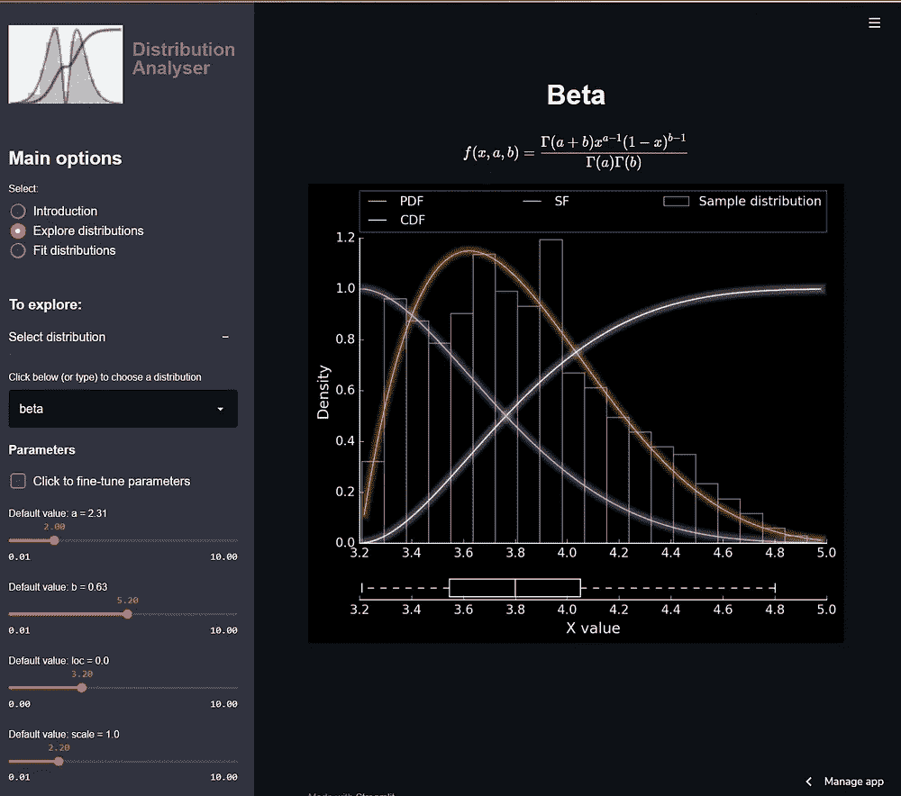
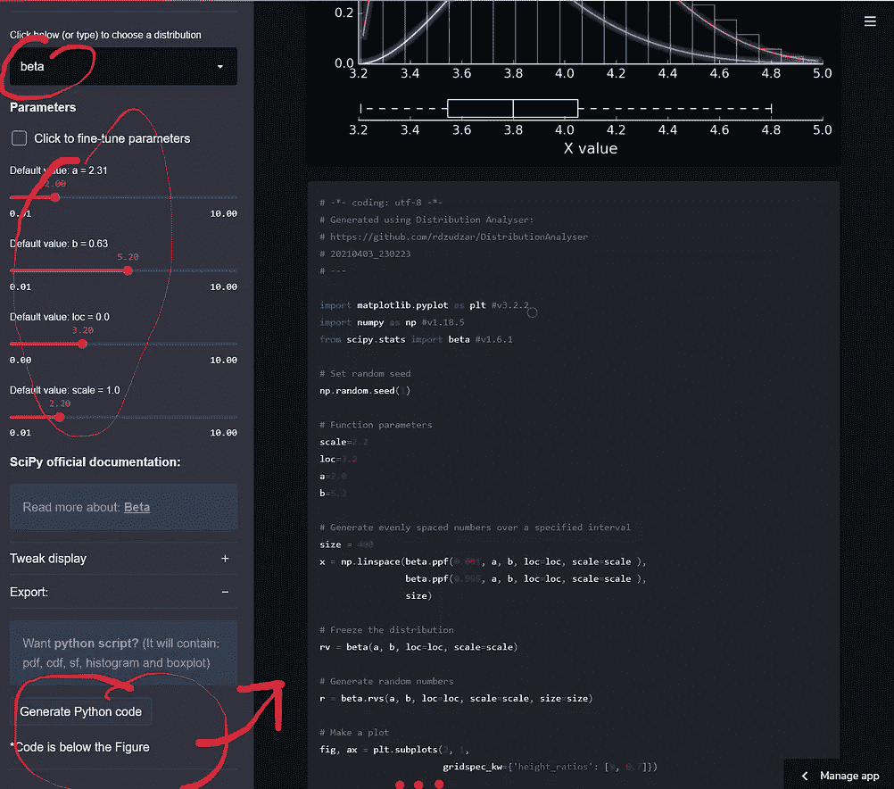
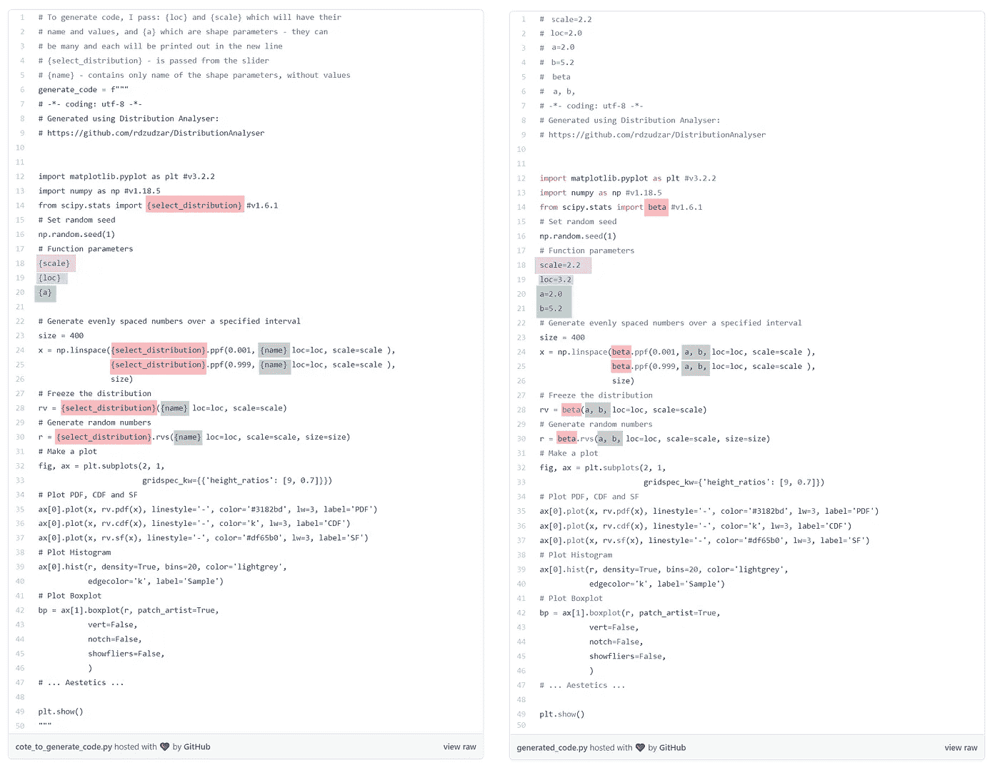

# 我们如何在交互式探索性数据分析后节省时间？

> 原文：<https://towardsdatascience.com/how-can-we-save-time-after-an-interactive-exploratory-data-analysis-c9edfdb8d3e5?source=collection_archive---------25----------------------->

## 一款 Web 应用程序，可以带回家的不仅仅是一个数字

在你深入我的故事寻找“如何”的细节之前，让我节省你的时间，马上给你一个答案:

*   **回答:**你应该给用户样本代码，预先填入他们在玩交互式网络应用时选择的参数。
*   **举例:**最近，我创建了一个 web 应用程序“ [Distribution Analyser](https://share.streamlit.io/rdzudzar/distributionanalyser/main/main.py) ”，它允许用户交互式地探索连续分布，并使它们符合他们的数据，最终给他们提供图形和表格。此外，他们将收到预填充的 Python 代码以及他们选择的参数(或拟合结果)，如下面的屏幕截图所示。



**图一。**从分布分析器中选择分布和生成代码的示例。**左:**用户选择了一个发行版(在本例中是 Beta 发行版)，他们调整了滑块上的参数。**右图:**选择所需参数后，用户点击“生成 Python 代码”按钮，得到代码，他们可以保存并从左图重新创建图形。作者制作的图表。

# 使用 Streamlit 的 Web 应用程序

## 怎么开始的

有了一个 web 应用程序的想法，我开始搜索可以用来实现我的想法的工具(下次再讲)。在搜索的时候，我发现了一个开源的 Python 库 [Streamlit](https://streamlit.io/) 的存在，这是一个定制 web 应用程序的库，用它你可以"*在几分钟内构建和部署一个应用程序"*。几行代码之后，我有了一个基本的功能 app——我被卖了！

## 大约 1 周后

第一个功能“探索发行版”的早期原型已经准备好了，我正在向朋友们展示这个应用程序(Niko 和 Matthijs)。有时，他们会问“*用户可以导出参数吗？”我的回答是“哦，是的，他们应该能做到！”*

站在用户的角度，我意识到，尽管表中有参数值，但我仍然需要花费大量的时间和精力才能使用应用程序在 5-10 秒内重现结果。如果我可以交互式地探索，为什么我不能生成一些示例代码在其他地方使用这些结果呢？

# 如何在代码中生成代码？

Python 的回答: **f-strings** -简单而强大

> F 字符串提供了一种使用最小语法将表达式嵌入字符串文字的方法。f 字符串是在运行时计算的表达式，而不是常数值。( [PEP 498](https://www.python.org/dev/peps/pep-0498/#:~:text=F%2Dstrings%20provide%20a%20way,literals%2C%20using%20a%20minimal%20syntax.&text=In%20Python%20source%20code%2C%20an,are%20replaced%20with%20their%20values.) )

**在 Python 中:**用一个 **f** 作为字符串的前缀，然后把你的变量放在花括号 **{}，**中，当你执行代码的时候，那些变量会得到赋值。请参见下面的简单示例(f 字符串及其评估值以粗体显示):

```
platform = 'Towards Data Science'
author = 'Robert Dzudzar'
number_of_articles = 1example = f"**{author}** wrote **{number_of_articles}** article(s) for **{platform}.**"print(example)
# Returns: **Robert Dzudzar** wrote **1** article(s) for **Towards Data Science**.
```

## 如何在“分布分析器”中生成代码？

在应用程序中，用户使用小部件:他们选择一个发行版，然后使用滑块或输入框来调整发行版参数(每个发行版都有自己的一组参数)。来自 Streamlit 小部件的值被传递给一个生成数字的函数——那么我们为什么不能传递代码呢？

根据代码和参数，有时需要调整变量，使其在 f 字符串中具有所需的格式:

*   在 [Distribution Analyser](https://share.streamlit.io/rdzudzar/distributionanalyser/main/main.py) 中，为了向用户提供生成的代码，我需要变量名或它们的值，或者有时两者都需要，我通过简单的字符串操作来获得。一旦我得到了想要的格式，我就把它传递给 f 字符串(见下图)。创建的 f-sting 然后被传递到一个 Streamlit 按钮，当按下时它将打印出来。

下图显示了' **Explore 发行版**'中的 f 字符串与生成代码的并排比较(f 字符串及其值被突出显示)。以同样的方式，这样做是为了从最佳分布函数中获得代码。您可以在 [GitHub](https://github.com/rdzudzar/DistributionAnalyser) 上找到完整的 web 应用源代码，并在 Streamlit Sharing 上随意使用和探索 [Distribution Analyser](https://share.streamlit.io/rdzudzar/distributionanalyser/main/main.py) 。

# 最后

*多给用户省时省力。*

对于 web 应用程序开发人员来说，只需在他们的应用程序中添加一些功能(至少如果他们使用 Python 的话)，就可以制作出简单、可重复且随时可用的代码，作为分析结果的一部分提供给用户。拥有这样一个选项可以为用户节省数小时甚至数天的时间来记笔记和钻研源代码。



**图二。**并排比较用于[分布分析器](https://share.streamlit.io/rdzudzar/distributionanalyser/main/main.py)中的“探索分布”选项。f 字符串及其值在代码中突出显示。你可以在 [GitHub](https://github.com/rdzudzar/DistributionAnalyser) 上找到完整的 web 应用源代码。 **Left:** 我创建了变量‘generate _ code ’,这是一个 f 字符串。在这个 f 字符串中，我放置了生成图形的整个代码，并放置了所有变量:选定的分布、分布参数以及它们在花括号{}中的值，这样它们就可以被用户通过小部件选择的实际值所替换。变量被传递给 Streamlit[ST . code(f " { generate _ code } "]，后者将把它打印出来。**右图:**我展示了一个用户得到的生成代码(这是针对本文开头图 1 所示的函数)。作者制作的图表。