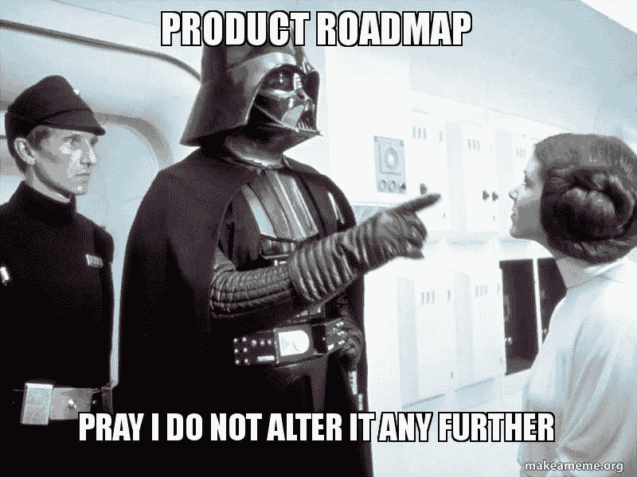
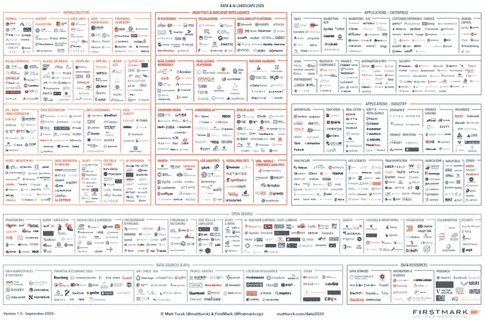
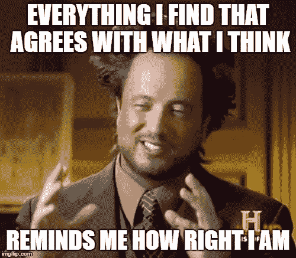
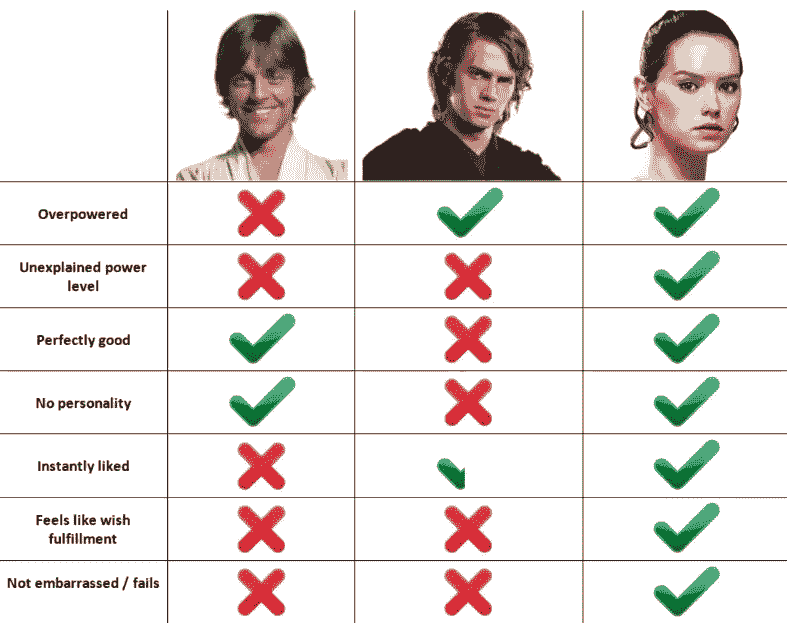

# 如何为您的公司选择最佳的数据分析平台？

> 原文：<https://towardsdatascience.com/how-can-you-choose-the-best-data-analytics-platform-for-your-company-8706b16f4693?source=collection_archive---------51----------------------->

## 知道选择“有史以来最好的工具”的过程…给定已知的事实和偏见

有这么多的数据分析平台，选择一个正确的平台可能是一个漫长的过程，但你如何开始实际操作呢？

来源:memegenerator.net

在选择数据分析平台时，要做的第一件事是选择 ***选择标准*** ，以便能够对它们进行比较。

这是非常重要的一步，因为选择的标准将决定最终的选择。在建立自己的选择标准时，以下是你必须考虑的因素:

*   已知技能、工具、公司战略
*   每种类型的用户所需的功能:数据分析师、数据科学家、运营人员…
*   价格

# ***已知技能、工具、公司战略***

***根据贵公司的已知技能*** ，用户友好标准和所需功能将有不同的含义。

来源:[memegenerator.net](https://memegenerator.net/instance/85194063/internet-grandma-surprise-how-do-i-internet-again)—网络奶奶惊喜

对于一个习惯于编码的数据科学家来说，拥有一个可以拖放东西的工具会削弱他的交付能力，因为他可能无法构建库、对代码进行版本化、回到项目的旧版本或者必须学习该工具。

然而，对于没有编码能力的数据科学家来说，拥有一个工具来指导他们可能真的很有帮助。

***贵公司的已知工具*** 会影响您要搜索的连接:云连接、数据库连接…

***贵公司的战略*** 可能会引导您使用某种类型的工具，并带来新的选择标准:SaaS、基于云、开源…

此外，根据公司的战略，你可以为整个公司提供一个工具，或者为每个小的需求/团队提供多个分析工具。所有这些都将影响每一类用户所需的功能

# ***各类用户所需的功能:数据分析师、数据科学家、运营人员…***

拥有真正需要的功能并不是一件容易的事情，因为通常情况下，用户并不真正知道什么是可能的，他们需要什么，他们总是试图向自己保证该产品在几年内也会为他们工作。

来源:[memegenerator.net](http://memegenerator.net/instance/85194068/tard-the-grumpy-cat-my-needs-are-simple-all-i-want-is-everything)

在这里，您可以找到一些您一定要解决的功能主题:

*   连接功能:平面文件、数据库连接、云连接器...
*   数据准备功能:标记、连接、排序等
*   数据科学功能:脚本和内置功能
*   数据可视化功能以及与数据可视化工具的连接
*   数据存储功能:实时、批量…
*   安全功能:认证类型、审计功能等
*   合规性功能:锁定数据、数据可追溯性、数据保留…

# **产品路线图**

我认为这是最难评估的事情之一。一个很好的例子可以说明这有多难，那就是 [CentOS 8 的生命周期在 2020 年 12 月被突然从 2029 年推迟到 2021 年初。](https://phoenixnap.com/kb/centos-8-early-eol-in-2021)这是一件需要很多科技手表来预测的事情，我们很容易错过。

来源:makeameme.org——路线图:祈祷我不要再改动它了

但是你需要考虑到这一点。选择一个今天对当前需求来说很棒，但是明天就过时的工具绝对不是一个好的选择。你需要了解产品路线图，以检查它们是否与你的公司战略一致。

# 价格

每个数据分析产品都有自己的价格策略:会话价格、用户数量、用户类型、机器大小、功能，应有尽有！

当然，你也可以拥有没有许可价格的开源产品，但这并不意味着它们是免费的。你有服务器成本，维护成本，等等。

来源[memegenerator.net](https://memegenerator.net/instance/72425069/willy-wonka-oh-you-want-everything-for-free)—产品价格

因为有许多不同的参数，所以您不能总是直接比较它们，比较它们的“简单方法”是检查对于您给定的用例，每个工具将花费您多少。

# 基于选择的标准比较平台

基于这些精心选择的标准，我们应该能够比较多个平台。然而，比较它们意味着选择比较什么平台。

> 如果你认为这是一项简单的任务，那就看看数据和人工智能领域吧

来源[https://mattturck.com/data2020/](https://mattturck.com/data2020/)—数据&艾景观 2020

对于这个任务，到目前为止我唯一觉得可靠的是:

*   查看 Gartner 魔力象限
*   查看[数据&艾景观](http://mattturck.com/wp-content/uploads/2020/09/2020-Data-and-AI-Landscape-Matt-Turck-at-FirstMark-v1.pdf)
*   对这个主题做更多的技术观察
*   与该领域的专家交流:已经做出这一选择的人和公司。

所有这些都会给你正确的知识，使你能够选择你应该比较的工具。如果没有，说明你做的技术观察还不够，多迭代就好了

# 涉及的团队和可能的偏见

来源:imgflip.com——最佳确认偏差

为一家公司选择工具并不是一件容易的事情，因为*倍数偏差*会造成干扰，而且很难克服所有这些:

*   确认偏差:当我们忽略挑战我们原有信念的信息时
*   当我们更多地基于感觉而不是证据时
*   *结果偏差*:当我们忽略一些决策过程，过度关注结果时。例如，我们可以关注这样一个事实，即我们将拥有一个产品的完整堆栈，而忽略一些想要的功能

我发现有一种方法可以帮助克服这种偏见，那就是尝试为多个人提供反馈，建立一个反馈循环。

# 要做的最后一个艰难决定

现在我们有了选择的标准和我们想要比较的工具，比较过程终于可以开始了！

来源[https://knowyourmeme.com/photos/1364668-mary-sue](https://knowyourmeme.com/photos/1364668-mary-sue):星球大战人物对比|玛丽苏

只要按照步骤去做，就能做出有史以来最好的选择，这太棒了。然而，我认为这是不可能的，**我们只能根据已知的事实和已知的偏见做出最佳选择**。

然而，不进行比较不会给我们带来克服偏见的论据，这意味着我们要靠运气而不是努力工作。