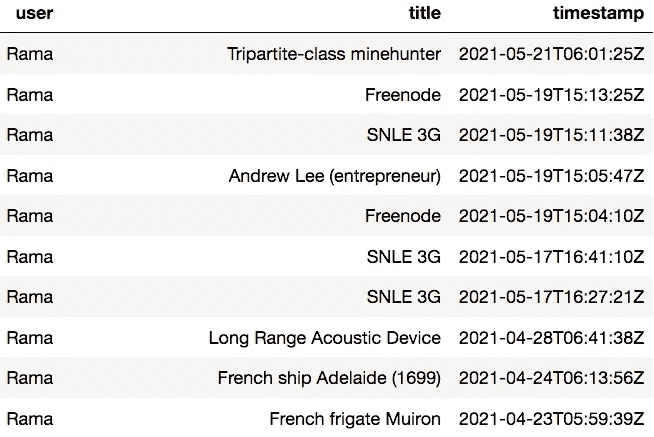
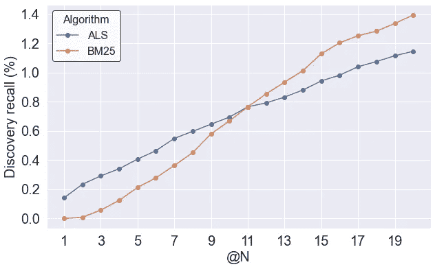
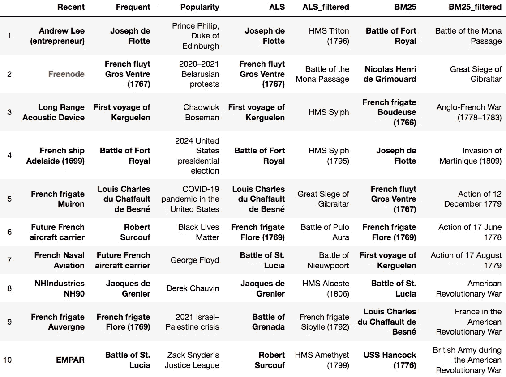
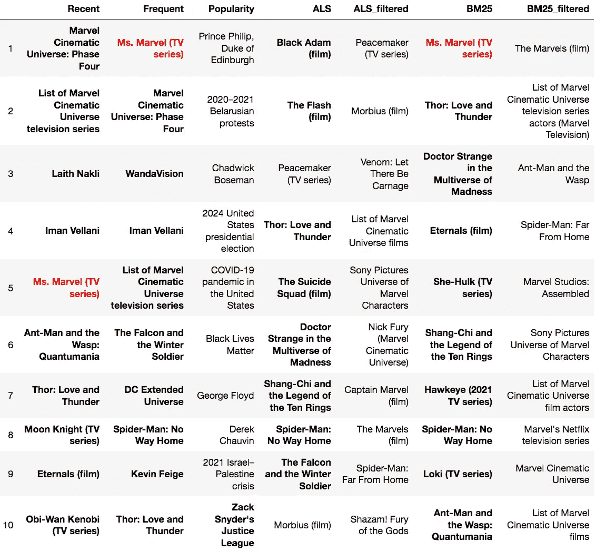
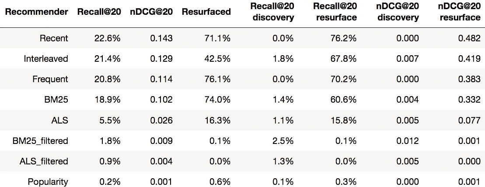
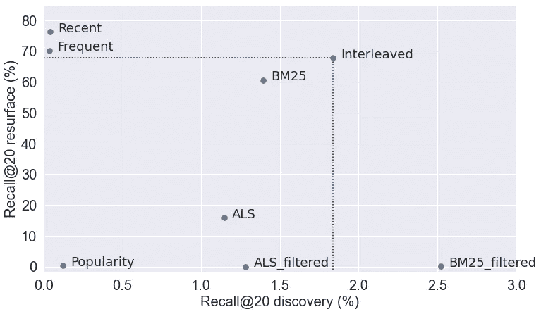
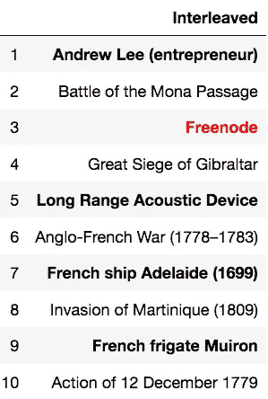
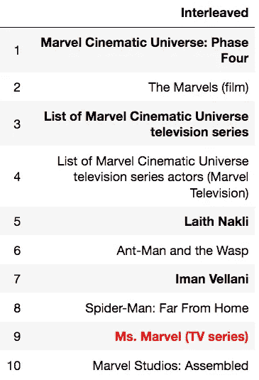

# 你怎么知道你的推荐系统好不好？

> 原文：<https://towardsdatascience.com/how-can-you-tell-if-your-recommender-system-is-any-good-e4a6be02d9c2?source=collection_archive---------3----------------------->

## [行业笔记](https://towardsdatascience.com/tagged/notes-from-industry)

## 离线评估的 12 个技巧，带航海弯

Charles Frodsham 的航海天文钟，可能是通过“离线”(或陆地)评估开发的。用户照片:Ktr101 — Ladd 天文台，CC BY-SA 4.0，【https://commons.wikimedia.org/w/index.php?curid=45968685 

研究推荐系统是一个激动人心的时刻。它们不仅比以往任何时候都更相关，脸书最近[投资了 12 万亿参数模型](https://arxiv.org/abs/2104.05158)，亚马逊估计[他们 35%的购买来自推荐](https://www.mckinsey.com/industries/retail/our-insights/how-retailers-can-keep-up-with-consumers#)，而且有大量强大的、尖端的技术和代码可供任何人尝试。

因此，工具就在手边，可以用来为用户提供个性化的推荐。问题是，知道它有没有用。

当[约翰·哈里森](https://en.wikipedia.org/wiki/John_Harrison)正在开发[海洋天文钟](https://en.wikipedia.org/wiki/Marine_chronometer)时，它通过允许船只精确确定其经度而彻底改变了长途海上旅行，他有一个评估问题:在实践中测量该设备的精度需要长途海上航行。同样，评估推荐系统的黄金标准也是昂贵且耗时的:一个 [A/B 测试](https://en.wikipedia.org/wiki/A/B_testing)，在这个测试中，随机选择的真实用户会看到新模型，他们的行为会与看到旧模型的用户进行比较。在这两种情况下，如果这是唯一的评估方式，就不可能敏捷地尝试新的想法，或者快速地消除缺陷。

相反，有必要找到一种快速、廉价的方法来评估一个模型。在哈里森的例子中，他总是建造两个时钟，并在他的工作台上测量它们偏离的程度。这给了他一个精确的衡量标准，这反过来又让他能够快速迭代他的设计，并在一艘船出海之前达到非常高的性能水平——事实上，1736 年从伦敦到里斯本的第一次测试旅程表明他的发明是成功的。对于推荐系统，解决方案是*离线评估*，其中历史数据用于估计用户在某个时间点对摆在他们面前的一组不同的推荐可能会有什么反应，方法是使用他们后来真正做出反应的知识。

> 有了好的线下评估，当我们做出好的东西时，我们会知道的。相反，如果没有良好的离线评估，整个团队可能会在几周或几个月内完全不知所措。

出于娱乐和学习的目的，我正在为维基百科编辑(又名维基人)建立一个推荐系统，建议他们下一步应该编辑什么文章，这个系统叫做**维基百科**。我对时间和行动顺序的相互作用特别感兴趣，以预测某人在应用程序或网站上的下一步行动。我正在探索几种尖端的人工智能技术，以充分利用所有这些信息来源，但从我的科学背景来看，我知道首要任务是值得信赖的测量，在这种情况下是通过离线评估。

离线评估需要弄清楚如何建立一个有效的测试集，计算什么度量，以及与什么基线模型进行比较。我将在下面给出我的建议，侧重于对行业实用的东西，而不是学术出版物的更高标准，但首先是关于我的数据集。维基百科没有星级评定，也没有竖拇指/竖拇指，所以这本质上是一个[隐含推荐问题](https://jessesw.com/Rec-System/)，我感兴趣的信号是选择编辑一篇文章。基于用户的编辑历史，以及我可以获取的任何其他信息，我想建立一个他们兴趣的图片，特别是他们最近的兴趣，并学习对个性化的文章列表进行排序。

这是我的维基百科数据的一个例子，给我的瑞士朋友，他叫 [Rama](https://en.wikipedia.org/wiki/User:Rama) 。自 2004 年以来，他对维基百科进行了超过 45000 次编辑，并有非常具体的兴趣，主要是法国海军史和计算机技术。

一个用户编辑的原始数据样本，来自维基百科 API

利用维基百科的公开 API，我对英文维基百科所有用户的 100 万条最新编辑进行了采样，结果发现这些数据只有几天的价值。然后，对于样本中的每个编辑，我提取了他们最近一年的编辑，总共 2100 万个数据点。像这样的抽样只捕获在这一时期活跃的用户——首先，这多少会过多地代表最活跃的编辑，但这是我最感兴趣服务的人群。我做了一些基本的清理，例如删除编辑过多或过少的机器人和用户，然后建立我的训练集、测试集和基线推荐器。最终的训练集覆盖了 300 万个维基百科页面(总共约 630 万个页面)和 32，000 个用户。

[(回购和笔记本全部代码](https://github.com/drsaunders/wikirecs))

## 提示 1:为了精心制作你的评估，首先要考虑推荐系统的目的

没有通用的度量或评估程序适用于所有用例。关于离线评估的每一个决定都取决于你使用推荐系统的目的。

你想为一个人做 3 小时的音乐 DJ 吗？你是想让人们注意并点击广告中的产品吗？当搜索者输入“绿色银行”时，你是否试图猜测他们想要什么？你想给订户安排一个合适的约会对象吗？

这将成为回答如下问题的基础:*成功的衡量标准是什么？你到底是如何分离出测试集的？在不再有用之前，相关的东西可以放在列表的什么位置？重新展示他们已经感兴趣的物品有多重要？*

就我而言，我把维基百科想象成编辑维基百科的副驾驶。一个个性化的列表，你可以浏览一下，为你可能想要编辑的下一篇文章提供思路。我还希望它能够灵活、持续地适应用户不断变化的兴趣。因此，我选择将我的评估集中在学习排序算法预测用户真正编辑的下一个页面的能力上。从短期预测的角度来阐述这个问题，使其成为[顺序推荐系统](https://arxiv.org/pdf/1905.01997)的绝佳候选，在该系统中，用户行动的顺序和时间被明确建模。

与其预测下一个项目，我可以用一整周或一个月的后续活动来预测在那个时期编辑了什么，这将是一个多标签问题(并考虑到 Precision@K 等其他指标)，但这将需要更多的数据，增加复杂性，并将重点转移到更长期的预测上。如果我的目标是捕捉用户更深、更持久的偏好，我会再次采用另一种方法，这种偏好预计会在他们与应用程序或工具的关系中持续存在。

要编辑的文章的快速菜单可能不应该超过 20 个项目，所以我选择了奖励将相关项目放在前 20 位的指标。首先，要看的基本指标是 [Recall](https://en.wikipedia.org/wiki/Precision_and_recall#Recall) @20(也称为点击率，在这种只有一个相关条目的情况下):这个算法将下一篇文章排在前 20 名的频率有多高？

## 技巧#2:注意模型和位置偏差

当你构建一个推荐系统来替换现有的解决方案时，会有一个[位置偏差](http://citeseerx.ist.psu.edu/viewdoc/download?doi=10.1.1.112.1288&rep=rep1&type=pdf)(也称为呈现偏差)的问题:当前系统推荐的项目通常会被放在列表的顶部，或者在用户面前更加突出。这使得这些项目在离线评估中具有优势，因为无论客户在实践中如何反应，都有倾向于将它们放在顶部的模型。因此，简单的评估指标对现有系统来说是保守的，改进必须很大才能击败“历史推荐者”(真正向客户展示的排名列表)。

有许多技术可以对抗这种偏见，特别是[反向倾向评分](http://www.cs.cornell.edu/people/tj/publications/joachims_etal_17a.pdf)，它试图对不公平的优势项目进行建模，然后按比例降低它们的权重。另一种方法，虽然成本较高，但在生产中有一个“拒绝通道”，在那里不提供个性化推荐，并使用它来至少提供评估数据——它可能不会提供足够的数据来进行训练。最终的评估数据可能是呈现给部分用户的真正随机的项目列表，但即使一家公司能够承受可能的性能大幅下降，它也可能不想要那种*信任破坏*(见下文)体验！

幸运的是，就我而言，我不必太担心位置偏差。编辑维基百科页面是一个相当高强度的行为，所以人们只是因为文章就在他们面前而随意编辑文章是没有问题的。这些编辑与我的推荐系统无关(因为它还不存在)，所以我不必担心[先前模型偏差](https://labs.pinterest.com/user/themes/pin_labs/assets/paper/p2p-www17.pdf)(一种呈现偏差)。可能存在受欢迎程度的偏见，人们争相编辑当天的热门话题，但正如我们将在下面看到的那样，这种偏见并不强烈。

## 技巧 3:小心挑选测试集

对于大多数推荐算法，可靠的评估需要留出一部分数据，并且仅用于该目的。我把我的推荐问题框定为一个预测问题，所以我把我的数据分为最近的行为和之前的所有行为。本帖中的基线算法(比如“最近编辑的”)，都是无监督的，所以把历史数据看做“训练数据”，把下一个动作看做测试数据。然而，当将来我评估由[监督的](https://en.wikipedia.org/wiki/Supervised_learning)算法时，我还需要留出一个随机的用户样本，他们的历史和最近的编辑，来自相同的时间范围。

要点:确保你的训练集不与测试集重叠，并制作两个测试集，一个是*开发集*，可用于调整你的 hyper 参数，而不是用于最终评估。

## 技巧 4:使用考虑位置的指标

回想一下@20，前 20 个 rec 包含下一个被编辑的页面的频率，这是比较我的任务模型的一个合理、直接的指标。然而，通过考虑学习排序算法是否将相关项目放在排序的顶部，可以在更细粒度的级别上对其进行比较。这可以通过简单地绘制 Recall @ 1 到 N 来直观地检查，这可以揭示位置差异。

例如，对于数据的子集(“发现集”，稍后将详细介绍)，BM25 模型具有较高的召回率@20，但是对于召回率@1，交替最小二乘法得分更高。BM25 的累积优势仅排在榜单的第 12 位。这可能表明 BM25 更擅长标记相关项目，但 ALS 更擅长确保最相关的项目出现在顶部。

在“discovery”测试案例上回忆 ALS 和 BM25 算法的@N 性能曲线

这种位置表现可以归结为一个数字，使用像 [MRR](https://en.wikipedia.org/wiki/Mean_reciprocal_rank) 或 [nDCG](https://en.wikipedia.org/wiki/Discounted_cumulative_gain#Normalized_DCG) 这样的衡量标准来衡量最高位置的表现。如果有多个相关的项目需要检索，并且这些项目可能具有不同的相关性级别，那么 nDCG 是更好的选择。但在我的例子中，在我的测试集中有一个相关项目，它们在数学上是相似的，相当于随着算法将相关项目放在页面的更下方,“得分”急剧下降。报告两者都不会增加什么，所以我武断地决定关注 nDCG@20，如果相关项目总是出现在第一个位置，那么它的得分为 1，如果它从未出现在前 20 位，那么它的得分为 0，在这两者之间有一个按位置加权的反对数下降。果不其然，未过滤的 ALS 在@20 时的召回率比 BM25 低，但在@20 时的 nDCG 较高。

Precision@K 或 MAP 之类的指标对我来说没有帮助，因为只有一个相关的条目。还有一些我没有计算出来的指标，可能对区分算法很有帮助，比如多样性、覆盖率和受欢迎程度偏差。

## 提示 5:决定你是否关心发现，重新露面，或者两者都关心

许多依赖推荐的公司，如网飞或亚马逊，在他们的界面上为特殊菜单或最近访问过的商品开辟了空间。然后，他们的推荐算法可以专注于向用户提供他们从未互动过，但可能喜欢的项目:*发现*。另一方面，许多推荐系统只是想向用户显示一个包含有吸引力的个性化项目的列表，包括他们已经参与的重新露面项目:*发现加重新露面*。这种“单流”推荐的例子包括 Spotify 和 YouTube 播放序列、一些电子商务和广告。

决定*重新显示*项目的顺序是一个有价值的挑战，其中有许多细微差别，例如时间的作用以及如何决定用户是否考虑了某个项目并拒绝了它。它与电子商务应用程序非常相关，例如[重定向](https://about.ads.microsoft.com/en-us/blog/post/may-2021/what-is-ad-retargeting-and-how-to-use-it-to-capture-customers)。但是有简单明了的基线:简单地按照交互的新近性或者交互的数量来排序。

相比之下，在 *discovery* 中获得良好表现是一个更加开放的问题，需要努力找到一个合理的基线。首先，即使用户已经购买了数百件商品，也可能有数百万件商品没有购买。

但我真正感兴趣的一个挑战是如何在一个列表中最佳地结合发现和重现。虽然过去与某个项目的接触应该很有分量，但如果它是很久以前的事情或者非常不合时宜(我曾经在 Wayfair 上点击一张俗气的雕花木床，只是为了弄乱我妻子的推荐)，一个全新的、有很高信心的推荐有时应该会击败它。

对于我的维基百科推荐任务，我既关心发现，也关心重现，所以我的评估需要反映这一点。许多维基人一遍又一遍地回到相同的文章，我的工具也应该使这变得方便，同时混合新的 rec，它有很高的信心那个人会喜欢。

因此，我将我的测试集划分为发现集和表面重现集，这取决于该用户之前是否编辑过目标最近的项目，并计算了我的所有指标，包括分别在这两个集上的 Recall@20 和 nDCG，以及组合的测试集。

通过查看原始编辑历史，我注意到一些影响我的训练和测试集的东西，那就是人们经常连续编辑两次或更多次文章。通常这些只是为了纠正他们刚刚编辑的一个错别字。在我最初的数据集中，我发现 35%的编辑是针对前一页的，所以推荐最后编辑的文章太容易了。这也不是很有用，因为该页面可能仍然在用户的某个选项卡中打开。因此，我更改了我的训练集和测试集，以删除块中的重复编辑。我重新定义了我的任务和评估，那就是:预测下一篇被编辑的*不同的*文章。这是一个更困难的任务，我的指标也相应下降。但是，当我考虑推荐质量时，这个任务更能反映我的意思。

在删除运行的编辑后，我的训练集是 30%的重新出现案例和 70%的发现案例。这种混合可能会影响模型的预测，因此通过下采样或上采样来强调其中一个可能是有意义的(也可能值得尝试为每组案例训练单独的模型)。但重要的是分别评估它们，了解整体性能来自哪里，以及是否以牺牲另一个为代价来强调一个。

## 技巧 6:为比较实现强大、简单的基线

“我建立了一个深度学习推荐器，它有 27 层，5 亿个可训练参数，它很宽，很深，它有 inception，autoencoder 和 transformer 组件。”

“那它做得怎么样？”

“嗯，它有 0.4 nDCG。”

…这样好吗？即使在学术机器学习的细致世界中，也有几个创新模型无法与常识基线相比较的高调案例，当它们与常识基线相比较时，也无法击败它们——这被称为“[幻影进展](https://arxiv.org/pdf/1907.06902)问题。即使这不是一个新的、实验性的模型类型，未能超越简单的基线也是一个很好的迹象，表明实现出现了问题。

确定您是否取得了进展，并理解您的度量标准的唯一方法是实现一些基本的推荐器——选择哪一个也取决于问题。

我想出了三个非常基本的方法来预测下一篇编辑过的文章:

*   **人气:**过去一年最受欢迎
*   **最近:**该用户最近编辑的
*   **频繁:**该用户在去年最频繁编辑的内容

然后我实现了一些稍微聪明一点，但仍然很好理解的[协同过滤](https://en.wikipedia.org/wiki/Collaborative_filtering)算法，它有成熟的、易于使用的 Python 包(特别是[隐式](https://implicit.readthedocs.io/en/latest/)包):

*   **BM25:** [Okapi BM25，](https://en.wikipedia.org/wiki/Okapi_BM25)JAC card 与 TF-IDF 相似性的一个简单变化，即[通常会有更好的结果](http://www.benfrederickson.com/distance-metrics/)
*   **ALS:** [隐式训练数据的交替最小二乘矩阵分解](http://yifanhu.net/PUB/cf.pdf)，带 BM25 预缩放

对于这两个项目，我还计算了“过滤”推荐，删除了用户之前编辑的所有页面，因此推荐了 20 个有价值的纯发现项目。后两者使用了相同的精简训练数据:用户-项目交互计数矩阵(300 万乘 32，000 个条目，由于 [SciPy 稀疏矩阵](https://docs.scipy.org/doc/scipy/reference/sparse.html)，加载到我笔记本电脑的 RAM 中仍然非常实用！)

实现简单基线的另一个主要好处是，它可以让您在数据准备和模型评估管道的每一步都踢轮胎，本质上是评估评估。如果度量标准，比如说，最近与流行度没有意义，最好在这个阶段找到它，而不是在试图解释一个更复杂的模型的结果时。我发现我的评估中至少有一个大的 bug！

## 技巧 7:检查“反托拉斯者”

一旦我有了我的第一套推荐算法，我会特意留出时间*查看*这些推荐——仔细阅读结果，看看它们直观上看起来有多好，并对算法如何因人而异有一个定性的了解。

我特别寻找的是网飞团队称之为“[反托拉斯者](https://www.slideshare.net/justinbasilico/recent-trends-in-personalization-at-netflix)，或者另一个团队称之为[“WTF @ K”](https://thenoisychannel.com/2012/08/20/wtf-k-measuring-ineffectiveness/)的东西:给用户的建议，这些建议来自如此遥远的领域，看起来就像是一个小故障。

对于 Rama 来说，只有人气推荐者有明显的信任破坏推荐，我碰巧知道他对一些话题不感兴趣，比如 Zach Snyder 的正义联盟。ALS 和 BM25 算法严重依赖于表面重建，这对一个 17 年的网站老手来说是有意义的。当新的页面被强制时(“过滤”的推荐)，他们通常给出看起来安全的海战和法国船只的选择。在下表中，重新显示的页面以粗体显示，数据集中正确的下一页为红色。

七个基线推荐者对 Rama 的 10 大维基百科页面推荐。粗体条目是之前编辑过的，红色是下一次编辑的目标

有趣的是，只有最近的推荐者进入了前 10 名。

除了 Rama，我还滚动了大量其他随机选择的用户的推荐，他们有超过 50 次的编辑。事实证明，就像我的朋友 Rama 一样，许多维基百科编辑都有相对较小的“节拍”,我们至少应该能够为他们提供推荐。例如，编辑金加蒂最关心的是漫威的电影和电视剧，大多数算法都注意到了这一点，尽管方式不同。有几个人还正确预测了金加蒂接下来会编辑《漫威女士》(电视剧)。然而，ALS 的最高推荐是一部相当晦涩的 2003 年西部连续剧《和平缔造者》，它可能会构成一部信任破坏者。

7 个基线推荐者对 KingArti 的 10 大维基百科页面推荐。粗体条目是之前编辑过的，红色是下一次编辑的目标

在我的观察中，BM25，当没有被过滤时，比 ALS 更倾向于表面重建，这后来被定量地证实了。

## 技巧 8:花时间优化你的评估代码是值得的

在这一点上，我会注意到，你将会一遍又一遍地运行评估代码，比你所能想到的还要多，而且你能使这个循环越紧密，找到你的最佳模型的过程将会越快越有趣。现在是时候通过使用 Spark、多处理或 joblib 等并行计算工具来利用所有可用的并行计算了，无论是在云中还是笔记本电脑上的多核。有一些包，比如[摩丁](https://modin.readthedocs.io/en/latest/)，试图让简单的熊猫并行化，所以这些包可能值得一试。

我选择隐式库是幸运的，但也是有目的的，因为它是高度优化的，本质上是并行的。尽管如此，我还是令人尴尬地花了很长时间才意识到有一个`recommend_all` 函数比在每个例子中运行`recommend`要快得多。如果您使用 Scikit-learn，许多操作都有一个`n_jobs` 参数——确保将其设置为-1，它将在您的所有内核上并行化。

除了并行化，这是一个很好的机会来更好地理解事情是如何在幕后计算的，并投资于[矢量化](https://www.askpython.com/python-modules/numpy/vectorization-numpy)和重构依赖于 Pandas 的繁重工作负载，这通常非常慢。当我重新编写我的回忆曲线函数来使用列表理解而不是`DataFrame.iterrows()`时，每次评估从 2.5 分钟变成了 4 秒钟，这产生了巨大的差异。

## 提示 9:确保你的评估是可重复的

一种可怕的感觉是回去重新计算指标，发现在相同的测试集上相同的模型产生了完全不同的分数。我防止这种情况的两个建议(我并不总是遵循)是:

*   同时检入您的模型代码、评估代码和评估结果，以便它们匹配
*   [遵循这种模式](https://locallyoptimistic.com/post/git-for-data-not-a-silver-bullet/)，而不是投资于数据版本化工具，将数据集视为一次写入，然后对管道的每一步进行版本控制，以清理和转换数据，从而生成您的训练集和测试集。

## 技巧 10:调整你的基线，但仅限于某一点

对测试集计算的所有基线算法的度量，按 Recall@20 排序。因为不是所有的用户在他们的历史中都有 20 次编辑，所以他们的 rec 被填充了流行的页面，所以最近和频繁的重铺并不是 100%

毫不奇怪，当谈到整体指标时，最近很难被击败——人们确实倾向于一次又一次地返回来编辑相同的页面。但是发现测试子集，其中最近的没有用，更有趣，这些回忆和 nDCG 分数帮助我区分协同过滤技术。

提出改进这些基线的想法是很容易的。例如，我可以采用频繁算法，并尝试将它限制为过去 30 天内最频繁的算法，引入时间元素。对于最近，我只能包括最近编辑的项目，这些项目至少被编辑了 5 次，或者编辑超过了一定的大小，例如 20 个字符。但是这些都是手工调整的试探法，这正是我们在 ML 项目中试图摆脱的。如果你不是在一个试图展示渐进改进的学术环境中，就停留在一些简单易懂的东西上。

然后是稍微不那么愚蠢的基线，它有可调的超参数，但很少——BM25 和 ALS 有两个，尽管我为隐式因子分解添加了 BM25 缩放，增加了两个超参数。但是四个仍然比最简单的神经网络的超参数数量少得多！我运行了几个长网格搜索来挑选最终设置(对于 BM25，K1 = 100，B = 0.25)，但并不太担心绝对完美的磨练。

令人惊讶的是，我最看好的算法，使用 ALS 的隐式矩阵分解，在 discovery 中的表现并不是最好的。相反，更简单和更快的 BM25 方法击败了它，无论是在发现集上过滤到新项目时(在 nDCG 上通过 *240%* )还是在未过滤时的整体集上。我仍然有可能找到超参数的正确组合，甚至是一个不同的包，这将突然提供一个突破，但这只是一个基线，还有更强大的算法我渴望尝试。

受欢迎程度确实非常糟糕——几乎在所有指标上都垫底，这与我通过查看具体例子对这个特定数据集的直觉相符。在维基百科上，人们通常会编辑他们自己的特殊兴趣，而不是插话讨论当天的问题。

## 技巧 11:有了好的评估指标，你可以尝试简单的解决方案——这可能正是你想要的

测试所有算法在 discovery 和 resume 示例集上的性能。虚线展示了交织算法优于许多其他算法的帕累托最优

这听起来可能与技巧 10 关于不要过多修改基线相矛盾，但事实并非如此！

如果我不得不在本周发布一个维基百科推荐算法*，并且它必须擅长发现和重新浮现，我可能会尝试简单地将最佳重新浮现(最近)和最佳发现算法(BM25 过滤)交错，在我进行的过程中删除重复的。对于我的数据集，我发现我得到的离线召回@20 比所有其他模型都好，除了 BM25 在 discovery 中过滤，在表面重建时只比最好的模型差 11%。此外，它显然[帕累托优于](https://hinnefe2.github.io/python/tools/2015/09/21/mario-kart.html)任何其他试图平衡重新露面和发现的解决方案。*

从 Rama 和 KingArti 的交叉推荐中，我也很清楚它是如何有用的。

交叉推荐的 Rama 的 10 大维基百科页面推荐。粗体条目是之前编辑过的，红色是下一次编辑的目标

KingArti 对交叉推荐器的 10 大维基百科页面推荐。粗体条目是之前编辑过的，红色是下一次编辑的目标

当然，这是一个黑客，但这个交错输出是一个单流推荐器，很容易得到正确的，产生高度可解释的 rec，并在生产中运行非常快。对于之前没有个性化的第一个系统来说，类似这样的东西可能是一个很好的选择——除非你经历过，否则你不会相信在生产哪怕是最简单的 ML 模型时会有多少意想不到的挑战，特别是如果它需要实时服务 rec 的话。

## 提示#12:如果可能的话，从用户那里获得定性的反馈

你有没有跟你的 Spotify Discover Weekly 或者你的网飞流派旋转木马顶嘴过？我有！我注意到我和我的朋友在生活中与推荐系统有着亲密的、固执己见的关系。当 rec 好的时候，尤其是当它们不好的时候。我们判断 rec，我们试图找出它们，我们甚至试图有意识地塑造它们，使它们更接近他们想要的和期望的。理想情况下，你可以将这种定性反馈作为你离线评估的一部分。

许多组织没有一个[用户体验](https://en.wikipedia.org/wiki/User_experience_evaluation)部门，作为建模者，你可以进入这个部门——尽管这值得一查！但即使如此，从已经是用户的朋友和亲戚那里获得非正式的反馈也是一个好主意，尤其是如果你可以向他们并排展示不同的推荐输出。我给 Rama 发送了这 7 个基线的输出，他写道“BM25_filtered(流行和他熟悉的文章之间)在这些极端之间取得了良好的平衡”，还说“系统显然正在找到与我的兴趣和能力相关的主题。”有趣的是，他还记得编辑过过滤列表中的许多页面，这意味着要么他是在一年多前编辑的，要么就是这么好。

最后一个长期想法是:离线评估可能无法完美预测 A/B 测试结果的原因有很多，但如果你小心谨慎并补偿一些偏差，希望它至少可以预测结果的方向:离线看起来像赢家的模型在线上也是赢家。然而，如果您在多个 A/B 测试的过程中保持认真的记录，您最终可以估计您的离线指标预测测试结果的程度，甚至可以猜测 nDCG 改进的成功程度。最重要的是，它会显示你的离线评估中是否有系统性的偏差。

现在，我的 WikiRecs 基线已经就绪，当我用更强大的机器学习算法击败它们时，我将确切知道我为了这些收益在增加的复杂性和性能方面牺牲了多少。而且，就像海洋计时器的创造者一样，我很清楚更昂贵的验证测试将会如何进行——远在帆展开之前。