# CatBoost 如何编码分类变量？

> 原文：<https://towardsdatascience.com/how-catboost-encodes-categorical-variables-3866fb2ae640?source=collection_archive---------8----------------------->

## CatBoost 的一个关键要素是从头开始解释

钱德勒·克鲁登登在 [Unsplash](https://unsplash.com?utm_source=medium&utm_medium=referral) 上的照片

CatBoost 是 Yandex 研究人员开发的一个“相对”新包。它现在非常受欢迎，尤其是在 Kaggle 比赛中，它通常比其他梯度树提升库表现更好。

在其他成分中，CatBoost 的一个非常酷的特性是它可以开箱即用地处理分类变量(这就是该算法的名字)。

当使用一个实现时，真正理解它是如何工作的是很重要的。这是本文的目标。我们将深入研究这种被称为**有序目标统计的技术。**假设你对梯度树提升有很好的理解。如果没有，看看我关于这个主题的文章。

# 介绍

[梯度树提升](https://en.wikipedia.org/wiki/Gradient_boosting#Gradient_tree_boosting)是 shelve 家族中处理结构化数据最好的算法之一。这个算法家族起源于 boosting 方法，这是过去 25 年中引入的最强大的学习思想之一。[1997 年由](https://en.wikipedia.org/wiki/AdaBoost) [Yoav Freund](https://en.wikipedia.org/wiki/Yoav_Freund) 和 [Robert Schapire](https://en.wikipedia.org/wiki/Robert_Schapire) 推出的 AdaBoost 是这种方法的第一个实例。那年晚些时候 [Leo Breiman](https://en.wikipedia.org/wiki/Leo_Breiman) 意识到提升可以转化为一个具有适当成本函数的优化问题，这催生了 2001 年 Jerome Friedman 的梯度提升。从那以后，带树的 boosting 方法又出现了很多新人，分别是并且按照出现的顺序， [XGBoost](https://en.wikipedia.org/wiki/XGBoost) —极限梯度 Boosting(2014)[light GBM](https://en.wikipedia.org/wiki/LightGBM)(2016)[CatBoost](https://en.wikipedia.org/wiki/Catboost)(2017)。

> 目前，梯度提升也可以与神经网络结合使用，或者集成结构化的附加知识，或者只是为了提高性能。在这方面, [GrowNet](https://arxiv.org/abs/2002.07971) 的作者介绍的一项技术看起来非常有前途，在这项技术中，弱学习者被浅层神经网络所取代。

# 分类变量编码

> 不过，有一点需要注意，我互换使用了术语类别、级别或因子(在本文中，它们指的是完全相同的东西)

你可能已经知道，机器学习算法只处理数字特征。所以假设你在尝试预测一辆二手车的开航价格。在可用的特性中，你有汽车的品牌(丰田、本田、福特……)。现在，为了在您最喜欢的梯度提升算法中使用该功能(这肯定会对航行价格产生影响)，您需要将品牌转换为数值，因为该算法需要对品牌进行排序，以便枚举拆分可能性并找到最佳的一个。

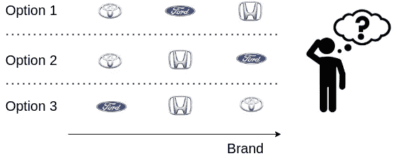

作者图片

好吧…但这听起来更像是对决策树机制内部约束的技术论证。如果我们认真思考一下，当把分类变量转换成数值变量时，我们要做的是什么？好吧，我们可以试着面对，在同样的尺度上，目标的分类价值，来想象这个问题:

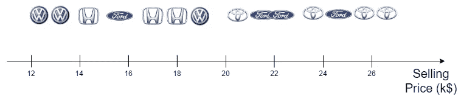

作者图片

当可视化这样的事情时，我们的目标是**揭示在预测目标**时出现在类别中的排序强度，这变得更加明显。理想情况下，我们希望在测量中反映有序性以及我们的不确定性。

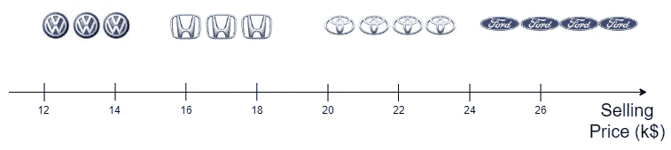

作者图片

在第二个示例中，品牌相对于销售价格的顺序非常清楚。但是这种排序甚至可以更强，如下面的第三个示例所示:

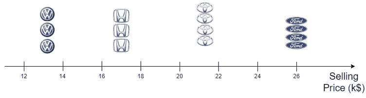

作者图片

为了介绍 CatBoost 中使用的技术，我们将首先介绍几种经常与决策树结合使用的分类编码方法。

## 一键编码

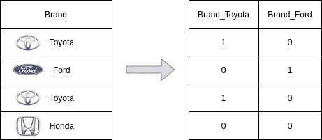

作者图片

这个想法很简单。您用虚拟变量(每个不同的类别一个变量)替换分类特征。虚拟变量是指示特定因子存在(值 1)还是不存在(值 0)的变量。您也可以决定其中一个因素不包含虚拟变量。

> 强烈建议最后一点，以避免[多重共线性](https://en.wikipedia.org/wiki/Multicollinearity)问题，并且在线性回归的情况下是强制性的，否则 OLS 估计量将不存在(由于完美的共线性，输入矩阵将不是满秩的，Gram 矩阵将不可逆)。

当与线性模型结合使用时，这种技术的好处是您可以为每个级别获得一个系数。每个系数都可以解释为相关类别与参考水平(没有包括虚拟变量的参考水平)相比的影响。

但主要的问题是，每个因素都有一个额外的变量。如果你有很多不同的类别，你将会遭受高维数的问题。在这种情况下，当与决策树或决策树集合一起使用时，因为您的虚拟变量将主要包含零，所以它们将非常不平衡。为分割选择一个特征时，虚拟变量被忽略以支持其他预测值的可能性更大。发生这种情况是因为当选择该特征用于分割时，相关的信息增益(分类情况下的熵减少和回归情况下的目标方差减少)可能会更小。当然，这种说法并不总是正确的，因为分割的性能将高度依赖于目标相对于感兴趣类别的分布。

让我们用一个简化的例子来形象化这个想法。我们有 10 个观察值(10 辆不同的汽车)，我们试图预测其售价(在€)。在第一种情况下，每辆车都有不同的品牌，销售价格是均匀分布的。如果我们选择一个虚拟变量进行分割，会发生什么情况:

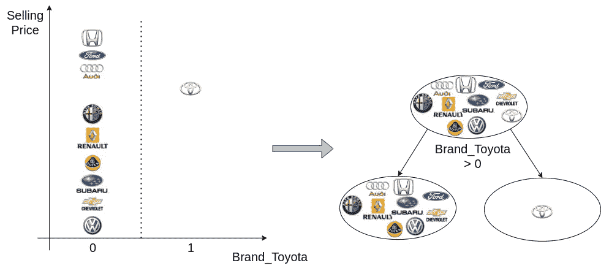

作者图片

在这个例子中，左叶中的目标方差非常高，因此这个分割展示的方差减少是非常蹩脚的(因此这是一个糟糕的分割)。当然，丰田品牌的目标分布可能完全不同，如下所示:

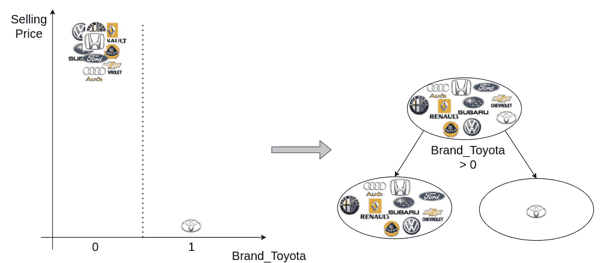

在这种情况下，分割更好**，但是**如果没有丰田的观察，目标方差**将已经非常低**。这意味着除了正确预测一个异常值之外，分类特征的预测能力相当弱。总而言之，**我们更感兴趣的是，当特征与目标有意义地相关时，编码方案展现出强大的预测能力**。

现在让我们看看当我们只剩下两个品牌时会发生什么(坚持销售价格均匀分布的情况)。我们展示了从一个极端到另一个极端的三种不同场景:

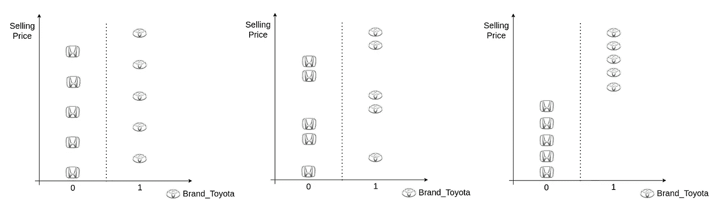

作者图片

所有这三种情况都导致了相同的平衡树，但是它们在目标方差减少方面并不完全相同。左边的方案提出了最低的方差减少量，右边的方案提出了最高的方差减少量。因此，我们从这个例子中看到，通过减少可能类别的数量，我们现在可以想象目标方差减少很重要的情况。

最后，要记住的是，在大量级别的情况下，使用一次性编码可能不是最好的转换，因为它降低了分类变量在最终模型中的重要性。相反，如果您有少量的级别，这种技术仍然非常有效。这就是为什么在 CatBoost 中，有一个超参数( [one_hot_max_size](https://catboost.ai/docs/concepts/speed-up-training.html#one-hot-encoding) )来配置使用单热编码的类别数量，而不是我们在本文稍后描述的主要技术。

## 梯度统计

这项技术是由 lightGBM 引入的。基本思想是根据依赖于成本函数的梯度的每个分割处的训练目标对类别进行排序。为了正确理解这种技术，需要理解梯度推进的机制。如果你觉得你需要复习一下，你可以看看我关于这个问题的文章。

首先，不是在训练之前对类别进行一劳永逸的编码，而是在训练过程中进行编码。在节点的每个分裂决策中，类别按照它们在该节点中(相对于目标)的权重的误差量(使用平方梯度作为代理)排序。

> 请不要认为残差(y-ŷ)等于梯度。只有在执行平方误差损失的回归时才会出现这种情况。如果使用另一个损失，我们不能做出同样的假设(我们依赖伪残差)但想法是完全一样的。

所以我们来直观的解释一下到底是怎么回事。假设我们正在构建一个弱学习器(回归树),并且已经为第一次分割选择了数字特征“里程”:

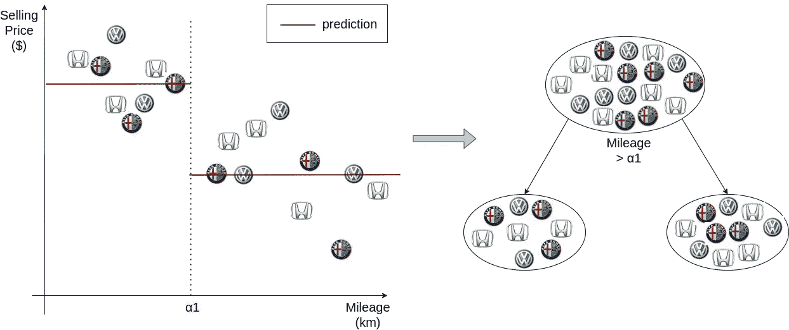

作者图片

现在我们想从树的左侧节点开始构建第二层。在这个例子中，品牌分类特征似乎提出了最佳分割。让我们看看我们是如何得出这个结论的。进行了以下操作:

1.  我们计算了这个节点的每次观测的电流梯度
2.  我们按类别对平方梯度求和，并使用该统计量对类别进行排序
3.  评估了梯度统计的分割可能性。其中一个分割声称总体目标方差减少最好，因此被选中

让我们放大左边部分，看看发生了什么:

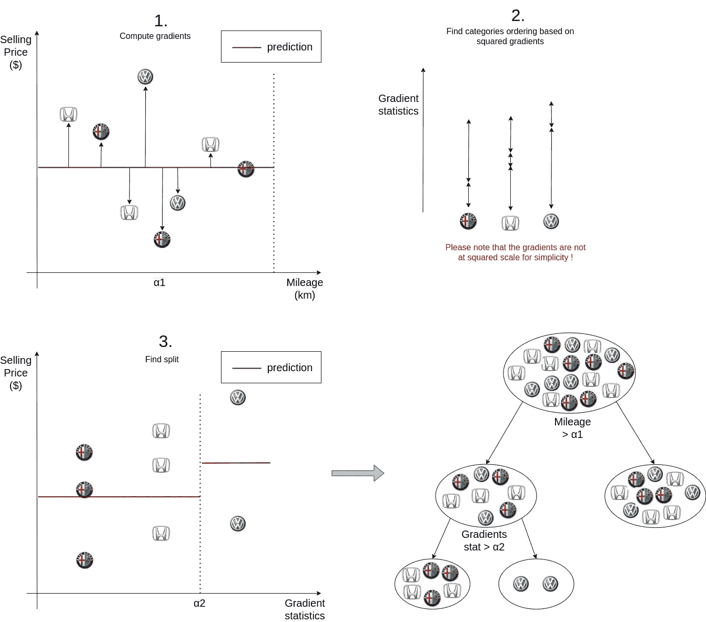

所以总的来说，这种技术非常好，因为它在每次分裂时根据它们的预测目标对类别进行排序。但是它有一些缺陷，引用 CatBoost 的作者在他们的论文中的话，它增加了:

*(i)计算时间，因为它在每个步骤为每个分类值计算统计数据
(ii)基于分类特征为每个分裂存储哪个类别属于哪个节点的内存消耗*

随着不同类别数量的增加，这个问题变得更加严重。为了克服这一点，在 lightGBM 中，他们将尾部类别分组到一个集群中，但因此丢失了部分信息。此外，作者声称，在建模之前，最好将基数较高的分类特征转换为数字特征。

> 请注意，与 lightGBM 中实际发生的情况相比，这个解释是简化的。事实上，他们使用一种称为二阶损耗近似的技术(由 XGBoost 引入)来计算损耗和最佳分割。因此，他们并不完全使用梯度(一阶)对分类值进行排序，而是使用损失的一阶和二阶导数之间的比率。如果你想了解更多关于这一点的信息，可以看看[这篇关于这个问题的好文章](https://everdark.github.io/k9/notebooks/ml/gradient_boosting/gbt.nb.html#43_second-order_loss_approximation)。

## 目标统计

正如我之前所说的，我们想要从编码方法中得到的最重要的特征之一是，它应该反映类别相对于目标的排序。因此，一个简单的想法是用以下任一项替换分类特征 x 的值:

*   以类别为条件的目标期望值(在回归设置中)
*   以类别为条件的肯定类别的预期概率(在二进制分类设置中)
*   m 类分类任务的 m-1 个新变量。每个新变量都将被构建为一个二元分类任务。

在我们的例子中(回归)，这将给出:

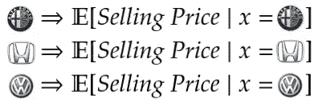

作者图片

假设我们有以下观察结果:

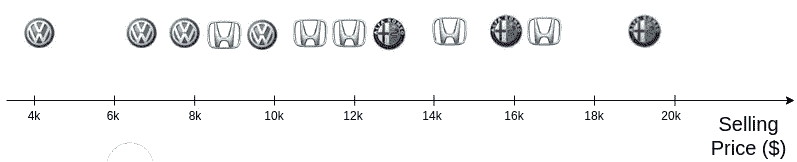

作者图片

编码将产生以下计算:

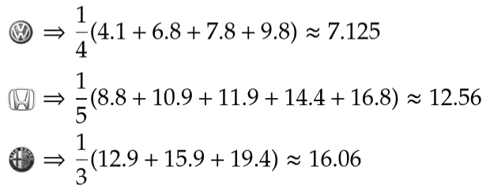

作者图片

这又会产生以下结果:

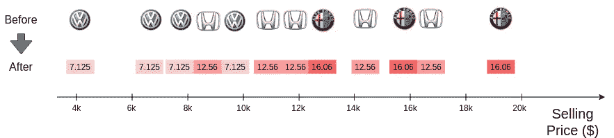

作者图片

此外，除了使用经验期望值(平均值)，还可以使用其他统计数据，如中位数、众数、方差或基础分布的高阶矩，这些统计数据将为编码提供不同的属性。

这种方法在统计学上是合理的，并且保留了分类变量的大部分预测能力。但它并不完美。一个常见的问题是，对于基数较低的类别，估计不够稳健。为了解决这个问题，我们通常添加一个加权先验。特定分类变量 x 的类别 k 随后被替换为以下值:

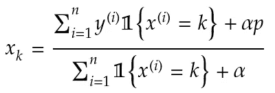

p 是先验的，例如，我们可以使用总目标平均值。α是调节先验强度的超参数。我们之所以讨论先验，是因为这种平滑结果的方式可以被认为是贝叶斯目标编码方法的频率等价物。我们引入一个关于感兴趣的统计量的先验信念，并注入一个特定的先验量。α也可以是一个由类别基数和数据集大小参数化的函数，这样您就可以根据类别是否被更多或更少地表示来使用更多或更少的先验。

请注意，我们在训练数据上计算统计数据，并同样在测试集上使用它们。如果来自测试集的类别在训练集中不存在，我们使用在完整训练集(没有条件)上计算的统计(均值、中值、众数等)。

但是这种技术存在一种被称为**目标泄漏**的情况。单独使用目标来编码变量必然导致这样一种情况，即所学习的关系过度符合训练集的特性。如果使用测试集计算，以使用训练集计算的目标值(x|y)为条件的分类变量的分布将不一定相同。这导致了**预测的转变**。为了说明这个问题，我们将使用一个从[的 CatBoost 论文](https://arxiv.org/abs/1706.09516)中借用的极端例子。

所以假设我们正在解决一个二元分类问题(这个车下个月到底卖不卖？).我们只有一个预测器，那就是汽车的品牌。为了确保目标和特征之间绝对没有关系，我们使用概率 p=0.5 的伯努利试验随机分配标签(0 或 1)。此外，我们确保每次观察都有一个独特的品牌。很明显，绝对没有比随机猜测更好的预测模型了。让我们看看 10 次观察会发生什么:

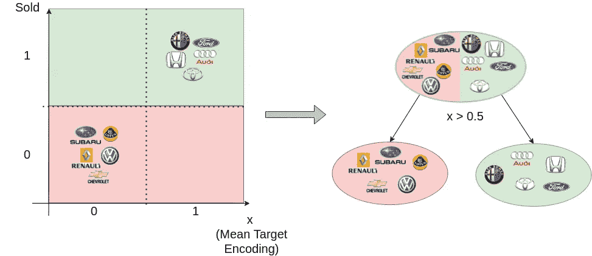

作者图片

为了简化我们的例子，我们在编码方案中没有使用先验。编码的特征根据相关联的目标获得值 0 或 1。但是发生了什么？嗯，我们得到了一个完美的分裂。杂质(熵)的减少是最大的，因为叶子中的所有观察结果具有相同的目标标记。因此，在训练集上，预测精度是 1.0(我们总是预测正确的标签)。但是，一旦我们切换到测试集，鉴于目标标签是随机分配的，错误率将会高得多，很可能等于随机猜测。

当然，这个例子是极端的，但它强调了这样一个事实，即通过使用我们正在执行编码的观察的目标，我们将预测信息泄漏到特征中。并且该信息可能与其他类似的例子无关。对于低基数类别，问题更严重。

## k 倍目标编码

为减轻特征泄漏问题而引入的这种技术在众所周知的交叉验证过程中找到了根源(发明这种技术是为了对抗过度拟合)。所以我们把数据集分成 K 个折叠。我们遍历每个折叠，并使用来自 K-1 个剩余折叠的数据计算当前折叠的目标统计。当 K=2 时，这种技术的一个特例称为保持目标编码。这种技术的缺点是，它会显著增加训练时间，并且我们没有使用完整的数据集来计算增加偏差的统计数据。

## 留一目标编码

这一次，我们将交叉验证方案推进了一步，试图使用尽可能多的数据。该技术也可以被称为 N 重目标编码(N 为观察值的数量)。对于每个观察，我们通过仅从训练数据中移除当前观察来计算目标统计。这种技术比 K-fold 目标编码更好，因为它几乎使用了完整的数据集，因此以增加计算预算为代价得到了更准确的统计数据。

有人可能会认为这种技术可以防止目标泄漏。但事实上，并没有。我们将用一个简单的例子来演示它。因此，让我们说，我们回到我们的二元分类问题，有 10 个观察值。这一次我们有 7 个积极的观察和 3 个消极的，但最重要的是分类变量只有一个独特的品牌。我们知道这样的特征是无用的，因为它没有任何预测能力。这里的问题是，当我们计算统计数据时，我们只有两种不同的情况，要么我们遗漏了 1，要么遗漏了 0。因此，编码特征仅有的两个可能值是:(7–1)/10(当我们忽略 1 时)和(7–0)/10(当我们忽略 0 时)。我们得到以下结果:

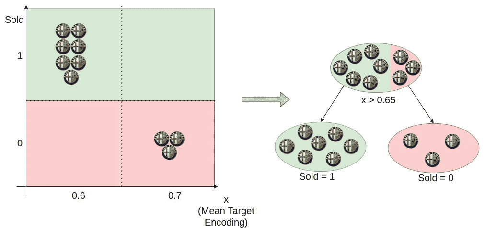

作者图片

我们又一次得到了完美的分割，这意味着我们完美地对训练示例进行了分类。但是我们知道这个特征是没有用的，因为对每一次观察都完全一样。对测试数据使用这个树将会失败。因此，通过这个简单的例子，我们表明目标泄漏问题是留一目标编码的一个问题。

## 泄漏分析

作为一般的经验法则，当一个人可以通过以一种不能使用测试数据再现的方式利用训练数据来更好地了解目标值时，就会发生目标泄漏。它可以是任何东西，比如训练数据分布的特性、与特定目标值相关联的时间戳特性，或者我们执行特征工程的方式，比如留一目标编码。在上面的例子中，因为我们正在解决一个二进制分类问题，编码只产生两个不同的值，因此编码值**自动显示**目标。此外，正如细心的读者可能会猜测的那样，在 K 折叠目标编码中，我们从训练折叠中移除的观察值越多，目标泄漏就越不重要，因为我们越不能从编码特征中推断出目标，但同时，我们在预期估计中也越不准确。

现在，有没有一种方法可以消除目标泄漏，同时使用所有的训练数据？答案是肯定的，继续读下去。

## 有序目标统计

最后，我们到达由 CatBoost 引入的编码分类变量的过程。至此，我们已经展示了引导有序目标统计开始的驱动因素。

*   使用目标编码类别可以创建一个强大的预测器，但是…
*   …它还会导致目标泄漏，因此应谨慎使用。避免这个问题的一个方法是在一个单独的保留数据集上学习统计数据，但同时…
*   …我们希望编码的统计数据尽可能准确，这意味着我们应该使用尽可能多的相关数据

如果我们有无限的标记数据，我们可以为每一个观察，从人群中抽取一个大的新样本，并学习感兴趣的统计数据。但是我们没有那种奢侈，所以我们需要别的东西。基本原理非常简单，灵感来自排列测试和在线学习，即观察值按时间顺序到达。

所以我们从画一个随机排列顺序开始。然后我们按照新的顺序依次重复观察。对于每个观察值，我们只使用我们过去已经看到的观察值来计算感兴趣的统计量。随机排列就像一个人造时间。

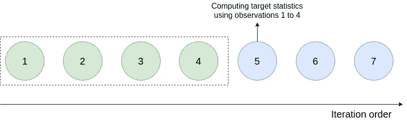

作者图片

现在，一旦排列完成，分类统计量是如何计算的？

首先，目标被转换成一个离散的整数，转换的方式取决于我们要解决的问题:

*   如果我们处于回归设置中，则对连续目标执行量化操作。这意味着目标的可能值范围被划分为特定数量的桶，并且同一桶中的所有目标都被替换为相同的值。确定存储桶的方式取决于所选的策略。在 [CatBoost 文档](https://catboost.ai/docs/concepts/quantization.html#quantization)中有更多相关信息。
*   如果我们在一个分类设置中，每一个不同的级别都简单地用一个从 0 开始递增的整数代替。

然后，我们计算统计数据。计算取决于所选的策略，但想法大致相同。例如，对于策略计数器，会发生以下计算:

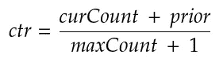

要理解这个公式的组成部分，最好是引用文档:

*   ***curCount*** *是训练数据集中具有当前分类特征值的对象总数。*
*   ***maxCount*** *训练数据集中具有最频繁特征值的对象的数量。*
*   **是一个由起始参数定义的数(常数)。**

*在我看来，文档中的 curCount 定义不是很清楚，因此我们将举一个例子来理解它(我们将 prior 设置为 0.05)。*

*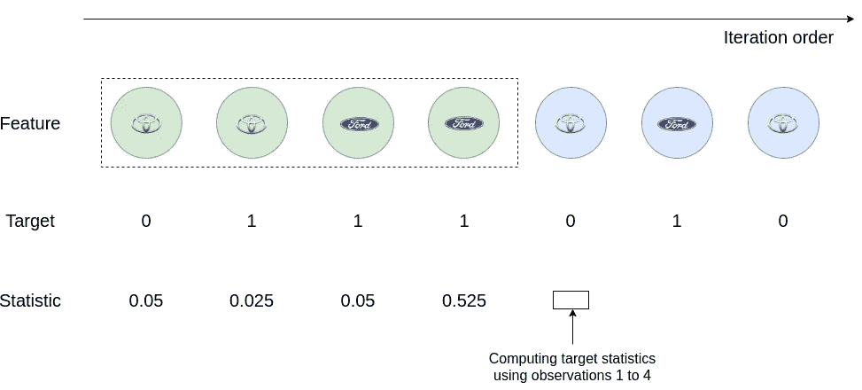*

*作者图片*

*计算第五次观察的统计数据时，我们有:*

*   *countInClass = 1(在过去的训练数据中，当分类特征等于 Toyota 时，目标等于 1 的次数)*
*   *maxCount = 2(过去训练数据中丰田品牌的总数)*

*第五次观察统计量等于(1+0.05)/(2+1)=0.35*

*最后，计算出的统计数据显示，与其他类别相比，每个类别和标签组合都存在于训练数据集中。当面对目标时，这具有揭示类别排序的效果(这是我们想要的)。*

*正如您可能注意到的，第一次观察将不会包含足够的训练数据来产生稳健的估计。方差很大。为了解决这个问题，CatBoost 的作者建议从生成几个随机排列开始，并为每个排列生成一个编码。最终结果只是不同编码的平均值。*

*通过这个过程，我们使用所有的训练数据，并且我们永久地消除了目标泄漏。作者还研究了他们在训练中应用的排列数量的影响。论文的结果如下所示:*

*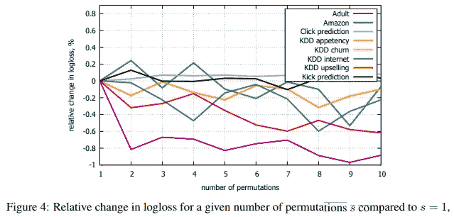*

*图片来自 [CatBoost 论文](https://arxiv.org/abs/1706.09516)*

*作者得出结论，排列的数量对编码效率有影响，但是当增加排列的数量时，我们得到的改善是微小的。*

## *结论*

*在这篇文章中，我们回顾了常见的分类变量编码方法，并显示了它们的优势和劣势。在我看来，有序目标统计是可以使用的最好的分类变量编码方案。*

*作为结束语，我在本文中简要提到了一种叫做贝叶斯目标编码的方法。这篇文章太长了，无法涵盖这个过程，但是我强烈建议您阅读更多关于它的内容(例如这里的),因为它有很多非常好的特性。*

*Finale 注意，你可以用[这个 scitkit-learn contrib 包](https://contrib.scikit-learn.org/category_encoders/index.html)找到上述编码过程的实现(包括 CatBoost)。*

*以上就是我的全部内容，我祝您在数据准备过程中一切顺利。如果有不清楚的地方，不要犹豫，留下你的评论。*