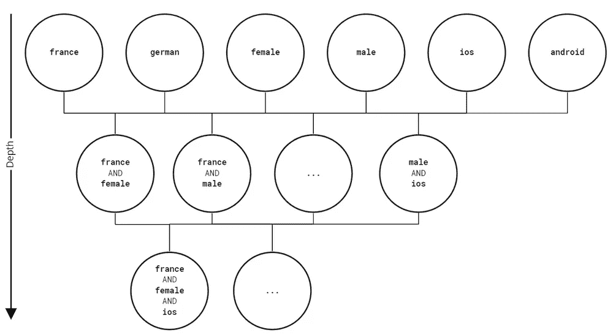
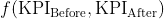
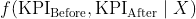
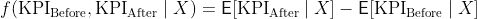

# 因果推理如何将增强分析提升到平地之外

> 原文：<https://towardsdatascience.com/how-causal-inference-lifts-augmented-analytics-beyond-flatland-95648fe30055?source=collection_archive---------10----------------------->

## [行业笔记](https://towardsdatascience.com/tagged/notes-from-industry)

## *因果推理技术和商业分析方法揭示了什么真正改变了你的 KPI，而预测建模却失败了。*

如果世界是二维的，生活将会非常奇怪。想想看:地球将不是一个球体，而是一个圆形——就像 2D 宇宙中的所有其他恒星和行星一样。生物也会变平，在平面景观和存在中航行。例如，在街上超过某人，你必须跳过那个人，因为没有任何深度。出于同样的原因，仅仅看你的身后，你真的得把自己翻个底朝天。幸运的是，这不是我们生活的世界。但不幸的是，这是当今大多数企业运行的基础——甚至可能是您的企业。在任何技术驱动的业务中，您的决策质量不可避免地基于您的数据洞察质量。然而，在太多的公司里，这些“见解”实际上是二维的:平淡、不切实际、毫无结果。


超级马里奥

企业通常用 KPI 来衡量他们的表现。因此，在给定历史数据的情况下，找到未来 KPI 值的最佳预测模型已成为数据分析的目标。尽管这些模型的表现可能出人意料地好，但从中提取价值同样困难。除了缺乏可解释性，这也是因为预测模型无法捕捉现实，并且仅限于低维解释。在本文中，我们将基于大多数预测模型中糟糕的缩放和不切实际的假设，给出为什么会出现这种情况的两个论据。

但何必呢？并不是表现好的模式提高了经营业绩。相反，改善企业的唯一途径是通过决策，而决策最终应该由人来完成。商业中数据分析的目标应该是通过揭示洞察力来为决策提供信息。不幸的是，这些就像大海捞针一样藏在你的数据里。这个远非无足轻重的问题激发了数据分析的一个相对年轻的分支——增强分析，并在最近的 Gartner 报告中得到推动[1]。

我们想要挑战预测模型应该是用于通知商业决策的默认选项的观念。他们在寻求洞察力的过程中引入了一条代价高昂的弯路，甚至可能使其实际上不可行。我们将在一个简单的问题中强调，除了巨大的开销之外，预测建模只能提供很少的东西。相反，我们将试图模仿一个业务分析师是如何操作的。这自然会把我们带到因果推论的方法。

# 有影响的变化

我们将考虑在大数据场景下诊断回归模型中的错误的问题。大多数读者应该都遇到过以下场景:

图 1

显然，KPI 发生了重大变化，这种变化似乎会持续一段时间。从技术面来看，合理的反应是在转折点之后，根据数据重新训练你的预测模型。你同意吗？如果是这样，也许要记住这一点。

图 2

好消息是你的模型似乎是准确的。坏消息是，你的经理不可避免地会问 KPI 怎么了。但是不要害怕。这是证明你对公司价值的理想情况。你能找出这种变化背后的原因吗？你能发现有助于正确决策的见解吗？

# 对为什么的探索

假设您公司的数据集如下所示:

```
import pandas as pd
df = pd.read_csv(“..\\dataset\\ecommerce_sample.csv”)
df.head()
```

让我们进一步假设您正在处理一个最简单的情况:跳跃前后的数据点的 KPI 值使用线性回归模型完全拟合。这里，您正在处理分类数据，您需要适当地处理这些数据以便在回归中使用。一种标准的方法是对分类值进行一次性编码:对于每个分类值，您引入一个可以是真或假的特性。例如，在上面的数据集中，您将定义特性*customer _ country = = Germany*。为了最终实现特征选择，有必要使用一种正则化形式。这里，你将使用套索正则化(十重交叉验证)。

在训练两个 Lasso 正则化线性回归模型(一个在跳跃之前，一个在跳跃之后)后，您可以查看这些模型之间的要素权重差异的排序列表。

```
from sklearn.linear_model import LassoCV
from bokeh.io import show
from bokeh.plotting import figure#get kpi_axis
kpi_axis = ‘kpi’
time_axis = ‘time’
df[time_axis] = pd.to_datetime(df[time_axis],format = ‘%d/%m/%Y’)
y_before = df[df[time_axis] <= ‘2019–09–11’][kpi_axis]
y_after = df[df[time_axis] > ‘2019–09–11’][kpi_axis]#one-hot encoding categorical features
for col in df.drop([kpi_axis,time_axis],axis=1).columns:
   one_hot = pd.get_dummies(df[col])
   df = df.drop(col,axis = 1)
   df = df.join(one_hot)X_before = df[df[time_axis] <= ‘2019–09 11’].drop([kpi_axis,time_axis],axis = 1).to_numpy()
X_after = df[df[time_axis] > ‘2019–09–11’].drop([kpi_axis,time_axis],axis = 1).to_numpy()#training left and right
regression_model_before = LassoCV(cv = 10)
regression_model_after = LassoCV(cv = 10)
regression_model_before.fit(X_before,y_before)
regression_model_after.fit(X_after,y_after)#plotting results
features = df.columns
dweights =regression_model_after — regression_model_before
index = np.argsort(-abs(dweights))
x_axis = features[index[0:3]].to_list()p = figure(x_range=x_axis,title = “Feature weights difference”,plot_width=1000)
p.vbar(x=x_axis, top=(abs(dweights[index[0:3]])),width = 0.8)
show(p)
```

图 3

看起来，android 用户或 46 岁以上用户等子群体在跳跃前后的表现有所不同。很好，看起来你找到了 KPI 上升的原因…或者你找到了吗？

# 维度的诅咒

事实上，这是一个比我们迄今所理解的更重要的情况。想象一下将此展示给 KPI 负责人。他们会很高兴你向他们提供了 KPI 变化的原因，他们现在会想知道根据这些信息该做些什么。这将自动引导他们提出如下问题:“*KPI 变化的实际驱动因素是所有 android-tv 客户、所有 46 岁以上的客户以及所有之前购买过产品的客户吗？也许是 46 岁以上的回头客和安卓电视用户…或者是以前买过东西的安卓电视用户？更糟糕的是，有没有其他你错过的功能组合？*

因此，为了能够更有信心地回答这些问题，您必须使用更复杂的一次性编码特征重复您的回归分析…现在表示比以前更精细的子群。因此，您可以在数据集的更深的子组中进行搜索，参见图 4，新功能包括 *customer_age == 46+和 first_order_made == yes、customer _ age = = 18–21 和 first_order_made == no.*

同样，这些子群通过一键编码进入。这显然是有问题的，因为你现在成为了*维度诅咒*的受害者。这是一个大数据时代，你只是增加了你的功能数量的阶乘[2]。可以用来生成这些细化的子组的一段代码是

```
def binarize(df,cols,kpi_axis,time_axis,order):
   cols = cols.drop([kpi_axis,time_axis])
   features = []
   for k in range(0,order):
      features.append(cols)
   fs = []
   for f in itertools.product(*features):
    # list(set(f)).sort()
      f = np.unique(f)
      fs.append(tuple(f))
   fs = tuple(set(i for i in fs))
   print(fs)
   for f in fs:
      print(len(f))
      states =[]
      for d in f:
         states.append(tuple(set(df[d].astype(‘category’))))
      for state in itertools.product(*states):
         z = 1
         name = str()
         for d in range(0,len(f)):
            z = z*df[f[d]]==state[d]
            name += f[d] + “ == “ +str(state[d])
            if d<len(f)-1:
               name += “ AND “
         df[name] = z
   for d in cols:
      df = df.drop([d],axis = 1)
   return df
```



图 4 —子组深度

请记住，线性回归是基于所有要素之间的协方差矩阵的反演，其标度为 O(d ), d 是要素的数量，也就是说，在我们的情况下，是可能的子组的数量。与非预测特征选择方法相比，这引入了显著的机会成本——这将在后面讨论。

```
df = pd.read_csv(“..\\dataset\\ecommerce_sample.csv”)
df[time_axis] = pd.to_datetime(df[time_axis],format = ‘%d/%m/%Y’)#get kpi_axis
kpi_axis = ‘kpi’
time_axis = ‘time’
y_before = df[df[time_axis] <= ‘2019–09–11’][kpi_axis]
y_after = df[df[time_axis] > ‘2019–09–11’][kpi_axis]#one-hot encoding categorical features
df = binarize(df,df.columns,kpi_axis,time_axis,3)
X_before = df[df[time_axis] <= ‘2019–09–11’].drop([kpi_axis,time_axis],axis = 1).to_numpy()
X_after = df[df[time_axis] > ‘2019–09–11’].drop([kpi_axis,time_axis],axis = 1).to_numpy()#training left and right
regression_model_before = LassoCV(cv = 10)
regression_model_after = LassoCV(cv = 10)
regression_model_before.fit(X_before,y_before)
regression_model_after.fit(X_after,y_after)#plotting results
features = df.columns
dweights =regression_model_after — regression_model_before
index = np.argsort(-abs(dweights))
x_axis = features[index[0:3]].to_list()p = figure(x_range=x_axis,title = “Feature weights difference”,plot_width=1000)
p.vbar(x=x_axis, top=(abs(dweights[index[0:3]])),width = 0.8)
show(p)
```

图 5

一段时间后，你的计算完成。虽然你之前的计算只花了 0.1 秒，但搜索三阶特征已经花了一分多钟。但似乎是值得的。您发现推动 KPI 变化的组的数量实际上是一个，见图 5。向您的经理展示这一见解，他可以迅速指出直接影响您报告的子组的更新。

> -通过细化子组，您可以使其具有可操作性。

虽然您的回归方法最终奏效了，但计算时间非常长，导致您公司的机会成本。在真实的大数据场景中，你的方法会失败得很惨。此外，仅包含浅子群的原始集合描绘了不正确的画面。只有在精炼集合和巨大的计算工作之后，你才能精确定位驱动 KPI 跳跃的实际子组。

这引发了几个问题:

*   你真的需要学习一个预测模型来回答为什么会发生跳跃吗？
*   你如何降低机会成本？
*   如何在适当的粒度级别找到子组？
*   为了这些信息，每次跳跃都要重新训练模型，这样经济吗？

虽然回答所有这些问题超出了这篇文章的范围，但我们将提供一个新的观点来帮助解决这些问题。为此，我们将开发一种改进线性回归的特征选择方法。增强分析依赖于它。

# 从商业分析师和因果推理中学习

我们退一步说…这里发生了什么？您从一个预测模型开始，您看到它既不能预测也不能解释 KPI 中观察到的跳跃。这是为什么呢？因为预测模型无法捕捉现实。他们假设所有数据都是独立同分布的[3]。然而，在实际应用中，这通常是不正确的，如本例所示。跳跃前后的数据是在不同的条件下产生的。当你使用两个独立的预测模型时，你甚至直觉地利用了这一事实，这两个模型(在一些技巧之后)帮助我们揭示了跳跃的原因。

当你不得不放弃预测，最终没有预测到任何东西时，预测模型实际上为你做了什么？仔细想想，关键是您对预测 KPI 作为所有可能子组的函数不感兴趣—您感兴趣的是影响 KPI 的子组！因此，为了寻找更深层次的见解，你必须远离预测建模。这是数据科学家可以向业务分析师学习的地方。

业务分析师通过包含有意义的数据摘要的仪表板来搜索见解。业务分析师不是像上面的回归方法那样将所有特性关联在一起，而是通过迭代过滤不同条件下的数据，尝试根据汇总(如均值、直方图或度量)来查明数据中发生了什么变化。最重要的是，业务分析师永远不必一次查看所有特性。你如何教一台机器做到这一点？你如何向商业分析师学习？

让我们用数学符号将上述形式化。设 X 是一个子组，例如 *X = customer_age == 46+和 first_order_made == yes* 和



KPI 跳跃前后 KPI 分布的一些摘要。然后，引入条件汇总



其中计算 X 为真的 KPI 值子集的汇总。我们的方法现在需要做的就是计算每个子组的条件汇总，并对它们进行排序。我想强调的是，在实践中，这些抽象的总结可以是作为手段的对象，直方图等等

上面详述的过程实际上是因果推理的一种常用技术[4]。你因此含蓄地改变了我们的观点。现在，你认为 KPI 中的神秘跳跃是一种干预，现在假设这是由于外部或内部*治疗*而发生的。一个外部处理的例子可能是假期，一个内部处理可能是一个广告活动，一个价格的变化，或者，在我们的例子中，一个软件更新。因此，你显然*解除了*所有数据都是独立同分布的错误假设。您现在正在搜索 KPI 变化的*因果*子组。

# 对为什么的探索——再访

现在您已经有了一个业务分析师如何操作的模型，让我们继续实际的实现。现在，你将使用因果推断中使用的标准总结，称为条件平均处理效应(CATE) [4]，我们的总结成为



CATE 对应于 KPI 平均值的变化，条件是子组 X 为真。然后，通过数量级排序，我们可以得到正确的子群。为了检测多个子组，我们在每次迭代后移除表现最好的子组后重复该过程:

```
df = pd.read_csv(“..\\dataset\\ecommerce_sample.csv”)
df[time_axis] = pd.to_datetime(df[time_axis],format = ‘%d/%m/%Y’)#get kpi_axis
kpi_axis = ‘kpi’
time_axis = ‘time’
y_before = df[df[time_axis] <= ‘2019–09–11’][kpi_axis]
y_after = df[df[time_axis] > ‘2019–09–11’][kpi_axis]df = binarize(df,df.columns,kpi_axis,time_axis,3)
df_before = df[df[time_axis] <= ‘2019–09–11’]
df_after = df[df[time_axis] > ‘2019–09–11’]
features = copy(df.drop([time_axis,kpi_axis], axis=1).columns)K = 3 #number of subgroups to detect
subgroups=[]
score=[]
for k in range(0,K):
   CATE = []
   y_before = df_before[kpi_axis]
   y_after= df_after[kpi_axis]#compute CATEs for all subgroups
   for d in features:
      g = df_before[d] == True
      m_before = np.mean(y_before[g])
      g = df_after[d] == True
      m_after = np.mean(y_after[g])
      CATE.append(m_after-m_before)#find subgroup with biggest CATE
   index = np.argsort(-abs(np.array(CATE)))
   subgroups.append(features[index[0]])
   score.append(abs( CATE [index[0]]))#remove found subgroups from dataset
   df_before = df_before[df_before[features[index[0]]] == False]
   df_after = df_after[df_after[features[index[0]]] == False]
   features = features.drop(features[index[0]])p = figure(x_range=subgroups,title = “Conditional Average Treatment Effect”,plot_width=1200,)
p.vbar(x=subgroups, top=score,width = 0.8,color=’black’)
show(p)
```

图 6

这只是我们预测模型成本的一小部分。计算一阶特征只需要 0.02 秒，搜索三阶特征不到一秒。

让我们后退一步，将这种方法与基于回归的早期方法进行比较，并比较它们各自的目标。通过回归的特征选择回答了这个问题:“哪些子群最好地预测了你的 KPI？”。而采用因果推理的观点回答了这个问题:“哪些子群对 KPI 有最大的因果影响？”。比较 CATE 的简单实现与图 7 中线性回归的优化 *sklearn* 实现的运行时间，我们发现它们的数量级不同。这清楚地表明，这些问题虽然表面上相似，但有着根本的区别。

图 7

# 结论

预测模型作为理解 KPI 变化的手段有很大的缺点，尤其是在多维环境中。这些模型从根本上回答了错误假设下的错误问题。相反，商业分析关注的是事情为什么会发生，而不是将会发生什么。将他们的思想从预测未来 KPI 值的辅助任务中解放出来，分析人员在数据中寻找原因，以了解 KPI 为什么会发生变化，试图找到正确问题的答案。

下次你想解释什么的时候要小心。首先，你应该问正确的问题。此外，多维环境需要基于因果推理和业务分析方法的可扩展技术。这是我们在 [Kausa](http://www.kausa.ai) 的使命:扩展业务分析逻辑，并将其与因果推理相结合，为 KPI 变化提供正确的答案。

*PS:复制本文结果的代码和数据可从[6]获得。*

# 关于作者和 Kausa

迈克尔·克拉普特是联合创始人兼首席技术官，张秀坤·林兹纳是 Kausa 的因果推理工程师。

[*考萨*](http://www.kausa.ai) *通过全面持续地测试所有假设，加速数据探索，在几秒钟内提供可操作的见解。* ***对试用产品感兴趣？*** [***报名提前入场排队***](http://www.kausa.ai) ***。***

# 参考

1.  [增强分析将如何改变您的组织](https://www.gartner.com/en/doc/441420-how-augmented-analytics-will-transform-your-organization)
2.  [停止一次性编码你的分类特征——避免维数灾难](https://medium.com/swlh/stop-one-hot-encoding-your-categorical-features-avoid-curse-of-dimensionality-16743c32cea4)
3.  [schlkopf，B. (2019 年)。机器学习的因果关系。1–20.](http://arxiv.org/abs/1911.10500)
4.  [古铁雷斯，p .&热拉尔迪，J.-Y. (2016)。因果推理和隆起建模文献综述(第 67 卷)](http://proceedings.mlr.press/v67/gutierrez17a/gutierrez17a.pdf)
5.  [在解释预测模型以寻求因果洞察力时要小心](/be-careful-when-interpreting-predictive-models-in-search-of-causal-insights-e68626e664b6)
6.  [电子商务数据集](https://github.com/kausa-ai/blog/tree/master/how_causal_inference_lifts_augmented_analytics_beyond_flatland)