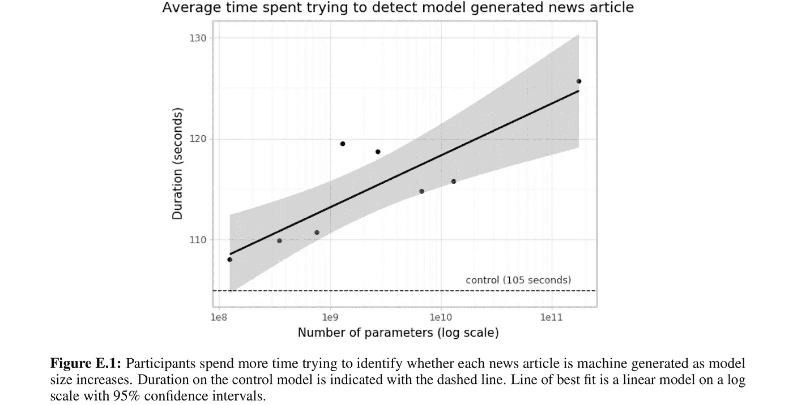

# GPT 3 号离人工通用智能有多近？

> 原文：<https://towardsdatascience.com/how-close-is-gpt-3-to-artificial-general-intelligence-cb057a8c503d?source=collection_archive---------15----------------------->

GPT-3 是仿人自然语言表现的良好开端。或许更好的类比可能是人工通用智能自然语言的“能人”**【1】**。

语言推理的漩涡。[美国地质勘探局](https://unsplash.com/@usgs?utm_source=unsplash&utm_medium=referral&utm_content=creditCopyText)在 [Unsplash](https://unsplash.com/s/photos/swirling?utm_source=unsplash&utm_medium=referral&utm_content=creditCopyText) 上拍摄的照片

*能人*物种区别于更早的*南方古猿*群体，它们有稍微大一点的脑壳和更小的脸和牙齿。然而，*能人*物种保留了一些类人猿的特征[1]。

最重要的是，对于我将要做的类比，*能人*物种被认为是第一个制造石器的人。

在我的类比中，GPT-3 代表了自然语言人工智能的能人。以下是我的推理:

*   GPT-3 的大脑(参数)明显比之前的 NLP 型号更大；
*   GPT-3 使用工具，例如，转移学习和微调。
*   GPT-3 完成其他 NLP 任务(制造工具),它没有接受过这方面的训练。
*   GPT 3 号保留了 GPT 2 号的大部分架构。与能人物种类似，GPT 3 号保留了“一些类人猿特征”。

# 关键要点:是什么让 GPT-3 如此特别？

GPT-3(生成式预训练变压器-3)是 OpenAI 迄今为止最大规模的自然语言预测(NLP)模型(2020 年 6 月向公众开放)。

1.  GPT 3 号大约有 1850 亿个参数。相比之下，人类大脑大约有 860 亿个神经元，每个神经元平均有 7000 个突触[2，3]；
2.  比较苹果和橙子，人类大脑有大约 60 万亿个参数，比 GPT-3 多 300 倍。注意:如果自然语言任务需要 10%的人脑容量，那么人脑的参数比 GPT-3 多 30 倍。
3.  据估计，GPT-3 的云计算时间成本在 400 万美元到 1200 万美元之间，并且需要几个月的时间进行培训[3，7]。OpenAI 没有说 GPT-3 的训练成本是多少，也不清楚他们是否知道 20%以内。然而，该论文的作者计数是 31 名工作人员[3]。这意味着一年至少要增加 1200 万美元的员工工资和福利。
4.  GPT-3 在总计约 5000 亿个标记(一个标记近似于一个单词)的几个大型文本语料库上进行训练[3]。

> 他们已经走得够远了！他们去建了一座七层楼高的摩天大楼，大约和一栋建筑物一样高。—俄克拉荷马州堪萨斯城的歌词子集[9]

> 注:迪拜塔摩天大楼目前有 183 层高。

# GPT-3 站在先前工作的肩膀上

1.  GPT-2 是一个大型的基于 T2 转换器 T3 的语言模型，拥有 15 亿个参数，在 800 万个网页的数据集上进行训练。GPT-2 将 GPT-1 模型架构的参数扩大了约 10 倍，并对超过 10 倍的数据量进行了训练。
2.  GPT-2 最初的研究目标是在 40GB 的互联网文本上进行无监督训练后预测句子中的下一个单词[4]。GPT-2 可能会也可能不会最初让 OpenAI 的研究人员惊讶地发现，它可以执行与它训练的不同的 NLP 任务[6]。我毫不怀疑 GPT-2 为 OpenAI 与 GPT-3 一起“做大”奠定了基础。
3.  GPT-2 模型和其他 SOTA(国家最先进的)自然语言处理模型仍然不能执行一个新的语言任务，从只有几个例子(称为少数镜头学习)或从简单的自然语言指令描述的任务[3]。
4.  GPT-3 将 GPT-2 模型架构放大了约 100 倍。如果你按页数或作者数计算，这是相当可观的 5 倍多的努力[3，5]。
5.  GPT-3 采用了 ULMFIT 的关键发现。在大型文本语料库上预先训练 NLP 模型，然后在特定任务上进行微调，在许多 NLP 任务和基准上实现了实质性的收益[4]。
6.  GPT-3 的研究人员表明 [NLP](https://chatbotslife.com/tagged/artificial-intelligence) 的性能(以交叉熵验证损失衡量)与 NLP 模型的大小(参数数量)成正比[3]。GPT-3 可以说是迄今为止最好的 NLP 模型。
7.  再次声明，由于这是一个至关重要的发现，研究人员通过 GPT-3 训练表明，扩大语言模型可以显著提高任务不可知、少数镜头的性能，有时甚至达到与以前的 SOTA 方法相当的水平[3]。
8.  GPT-3 可以在没有任何神经网络梯度更新或微调的情况下应用[3]。
9.  GPT-3 论文的结论是，17.8 亿个参数模型在一些少量学习任务中不够准确[3]。

研究人员训练了一系列较小的 GPT-3 模型，其变化范围从 1.25 亿个参数到 1，300 万个参数。零炮、单炮和少炮性能之间的精度差距随着模型参数的大小而扩大。OpenAI 的研究人员坚持认为，他们的研究表明，更大的模型和更多的数据输入将是适应性更强的通用语言系统的成功之路。来源:https://arxiv.org/pdf/2005.14165.pdf

GPT-3 是迄今为止最好的 NLP 模型吗，因为它是最大的？

***注****:2021 年 6 月 12 日，北京人工智能研究院(BAAI)近日* [*发布了关于其“悟道”AI 系统的详细信息*](https://syncedreview.com/2021/03/23/chinas-gpt-3-baai-introduces-superscale-intelligence-model-wu-dao-1-0/) *。据悉有* [*175 万亿*](https://syncedreview.com/2021/03/23/chinas-gpt-3-baai-introduces-superscale-intelligence-model-wu-dao-1-0/) *参数。据报道，吴导在文本分类、情感分析、自然语言推理、阅读理解等方面超过了人类的平均水平。我提醒读者注意上述声明，直到 BAAI 提供其他细节，如使用的硬件，训练时间和使用的训练数据。据报道，该代码是开源的。*

# GPT-3 的第一个例子

GPT-3 在需要即时推理或领域适应的任务上表现出色，如解读单词，在句子中使用新词，或执行 3 位数算术[3]。

GPT-3 模型生成的新闻文章样本，人类评估者很难从人类撰写的文本中区分出来。增加参数的数量增加了人类读者的难度，如下图所示。

来源:[3][https://arxiv.org/pdf/2005.14165.pdf](https://arxiv.org/pdf/2005.14165.pdf)

GPT 以华莱士·斯蒂文斯的风格创作诗歌。我的反应很奇怪，我承认，有点害怕。

来源:https://arxiv.org/pdf/2005.14165.pdf

2020 年 6 月，OpenAI 发布了它为访问不同 OpenAI 模型而开发的 [API](https://beta.openai.com/) 。该 API 运行预训练的 GPT-3 模型系列，用于各种 NLP 任务[3]。

与通常的人工智能社区实践不同，GPT-3 模型的权重不向公众公布。

# 结论

OpenAI 长期以来一直声称，巨大的计算能力和强化学习是通往 AGI 或可以学习人类可以完成的任何任务的人工智能的必要一步[14]。

人工智能 2.0 的创始人，如 Yoshua Bengio 和 Yann LeCun，[认为从目前的](https://venturebeat.com/2020/05/02/yann-lecun-and-yoshua-bengio-self-supervised-learning-is-the-key-to-human-level-intelligence/)[人工智能](https://becominghuman.ai/)技术不可能创造出 AGI。他们认为我们需要自我监督学习(实际上 GPT-2 和 GPT-3 是自我监督的)和先进的基于神经生物学的进步[15]。

然而，人工智能 1.0 的父亲，人工智能的祖父，如马文·明斯基和安德鲁·麦卡锡，认为丰富的知识(数据)和常识推理专家的“社会”是通往 AGI 的道路[16]。

GPT-3 是一个存在的证据，它证明了扩大文本(数据)的数量，扩大参数(模型大小)，以及扩大训练计算的结果在一个专家身上有更好的准确性(可怕的性能)来完成少量的 [NLP](https://chatbotslife.com/ultimate-guide-to-leveraging-nlp-machine-learning-for-you-chatbot-531ff2dd870c) 任务。

模型的架构、模型的大小和训练计算机的数量实现了常识推理专家吗？数据和常识推理能让我们到达 AGI 吗？

## 对人工智能可能未来的推测

> 所以，我认为人工智能研究者犯的最大错误是假设他们是聪明的。是的，和人工智能相比，他们不是。—埃隆·马斯克[12]。

60 到 65 年前，第一台计算机装满了一个房间。60 年后，一个计算机核心，大约有我的头那么大，已经放大了第一台计算机的大约 10 亿倍(可能更多)。

假设第一台可行的量子计算机充满了整个房间。60 年后，我脑袋大小的量子计算机核心将会放大到第一台量子计算机的 10 亿倍吗？

也许吧。

想象一台量子计算机，其 AGI(人工通用智能)模型的规模是 GPT-3 参数的 10 亿倍，或人脑参数的约 300 万倍。

> “我预测在 2029 年，我们将通过图灵测试，”雷·库兹韦尔说[11]。

注意:GPT 3 号非常接近 GPT 3 号通过图灵测试[13]。

> GPT 3 号在某些方面给人留下了深刻的印象，但在其他方面却明显不如人类。——凯文·莱基，Just，2020。

你认为我们会做一个霍金-马斯克的噩梦或者哈文斯-库兹韦尔的梦吗？

我们可能两者都有，也可能都没有。

我把钱投在我们的工具制造上。我怀疑我们会改变，或者我们应该改变这种行为。

我觉得埃隆·马斯克的 NuralLink 项目是在我们的工具制造上赌人工智能的未来潜力[17]。

# 资源

[1] [成为人意味着什么？](https://humanorigins.si.edu/evidence/human-family-tree)

人类大脑的规模。

[3] [语言模型是很少出手的学习者](https://arxiv.org/pdf/2005.14165.pdf)。

[[4]文本分类通用语言模型微调](https://arxiv.org/pdf/1801.06146.pdf)。

[5] [语言模型是无人监督的多任务学习者](https://d4mucfpksywv.cloudfront.net/better-language-models/language-models.pdf)。

[6] [更好的语言模型及其含义。](https://openai.com/blog/better-language-models/)

[7] [OpenAI 庞大的 GPT-3 模型令人印象深刻，但大小并不代表一切。](https://venturebeat.com/2020/06/01/ai-machine-learning-openai-gpt-3-size-isnt-everything/)

[【8】通过生成性预训练提高语言理解](https://s3-us-west-2.amazonaws.com/openai-assets/research-covers/language-unsupervised/language_understanding_paper.pdf)。

【9】[堪萨斯城的歌词出自戏剧《俄克拉荷马》。](https://www.allmusicals.com/lyrics/oklahoma/kansascity.htm)

[10] [哈利法塔摩天大楼。凯文·莱基](https://www.skyscrapercenter.com/building/burj-khalifa/3)

未来比你想象的更好:雷·库兹韦尔对人工智能和发展的预测。

[12] [埃隆·马斯克:对于人工智能来说，人类是一种‘生物启动加载器’。](https://www.wired.com/story/elon-musk-humanity-biological-boot-loader-ai/)

[13] [给 GPT-3 做图灵测试——凯文·拉克尔的博客](https://lacker.io/ai/2020/07/06/giving-gpt-3-a-turing-test.html)。

【14】[AI 训练如何规模化。](https://openai.com/blog/science-of-ai/) — OpenAI Blob 贴子。

[ 15] [Yann LeCun 和 Yoshua Bengio:自我监督学习是人类水平智能的关键。](https://venturebeat.com/2020/05/02/yann-lecun-and-yoshua-bengio-self-supervised-learning-is-the-key-to-human-level-intelligence/)

我们正处于人工智能的风口浪尖上吗(AGI)？

[17] [埃隆·马斯克的 Neuralink 是神经科学剧院。](https://www.technologyreview.com/2020/08/30/1007786/elon-musks-neuralink-demo-update-neuroscience-theater/)