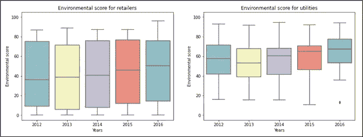

# 公司董事如何影响公司的可持续性

> 原文：<https://towardsdatascience.com/how-company-directors-affect-corporate-sustainability-9e8b457a2878?source=collection_archive---------30----------------------->

## 通过使用机器学习和统计学，我证明了之前在董事会的专业经验对公司社会绩效的影响

图表显示了董事的企业社会责任相关经验如何促进企业的可持续发展。朱莉娅·尼库尔斯基拍摄的图片，图标由来自 www.flaticon.com[的](https://www.flaticon.com/)[弗里皮克](https://www.freepik.com)和[基兰沙斯塔里](https://www.flaticon.com/authors/kiranshastry)制作。

公司不仅仅是生产者和服务提供者，雇佣我们，满足我们的消费需求。他们是我们社会中的行动者，可以对气候变化、人权和我们生活的社区产生积极和消极的影响。因此，**消费者、监管者和投资者越来越多地要求公司采取更多行动，为社会做出积极贡献。**

我调查了公司董事对公司社会责任的潜在影响。具体来说，我查看了董事会成员的**先前职业经历**。我假设与环境和社会问题相关的经验会积极影响一个公司的社会责任行为。

我使用机器学习来分析 [S & P 500 成员公司](https://www.spglobal.com/spdji/en/indices/equity/sp-500/)的公司董事的履历信息。然后我对他们的经历和这些公司的可持续性评级进行了线性回归分析。请继续阅读，看看我的发现，以及它们对希望支持可持续发展的公司和投资者意味着什么。

卡尔·海尔达尔在 [Unsplash](https://unsplash.com?utm_source=medium&utm_medium=referral) 上拍摄的照片

# 公司董事和企业社会责任

## 什么是 CSR？

**企业社会责任描述了公司在其业务运营中考虑环境、社会、道德和其他非财务因素的责任**[1]。在过去的 50 年里，研究人员和从业人员基本上一致认为，以对环境和社会负责的方式行事不仅是公司的道德义务。无数的研究也表明，一个公司的企业社会绩效(CSP)积极影响其财务绩效[2， [3](https://doi.org/10.1177/0007650315584317) 。CSP 描述了公司商业活动的社会影响和结果[4]。因此，格言“做好事才能做好事”是有实证依据的。

## 公司董事的作用是什么？

因此，如果企业社会责任能够带来经济利益，那么问题就变成了:*一家公司如何提高其企业社会绩效？*许多研究对这一领域进行了调查，发现了公司制度、组织和个人层面的各种影响因素[ [5](https://doi.org/10.1007/s10551-015-2822-y) 、 [6](https://doi.org/10.1177/0149206311436079) ]。**董事会是影响 CSP 的因素之一。**

董事会的任务是向管理层提供建议并控制管理层，以确保管理层的行为符合股东的最大利益[7-[9](https://doi.org/10.1111/j.1467-8683.2009.00740.x)。各种理论观点旨在解释董事会在公司中的特殊作用(见[8，10， [11](https://doi.org/10.1177/031289629101600103) )。大量实证研究证实**董事会控制管理层*和*在战略决策**[9](https://doi.org/10.1111/j.1467-8683.2009.00740.x)中发挥作用。这意味着他们参与并能够影响各种决策:进入新市场——如电动汽车——或调整生产流程以提高能效。

照片由[克里斯蒂娜@ wocintechchat.com](https://unsplash.com/@wocintechchat?utm_source=medium&utm_medium=referral)在 [Unsplash](https://unsplash.com?utm_source=medium&utm_medium=referral) 上拍摄

## 关于董事和 CSP 之间的联系，研究告诉了我们什么？

董事会和各个董事的各种特征都与 CSP 相关联。董事的独立性[12、 [13](https://doi.org/10.1007/s10551-014-2460-9) 、首席执行官和董事长角色的分离[ [14](https://doi.org/10.1108/14720701211275604) ]、董事会规模[ [15](https://doi.org/10.1007/s10551-012-1578-x) 、 [16](https://doi.org/10.1002/csr.1889) ]，以及处理可持续性问题的董事会委员会的存在[ [17](https://doi.org/10.1007/s10551-017-3453-2) ]已经被证明会影响 CSP。**对董事的人口统计学和心理学特征的调查程度较低。**

一些研究发现性别[ [18](https://doi.org/10.1111/corg.12165) ]、年龄[ [19](https://doi.org/10.1007/s10551-012-1272-z) ]、任期[ [19](https://doi.org/10.1007/s10551-012-1272-z) ]、种族[20]、国籍[ [21](https://doi.org/10.13140/RG.2.2.19589.60648) ]、职业经历[ [15](https://doi.org/10.1007/s10551-012-1578-x) 、 [19 【T23、20】与 CSP 之间存在相关性。然而，迄今为止还没有研究调查董事的 CSR 相关经验对 CSP 的潜在影响。之前的三项研究仅着眼于**董事在环境相关领域的经验及其对公司环境绩效的影响**[22—](https://doi.org/10.1007/s10551-012-1272-z)[24](https://doi.org/10.1002/job.1813)。

## 董事的职业经历如何影响 CSP？

一个重要的研究领域是关于首席执行官和其他高层管理人员对组织成果和行为的影响。例如，首席执行官的职业经历、年龄、任期和教育程度与公司的财务表现挂钩[ [3](https://doi.org/10.1177/0007650315584317) ]。其他研究表明，政治意识形态[26]、自恋、马基雅维利主义和精神变态[ [25](https://doi.org/10.5465/AMBPP.2019.10847abstract) ]会影响战略选择和经济结果。

这些研究基于上层理论(UET)，该理论认为**首席执行官和高层管理团队的人口特征、个性和价值观会影响组织绩效** [27]。这一理论表明，个人的价值观和认知基础引导着他们的战略选择过程[27](见**图 1** )。因为这些很难观察到，所以在研究中经常使用代理变量——比如以前的专业经验。

**图 1:** 战略选择流程。改编自汉布里克&梅森【27】，第 195 页。图片由 Julia Nikulski 提供。

如前所述，董事会参与战略决策过程。因此，可以假设董事的人口统计特征、个性和价值观也会影响组织行为和结果。

基于这个理论框架，我推导出两个假设:

*   **H1:** *董事会董事的企业社会责任相关专业经验将对公司的企业社会责任计划产生积极影响。*
*   **H2:** *如果董事是企业社会责任委员会的成员，董事的企业社会责任相关职业经验与企业社会责任计划之间的正相关关系将会增加。*

第二个假设也认为**董事会委员会的组成比整个董事会的组成更能预测具体的结果**(见【28】)。董事会委员会处理特定的主题或领域。例如，审计委员会必须由具有金融专业知识的董事组成[29]。这表明，将专业知识与责任相匹配会带来更好的结果。

[巴德·赫利松](https://unsplash.com/@budhelisson?utm_source=medium&utm_medium=referral)在 [Unsplash](https://unsplash.com?utm_source=medium&utm_medium=referral) 上的照片

# 调查主管经验和 CSP

## 样本和变量

我的样本包括 2011 年至 2015 年间在标准普尔 500 指数成员公司董事会任职的所有董事。我分别调查了环境经验和绩效以及社会经验和绩效之间的联系。因此，我使用了来自[路孚特](https://www.refinitiv.com/en)的环境得分和社会得分作为因变量。

控制变量包括董事会规模、董事会独立性、董事会平均任期、首席执行官双重性、资产回报率(ROA)、财务松弛、杠杆、行业和年份。独立变量包括**在整个董事会和 CSR 委员会中拥有相关环境或社会经验的董事比例**。

来自早期研究[ [17](https://doi.org/10.1007/s10551-017-3453-2) ， [23](https://doi.org/10.1007/s10551-017-3769-y) ]和评级机构([路孚特](https://www.refinitiv.com/content/dam/marketing/en_us/documents/methodology/esg-scores-methodology.pdf)， [SASB](https://www.sasb.org/wp-content/uploads/2020/02/SASB_Conceptual-Framework_WATERMARK.pdf) )的信息被用于确定哪些类型的专业经验和领域有资格被标记为环境和/或社会。先前环境经验的一个例子是**一个专注于生物多样性和保护的基金会的董事会任命**。之前担任过首席可持续发展官的工作会被考虑到环境和社会经验得分中。

有关此分类的更多详细信息，请参考我的 GitHub repo 的[自述部分。在考虑缺失数据后， **463 家公司和 2，201 家公司年度观察结果仍为 5，276 名独立董事**。](https://github.com/julianikulski/director-experience-sustainability)

马库斯·斯皮斯克在 [Unsplash](https://unsplash.com?utm_source=medium&utm_medium=referral) 上拍摄的照片

## 语言模型实现

我们选择了一种机器学习的方法，而不是手动阅读数千份简短的传记，来识别具有相关经验的董事。我使用了基于 **Transformer 的预训练 NLP 模型**[***long former***](https://github.com/allenai/longformer)*[30](http://arxiv.org/abs/2004.05150)*来将短篇传记分类为环境和/或社会或不相关的经历。**

**与人工审查传记相比，使用这种方法为我节省了大约 250 个小时的工作时间。表 1 显示了样本中环境和社会传记的分布。关于 Longformer 模型如何工作的更多细节，请查看我的关于基于 Transformer 的 NLP 模型的文章。**

****

****表 1:** 包含 5276 个传记的样本中不同类别的份额。图片由 Julia Nikulski 提供。**

## **数据分析和建模**

**使用考虑行业固定效应和时间固定效应的**双向固定效应模型**对这两个假设进行了调查【31】。内生性和因果性问题的解决方法是在自变量(和控制变量)和因变量之间包含一年的时滞[32]，使用固定效应模型[31]，并遵循先前类似研究的操作化方法。**

**为了确保结果的稳健性，我进行了三种不同的回归分析。首先，我使用了整个样本，包括所有异常值。然后，我用截断样本重新计算，从所有连续的因变量、自变量和控制变量中切掉第 1 和第 99 个百分位数。第三次运行是在 winsorizing 第 1 和第 99 百分位，限制每个连续变量的最小和最大值[ [33](https://doi.org/10.1177/0148558X9200700205) ]之后进行的。**

**进行这些计算的代码可以在我的 [GitHub](https://github.com/julianikulski/director-experience-sustainability) 上找到。**

# **结果**

## **描述统计学**

**我的样本中的数据显示了几个有趣的见解。首先，它显示了行业和年份因变量的差异。例如，**图 2** 中的箱线图显示出零售业的环境得分比公用事业更广泛。**

****

****图 2:** 零售和公用事业行业的环境得分方框图。图片由 Julia Nikulski 提供。**

**此外，随着时间的推移，所有行业的环境和社会得分都在增加，而独立变量和控制变量保持相对恒定。**图 3** 还显示，环境得分的四分位距(IQR)高于社会得分。因此，各行业的环境得分差异较大。**

****

****图 3:** 所有行业的环境和社会得分方框图。图片由 Julia Nikulski 提供。**

**整个董事会的环境经验得分(独立变量)范围从 0%到 86%的董事。平均值为 19%，而图 4 显示，在 2201 家公司的年度观察中，有 402 家公司的董事会中没有任何有环保经验的董事。更多的董事有社会问题的背景，只有 162 家公司的年度观察显示他们的董事会缺少社会经验。董事会的社会经验得分在 0%到 93%之间，平均为 31%。**

****

****图 4:** 板上环境体验和社会体验直方图。图片由 Julia Nikulski 提供。**

**在与董事会委员会相关的独立变量中也可以观察到类似的趋势。1，804 个公司年度观察在其环境相关委员会中没有环境经验。这一数字略低于社会经验委员会的分数，为 1，703(见**图 5** )。这些高值部分是由于缺乏有经验的董事和缺乏 CSR 相关委员会造成的。只有 140 家公司有董事会环境监督委员会，145 家公司有社会监督委员会。**

****

****图 5:** 相关委员会环境经验和社会经验直方图。图片由 Julia Nikulski 提供。**

**我进行的[曼-惠特尼 U 检验](https://en.wikipedia.org/wiki/Mann%E2%80%93Whitney_U_test)已经为我的两个假设提供了初步支持(见**表 2** )。经验分数大于 0 的公司年观察值的因变量平均值高于经验分数为 0 的公司年观察值。这表明有经验的董事对环境和社会绩效有积极的影响。**

**此外，有经验的董事会委员会成员的公司年度观察的平均环境和社会得分高于那些考虑整个董事会经验的人。**

****

****表 2:** 有经验主管和没有经验主管的观察结果的曼-惠特尼 U 检验结果。图片由 Julia Nikulski 提供。**

## **回归分析**

**回归分析证实了假设 1 和假设 2。表 3 中**所示的模型 1 和模型 2 调查了 H1。结果显示，一个拥有在环境问题上有经验的董事的公司比一个没有有经验的董事会的公司有更高的环境得分。同样适用于有社会经验的导演。****

**具体来说，模型 1 中的系数 18.163 可以这样解释:**董事会经验得分每增加 10 个百分点，公司的环境绩效得分就会增加 1.8163 分**。这种业绩变化表明，董事很重要。然而，它们只是改善企业社会绩效的更大战略的一部分。**

****

****表 3:** 固定效应回归模型的结果。图片由 Julia Nikulski 提供。*注:** * *:1%水平显著；**:在 5%的水平上显著；*:在 10%水平上显著。括号中给出了稳健的标准误差。模型 1 使用环境委员会经验分数作为自变量，环境分数作为因变量来测试 H1。模型 2 通过用社会委员会经验分数预测社会分数来测试 H1。模型 3 使用环境委员会经验分数作为自变量，环境分数作为因变量来测试 H2。模型 4 用社会委员会经验分数和社会分数测试 H2。**

**假设 2 也被证实，因为独立变量的模型 3 和模型 4 中的系数大于模型 1 和模型 2 中的系数。因此，如果**一家公司任命其有 CSR 经验的董事加入 CSR 相关委员会**，环境和社会绩效得分将大幅增加。**

**使用截断和 winsorized 样本进行回归分析的结果可以在 my [GitHub](https://github.com/julianikulski/director-experience-sustainability/blob/main/analysis/regression_analysis.ipynb) 上找到。两次稳健性检查都证实了使用整个样本进行回归分析的结果。**

****

**照片由[缺口缺口](https://unsplash.com/@jannerboy62?utm_source=medium&utm_medium=referral)在[缺口](https://unsplash.com?utm_source=medium&utm_medium=referral)处拍摄**

# **含义和结论**

**从这些结果中可以得出各种理论和实际的含义。高层理论是适用于董事会和公司业绩的有效理论。只有很少的先前研究做过。此外，这项调查强调了**专业知识与责任相匹配的重要性**。今后，公司应建立企业社会责任相关委员会，并任命具有企业社会责任相关经验的合格董事。**

**此外，公司应该感到鼓舞，任命更多有 CSR 经验的董事进入董事会和董事会委员会。**投资者应该让公司负起责任，增加他们在董事会中的 CSR 专长**。关于数据收集过程，机器学习的应用前景非常广阔。这项研究显示了它在处理大量非结构化数据时的优势。**

****这项研究的最终收获**应该是**增加 CSP 和促进可持续发展的一个步骤是任命具有 CSR 相关经验的董事**。然而，要创造积极的社会影响并实现可持续发展，还需要采取更多以企业社会责任为导向的措施。**

**请注意:这项调查是我硕士论文的一部分。**

**你想在媒体上阅读更多高质量的故事吗？考虑注册一个支持我和其他媒体作者的[会员](https://medium.com/@julia.nikulski/membership)。**

**<https://medium.com/@julia.nikulski/membership> ** 

**既然你在这里，你可以看看我写的关于**数据科学和可持续发展的交集**以及在这个领域工作的有前途的项目和组织的文章。**

**</data-science-for-sustainability-b912d5fb5d24> ** 

# **参考**