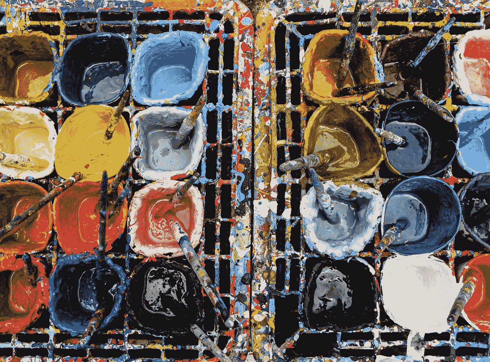
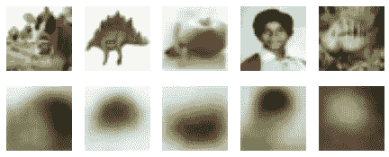
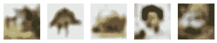
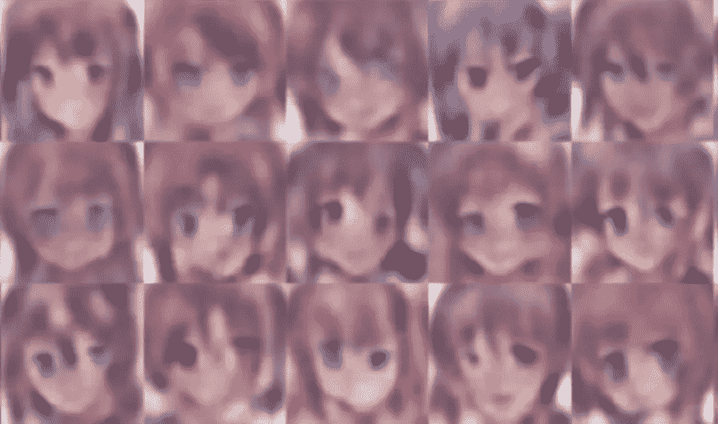
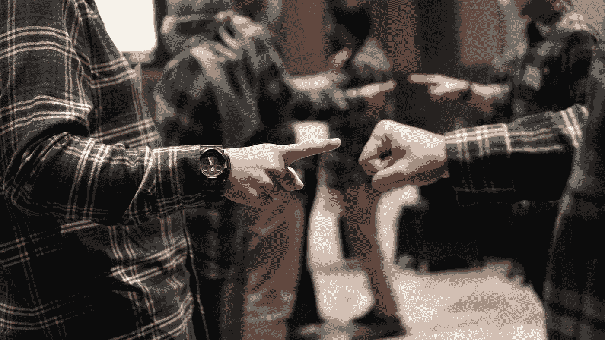
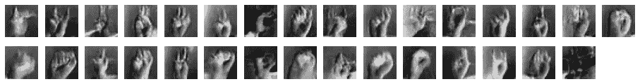
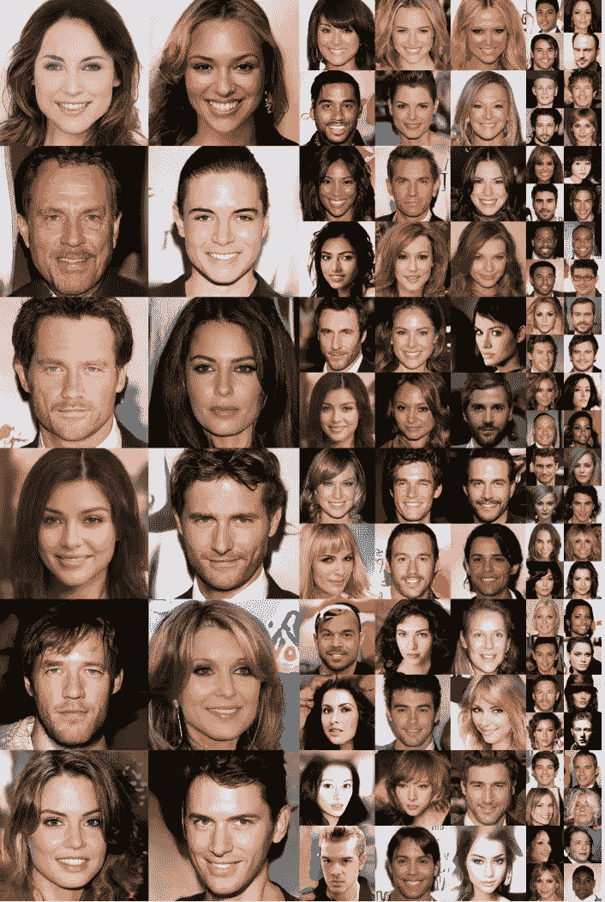

# 计算机如何玩模仿游戏:不到 10 分钟从自动编码器到 StyleGAN2s

> 原文：<https://towardsdatascience.com/how-computers-play-the-imitation-game-from-autoencoders-to-stylegan2s-in-less-than-10-minutes-d0a89507cc04?source=collection_archive---------36----------------------->

## 非极客的(小说)图像生成指南

威廉·冈克尔在 [Unsplash](https://unsplash.com?utm_source=medium&utm_medium=referral) 上拍摄的照片

这一切都始于 1950 年三个受试者玩的一个游戏。c 会坐在一个单独的房间里，向 A 和 B 提出开放性的问题，接受书面回答，并试图从中辨别 A 和 B 是人还是机器。C 的目标是把它做对，而 A 和 B 的目标是愚弄 C。

自从机器开始研究如何通过图灵测试以来，已经过去了 70 年，它们已经走过了漫长的道路。

我是一名投资者，在游戏中呆了 15 年，对金融服务有一定程度的了解，是一名机器学习和 Tensorflow 免费击球手，但绝不是机器学习工程师。尽管如此，我认为内容生成技术告诉了我们很多关于计算机在模仿人类方面有多好的信息——并且可以在这个过程中教会我们一些谦逊和自我意识。

**这篇文章的目标是在不到 10 分钟的时间里总结玩模仿游戏**的最新计算机技术的发展。我同意，图灵将这个简单游戏的成功与回答更深层次的问题“*机器能思考吗？”*是一个很大的假设，但另一个时间。10 分钟现在开始。

# **第一步:自动编码器和降维**

为了公平地复制人类生产的东西(以及我们认为是人类生产的东西)，计算机应该首先学会理解，或者至少(让我们尽可能远离意识和自我意识这些令人毛骨悚然的概念)通过综合其核心维度来概括内容。

在现实生活中，通常可以在不丢失太多信息的情况下显著减少一个集合的特征数量。看下面的自然数序列。

*顺序= [1，2，4，8，16，32，64，128，256，512]*

虽然该序列包括 10 个数字，但显然该列表代表序列 2ⁿ的前 10 个实例，其中 *n* 从 0 开始。对于一个人来说，最多装备笔和纸，复制这样的序列的前 10、20、50 个成员而不全部记住是微不足道的。换句话说，我们已经确定了序列固有的低维特征，这些特征足以进行完美的复制。或者，更简单地说，我们发现了一种模式。但是机器也能做到这一点吗？

你不会感到惊讶，他们可以，通过同样的测试和学习的方法，人类将适用于这个和更复杂的序列。这正是自动编码器所做的。

什么是自动编码器？自动编码器是一种模型，它查看输入，提取有效的潜在表示(编码器)，并吐出希望看起来尽可能与输入相似的东西(解码器)。

自动编码器的图形表示:从输入到重构

我们来拍几张低分辨率的图片。编码器的工作是将(32 高 x 32 宽 x 3 RGB 通道)像素中的信息压缩到更低的维度；解码器的任务是获取该表示，并尽可能地再现与原始图像接近的内容。第一次，我们的模型通过随机猜测做得很差，然后它做得好一点，然后再好一点，直到希望在多次迭代后它变得非常好，这取决于我们想要压缩原始信息的程度。

原始图像*与使用 1 个中间层和 10 个神经元的重建图像——实际上是将 32x32x3 像素中包含的信息压缩到 10 个感知器中。结果不出所料的差(卢瑟激活和极客的 20 个纪元)*

使用具有 100 个神经元的 1 个中间层重建的图像—结果明显好得多(架构和其他参数保持不变)

如果您想要编码的信息非常(非常)大，或者非常混乱，并且模式很难被识别，那么我们简单的架构就不能令人满意地执行，并且需要扩展。但总是一样的东西。你扩展编码/解码层中的单元数量，你将这些层一层一层地堆叠起来，你玩被称为激活函数或超参数的东西，你不断地从输入到重建。你得到了**深度自动编码器**(它包括许多层)**卷积自动编码器**(它包括通过特殊过滤器过滤信息的层)**递归自动编码器**(它对它们所做的事情保持某种记忆)等等。但是如果你得到了最初架构的想法，基本上是一样的。

# **第二步:变化的自动编码器和新东西的创造**

但是有一类自动编码器，所谓的**变型自动编码器**，它的行为与其他编码器不同，并且**不是尽可能接近你输入的内容，而是生成一些全新的东西，但可能类似于原始输入**。你给模型 1，000，000 张雨伞的照片，然后(经过大量学习)它会产生一张真正像雨伞的照片，但那不是你分享的照片之一。这是赢得模仿游戏的第一步。

一个可变的自动编码器在这个过程中引入了一点随机性。研究输入后，编码器生成输入(理论)分布的均值μ和标准差σ，而不是为其生成编码，即假设输入呈正态分布时的均值和标准差。如果听起来很复杂，让我们一步一步来分析:

1.  编码器接收输入列表，并猜测μ和σ的两个值，假设两者都是 0.5
2.  然后，从μ = sigma = 0.5 的正态分布中随机抽取一系列数字
3.  随后，解码器试图基于这些随机数再现输入(我们的图像)，并将其呈现给陪审团(一个客观函数)
4.  陪审团很可能会发现结果非常糟糕(这只是随机噪声),并将其退回
5.  结果很糟糕，原因有两个:输出看起来不像输入(即**重建损失**很高)，采样像素看起来不像是从正态分布中随机采样的(即**潜在损失**很高)——如果输入实际上是具有均值μ和标准差σ的正态分布，那么这些参数很可能不同于 0.5
6.  编码器更新他对μ和σ的估计，并对一组新的随机数进行采样，试图减少潜在损失
7.  然后，解码器产生一个新的估计，试图减少重建损失，并再次发送给陪审团

很长一段时间后，我们将拥有足够好的模型参数来产生全新的图像——类似于模型被训练的输入。我们只需向模型输入随机噪声(正态分布)，并使用学习到的参数对其进行解码。

由一个变化的自动编码器生成的新的动画脸——图像很模糊，需要很长时间来训练，但结果很好，它们真正提醒我们由人类绘制的动画脸

# 第三步:生成对手网络背后的思想

2014 年，一组人工智能研究人员意识到，设计两个不同的模型试图愚弄对方，而不是让他们为同一支球队效力，结果将会显著改善。这个想法既简单又天才。

我们有一个发生器和一个鉴别器，它们互相对抗。**发生器**将随机噪声作为输入并输出图像(与解码器在上述可变自动编码器架构中工作的方式相同)。相反，**鉴别器**接收一组图像，并试图识别图像是真的还是伪造的。这是*事实上的*，一个在机器学习环境中重建的模仿游戏。

第一阶段:给自己找一个好的鉴别者。我们首先训练鉴别器，目的是让它相当好地识别真实和伪造的图像。开始时这很容易，因为发生器只看到真实图像和发生器产生的初始假图像(看起来真的像噪声)。

**第二阶段:教发电机学会作弊**。然后，我们训练生成器产生图像，鉴别器会错误地将这些图像归类为真实图像。生成者从来看不到任何真实的图像，而只是根据鉴别者识别伪造图像的能力来接收对其工作的间接反馈。鉴别器的好处是可以看到真实图像的样子。

再现的图像很快变得相当好(比可变自动编码器的情况快得多)，但几乎同样快地停止改善。其背后的原因是，他们不断试图智胜对方，最终选择了相当成功的技术。

照片由[蔻驰·埃德温·因达尔托](https://unsplash.com/@coachedwin?utm_source=medium&utm_medium=referral)在 [Unsplash](https://unsplash.com?utm_source=medium&utm_medium=referral) 上拍摄

**让我们假设，例如，我们正在训练 GAN 生成假的石头剪刀布图像**。在开始时，生成器非常糟糕，然后它变得更好，然后最可能理解的是，用岩石图像(一个拳头)欺骗鉴别器比用手指开发一只完整的手容易得多——所以它不断生成许多拳头，可能没有太大改善，以及一些非常糟糕的纸和剪刀。最终，鉴别者赶上来，并开始区分假石头和真石头，如此之好，以至于在某一点上，生成器尝试另一种策略，即展示纸或剪刀。开始时，它们是如此糟糕，以至于鉴别者发现了它们，但后来是鉴别者忘记了如何识别假纸和假剪刀(记住，它已经在岩石上训练了一段时间，以便智胜生成器)，生成器开始获胜。GAN 可能会在一段时间内陷入这种轮换策略，而没有真正的改善。电脑也很懒。

使用 StyleGAN 架构生成的手语图像——经过 50 个时代后，拳头或拳头状图像的趋势显而易见

**深度卷积 GANs** (DCGANs)来帮忙了，一层一层的叠加，包括滤波器，随机漏失，以及其他限制 GANs 不稳定性的技术。小图像的结果有所改善，但结果并不完美。在较大图像的情况下，重建可能会在某些细节上产生局部令人信服的结果，但整体效果不佳。

2018 年，英伟达的一个团队提议使用 DCGANs 来产生小图像，然后通过特定的过滤器(卷积层)在一个称为渐进增长( **ProGANs** )的过程中逐步扩展它们。为了避免模式崩溃(即上述 gan 的懒惰/不稳定问题)和增加多样性，引入了一些其他创新。所有这些技术的结合为高质量的图像提供了非常好的结果。

[为提高质量、稳定性和多样性而逐步种植的 GANS](https://arxiv.org/pdf/1710.10196.pdf)。使用 CELEBA-HQ 数据集生成的 1024×1024 图像(经过多天的训练)

研究小组通过比较每一层的风格，分析了生成的图片与原始图片的相似程度。这种比较程序提供了 StyleGANs 的想法，StyleGANs 是目前小说图像生成中最先进的技术。

# 步骤 4: StyleGANs 和没有名字的人

正是同一个 Nvidia 团队引入了 StyleGANs 的想法，即 GANs，其中生成器被修改为使用样式转移技术，以便在局部和全局都具有与原始图像相似的结构。高质量图像的结果是惊人的。

Rani Horev 在 StyleGANs 上的帖子提供了一个精彩的解释，但以下是他们主要特征的总结:

*   **映射网络**将输入编码成控制不同视觉特征的中间向量
*   **风格模型**将由映射网络编码的特征转移到每个分辨率级别的生成图像中(即，对于低级和高级图像特征)
*   使用**随机变化**来生成不确定的或不能被映射网络映射的特征(如头发、雀斑、皱纹等)。)
*   **在生成图像的每个级别进行风格混合**,以避免级别之间的相关性，这可能导致生成的图像遵循特定(且不一定真实)的模式

这种方法在生成新颖的逼真图像方面具有开创性，并在 2020 年的另一篇论文中得到进一步改进(该论文介绍了 StyleGAN2s)。结果呢？自己判断。

由 StyleGAN2 架构生成的图像—归功于[thispersondoesnotexist.com](https://thispersondoesnotexist.com/)

如果你像我一样，想象照片上的人的生活，他的童年，他的青年，他的爱和恐惧，痛苦和快乐，然后提醒自己这实际上只是随机像素的集合，那么计算机真的在模仿游戏中走了很长的路。

我希望你喜欢这次短暂而紧张的旅程。应用程序的数量是巨大的，你可以选择是被它吓倒还是被它激励。这是你的选择。我们才刚刚开始。