# 计算机如何看深度:基于深度学习的方法的最新进展

> 原文：<https://towardsdatascience.com/how-computers-see-depth-deep-learning-based-methods-368581b244ed?source=collection_archive---------19----------------------->

来源: [Unsplash](https://unsplash.com/photos/0YQOOxNT2V4)

## 从立体图像估计深度

## 第 1 部分:立体视觉的动机和基础

O 我们对深度的感知对于创造我们周围的 3D 世界至关重要。这种知识已经流行了几个世纪，有一个人非常了解这一点，他就是莱昂纳多·达·芬奇。他利用自己的专业知识帮助自己创作了一些艺术作品，这些作品将会名闻遐迩，如《最后的晚餐》或《萨尔瓦托勒·希泽拉》。从技术上讲，对双筒望远镜的理解可以追溯到公元 280 年，当时欧几里德意识到我们的深度知觉是人类用两只眼睛聚焦于同一物体。尽管如此，今天，立体视觉仍然是一个非常有趣的问题。我的目标是深入了解这个话题。现在，我把我的笔记转变成一个博客系列。

✍每篇文章都将包括一个突击测验！突击测验的目的是通过思考精选的问题集来巩固关键概念。所以，请分享你的回复吧！

# 目录

[一简介](#e7c3)
[二深度感知:3D 空间中的人类](#16d0)
∘ [二. a 为什么是立体的？](#1096)
[III 立体问题](#ef51)
∘ [III.a 立体视觉方法论](#f194)
∘ [III.b 核几何(概念)](#213b)
∘ [III.c 核几何(数学)](#7633)
[IV 立体视觉系统的几代产品](#538d)
[V 未来工作](#2462)
[VI 结论](#36ec)
[博士中等上](#0281)
[**突击测验**](#2713)
∘ [A)捕食者对猎物](#a52a)
∘ [B)立体视觉由费雪](#33c7)
∘ [C)附加题](#a5b4)

# 一.导言

深度估计在现实世界中有许多用途，在机器人、计算机视觉和沉浸式显示中具有实际意义(见上图)。我们将深度估计视为一个多图像问题。多视图(或图像)问题跨越不同的问题领域，如(1)立体视觉，(2)运动结构，以及(3)光流。虽然每一个都在虚拟现实(V.R .)、机器人和计算机视觉问题中作为一个整体具有巨大的重要性，但在这个多部分系列中，我们将重点关注(1)立体视觉。具体来说，深度学习在立体视觉技术上的进展。首先，在*第一部分*中，我们涵盖了预备材料(即经典立体视觉理论)。

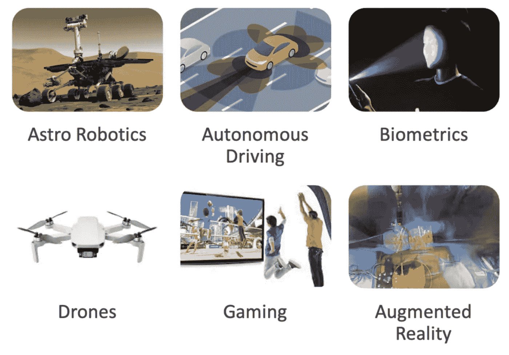

基于深度传感技术的大量应用。图片作者。

人工神经网络在计算机视觉中有很长的历史，为对象检测和分类提供了一个健壮的框架。此外，深度学习通过提供网络学习的图像的更深层次的表示，彻底改变了该领域。最近这一成功的关键因素包括一个简化的网络架构，其参数更多，规则更少，以及新的训练技术，如辍学[3]和 L2 正则化[4]。

在我们专注于具体的深度学习解决方案之前，让我们首先通过理解为什么立体图像对可以推断深度来激发这个问题。

# 深度知觉:3D 空间中的人类

人类的大脑在立体视觉中有一种奇妙的能力来看深度。我们使用我们的两只眼睛，它们分别位于头部的两侧，使我们能够感知物体的三维空间:高度(深度)、宽度和相对于周围环境的前后位置。然而，这项技能并不是人类独有的——许多动物都拥有它！然而，当尝试关于这个主题的计算建模研究时，仍然会出现几个挑战，主要是因为在没有输入数据集的情况下，这些挑战是困难的或不可能的，这些输入数据集包含关于您希望他们训练什么对象以及这些项目当前位置有多近/多远的信息。这个博客系列将探索这些挑战，以及基于深度学习的方法的最新进展如何克服这些挑战。

我们可以使用核几何来重建在图像捕获期间丢失的深度(即， *z* )维度，其中图像对来自已知参数的来源:内在参数(即，透镜的焦距 *f* )和外在参数(即，称为基线*b】*的左右摄像机的光学中心之间的距离)。

我们如何从图像中自动计算三维几何图形？图像中的哪些线索提供了 3D 信息？在看双目(即立体或两个)之前，让我们先考虑一些单一视角，即单目特征。

我们人类天生如此。下图描绘了我们自然用来感知世界深度的线索。

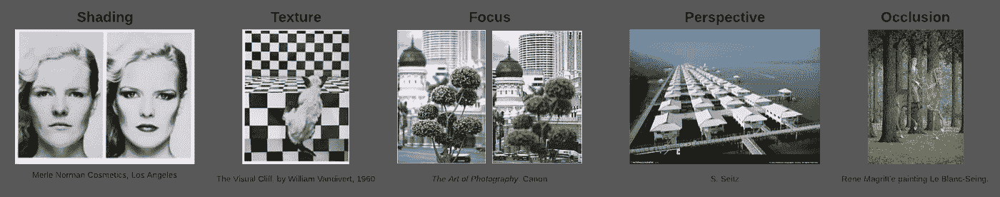

人类用来推断深度信息的几个线索，线索列在每个样本的上面，来源在下面。

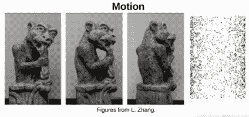

运动是我们用来推断深度信息的另一个线索。想象一下 gif(最右边)中所示的雕像的转动。作者创建了 gif。

*   突出
*   阴影
*   轮廓
*   相互反射
*   对称
*   光偏振

## 为什么是立体声？

如简要提到的，深度线索可以来自单个源(即，单目视觉)。另一种方法是通过立体图像对使用同一场景的两个视觉参考(即双目视觉)。为什么要使用多个来源？通常，从单一来源推断深度信息是不可能的。还有，单目视觉任意缩放。下图描述了这个概念。

让我们通过例子来看看单一观点的模糊性。

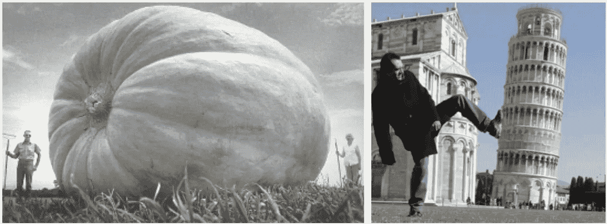

**深度，正如在 2D 的图像中看到的，是模糊的。**因此，先前的线索不能确定地产生精确的深度信息。

描绘这种模糊性，我们看到从光学中心(即摄像机位置)看到的 **P1** 和 **P2** ，投影到像平面上的**P1’**和**P2’**是等价的。

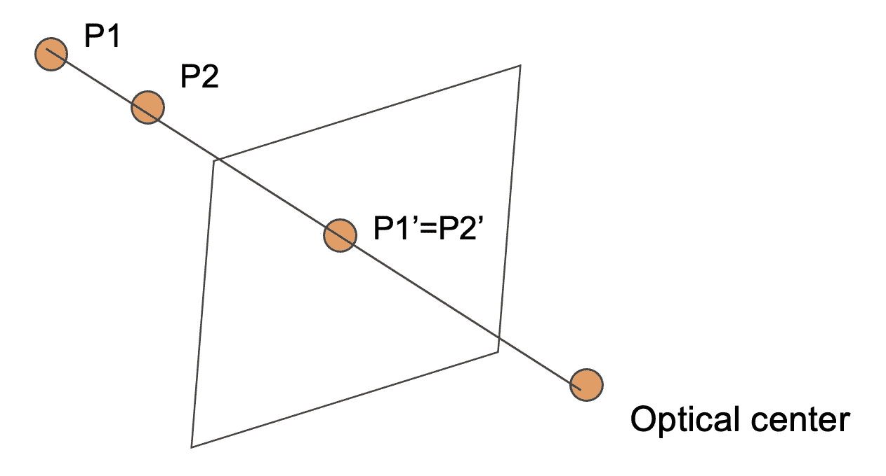

**图形描绘显示了来自单目视图(即，单个图像)的深度模糊。**从单个视角来看，结构和深度本质上是不明确的。上图显示，单一视图的框架和深度是模糊的。请注意，上面的示意图在本文末尾会更有意义，因此，应该在讨论核几何时返回。作者创造了它们。

# 三立体声问题

立体在很大程度上受到生物学的推动(即，使用左眼和右眼同时捕捉视觉信息)。

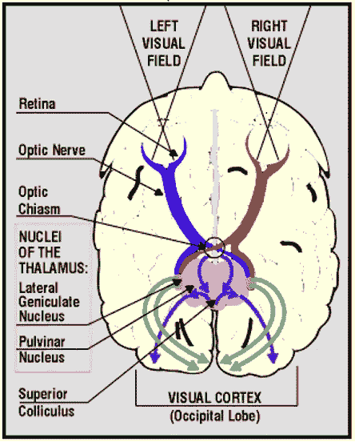

**S .伯奇菲尔德，克莱姆森大学** [**ECE 847**](http://www.ces.clemson.edu/~stb/ece847)

经典立体声方法的灵感来自于我们感知深度的方式，如上述线索。例如，可以使用刚体解算器来求解 3D 空间中的球面坐标方程，其中图像是从现场的不同角度或视角拍摄的，从而产生视差和其他效果。然而，这个系列将更加专注于深度学习解决方案(DL)。在进入任何细节之前，我们需要对这些基本原理有一些初步的了解，所以让我们从这里开始吧！

接下来，我们将回顾为什么立体对(即，左图像和右图像)足以解决前面提到的模糊问题。它使用两个相机都能看到的世界坐标中匹配对应点的两个图像平面的三角测量。

## 三.立体视觉方法

传统算法分为两大类，具体来说是*局部*和*全局*方法，对应于步骤:

1.  成本计算。
2.  成本汇总。
3.  视差优化/计算。
4.  视差细化。

当我们探索现代的、数据饥渴的、端到端的解决方案时，这些步骤将类似于本博客中涉及的系统的许多模块。但是，首先，让我们回顾一下立体视觉的基础。

## III.b 极线几何(概念)

沿着由相交射线形成的平面的法线称为核平面。同样，我们假设立体对之间的校准图像和点对应。

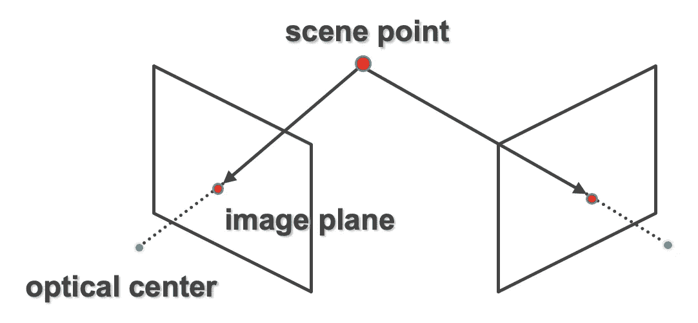

**三角测量的原理，如上所示，允许通过光线追踪到世界坐标中的交点(又名场景点)进行 3D 重建。**追踪光学中心到*场景点*是通过匹配从左到右图像(反之亦然)的对应关系来完成的——作者的照片。

*核线* *约束*将对应问题简化为沿*共轭* *核线*的 1D 搜索——如下图所示。

核线约束变换立体对，使两幅图像的核线平行。核几何将对应问题简化为 1D 搜索(即，沿着*共轭* *核线搜索匹配点)。作者创造了可视化。*

因此，核极约束假设校正的立体图像，意味着相同的*核极平面*(如上所示)跨行对齐。它与两者正交并彼此对齐[1]。使用基于内部和外部参数的变换来校正图像是一个可以追溯到几十年前的过程。

立体像对是由相对于彼此位置已知的两个相机捕获的场景的图像。视差测量左右摄像机(即立体对)之间的水平距离(以像素为单位)。因此，使用核几何沿着校正图像的水平线约束视差。

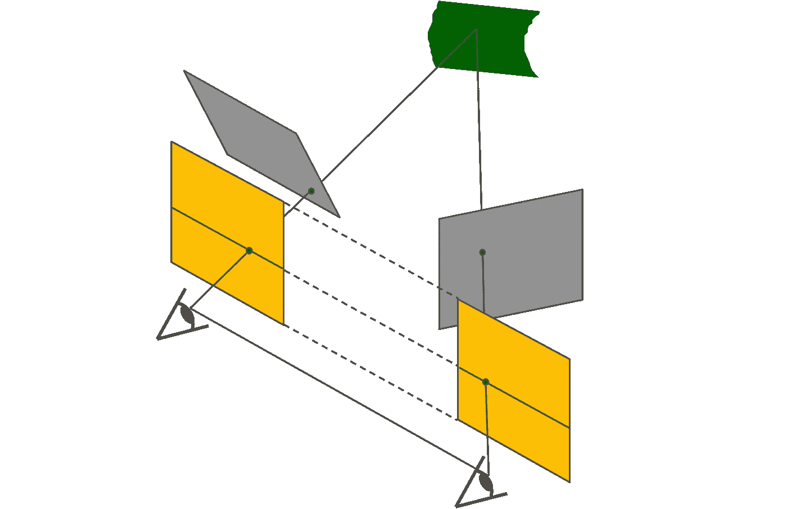

**图像矫正的过程。**一个立体像对(中间的灰色图像)在校正过程中被转换。因此，核线是水平平行的(最下面的黄色照片描绘的是校正后的图像)。视差与 3D 场景中的深度有关(图中最顶端的绿色空间)。将图像平面(即立体对)重新投影到平行于光学中心之间的线的标准平面上；像素运动在此变换后是水平的(右侧视图中的黄色方块)-图片由作者提供。

具体来说，左图像中的一个点( *x* ， *y* )在右图像中的( *x-d* ， *y* )，其中 *d* 为视差(以像素为单位)。然后，像素位移通过焦距 *f* 和被称为基线 *B 的相机之间的距离与深度相关:z = f* ∙ *B/d* ，其中 *z* 是在三个坐标空间中恢复的深度值。

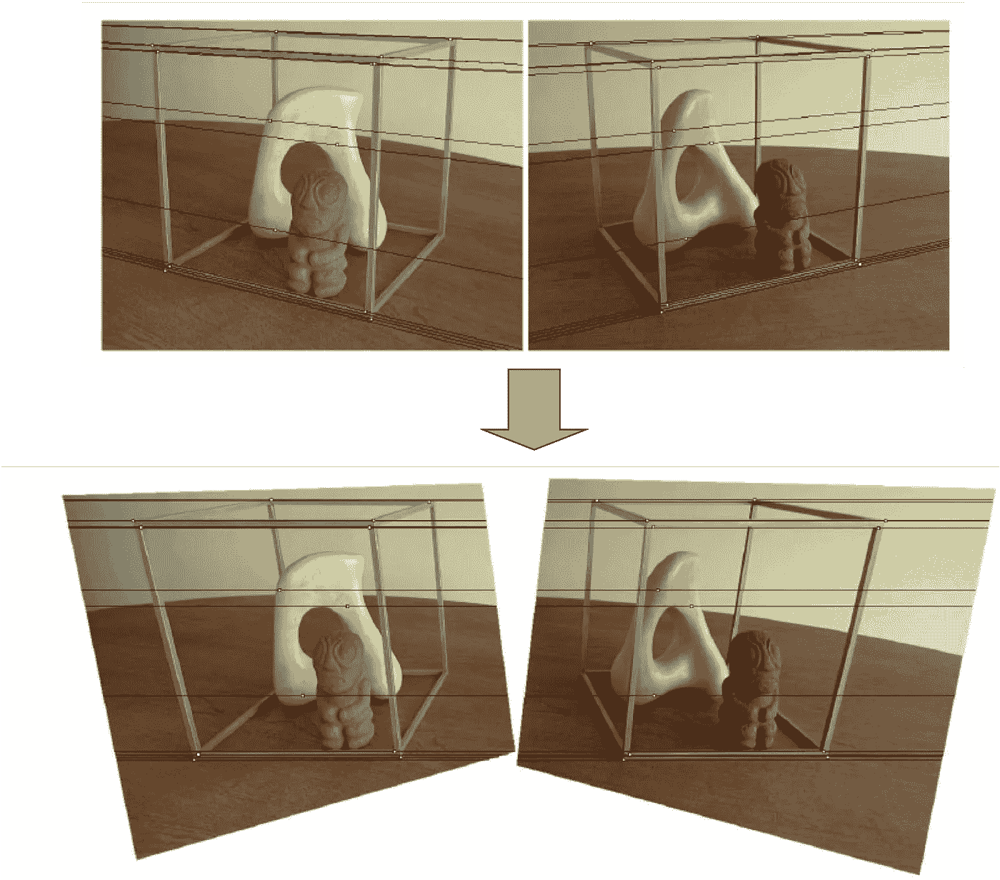

请注意，校正后的立体图像对的核线在校正前是不平行的(顶部)。因此，扭曲图像通过变换图像对来约束点对应的搜索，使得核线平行(底部)。作者创造了这个人物。

下图描述了立体像对(即输入)和生成的视差图(即输出)。

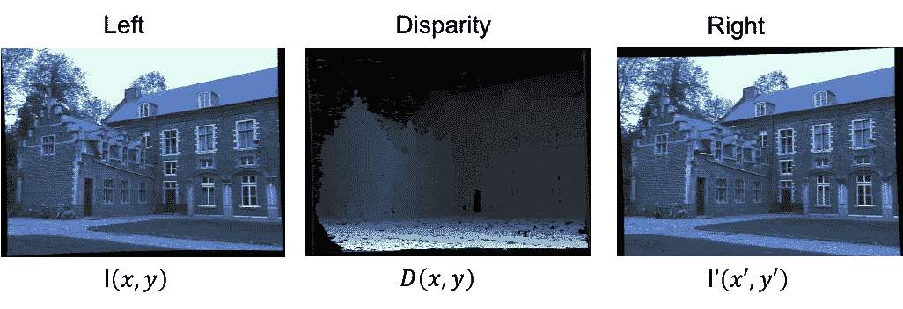

*视差(中间)表示从左到右的像素移位(即，每个对应点移位的像素数量的整数值)。作者创造了可视化。*

我们找到两幅图像中的对应点来估计相对深度。如上所述，视差和深度直接相关如下。

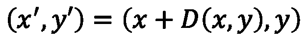

同样，我们可以将等式表示为`(x, y)=(x' — D(x, y), y'), as (x, y) is the point in the left image and (x', y') is the corresponding point in the right image. Hence, the magnitude of D(x, y) is the number of pixels shifted along the horizontal (i.e., x-direction). Notice the y-axis remains constant. Referring to the image of the building above, at the point marked in red, the value of D(x, y) will be the magnitude of the vector depicted in the right image. Take a minute to understand this, for it shows the very meaning of disparity.`

## III.c 极线几何(数学)

我们现在将解释上面介绍的概念背后的数学原理。对于那些对为什么立体声从严格的数学角度起作用的细节不感兴趣的人，请随意跳到下一部分(这里是)。

从校正后的图像对中，深度 *Z* 可以通过其与视差 *d* 的反比关系来确定，其中视差定义为比较左右对应时沿水平方向的像素差，即 **I** ( *x* ，*y【T32)=**D**(*x*+*D*，*

这种关系最容易从视觉上把握。

提供在世界坐标(X，Y，Z)中投影的左图像平面 P_L( *x* ， *y* )中的点作为 3D 场景中的点，我们的目标是重建提供立体对的缺失的 Z(深度)。

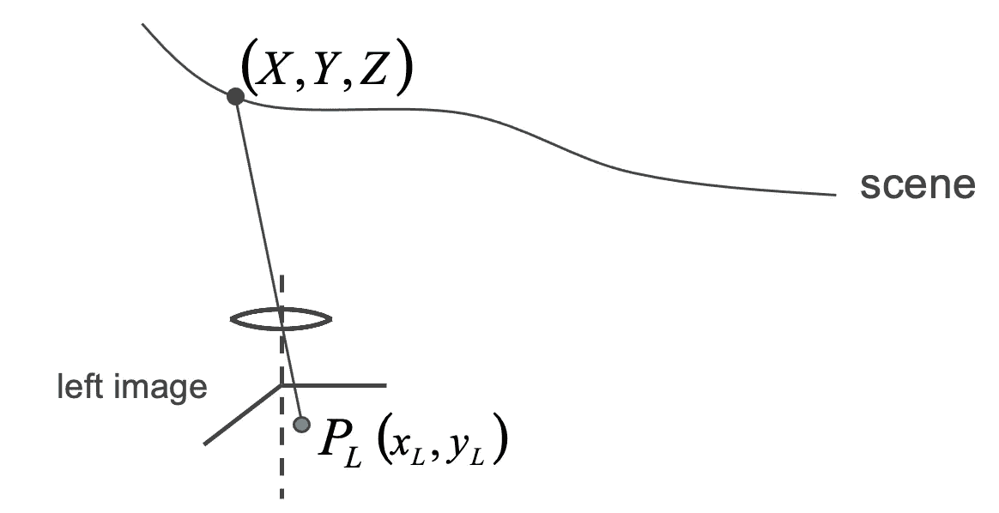

左侧图像中的点-投影到世界坐标的位置-作者提供的图像。

下图显示了右侧图像平面中的对应关系。

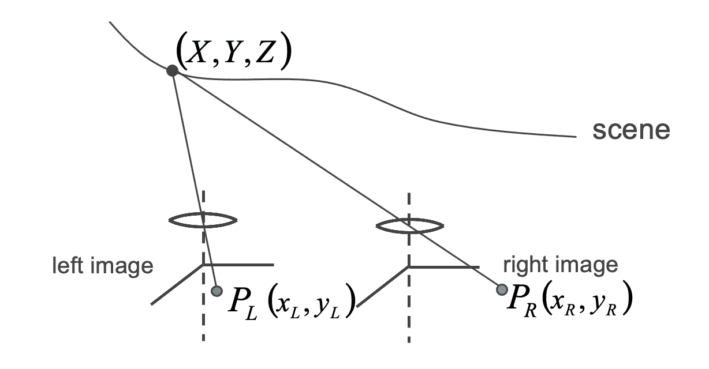

假设我们知道 P_L 对应 P_R. Image by Author。

我们设置相对世界坐标(红轴)以及两个相机中心之间的已知基线 *b* :

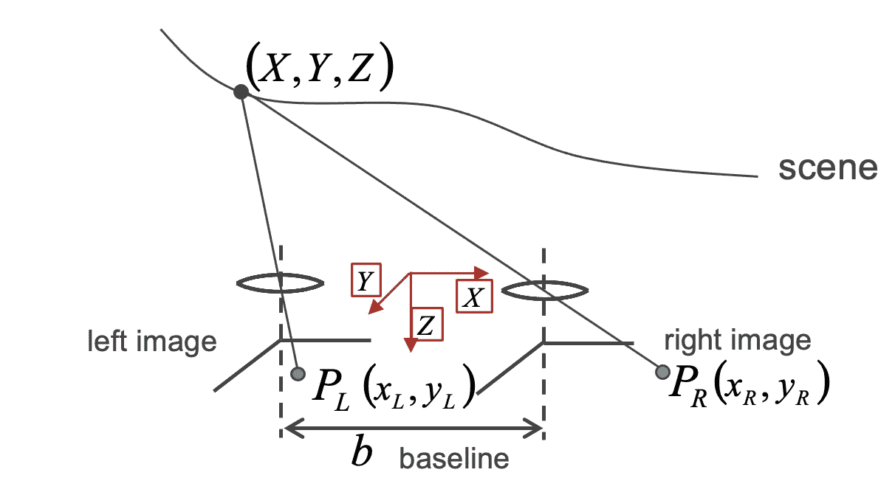

基线 b 代表摄像机之间的实际距离。图片作者。

我们得到了

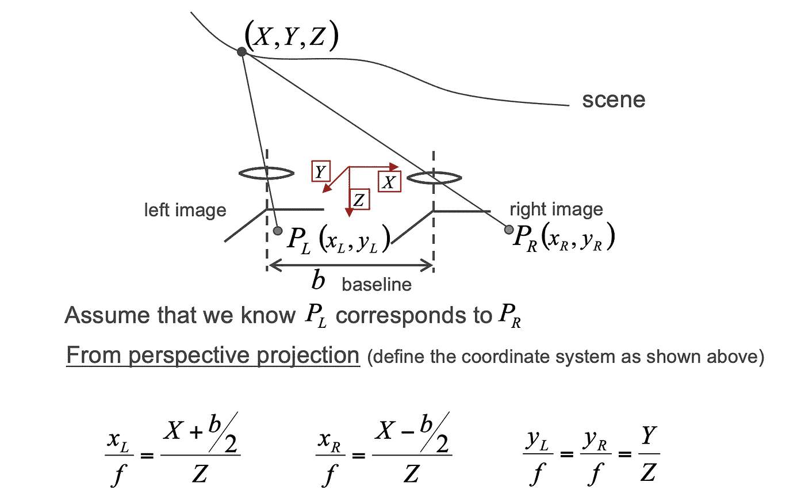

立体视觉理论基础。图片作者。

我们可以用下图表示坐标。

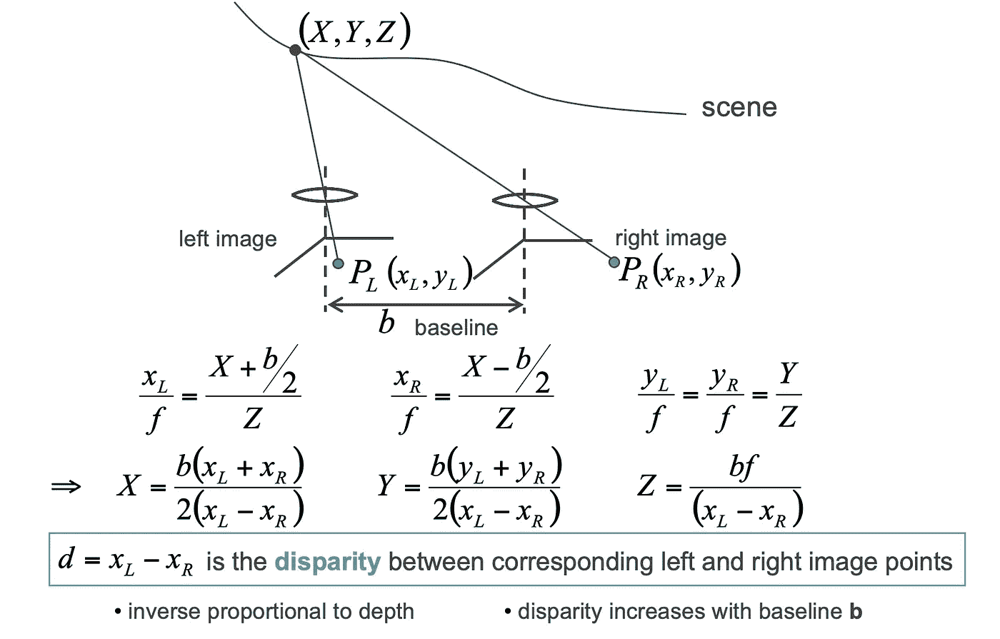

传统立体视觉综述。图片作者。

# 第四代立体视觉系统

多年来，立体视觉一直是研究界感兴趣的问题。如今，人们可以把不同的方法归为三代之一。

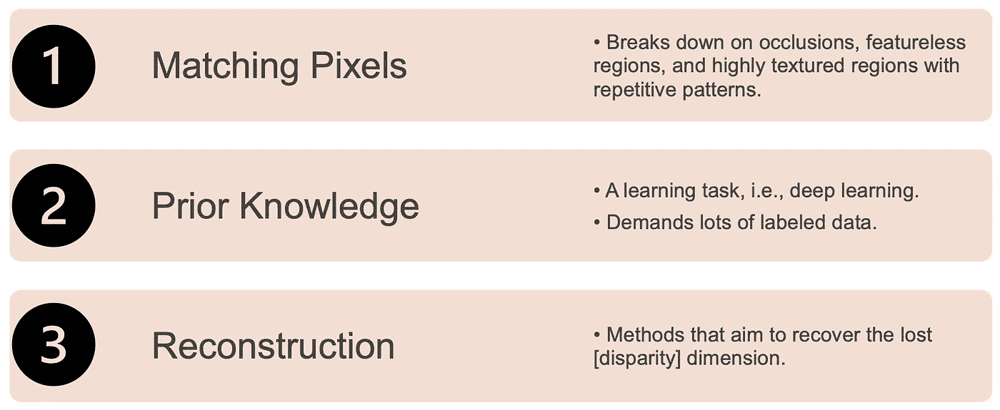

第 1 代、第 2 代和第 3 代，其中第 2 代和第 3 代将包含在系列的后续部分中。图片作者。

关于用于视差图估计的 DL 系列，我们可以将方法描述为以下任一种。

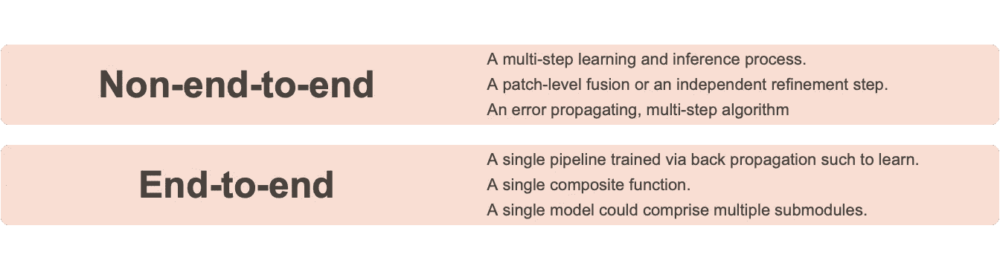

**传统方法(非端到端)和现代方法(端到端)的特点。**作者创建了可视化。

下图描述了(2)中列出的端到端系统。

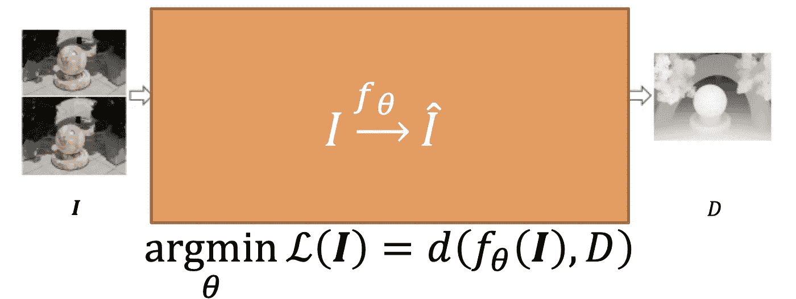

学习具有权重θ的映射函数 f，使得当将预测的视差 f _θ(**I**)= D’与作者的 G.T .视差 D .图像相比较时，输入图像张量 **I** 具有对于某个距离度量 D 最小化的损失 L。

正如我们将在前面的部分中看到的，代表 DL 网络的黑色(橙色)方框可以包括几个子模块，通常串联级联。不同的步骤类似于传统立体视觉系统中涉及的常规步骤。

# 五.未来的工作

接下来，我们开始回顾基于深度学习的深度估计方法的进展。具体来说，在*第二部分*中，我们涵盖了几个跨越 2015-2020 年的基于图像的深度立体网络(即 MC CNN [1]、DispNet [2]、GC-Net [3]、PSMNet [4]、iResNet [5]和 GA-Net [6])。然后，*第三部分*、*第四部分*和*第五部分*将涵盖最新和最大的(即 2021–2022)基于视频的立体方法，称为多视图立体(MVS)，并分别在子像素级别生成置信图。

# 六.结论

随着最近深度学习的进步，立体视觉技术正在取得长足进步。*一个多部分系列的第一部分**涵盖了经典立体视觉技术的基础:草稿是一项正在进行的工作，每个草稿都应该在接下来的几周甚至几个月内完成。*

*如果你想了解更多关于在工作或研究中使用深度估计的信息，请不要犹豫，直接联系我或者在下面留言！我们可以帮助您从今天开始。在第二部分中，准备学习各种用于立体视觉的图像级深度模型。*

*看看第二部分。*

*</dl-for-depth-estimation-p2-7cb2c9ff325d> * 

# *七参考文献*

*[1] C. Loop 和 Z. Zhang。[计算立体视觉的矫正单应性](http://research.microsoft.com/~zhang/Papers/TR99-21.pdf)。IEEE 会议。计算机视觉和模式识别，1999。*

*[2] Zbontar、Jure 和 Yann LeCun。"立体匹配通过训练卷积神经网络来比较图像补丁." *J .马赫。学习。第 17.1 号决议(2016 年):2287 至 2318。**

*[2] Mayer，Nikolaus 等人，“用于训练卷积网络进行视差、光流和场景流估计的大型数据集。”*IEEE 计算机视觉和模式识别会议论文集*。2016.*

*[3] Kendall，Alex 等，“深度立体回归的几何和上下文的端到端学习”IEEE 计算机视觉国际会议论文集。2017.*

*[4]常、贾仁和."金字塔立体匹配网络."IEEE 计算机视觉和模式识别会议录。2018.*

*[5]梁，，等，“通过特征恒常性学习视差估计”IEEE 计算机视觉和模式识别会议论文集*。2018.**

*[6]张，，等.“Ga-net:端到端立体匹配的引导聚合网”*IEEE/CVF 计算机视觉和模式识别会议论文集*。2019.*

*在 [LinkedIn](https://www.linkedin.com/company/superannotate/) 、 [Twitter](https://twitter.com/jrobvision) 和[脸书](https://www.facebook.com/superannotate)上关注罗宾逊博士*

*<https://www.jrobsvision.com/>  

# 阅读更多由[约瑟夫·罗宾逊博士](https://medium.com/u/8049fa781539?source=post_page-----368581b244ed--------------------------------)在媒体上发表的文章

</pandas-tips-tricks-need-for-speed-54e217cc6aa0>  <https://jvision.medium.com/remote-development-with-pycharm-d741287e07de>  </a-great-tool-for-image-datasets-cb249663ca45>  <https://jvision.medium.com/reduce-the-clutter-adapt-the-space-6daeef2e2ca9>  

[*深度估计:基础知识和直觉*](/depth-estimation-1-basics-and-intuition-86f2c9538cd1) 作者 [Daryl Tan](https://medium.com/u/d5d47d10c0e9?source=post_page-----368581b244ed--------------------------------) ，是我在准备本系列*第二部分*时偶然发现的一篇博客，是一篇很棒的文章。它很好地补充了第一部分(即这篇博客)。此外，主题将帮助我们更深入地理解这个主题。

</depth-estimation-1-basics-and-intuition-86f2c9538cd1>  

# 突击测验

这里有几个关于立体视觉的问题，如果思考和回答，将提供更大的洞察力。在下面评论你的答案和问题。利用从本系列第一部分中获得的经验:顶级答案和问题将得到认可。🏆

## a)捕食者与猎物

适者生存；生存进化的概念:我们能把立体视觉的概念与野生动物的生物构成联系起来吗？

比较猎物(即羚羊)和捕食者(即猎豹)的视野有什么不同？

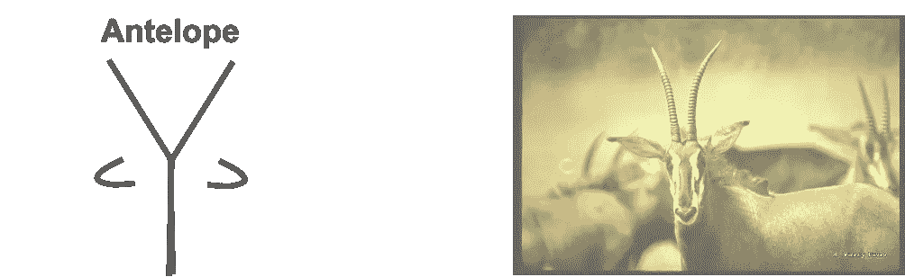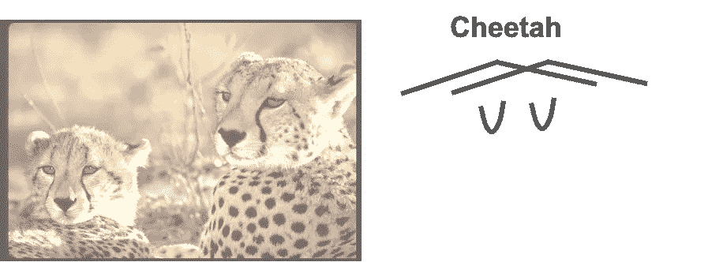

动物照片由加州科学院提供。作者修改了一下。

该图显示了一个捕食者和它的猎物以及它们立体视觉的近似示意图。考虑深度、视野和精确度。你为什么假设这是不同的？当考虑不同的立体视图时，你会想到什么好处和问题？

## b)fisher-price 的立体视觉

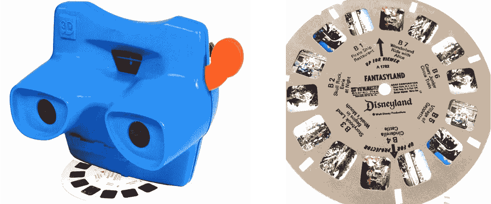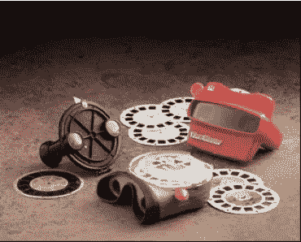

图片来自 fisher-price.com

回想一下费雪公司的 3D 幻灯片浏览器。它到底是怎么工作的？音响起作用吗？如果有，如何实现？利用了哪些线索？从稍微不同的视点拍摄的同一主题的两幅图像如何融合产生 3D 效果？

## c)其他问题

1.猎豹和羚羊立体看到的东西有什么区别？
2。不能用立体视觉寻找猎物的动物是什么？
3。哪些动物没有立体视觉系统，但使用其他感官(如嗅觉、听觉)来捕猎和探测猎物？
4。猫和狗谁的视力更好？*