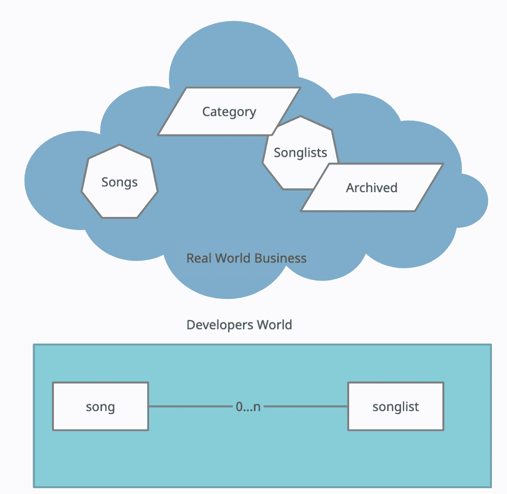
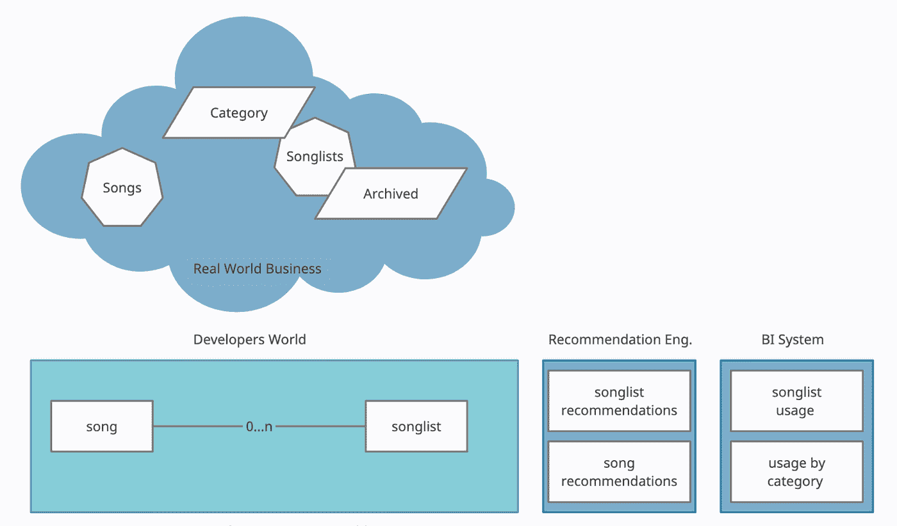
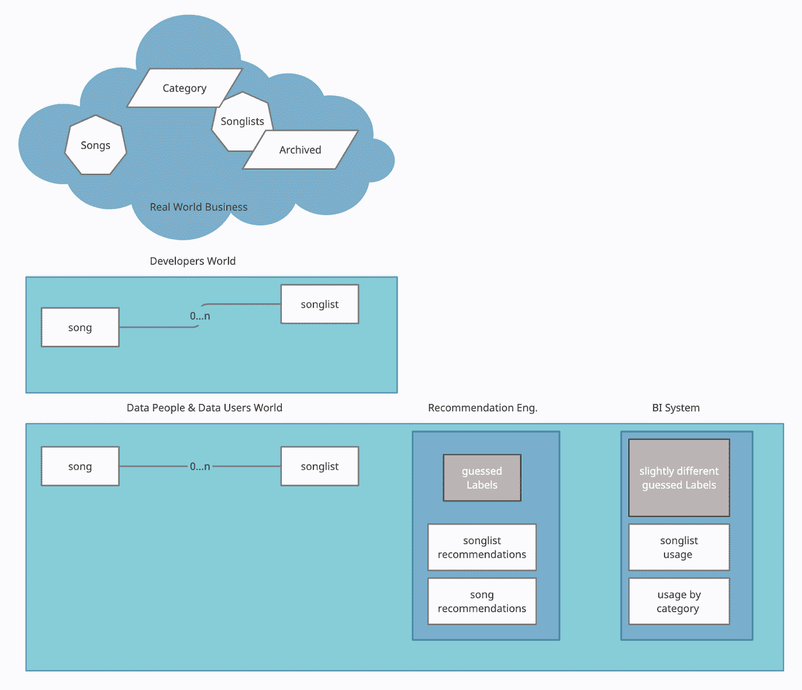
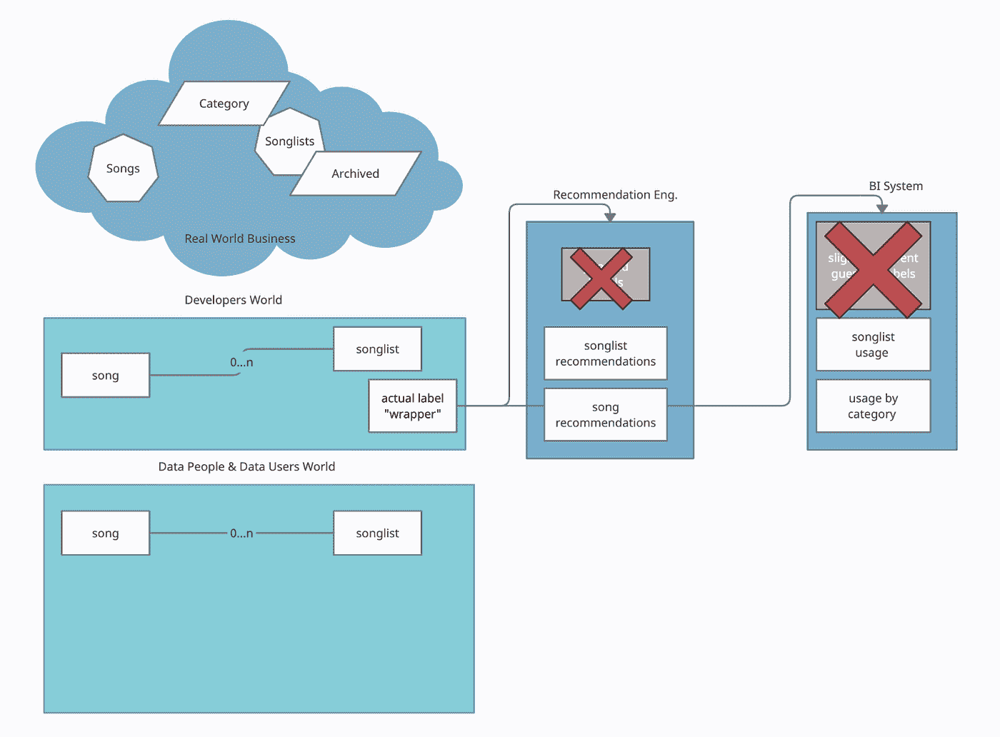

# 康威推论如何破坏你的数据组织

> 原文：<https://towardsdatascience.com/how-conways-corollary-wrecks-your-data-organization-c81d0b134230?source=collection_archive---------37----------------------->

## [意见](https://towardsdatascience.com/tagged/opinion)

## 康威定律有一个邪恶的推论，它在开发领域不为人知，但会摧毁你的数据组织。

> *“你认为这是一次黑客攻击，但你所攻击的只是你数据的价值。”*(作者)

*图片由斯文·巴尔诺扬拍摄。*

梅尔文·康威是一位才华横溢的计算机科学家，他也发明了协程的概念，在过去的 20 年里，他因为一条以他的名字命名的定律而变得非常有名:

任何设计系统(广义定义)的组织都将产生一个设计，其结构是组织的沟通结构的复制

事实证明，当我们走向领域驱动设计和微服务架构的世界时，这是非常重要的。该法律还可以通过所谓的“逆康威策略”来实施。但是他的定律也对数据世界产生了影响，这并不有趣。

让我们后退一点…

## **康威定律隐含康威推论**

最近，我观察到这个定律的一个隐含意义。我喜欢称之为“康威推论”，尽管我很确定这是一件很平常的事情。

*简而言之，如果你的开发部门为人们提供了命名歌曲列表的工具，但没有为他们提供添加标签/类别的方法，人们将开始使用这个名称来做他们“真实世界”领域中常见的事情。他们会用“X-my-song-list”来标记过时的列表，用“JAZZ-my-song-list”来表示类别，等等。*

用更通俗的话来说…

*“人们会适应* ***显性的*** ***系统*** *他们会适应* ***隐性的现实世界的商业概念*** *。”*

这听起来像是一件微不足道的事情，类似于一种变通办法。但是这些“隐含的概念”对这个世界的数据组织有着可怕的后果。这些隐含的概念完全没问题，只要不重要。但是当它们变得重要时，数据世界就崩溃了…

## **为什么 Conways 推论对数据组织如此不利**

问题是，数据的价值在于业务领域，而不是技术领域。在我们的歌曲列表示例中，一些典型的数据应用程序是歌曲列表的推荐引擎，或者是 bi 工具中用于评估特性采用情况的数据。

那么会发生什么呢？数据人员可能会重新创建“标签/分类”的业务概念，并从名称中提取出来。推荐引擎将需要它来排除存档列表，BI 系统将需要它来按类别分组。

更糟糕的是，在这种情况下，两个实体将实现这个逻辑。

问题是，如果这种环境在商业世界中很重要，那么“抽筋”就会越来越严重；随着歌曲列表概念的每次重用，两个数据团队将不得不调整他们对这种“隐含的业务上下文”的理解。

## 我们该怎么办？我们创造环境！

解决方案非常简单，要么创建一个新的[有界上下文](https://martinfowler.com/bliki/BoundedContext.html)，要么将它放入一个已有的上下文中。从技术上来说，这也很容易做到，你只需要在某个地方放上一个“包装”，然后假装得到它。

在我们的示例中，负责歌曲/歌曲列表域的人因此创建了一个小存根，它基于命名公开了两个简单的标签:

*   基于第一个单词的类别，
*   和基于前导 x 的存档标志。

仅此而已。在未来的某个时候，这个领域团队可以实现实际的标签，并在包装器后面进行简单且不间断的更改，同时推荐引擎和 BI 系统继续工作。

## **问题？这超出了数据组织**的范围

首先，这种事情经常发生。特别是当开发团队重用技术概念时，他们有时会忘记隐含的概念，这些概念会被束缚在技术概念中。这导致了一个两难的境地:

1.  对于开发团队来说，这“只是一个技术概念”，实际上并不是商业概念，
2.  但是对于数据世界，它变成了一个商业概念，因为康威的推论。

除了意识到，没有简单的方法来解决这个困境。建筑师应该注意这些事情。在这种情况下，创建至少封装了概念的包装器总是一个好主意。**数据团队**也可以在他们这边创建这样的包装器，至少让问题变得透明。

最后，在我看来，摆脱困境的最简单方法是让**产品经理**用心。因为如果一个新的特性/产品以“我为什么要这么做？我怎么知道我正朝着正确的方向前进？”，答案几乎总是涉及数据和正确的上下文。