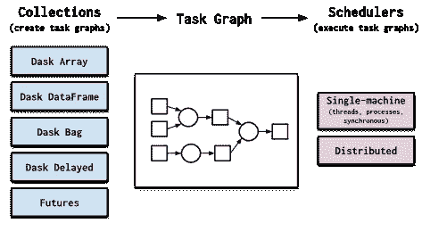
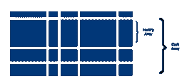
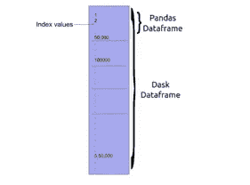
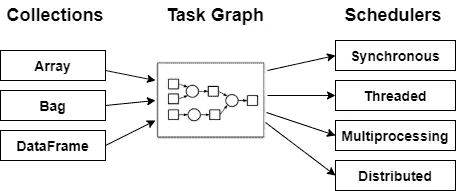
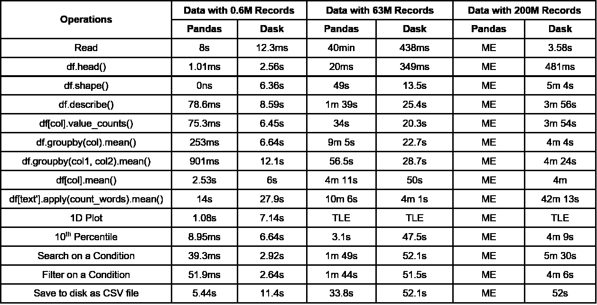

# 达斯克如何加速熊猫生态系统

> 原文：<https://towardsdatascience.com/how-dask-accelerates-pandas-ecosystem-9c175062f409?source=collection_archive---------42----------------------->

## 深入了解 Dask 数据框架，以及它是如何工作的

澳大利亚八月在 [Unsplash](https://unsplash.com?utm_source=medium&utm_medium=referral) 拍摄的照片

Python 有大量的开源库，简化了数据科学项目的开发。一些著名的 Python 库，如 Pandas、Numpy、Scikit-Learn，提供了高级的可用和灵活的 API 以及高性能的实现。这些库专注于提供大量的 API，但是很大程度上忽略了性能和可伸缩性。

换句话说，这些库无法加载大型数据或内存不足的数据集，也无法执行探索和可视化。Dask library 来帮忙了，它有一个类似于 Pandas 和 Numpy 的 API，并通过在所有 CPU 上并行化来加速工作流。

在本文中，您可以深入分析 Dask 框架以及它是如何工作的。

> 注意:在本文的最后，您可以获得比较 Pandas 和 Dask 库的基准时间约束，并观察 Dask 的性能如何优于 Pandas。

# Dask:

**Dask** 是一个开源的 Python 库，它提供了高性能的实现和类似于 Pandas 和 Numpy 库的 API，以及通过在所有 CPU 上并行化操作来加速工作流的能力。它是一个灵活的库，可在大于内存的数据集上进行多核和分布式并行执行。

*   **高级集合:** Dask 提供了一个高级集合，比如数组、数据帧，它们扩展了 Numpy 和 Pandas 的通用 API 以及分布式环境。这些集合在动态任务调度器上并行运行。
*   **动态任务调度:**这是线程化和多重处理库的一种替代方式。Dask 提供了一个并行执行任务图的动态任务调度器。

([来源](https://docs.dask.org/en/latest/))，Dask 工作架构

如上图所示，Dask 提供了 5 个高级集合:Dask 数组、Dask 数据帧、Dask 包、Dask 延迟、Futures。对这些高级集合的任何计算都会生成一个任务图。这个任务图由动态任务调度器并行执行。

# 高级系列:

如上图所述，Dask 框架有 5 个高级集合，扩展了 Pandas、Numpy、Scikit-Learn 等的公共接口。

## Dask 阵列:

Dask 数组是由存储在块中的多个 Numpy 数组组成的数据结构。换句话说，一个 dask 数组可以分成多个 Numpy 数组。Dask 数组的 API 非常类似于 Numpy 库。

([来源](https://dask.org/))，Dask 阵列分为多个 NumPy 阵列

在 Dask 阵列上执行的任何操作都是在 Numpy 阵列上执行的。Dask Arrays 使用分块算法来执行计算，该计算使用系统的多个内核来并行化计算。通过将大的 NumPy 数组分成较小的块，它允许用户执行超出内存的计算和加载大于内存的数据集。

## Dask 数据帧:

类似于 Dask 数组，Dask 数据帧由多个 Pandas 数据帧组成。为了提高效率，dask 数据帧按行划分为小熊猫数据帧分组行。

([来源](https://dask.org/))，Dask 数据帧分成多个熊猫数据帧

通过将 dask 数据帧分成 Pandas 数据帧的较小块，计算使用内置的分块算法并行运行。Dask 使用内存映射，它不会一次加载全部数据，而是与操作系统同步指向数据的位置。

## Dask 包:

Dask Bags 是 Python 对象的高级并行集合，用于处理半结构化或非结构化数据集。与其他 dask 集合一样，Dask Bag 遵循惰性传播，可以在机器集群上轻松实现并行化。

初始数据消息传递和处理是使用 list、dict、sets 完成的，因为初始数据集可能是 JSON、CSV、XML 或任何其他不强制使用严格数据类型的格式。Dask 包可用于此类任务。

> 简单地说，Dask 包可以被称为:
> 
> dask.bag =映射、过滤器、工具+并行执行

## Dask 延迟:

Dask Delayed 是一个 Dask 集合，可用于并行化自定义函数和循环。延迟函数可用于并行化现有的代码库或构建复杂的系统。

它不是快速执行函数，而是延迟执行，将函数及其参数放入任务图中。一旦调用`**.compute()**`函数，它将被并行执行。

# 动态任务调度:

动态任务调度器被设计为仅在个人笔记本电脑上扩展到数千个节点集群。

(图片由作者提供)，动态任务调度架构

Dask 中的所有高级集合都有生成任务图的 API，其中图中的每个节点都是普通的 Python 函数，节点之间的边是普通的 Python 对象，这些对象由一个任务作为输出创建，并在另一个任务中用作输入。在生成这些任务图之后，调度器需要在并行硬件上执行它们。

([source](https://dask.org/))，使用动态任务调度程序并行执行的示例任务图的动画

# 一些基准数据:

(图片由作者提供)，Pandas 的基准时间约束以及小型、中型和大型数据集的 Dask 数据框架

> 以上基准时间限制是使用笔记本电脑记录的，配置: **RAM (8GB)、磁盘(1TB)、处理器(i5–第八代@ 1.6GHz)。**

# 结论:

在本文中，我们将深入了解 Dask 框架，包括其高级集合和任务调度。Dask 构建在著名的 Python 库之上，可以在内存不足的数据集上加载和执行探索和可视化。它遵循惰性求值、内存映射和阻塞算法的概念。

还有各种其他框架，如 Vaex、Modin、Ray、Rapids 等等，可以并行化现有的 Pandas 生态系统。阅读下面提到的文章[，了解更多关于 Vaex 框架及其实现的信息。](/process-dataset-with-200-million-rows-using-vaex-ad4839710d3b)

 [## 使用 Vaex 处理具有 2 亿行的数据集

### 使用 vaex 数据框对大型数据集执行操作

towardsdatascience.com](/process-dataset-with-200-million-rows-using-vaex-ad4839710d3b) 

# 参考资料:

[1] Dask 文档:[https://dask.org/](https://dask.org/)

> 感谢您的阅读