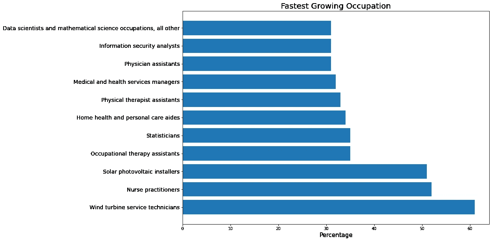
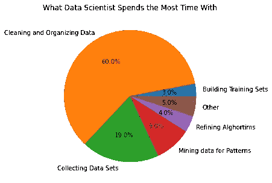

# 数据如何帮助我选择数据职业

> 原文：<https://towardsdatascience.com/how-data-helped-me-pick-a-data-career-66ba0ab24be6?source=collection_archive---------35----------------------->

## 对我的职业生涯来说，数据驱动的决策是我能采取的最佳途径

斯蒂芬·菲利普斯-Hostreviews.co.uk 在 [Unsplash](https://unsplash.com?utm_source=medium&utm_medium=referral) 上的照片

> 如果你喜欢我的内容，并想获得更多关于数据或作为数据科学家的日常生活的深入知识，请考虑在这里订阅我的[时事通讯。](https://cornellius.substack.com/welcome)

我的数据职业生涯是我从零开始建立起来的，我从来不知道我会在这个领域结束。这是我工作的顶峰，也是我感觉在智力上、精神上和经济上真正满足我的东西。这个职业让我很惊讶——因为我从来不认为这个职业是我梦想的工作。

生活有时是令人惊讶的，因为你永远不知道你会在哪里结束，你将来会做什么工作。从我十几岁到 20 多岁，我一直在规划自己的职业生涯，希望成为一名生物学研究者，我很少考虑研究生活之外的职业。我热爱研究工作，我觉得如果没有我的研究，我将一事无成。我对一切都很满意，因为我的环境支持我想做的事情，我觉得我会成为一名伟大的生物研究员——尽管生活总是有不同的计划。

在这篇文章中，我想讲述我的经历，我决定数据职业的思维过程，以及如何使用数据来帮助我决定我的职业步骤。让我们开始吧。

# 寻找新的激情

我的研究职业道路充满荆棘，因为我选择了一个非常小众的专业，并且在财务方面也不太好。竞争也很激烈，因为研究岗位很少公开。有了这些，我意识到另一个事实——我并不是这个房间里最聪明的研究员。我对研究有很大的热情，但不知何故，这种热情在生物学研究中没有得到很好的体现；要么是我缺乏创意，要么是我文笔不够。无论如何，我在硕士毕业后再也找不到任何研究职位了。

在我的生活中没有太多事情发生，我试图在我的工作中找到新的激情，因为我觉得研究是我可以做的事情，但也许只是不在学术界。这就是为什么我决定做一些研究来寻找我的新激情。

## 对新职业的研究

我知道我擅长什么——我擅长在我的研究时间内分析数据，我也对我所做的任何工作充满热情。在这段不确定的时间里，我没有任何研究工作可做(博士学位，实验室等等。)，感觉需要做一些以前没有做过的事情；行业内求职，学习新技能。但是，我不想盲目地去；这就是为什么我对未来的最佳职业做了一点研究。

作者图片

以上是我研究的一个代表。基本上，我试图找到关于发展最快的职业的数据。下一个未来会是什么？如果我想转行，它应该接近我所知道的，但不会像我以前的职业选择一样没有前途。

研究结果告诉我，许多未来的职业选择与能源、健康或**数据**有关。能源不在我的选择范围内，因为它不是我的专长，然后健康在某种程度上是相关的，但职业名称对我来说太具体了，最后，数据领域值得更多的研究。

## 数据职业的未来

首先，我研究了数据技能在未来的价值——它在未来对一家公司来说是必要的吗？这会促进我的事业吗？而且很难学吗？。我找到的一份[研究总结](https://priceonomics.com/survey-which-data-skills-do-you-need-to-get-ahead/)让我对所有这些问题有了深入的了解。基本上，我发现:

1.  超过 80%的高管受访者表示，数据技能对公司很有价值，
2.  81%的受访者提到高级领导职位所需的数据技能，
3.  对数据专家的需求逐年增加。

上述研究总结出**数据职业在未来将是有价值的，并且有前途的职业，因为需求和顶级职业将需要数据技能**。

我还试图寻找另一个研究来源来支持数据职业的未来。[世界经济论坛](http://www3.weforum.org/docs/WEF_Future_of_Jobs_2018.pdf)在 2018 年进行的另一项研究发现，73%的受访者预计他们的企业将采用数据技术，到 2022 年，85%的受访者打算扩大他们对用户和实体大数据分析的采用。这一结果很有希望，因为研究还提到**建立的数据角色将在未来**扩展。

许多研究发现，数据职业很好，我一直坚信数据是每个行业的未来。然而，我还不知道什么是适合我的数据职业(有很多数据职业的头衔)。这就是为什么我看了一下对数据职位进行分类的另一项研究，发现**数据科学家位于图表的顶端**。考虑到这一点，我觉得数据科学家是我未来职业生涯中会考虑的事情，但数据科学家到底做什么，我需要什么技能？

## 什么数据技能？

虽然我有一个答案，数据职业会有一个光明的未来，数据科学家是我追求的头衔，但我进入数据职业需要什么样的数据技能，数据科学家以什么为生？

首先，我参考了 customerthink 的[研究，以确定数据职业所需的数据技能。这项研究有趣地根据工作角色划分了技能；然而，在数据职业生涯中，只有两种工作角色强调数据熟练程度:业务经理和研究员。他们中的大多数需要以下技能:](https://customerthink.com/skill-based-approach-to-improve-the-practice-of-data-science/)

*   统计/统计建模
*   大数据和分布式数据
*   机器学习
*   贝叶斯统计
*   数据管理
*   算法

我来自一个研究背景，并已将上述一些技能确定为我的专长，如统计学和贝叶斯，但我仍然缺乏算法、大数据和数据管理的一些技能。尽管如此，我仍然觉得这是一个适合我的职业，因为在我做研究之前，我从来不知道在一个非常需要统计的行业中有一个职位，而且我擅长这个职位。

然后，我试图找到能告诉我数据科学家在日常工作中做些什么的研究。在这种情况下，我发现福布斯很好的[研究肯定了大多数数据科学家在他们的就业期间做什么。结果如下图所示。](https://www.forbes.com/sites/gilpress/2016/03/23/data-preparation-most-time-consuming-least-enjoyable-data-science-task-survey-says/?sh=47592d8b6f63)

作者图片

我最初对这些发现感到惊讶。在我看来，数据科学家会通过分析和开发统计建模来彻底处理数据，这是我在研究期间做得最多的。然而，该行业似乎与学术界有着不同的模式，在学术界，大多数数据科学家的时间都花在清理和组织数据上。

我真的很好奇为什么数据科学家需要花这么多时间清理数据？许多参考文献都写了为什么数据清理是必要的，但是大部分都说数据清理是为了提高数据质量——这是合乎逻辑的。

我会想花大部分时间清理数据集吗？在我目前的时间里，答案是肯定的。但是那个时候，我还不确定这个活动。然而，我确信我想从事数据职业，因为所有的数据都显示了一个很好的前景，这与我以前的工作是一致的。这就是为什么，在所有这些研究之后，我决定通过参加在线课程来弄脏我的手，并去训练营，但经验将是另一回事。

## **密钥查找**

从我为寻找新的激情而做的一点研究中，我发现了一些我认为对我的职业决策很重要的关键发现:

1.  数据领域是发展最快的职业之一
2.  未来对数据专家的需求将会增加，高级水平需要数据技能
3.  数据科学家是数据领域最受欢迎的头衔
4.  为了在数据领域取得成功，我需要学习 6 种技能:统计/统计建模、大数据和分布式数据、机器学习、贝叶斯统计、数据管理和算法
5.  数据科学家的大部分时间都花在了数据清理上。

# **结论**

找到一个新的激情并不容易，尤其是当我已经在我的整个教育中被训练成为一名生物研究员。然而，我需要面对现实，寻找新的工作激情，因为我以前的经历在职业生涯方面没有出路。

这就是为什么我在利用我擅长的东西——分析数据。我正在使用数据来寻找我的新职业，并发现数据职业是发展最快的职业之一，所需的技能与我以前的经验密切相关。

所有的数据都显示了一个良好的前景，而不是一个没有尽头的职业生涯，我决定从事数据方面的职业，并在这个职业生涯中从头开始建立一切。

> *如果您没有订阅为中等会员，请考虑通过* [*我的推荐*](https://cornelliusyudhawijaya.medium.com/membership) *订阅。*

在我的[**LinkedIn**](https://www.linkedin.com/in/cornellius-yudha-wijaya/)**或 [**Twitter**](https://twitter.com/CornelliusYW) **上访问我。****