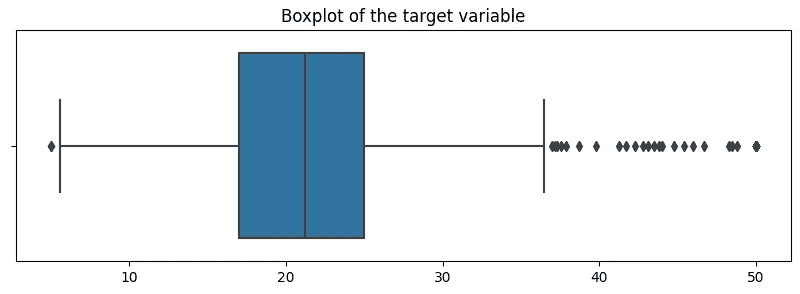

# 数据规范化如何影响随机森林算法

> 原文：<https://towardsdatascience.com/how-data-normalization-affects-your-random-forest-algorithm-fbc6753b4ddf?source=collection_archive---------6----------------------->

## 数据标准化在随机森林分类器和回归器中的重要性。


照片由[卢卡斯](https://www.pexels.com/@goumbik)在[像素](https://www.pexels.com/photo/chart-close-up-data-desk-590022/)上拍摄

最近，我在实现一个随机森林回归器时，遇到了一个经典的问题:*我应该实现数据规范化吗？。*

据我所知，基于决策树的算法通常不需要规范化。但是，我意识到，每次我听到这个说法，它都与量词有关，那么回归变量呢？他们需要数据规范化吗？

如果您在互联网上搜索 R *和 om Forest normalization* ，第一个链接表明:

*   [堆栈溢出](https://stackoverflow.com/questions/8961586/do-i-need-to-normalize-or-scale-data-for-randomforest-r-package) : (1)不，随机森林不需要缩放，(2)随机森林是基于树的模型，因此**不需要**特征缩放。
*   [堆栈交换](https://datascience.stackexchange.com/questions/62031/normalize-standardize-in-a-random-forest):感谢评论澄清。基于树的模型不关心某个特征的绝对**值。他们只关心值的顺序。因此，归一化主要用于线性模型/KNN/神经网络，因为它们受特征所取绝对值的影响。**

但是，在深入研究之后，我发现数据规范化可能会影响输出。所以，在这里我留下了我的外卖和一个简短的 Python 演示。

## 外卖食品

对于分类任务，随机森林的输出是大多数树选择的类。对于回归任务，返回单个树的平均值或平均预测值。

因此，**数据归一化不会影响随机森林分类器的输出，但会影响随机森林回归器的输出。**

关于[回归量](https://stats.stackexchange.com/questions/447863/log-transforming-target-var-for-training-a-random-forest-regressor)，如果数据不进行转换，算法会更受高端值的影响。这意味着它们在预测高值时可能比低值更准确。

因此，对数变换等变换将降低这些高值的相对重要性，从而更好地进行概化。

## 实验

在这里，我展示了一个简短的实验，它表明当实现数据规范化时，回归变量的输出会发生变化，但分类器的输出是相同的。

*   导入库

*   加载数据集

选择的数据集是用于回归任务的*波士顿房价*数据集。

```
Keys: dict_keys(['data', 'target', 'feature_names', 'DESCR', 'filename'])Feature names: ['CRIM' 'ZN' 'INDUS' 'CHAS' 'NOX' 'RM' 'AGE' 'DIS' 'RAD' 'TAX' 'PTRATIO'
 'B' 'LSTAT']Data shape: (506, 13)Target shape: (506,)
```

为了将该数据集也用于分类，目标变量已经被舍入。



*   随机森林分类器

下面是随机森林分类器在三种条件下的实现:(1)没有归一化，(2)最小-最大归一化，以及(3)标准化。

正如所观察到的，数据标准化不影响准确度分数。

```
Accuracy score without normalization: 0.12574850299401197
Accuracy score with min-max normalization: 0.12574850299401197
Accuracy score with standardization: 0.12574850299401197
```

*   随机森林回归量

下面是随机森林回归器在三种条件下的实现:(1)没有归一化，(2)最小-最大归一化，以及(3)标准化。

在这种情况下，数据标准化会影响回归变量的均方得分。

```
Accuracy score without normalization: 13.38962275449102
Accuracy score with min-max normalization: 13.478456820359284
Accuracy score with standardization: 13.38586179640719
```

***如果你喜欢这个帖子，请考虑*** [***订阅***](https://javiferfer.medium.com/membership) ***。你将获得我所有的内容+所有其他来自牛逼创作者的文章！***