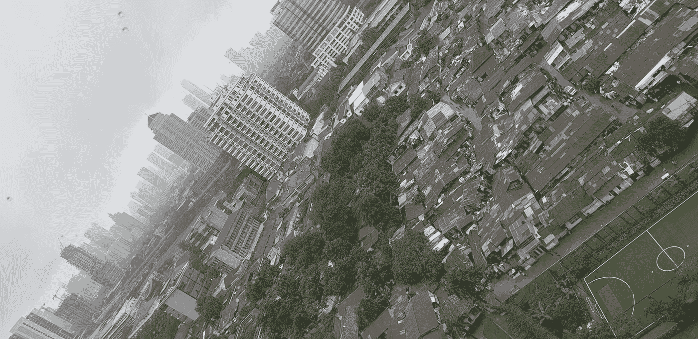

# 数据科学如何加深对城市贫困的理解

> 原文：<https://towardsdatascience.com/how-data-science-can-give-further-understanding-on-urban-poverty-ab52e448913?source=collection_archive---------19----------------------->

## 根据使用数据科学生成的见解和预测，制定满足人们需求的正确扶贫战略

正如我在之前的文章中提到的，数据是新的黄金。通过实时分析，科技公司可以快速了解他们的客户；例如他们的产品偏好、对营销活动的反应以及可接受的价格点；而无需花费时间和金钱进行广泛的市场调查。这些见解对于管理层决定重点产品、营销内容和定价模式至关重要。虽然这看起来很酷，但我开始思考我们如何利用这项技术来解决更大更复杂的问题，比如城市贫困。如果数据科学可以帮助我们理解消费者行为，那么它应该能够帮助我们理解那些与贫困作斗争的人的实际需求。

在南雅加达看到的对比(图片由作者提供)

在讨论细节之前，我们必须先弄清楚我们对贫困的定义。理论上，贫困主要有两种类型:绝对贫困和相对贫困。绝对贫困意味着无法获得食物、衣服、住所和卫生设施等基本需求。相对贫困是指无法享受体面的生活水平。由于各国的标准不同，这一术语反映了不平等。当经济活动的数量和基础设施的能力无法满足人口的增长时，城市地区就会出现贫困。这将导致城市贫民窟、非正规工作和更高的犯罪率，与中高收入群体相比，他们的经济保障要少得多。贫民窟居民的流离失所将使他们进一步陷入贫困，因为他们将远离自己的收入来源。

政府、非营利组织和援助机构已经为减轻贫困做了几次尝试。例子多种多样，从提供现金转移和公共住房到小额信贷和技能建设培训。然而，许多人未能成功实现预期目标。例如，在 2000 年代末，援助机构分发免费蚊帐，以防止疟疾在非洲村庄传播。大多数村民没有使用渔网，而是用渔网捕鱼，甚至把它们卖到市场，因为他们更需要额外的收入。另一个例子是拉丁美洲和南亚各国为现有贫民窟居民开展的公共住房项目。尽管人们认为新的住房建筑质量不错，但目标用户仍然不愿意搬离贫民窟，因为新的地点不能提供同等水平的经济活动。这一失败是规划和决策的结果，这些规划和决策是基于主观观点或与富人标准的比较，而不是实际了解穷人的需求。大多数项目实际上都举行了公开听证会和焦点小组讨论，但是由于沟通不畅和/或参与者不具代表性，这种对话存在局限性。这就是数据科学派上用场的地方，它是一门使用大量数据来为决策提供见解和预测的科学。

我从比尔·盖茨和拉什达·琼斯的播客“问大问题”中发现了一个很好的数据用例。在一次关于不平等的讨论中，他们特别提到了哈佛大学公共经济学教授哈吉·柴提。利用大数据，Chetty 能够形成一种算法，预测年轻人在洛杉矶特定社区避免犯罪的可能性。在确定了那些发病率高的地区后，他能够看到这些地区的模式和特征。他还发现，像康普顿这样以前属于高犯罪率地区的地区，可以在几年内显著改善。有了这些见解，他可以追溯导致康普顿成功的因素以及在其他社区的潜在应用。

这个案例给了我一个关于发展中国家面临城市贫民窟问题的想法。首先，我们可以通过数字化电缆和管道装置的当前数据来制定公用事业(电力和水)流量的数据集。更先进的是，我们可以将公用事业系统与物联网技术相结合，以监控电力和清洁水供应的可靠性。有了关于公共设施供应和质量的数据集，我们可以与从地理信息系统(GIS)数据中提取的另一个数据集相匹配，以绘制出社区地图。这种新的数据源将使人们了解每个社区可靠的电力和水的可获得性，或者换句话说，确定贫民窟区域。获得这些见解后，我们可以更深入地研究 GIS 数据，以了解贫民窟的类型。这方面的关键要素是房屋的物质条件、主要经济活动以及与公共设施和就业场所的连接。一个直接的反应是:让我们为这些社区提供电力和水。但对我来说，这些信息应该用来更深入地了解目标群体。这将是分析的下一阶段:了解居住者。

在第二阶段，我们可以通过移动应用程序或简单的谷歌表单访问或寻找联系选定贫民窟社区领袖的方式，以帮助识别居民。要收集的数据包括出生地点和日期、性别、职业、收入水平、教育水平以及当前和以前的受抚养人(居民的子女)的信息。最后一个数据点的目的是表明以前年轻居民的发展，如接受高等教育和安全就业。其他数据点将解释他们目前的状况，以及他们当初为什么选择这些定居点。拥有这些数据将有助于预测这些贫民窟的年轻居民稳定就业的可能性。如果可能的话，将学校数据数字化，看看生活条件和学习成绩之间的相关性，会很有意思。社区领导和居民填写这些表格的动机是一个明确的支持计划。这比听起来要困难得多，正确的沟通方式是关键。完成这些数据将使我们能够继续第三阶段:实验。

许多减贫举措是根据国外的成功做法和实施的简便性确定的。问题是，如何确保它能满足穷人的实际需求？再以公共住房项目为例，贫民窟居民是愿意搬到一个有可靠公用设施的新建社区，还是愿意升级他们目前的居住区？如果给他们一个更体面的住处，他们的生产率会提高吗？此外，他们会留下还是以更高的价格卖掉这个单位来获得额外的现金？实验将有助于规划当局了解穷人的需求，就像公司了解消费者偏好一样。为了回答关于住房的问题，我们可以选择两个类型相似的社区进行试验。其中一个将获得资本、设计指南和足够的基础设施来升级他们的居住区，而另一个将搬迁到一个有商业和就业空间的公共住宅区。前者的成本较低，但后者更容易实现。社区领导可以使用数字平台帮助管理和更新进度。几个月后，我们可以通过测量生产率(居民人均收入的增长)和居民满意度来评估这两个项目。升级后的集团可能因为在当前位置有更多的经济活动而具有更高的生产率，反之亦然，因为重新定位后的集团可能很好地适应新环境。这将有助于了解哪个计划会起作用，导致意外结果的因素以及升级到其他领域的可能性。实验输出也可以纳入数据科学家的机器学习算法，以预测计划或未来举措的经济输出。

为了进一步了解城市贫民，规划部门还可以与科技公司合作，利用它们的数据能力。这些公司将是金融科技和共享经济平台，具有相同的扶贫使命。疫情向那些依赖线下活动日常收入的人展示了数字化转型的重要性。要回答的问题是，城市贫民是从现金转移还是技能培养中获益更多？一组将获得电子钱包余额形式的现金，另一组将接受特殊培训，以在共享平台上表现出色，无论是作为司机还是食品商人，他们都将在同一个电子钱包中获得收入。这两个群体将被要求只使用电子钱包消费，这样就可以产生数据进行分析。通过使用技术合作伙伴的数据平台，当局可以了解这两个群体的额外收入和支出模式，以了解哪一个更具可持续性。如果结果都一样有效，甚至无效，我们可以更深入地实验什么是现金转移的正确数量和频率，以及什么技能或激励方案需要改进。

减缓贫穷的一个重要因素是赋予穷人影响决策和政府资金分配的权力。首先在巴西证明成功的一种做法是参与式预算编制。这是低收入群体通过参与地方政府预算编制过程发表意见的地方。通过开发一个数字预算平台，目前的技术也可以用在这里。社区代表可以使用这个平台填写他们渴望的预算，并提交给规划当局。使用数据分析和科学，我们可以看到这个群体认为最迫切需要改进的领域。

总之，数据科学将洞察穷人的实际需求，以制定正确的扶贫计划。有了技术和数据，我们可以了解目标群体当前和潜在的收入来源，提供一个平台来捕捉他们的愿望，并确定最有价值的社会保障要素。这将有助于我们决定促进哪些经济机会、赋予这些群体权力的政策以及分配援助的形式和水平。由于机器学习算法仍然具有主观性，因此仍然存在局限性。尽管如此，数据科学使我们能够更深入地研究人们面临的问题，并不断监测改进情况。我的结束语是:我们可以利用数据进行探索，包括为那些难以满足基本需求的人提供服务的最佳方式。