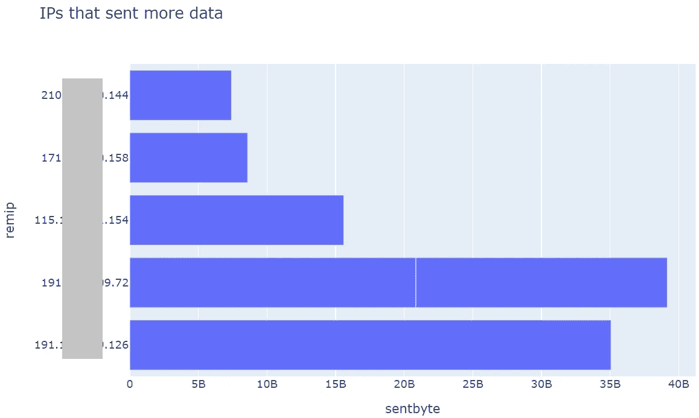

# 数据科学如何使网络安全故障排除更容易:防火墙日志分析

> 原文：<https://towardsdatascience.com/how-data-science-could-make-cybersecurity-troubleshooting-easier-firewall-logs-analysis-591e4832f7e6?source=collection_archive---------14----------------------->

## [行业笔记](https://towardsdatascience.com/tagged/notes-from-industry)

## 改善事件响应运营。使用数据分析技术和工具。


照片由来自 [Pexels](https://www.pexels.com/photo/backlit-breathing-apparatus-danger-dangerous-279979/?utm_content=attributionCopyText&utm_medium=referral&utm_source=pexels) 的 [Pixabay](https://www.pexels.com/@pixabay?utm_content=attributionCopyText&utm_medium=referral&utm_source=pexels) 拍摄

毫无疑问，我们正处于信息时代，从来没有如此多的信息来源，在网络安全领域也是如此。

当有人开始从事数据分析工作时，他经常听说在处理数据之前，大部分时间都花在处理、纠正和标准化数据上。如果不同的制造商使用标准化的日志，如果它们在不同的产品之间是一致的，或者即使日志格式很容易处理，这可能是一个微不足道的操作…那该多好啊…😍

在现实世界中，情况并非如此，在事件响应中，每个客户都是不同的，并且不得不与各种日志斗争是非常常见的。

在大规模事件中，最有用的日志之一是防火墙日志，它提供了有关进出外部的网络连接、内部组织流量以及在某些情况下甚至用户的 VPN 访问的信息。

以我的经验来看，我遇到的最常见的厂商之一就是 Fortinet。这家公司的防火墙非常常见，并且有一种日志类型，虽然很常见，但处理起来很可怕。


Fortinet 日志示例

这种日志是 bash 和 awk 爱好者的噩梦，对于我们这些喜欢更进一步的人来说，这是一个探索和理解数据分析工具重要性的机会😉。

在这种情况下，将分析一个中型组织的单个站点的 VPN 流量。一周内，产生了 1400 万个 VPN 流量事件。

# 第一步—向 CSV 转型

因为任务是用熊猫的日志来获取证据，我们需要熊猫能读懂的日志格式。

该函数允许我们提取文件每行的标题和字段，如下所示:

*   通过分别捕获数据键、分隔符和数据来提取属性组。这样，对于每一行，我们将能够区分哪些是数据，哪些是键。
*   为所有值分配相同的索引。
*   因为有些字段有分隔符，所以生成了三个组。有必要将结果分组在一列中，以消除空结果。
*   使用列 0 表示标题，使用列 1 表示值，生成包含数据的单行。

以下函数可用于在整个文件夹的文件之间迭代，并逐行读取和创建 Pandas 数据帧:

这个函数没有做什么特别的事情，它只是在日志的第一行创建一个数据帧，并在处理后添加每一行。完成所有行后，它在指定的文件夹中生成一个 CSV 文件，并删除原始数据帧以释放内存。
该功能可轻松修改，以便在所有文件的处理过程中维护生成的数据帧，并最终将数据保存在内存中。

这最后两个功能可以并行执行，以实现更高的处理效率。为此，有必要将它们存储在一个单独的文件中，以便能够从 Jupyter 中正确地执行多进程库。
之后，我们可以执行下面的代码，以并行的方式执行任务。

为了继续，主要有两个弊端。首先，每个文件的列数，因为根据日志的类型，有些文件包含不同的列；其次，处理所有记录所需的内存量。让我们一步一步来🏃🏻。

## 用 **d6tstack** 调整立柱

由于日志格式的类型，经常会发现文件中的列数不同，这与数据分析库不兼容。为了解决这个问题，有一个名为 **d6tstack** 的库。
该库对 csv 文件进行分析，并告诉我们每个文件中有哪些列，哪些没有。

```
import glob
import d6tstack.combine_csvcfg_fnames = list(glob.glob(r'C:\logs_vpn_out\*.csv'))
c = d6tstack.combine_csv.CombinerCSV(cfg_fnames)# check columns
print('all equal',c.is_all_equal())
print('')
d = c.is_column_present()
```

输出会是这样的。


Dask 列检查

为了纠正它，库本身提供了用固定列重写新文件中的数据的可能性。

```
fnames = d6tstack.combine_csv.CombinerCSV(cfg_fnames).to_csv_align(output_dir=r'C:\logs_vpn_out_fix')
```

一旦修复，我们可以进入下一个阶段，读取文件。

## 对抗对记忆的需求💪💻

这是数据分析中很常见的问题，我们有很多数据，没有足够的 RAM 来处理。
当我们的任务是定期存储标准化信息时，我们通常会选择将信息存储在 Spark、Elastic 等数据库中……但是在事件响应的情况下，通常需要快速分析一类我们很可能再也不会看到的事件。

为了处理这些情况，有 Dask。


[https://dask.org/](https://dask.org/)

这个数据分析库为我们提供了使用计算机资源以并行方式对日志文件执行查询的可能性。
换句话说，它允许我们有效地处理大量数据，而不必将它们加载到内存中。

当你习惯和熊猫一起工作时，读取文件的过程很快，但很耗时，令人惊讶的是，当用 Dask 读取文件时，响应是瞬时的。


Dask 数据帧创建

重要的是，此时 Dask 还没有读取文件，它已经按索引划分了数据，并且将在需要时读取它们，这就是它在此阶段如此快速的原因。
*df*物体不是*熊猫。数据帧*是一个 *Dask。DataFrame* ，重要的是不要忘记它。
在创建数据帧的过程中，标记每一列的数据类型对于加快查询速度和避免问题非常有用。

日志分析中最常见的用例之一是搜索事件期间的信息泄漏。为了做到这一点，我们将使用 Dask 执行一个查询，以获得一小部分可以在内存中轻松处理的数据。

```
df_exf = df[["remip", "tunnelid", "sentbyte"]].groupby(["remip","tunnelid"]).max().compute()
```

这个查询运行了 1 分 28 秒，这就是熊猫和 Dask 的最大区别所在。在 Pandas 中，如果数据适合内存，这个查询会快得多😅。
**。compute()** 函数允许用 Dask 结果创建熊猫数据帧。

在 1 分 28 秒内，我们对 1400 万条日志进行了查询，我们对它们进行了分组，并将其放在数据框中，Dask 太棒了！

如果您不知道这些日志是如何记录的，这个查询就没有多大意义。每次用户通过 VPN 与另一个 IP 地址建立会话时，都会分配一个名为 *tunnelid* 的唯一标识符。在 *sentbyte* 字段中，记录了该会话期间离开组织的信息量，但不是记录每个连接中的字节数，而是累积反映，因此只考虑会话期间所有连接的最大值。

为了便于读取以字节为单位的信息，我将使用这段代码。

前两个 IP 地址是合法的，与研究无关。这是要调查的前 5 个 IP 地址的图表。



发送到外部 IPs 的信息

在这一点上，有必要充实我们现有的数据。为此，我们将使用几个免费服务，MaxMind GeoIP，MaxMind ASN，AbuseIPDB 和 Dan Tor List。

## MaxMind ASN


[https://www.maxmind.com](https://www.maxmind.com/en/home)

这项服务将允许我们获得我们需要的 IP 地址。MaxMind 公司提供了一个数据库，我们可以快速下载并离线查阅。


IP 地址 ASN

通过这个功能，我们将能够获得事件的 IP 地址所属公司的名称。

## MaxMind GeoIP

同一家公司提供了一个 IP 地理定位数据库，使我们能够非常可靠地知道 IP 地址的位置。

同样，我们将能够知道我们连接的 IP 的位置。在地图上，你总能更好地看到一切😏。


按国家分列的数据量

## 危险节点列表

攻击者使用 Tor 网络节点来匿名化他们的通信是很常见的，有时这可以是一个快速检查，为我们提供了一个很好的线索。在网站 [dan.me.uk](https://www.dan.me.uk/torlist/) 上可以找到 Tor 节点的更新列表。


Tor 节点通信

尽管它们与数据泄露无关，但它们是必须检查其合法性的连接。

## AbuseIPDB

AbuseIPDB 是众所周知的域名和 IP 地址信誉服务。通过它的 API，我们每天可以免费执行 1000 次查询。

AbuseIPDB 代码


AbuseIPDB IP 地址

在这种情况下，我们看到多个连接到声誉很差的 IP 地址，必须对其进行分析以验证其合法性。

此时，我们将进行新的查询，以便对数据进行新的可视化，从而尝试识别异常。

```
df = df_dask[~df_dask[“tunnelid”].isnull()][[“remip”, “duration”, “tunnelid”,”sentbyte”]].compute()
```

这个查询将返回所有数据的子集，通过下面的代码我们将得到。

现在，我们有 4 个变量来绘制图形，即创建到特定 IP 地址的隧道数量、到每个 IP 地址的总连接数、到每个 IP 地址的连接持续时间总和以及发送的字节数。
首先，如果我们制作一个连接数量和总持续时间的关系图，结果图将是这个。


连接数与持续时间

我用红色突出显示了数据泄露中使用的 IP 地址，这将是我们的目标之一。
考虑到显示的数据，恶意 IP 已经隐藏在大多数其他连接中，但该图可以帮助我们检测网络安全中非常常见的两种异常。
一方面，在左上部分，将会反映许多短时间连接的 IP 地址，例如钴击信标的情况，而在右下部分，将会出现长连接，例如 SSH 或 RDP 连接。

在下图中，我们将把发送的数据与连接的持续时间联系起来。


发送数据与持续时间

如您所见，这是检测大量信息泄漏的完美图表。在左上角，我们将显示已建立短连接但发送了大量信息的 IP 地址。
最后，我们将可视化发送的信息和连接数量之间的比率。


发送的数据与连接

该图可以帮助我们直观地看到少数连接中的数据泄漏，如将文件上传到云或通过 SSH 发送文件，以及隐蔽通道中的数据泄漏，如 DNS 或 ICMP，因为我们会看到许多连接和发送的大量信息。
为了结束本文，我们将执行更高级的分析，尝试同时使用四个变量来检测连接中的异常。

## PCA —主成分分析

简化它，这种机器学习技术将允许我们在不失去数据唯一性的情况下进行降维。我们将从四维发展到二维，这样我们就能够用图形来表示它，并试图将异常现象可视化。

正如您在代码中看到的，执行了二维缩减，然后添加了 remote IP 列，以便更容易识别图中的数据，结果如下所示。


PCA 结果

一旦显示在图表上，我们就可以识别连接中的异常。


主成分分析数据图

通过这种方式，我们可以快速识别连接中的异常，这将为我们开始调查提供线索。

尽管可以对这些数据进行大量的进一步分析，但现在是时候结束这篇文章并继续下一篇文章了。完整的笔记本可以在[此链接](https://github.com/lucky-luk3/Infosec_Notebooks/blob/main/Forti_VPN_Logs_Analysis-Public.ipynb)获得。

总而言之，很明显，数据分析是几乎每个行业未来的关键之一，但在网络安全方面，它现在是，将来也将是分析师的核心技能。
在事故调查或监控过程中，知道如何使用我们所掌握的工具将会在时间和结果上有所不同。

我将继续谈论在我的日常工作中有用的笔记本，希望你会发现它们有用。

研究愉快！