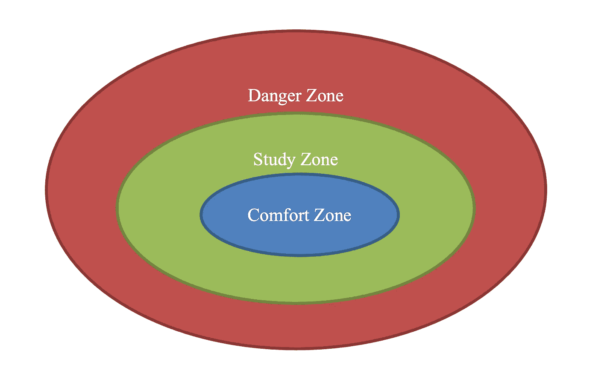

# 数据科学家如何提高他们的编码技能

> 原文：<https://towardsdatascience.com/how-data-scientists-can-improve-their-coding-skills-b4f2924198ae?source=collection_archive---------3----------------------->

## 科技职业

## 可以帮助你轻松编程的 6 个技巧

在 [Unsplash](https://unsplash.com/s/photos/programming?utm_source=unsplash&utm_medium=referral&utm_content=creditCopyText) 上由 [Max Duzij](https://unsplash.com/@max_duz?utm_source=unsplash&utm_medium=referral&utm_content=creditCopyText) 拍照

# 介绍

正如在[之前的博客文章](/how-i-grow-as-a-data-scientist-62027b7cc069?sk=3b1a5303a5f74e647d36eba5c57161b6)中提到的，我将在科技领域开始我的职业生涯，成为一名数据科学家/统计学家。获得技能和建立关系网需要多年的努力和奉献。从第一天开始，这是一个漫长的过程，但不再是一个孤独的旅程。

我开始了一个新的博客系列，名为“ ***科技职业*** ”，来分享我的学习和成长。我对该系列的愿景是关注数据科学的软方面。我所说的“软方面”是指软技能，如良好的沟通、主动学习、指导、职业发展、协作、团队建设、冲突解决，以及在数据世界中取得职业成功所需的其他非技术因素。这些软技能广泛适用于在该行业工作的其他人或任何想进入科技行业的人。

> 我的目标是分享好的经验，共同成长。

在第一篇文章中，我列出了帮助我成长为数据科学家的四个技巧([链接于此](/how-i-grow-as-a-data-scientist-62027b7cc069?sk=3b1a5303a5f74e647d36eba5c57161b6))。下面是一个快速回顾:

*   *把读书当成呼吸:大量阅读，广泛阅读；*
*   *邻近学习:开发与你的主要职责相关的新技能；*
*   *熟能生巧:动手方法；*
*   成为社区的一员:帮助他人，也帮助自己。

在今天的帖子中，让我们转换话题，深入探讨如何学习迭代有效编程的问题。如前所述，整个数据科学领域正在迅速向软件工程转变，并越来越关注编码技能。因此，如果没有很强的编码背景，想要得到一份 DS 的工作是极其困难的。

来自一个非传统的背景，我非常害怕任何面试中的编码部分。在这篇文章的剩余部分，我将分享我的顶级编程技巧，可能对其他人有所帮助。

# 一般学习策略

在讨论具体的技巧之前，指出主动学习的两个必要因素是有帮助的:自我反思和教学。

*   **自我反省**

学习本质上是渐进的，建立在我们已经知道的基础上。学习不应该远离我们现有的知识图谱，这使得自我反思变得越来越重要。学完新东西后，我们应该反思以下几点:

*   这篇论文/文章要回答的主要问题是什么？
*   *提出了什么新方法，为什么？*
*   *在实施方面有什么实际的限制吗？*
*   *权衡*
*   *有哪些贡献？*

思考这些问题可以帮助我们将这些点连接起来，并理解增量价值。

一如既往，有效的学习需要循序渐进，不应该留下很大的认知差距，自我反思有助于我们更好更快地处理信息。

*   **教学**

反思我们所学的内容后，下一步是在没有接触过这些内容的情况下教别人。如果我们真正理解它，我们可以将概念分解为多个可消化的模块，使其更容易理解。

教学以不同的形式进行。它可以是一个教程，一个技术博客，一个 LinkedIn 帖子，一个 YouTube 视频等等。一段时间以来，我一直在 [Medium](https://leihua-ye.medium.com) 上写长篇技术博客，在 [LinkedIn](https://www.linkedin.com/in/leihuaye/) 上写短篇数据科学入门。此外，我正在尝试 [YouTube](https://www.youtube.com/channel/UCBBu2nqs6iZPyNSgMjXUGPg) 视频(YouTube 上的[我的数据科学频道)，这为学习提供了一个很好的补充渠道。](https://www.youtube.com/channel/UCBBu2nqs6iZPyNSgMjXUGPg)

如果没有这两个因素，我的数据科学之旅将会更加坎坷和具有挑战性。老实说，我所有的啊哈时刻都来自广泛的反思和教学，这是我活跃在多个平台上的最大动力。

[Kelly Sikkema](https://unsplash.com/@kellysikkema?utm_source=unsplash&utm_medium=referral&utm_content=creditCopyText) 在 [Unsplash](https://unsplash.com/s/photos/learning?utm_source=unsplash&utm_medium=referral&utm_content=creditCopyText) 上拍摄的照片

# 发展有效编码技能的六个技巧

## 提示 1:找到你的工具并坚持使用它

这不是一个技巧本身，但肯定是有用的。前阵子数据科学家之间有一场关于 R VS Python 的争论。作为一个经常使用 R 的用户，我一开始是不愿意转用 Python 的。然而，在看到 Python 可以做什么之后，我很快改变了主意。它是一种如此通用的语言，使我们能够顺利地与其他工程同事合作。

经过一段短暂的过渡期后，我对用两种语言进行编码变得相当适应了。我将它们用于不同的目的:R 用于因果推理相关的问题，Python 用于工程繁重的任务。

我的建议是选择你的工具并坚持下去。这里没有对错的答案，真正的问题是为你的研究问题找到最合适的工具。

## 技巧 2:从简单的问题开始

由于自我膨胀的性格，我喜欢走出舒适区，用远大的目标挑战自己。然而，努力追求一些我目前力所不及的东西，带来的弊大于利。

在这一点上相信我，因为我有过惨痛的教训。

我曾经被 LeetCode 上最具挑战性的编程问题弄得焦头烂额，这让我精神萎靡，也打击了我的信心。它们太难了，没用。这与我如何努力无关，因为它们超出了我的能力范围(请参考下图)。

回到过去，我从一个简单的 for 循环中学到了最多的编程知识。所以，放松自己，从简单的问题开始。

## 技巧 3:提升自己，用更具挑战性的问题挑战自己

我自己的画

我创建了上面的图表来区分三个区域:舒适区、学习区和危险区。舒适区指的是我们熟悉的领域，我们从舒适区拉知识不费吹灰之力。学习区指的是我们现在还不懂，但已经为快速学习打下基础的领域。最后，至于危险区，它是我们目前无法触及的地区。

这里有一个玩具的例子。对于之前接触过统计学和机器学习的有志数据科学家来说，概率论和其他基本概念，如**、*[*Bootstrap*](/a-practical-guide-to-bootstrap-with-r-examples-bd975ec6dcea?sk=92ce4c8398188ab9421797ac5e292bf7)*和* [*大数定律*](/crack-data-science-interviews-essential-statistics-concepts-d4491d85219e?sk=af5291865f239ad505e8a8a1a80cceb8) 应该在他们的舒适区。在生产中部署机器学习模型应该在研究区域中。高效计算和性能优化应该处于危险区域。*

*解决最优化问题太过雄心勃勃。相比之下，如果有抱负的数据科学家专注于研究区域，即学习如何在生产中部署模型，他们将受益匪浅。*

*回到编程问题。在将新的编程技巧引入舒适区之后，我们应该尽快升级并进入学习区。*

*通过做我们最熟悉的事情来停留在舒适区不会让我们成长。相反，我们应该站出来，用新事物挑战自己。*

*一个警告:不要在伸出手的时候跨过危险区域，这与前面关于持续学习没有大的知识差距的观点密切相关。*

> *再说一遍，大多数学习都发生在中间地带:学习区。*

*开始新的事物已经足够具有挑战性；我们不想同时尝试新的和大的东西。一如既往，学习发生在小剂量。*

*之所以首选学习区，主要是因为只需要花一点力气就能学到东西；如果我们处于危险地带，无论我们如何努力，事情都不会有结果。*

**

*尼克·莫里森在 [Unsplash](https://unsplash.com/s/photos/learning?utm_source=unsplash&utm_medium=referral&utm_content=creditCopyText) 上的照片*

## *技巧 4:学习数据结构和算法*

*我发现这条建议很有见地，但经常被忽视。一个常见的误解是，DSA 属于软工程师的工具包，而不是数据科学家，这是不正确的。数据科学不是一个纯粹的分析领域。相反，它涉及工程义务，包括模型部署、ETL、高效计算和优化，以及数据基础设施知识。所有这些义务都要求强大的编码技能。*

*作为一名推理数据科学家，我的一大块工作是理解数据管道，高效地提取数据。对 DSA 的扎实理解大有裨益，对数据科学的其他领域(分析和算法)也是如此。*

*如果你是新来的，这里有一个 DSA 的简单例子。*

* [## 为什么数据科学家应该学习动态编程

### 数据科学家的基本算法

towardsdatascience.com](/why-data-scientists-should-learn-dynamic-programming-e50dfe62a5c7) 

学习 DSA 的另一个好处是我们可以在采访中谈论时间和空间的复杂性，这很好地服务于我们的目的。

下面是我最喜欢的两本关于 DSA 的书:[算法靠摸索](https://www.amazon.com/Grokking-Algorithms-illustrated-programmers-curious-ebook/dp/B09781V6F7/ref=sr_1_1?dchild=1&gclid=CjwKCAjwp_GJBhBmEiwALWBQkwiyy2YESaoQPrSTPzeV-B4lg2iY0RgOvUZe1N8u1wNk35DWdIFjExoCII8QAvD_BwE&hvadid=241894716647&hvdev=c&hvlocphy=9031645&hvnetw=g&hvqmt=b&hvrand=12318901436881194498&hvtargid=kwd-161600481917&hydadcr=16378_10302381&keywords=grokking+algorithms&qid=1631416675&sr=8-1)和[破解编码面试](https://www.amazon.com/Cracking-Coding-Interview-Programming-Questions/dp/0984782850/ref=sr_1_1?dchild=1&keywords=Cracking+the+Coding+Interview&qid=1631416688&sr=8-1)。* 

## *技巧 5:使用不同的方法*

*到目前为止，您应该已经很好了，并且能够解决常见的编程问题。为了进入下一个层次，我们可以尝试使用不同的方法解决相同的问题，同时讨论折衷方案(例如，时间复杂性、基础架构要求、利弊等)。).*

*   **为什么算法 A 比其他算法表现得更好？**
*   **为什么 Dictionary 是键值对的推荐数据类型？**
*   *…*

*这里有一个简单的例子。*

* [## 2021 年数据科学家的 Python 字符串操作

### 使用不同的重量训练你的 Python 编码肌肉

towardsdatascience.com](/python-string-manipulation-for-data-scientists-in-2021-c5b9526347f4)* 

## *秘诀 6:成长心态*

*低起点是可以的，即使你在面试中不能解决任何编码问题也是可以的。正如发生在我身上的那样，一开始我无法回答任何与 Python 相关的问题。但是经过坚持不懈的学习，我现在已经是(自称)编程高手了。*

> *记住，每个人都有一个学习曲线。*

*如果你在面试循环中，试着从每次失败中学到新的东西。你从哪里开始或者你目前的编码水平都不重要。真正重要的是认识到差距并成为一个增量学习者的能力:从低开始，保持动力，每天练习。*

*Medium 最近推出了作家伙伴计划，支持像我这样的普通作家。如果你还不是订户，通过下面的链接注册，我会收到一部分会员费。*

* [## 阅读叶雷华博士研究员(以及其他成千上万的媒体作家)的每一个故事

### 作为一个媒体会员，你的会员费的一部分会给你阅读的作家，你可以完全接触到每一个故事…

leihua-ye.medium.com](https://leihua-ye.medium.com/membership)* 

# *外卖食品*

*退一步说，作为一名之前在该行业工作经验有限的应届毕业生，迈出第一步总是困难的。刚开始的时候，我没有 Python 和 SQL 的背景，不懂数据的应用端，对 DSA 更是零了解。这是一个相当低的起点。*

*然而，通过不断的学习，我能够填补空白，成为一名高效的程序员。主动学习的秘诀是持续、渐进和迭代。没有一朝一夕的成功；反而需要付出很大的努力。*

*让我们回顾一下可能对你也有帮助的 6 个技巧。*

**提示 1:找到你的工具并坚持使用它**

**提示 2:从简单的问题开始**

**提示 3:及时转向更具挑战性的问题**

**技巧 4:学习数据结构和算法**

**提示 5:使用不同的方法**

**提示 6:成长心态，你能做到**

# *喜欢读这本书吗？*

> *请在 [LinkedIn](https://www.linkedin.com/in/leihuaye/) 和 [Youtube](https://www.youtube.com/channel/UCBBu2nqs6iZPyNSgMjXUGPg) 找到我。*
> 
> *还有，看看我其他关于人工智能和机器学习的帖子。*