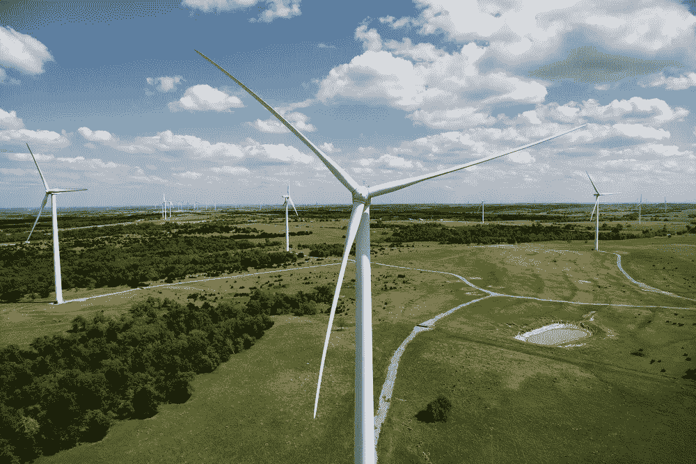
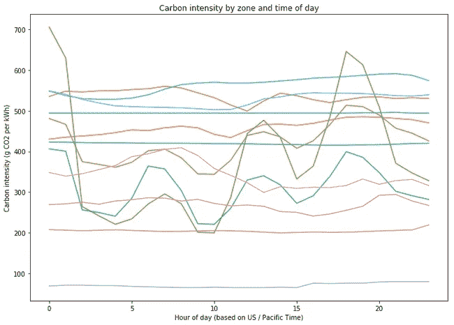

# 数据科学家如何减少二氧化碳

> 原文：<https://towardsdatascience.com/how-data-scientists-can-reduce-co2-6b3249e0eb61?source=collection_archive---------15----------------------->

## 通过在时间和空间上转移负载来优化操作

(图片来源:谷歌)

数据科学家可以为气候变化解决方案做出很多贡献。即使你的全职工作不是研究气候，研究公司运营的数据科学家也可以在他们目前的岗位上产生很大的影响。通过发现以前未开发的运营灵活性资源，数据科学家可以帮助将负载转移到电网中无碳能源份额更高的时间和地点，如风能和太阳能。这种负荷转移允许电网更快地过渡到更高份额的无碳能源，并且还可以降低运营成本。

**数据科学对气候解决方案的贡献**

在讨论优化运营或基础设施的具体机会之前，我想先介绍一下数据科学家在气候研究方面的广阔舞台。当前关于将数据科学应用于气候的大部分兴奋都围绕着 ML 和大数据的应用，这是正确的。一个很好的起点是 [climatechange.ai](http://climatechange.ai/) ，这是一个志愿者组织，已经建立了一个广泛的社区，这些人在气候变化和人工智能的交叉领域工作。他们的网站包括 2019 年论文[用机器学习](https://arxiv.org/pdf/1906.05433.pdf)【1】中描述的几十个“气候变化解决方案领域”中每个领域的[摘要](https://www.climatechange.ai/summaries)。虽然解决方案领域旨在作为高效 ML 气候应用的指南，但许多领域也适用于来自统计和运筹学的更“经典”的数据科学方法。可能性的列表是巨大的，并且可能很难知道从哪里以及如何开始。对于希望更多地参与气候问题的数据科学家来说，无论是 20%的项目还是改变职业轨迹，Terra.do 训练营和 workonclimate.org Slack 社区都是结识他人和寻找资源的好地方。

**转型中的电网创造机遇:碳强度的变化**

随着电网在未来几十年向无碳能源发展，我们正处于一个独特的转型期，我们生活在清洁能源和肮脏能源的混合中。即使在同一个地区，一天中风刮得更大或阳光更强的特定时间比一天中其他时间的碳密集度低得多，这是可以预见的。一天中不同地区和不同时间的碳强度的这种可预测的变化创造了减少碳排放的机会。

如果你的管理层已经关心优化运营成本，那么你的章程中已经包含了寻找可以减少碳足迹的优化方案。正如我将在下面描述的那样，减少碳排放可以来自于发现运营中未开发的灵活性资源，将负载转移到更清洁的地点或一天中更清洁的时间。建立利用这种灵活性的能力也可能使运营降低成本。因此，你不需要等待一个新的“绿色”指令或计划开始。只需以一种小而具体的方式开始，探索并展示更多的时间和投资可能带来的好处。

让我们来看看碳强度实际上是如何变化的。图 1 显示了谷歌在全球拥有数据中心站点的每个地区在一个样本日内每小时的地区平均碳强度。从阅读这些图表的角度来看，基于生命周期总排放量，发电的碳排放强度中值[约为 1000 kg CO2/MWh(煤)、900kg CO2/MWh(石油)、500kg CO2/MWh(天然气)、50kg CO2/MWh(风能、太阳能、水能和核能)。在图 1 中，我们看到*不同地点的碳强度相差 2.5 倍。*我们还发现，在一些地点，一天中会有很大的变化。*一天中最脏的一个小时的碳强度比一天中最干净的一个小时*高 46%，这是一年中所有时间和所有数据中心站点的平均值。当研究碳强度的时间和空间变化时，其他研究显示了类似的结果。美国国家科学院(National Academy of Sciences)2019 年 12 月发布的一份关于跟踪美国电力系统排放的报告](https://en.wikipedia.org/wiki/Emission_intensity)【2】报告了 2016 年美国 20 个不同平衡机构的碳强度分布，并显示了美国最清洁的 25%和最脏的 25%地区之间的碳强度差异*~ 4 倍，每个地区内的时间差异也很大，正如我们在谷歌网站上看到的那样。(平衡机构通过控制其区域内和相邻平衡机构之间的发电和输电，确保其区域内的电力系统供需平衡。)*

**

*图一。谷歌每个数据中心站点一个采样日的平均碳强度。数据来源:[明日起 electricityMap API](https://api.electricitymap.org/?utm_source=electricitymap.org&utm_medium=referral) 。*

**在预测每小时的碳强度*时，这些变化是相当可预测的，碳强度数据和预测可从第三方提供商获得，如[明天](https://www.tmrow.com/)和[瓦特时间](https://www.watttime.org/)。在我们测试的预测中，我们发现预测的每小时平均碳强度的平均绝对百分比误差(MAPE)在未来 16 小时的 3–8%范围内，在未来 32 小时的 10–15%范围内。虽然这些预测仍有很大的改进空间，但这种准确性已经足以根据碳强度预测提前一天优化运营。*

*我们电网中碳密度的区域差异将会伴随我们一段时间。大多数电网接近零碳强度需要时间，可能需要几十年。[2020 年全球新电厂支出的 22%](https://www.iea.org/reports/world-energy-investment-2020/power-sector) 仍流向煤电厂和天然气电厂[3]。即使没有新的化石燃料发电厂建设，一项研究估计，美国 73%的现有化石燃料发电厂容量将在 2035 年[达到其典型的寿命终点[4]。我们的观察是，日内变化是混合了化石燃料和无碳能源的电网的一个特征。图 2 显示了碳强度的日内变化如何随电网中的无碳能源量而变化，垂直线表示 2018 年亚洲、美国和欧洲的无碳能源量。在图表的左侧，我们可以看到消耗能源的地区主要来自化石燃料发电厂，一天之内变化很小。在图的右侧，我们看到消耗大部分无碳能源的区域，那里的平均碳强度非常低，因此碳强度的日内变化也很低。在图表的中间，在 10-80%的大范围无碳能源组合中有很高的日内波动，波动稳定在 30-50%左右。这里的直观解释是，随着电网增加风能和太阳能(间歇性能源)而不存储，无碳能源的份额增加，但影响集中在一天中风能和太阳能容量更可用的特定时段。来自前面提到的国家科学院的同一份报告[2]:“随着电网吸收更多的可再生能源，获取异质性的需求变得更加迫切，而可再生能源的可用性通常在时间和空间上有所不同。在这样的电网中，需求将需要变得更加灵敏。”](https://science.sciencemag.org/content/370/6521/1171.full?ijkey=U7SbGvpzhvvB2&keytype=ref&siteid=sci)*

**

*图二。不同地区作为无碳能源组合函数的碳强度日内变化，大陆平均碳强度用垂直线表示。误差线表示每个地区全年的差异范围。数据来源:[明日起 electricityMap API](https://api.electricitymap.org/?utm_source=electricitymap.org&utm_medium=referral) 。*

***负荷转移对电网的影响:边际和平均二氧化碳***

*根据典型的碳会计规则，将负荷转移到平均碳强度较低的时间和地区可以降低公司的碳足迹。但是这实际上如何影响电网排放的碳呢？这不是一个零和游戏，消费者为了无碳能源的固定供应而竞争。通过减少高排放发电机(如煤电厂)的能源生产或帮助电网过渡到提供更多无碳能源，负荷转移可以带来真正的变化。*

*在考虑负荷转移的影响时，理解*平均*碳强度和*边际*碳强度之间的区别很重要。给定时间点的平均碳强度是总排放量与为满足当时需求而调度的能源总功率之比。边际碳强度是基于边际发电厂提供的容量来满足下一个单位的需求。地区平衡机构按照成本递增的顺序调度工厂，市场清算价格基于边际工厂的成本。因为风能和太阳能没有燃料成本，所以它们的投标价格通常很低，而且这些能源会被优先调度。因此，边际排放量通常介于燃气发电厂和燃煤发电厂之间[5]。*

*如果实时转移负载是可能的，例如通过物联网设备，那么跟随低*边际*碳强度可以是一种当天需求响应策略，可以通过将负载从具有高排放边际工厂(通常是燃煤发电机)的时间和地点转移到具有低排放边际工厂(如燃气发电机)的时间和地点来减少碳排放。然而，在大多数大规模操作中，很可能至少需要一些提前一天的计划来大规模转移负载。优化前一天的负荷以遵循低平均碳强度有助于电网向更高份额的无碳能源过渡。它将需求转移到无碳资源预计最具生产力的时间和地点(阳光普照或刮风的时间和地点)。当负荷遵循低平均碳强度时，额外的需求可以在无碳能源份额较高的时段和地区推动较高的市场清算价格。这反过来允许投资者从现有的无碳资产中获得更好的回报，并鼓励更多新的无碳能源投资和更高的无碳能源在电网中的渗透率，否则将是不经济的。*

***数据科学家在运营碳管理中的角色***

*虽然碳强度的可预测变化创造了减少碳排放的机会，但这并不意味着利用它总是经济的，甚至是可行的。采取行动需要组织经历几个步骤，而数据科学家在每个步骤中都处于推动组织变革的有利位置:*

1.  *制作业务案例:确定行动并估计成本和收益*
2.  *在可行的水平上测量碳足迹*
3.  *优化运营中的碳*

**制作商业案例**

*在对碳排放影响最大的时间和地点上，找到你的经营灵活性的来源。一个好的第一步是粗略清点你公司的碳足迹，以了解最大的排放源在哪里。温室气体协议建立了碳会计和报告的国际标准，在他们的[公司会计标准](https://ghgprotocol.org/corporate-standard)中使用了三类排放:*

*   *范围 1:公司拥有或控制的来源的直接排放，例如，拥有或控制的工艺设备燃烧产生的排放；*
*   *范围 2:公司消耗的购买电力产生的排放；*
*   *范围 3:间接排放是公司活动的结果，但来源不是公司拥有或控制的；例如，外购材料的提取和生产，外购燃料的运输，出售产品和服务的使用。*

*如果用电产生的排放(范围 2 排放)在您或您的供应商的碳足迹中占很大一部分，那么在您的工厂或一天中的几个小时的运营中是否有短期的、提前一天的灵活性，您还没有充分利用？从长远来看，对于新的厂址，是否有其他可能实现盈亏平衡但碳足迹截然不同的替代厂址？*

*碳应该与其他成本和商业目标一起优化。针对碳排放进行优化是否也会降低其他成本，或者在权衡碳排放与增加其他成本或客户服务目标时，您是否会面临阻力？在试图应对逆风之前，先寻找顺风的机会。灵活性在运营中创造价值，在追求减少碳排放的过程中，您可能会发现您正在发展运营灵活性，这也可以降低其他成本。您能否从运营高峰转移负载，将负载从高峰时间转移到非高峰时间，或者在不同时经历高峰负载的站点之间转移负载？如果你能及时或跨站点转移一些运营负载，你就能降低成本和碳排放。例如，在谷歌，开发提前一天在时间或空间上转移我们的计算负载的能力减少了我们的碳足迹，但也使我们能够平滑每个地点一天中的峰值计算和电力使用。这反过来使我们能够构建更少的数据中心和服务器容量，从而降低我们的成本。此外，公用事业公司可以提供需求响应激励，以支付其客户将负荷从高峰使用时间转移，这通常需要最大份额的化石燃料(并且由于气体或煤炭燃料的投入成本，供应的边际成本更高)。*

**测量可行水平的碳含量**

*一旦有了业务案例，并考虑到运营灵活性的具体来源，数据科学家就可以在构建所需数据集方面发挥作用，这些数据集是以最佳方式运用这种灵活性所必需的。首先，电网碳强度的外部数据需要达到必要的粒度，以支持优化，这可能意味着每个运行区域的每小时碳强度。第三方提供商如[明天](https://www.tmrow.com/)和[瓦特时间](https://www.watttime.org/)估计世界各地的实时碳强度，并提供 API 以提供至少提前 24 小时的预测，至少每小时更新一次。*

*有了每个运营区域的碳强度数据，数据科学家可以构建模型来估计碳足迹作为特定公司运营的一个函数如何扩展。例如，在我们的数据中心应用中，我们需要构建模型来估算功耗，作为计算和存储资源消耗的一个函数，我们需要在一个相当精细的级别上这样做，以便我们可以将碳足迹与特定的产品使用联系起来。这些模型还可用于估算运营产品的碳足迹，以帮助公司客户优化碳足迹。*

**优化运营中的碳排放**

*有了确定的机会和手头的必要数据，数据科学家可以构建决策支持系统来优化碳和其他成本。*建立在时间和空间上转移运营的能力不仅可以降低碳排放，而且如果它能够使运营以更少的容量或更低的能源成本运行，还可能产生传统财务意义上的高投资回报率。*一个决策支持系统需要在一个精细的、逐小时的水平上考虑权衡。在 Google，我们在未来一天的负载转移模型中使用碳价格，以便我们可以通过考虑所有成本类型的单一统一目标函数来优化我们的运营灵活性:能源、碳、容量以及与实现时间或空间灵活性相关的任何其他成本(如数据中心工作负载的空间灵活性情况下的网络成本)。对于碳成本，我们使用美元/吨的碳价格，该价格与经济学家估计的避免 1.5–2 摄氏度以上变暖所需的价格一致。( [2015 年巴黎协定](https://sustainabledevelopment.un.org/frameworks/parisagreement)第二条提出了“将全球平均气温增幅控制在比工业化前水平高出 2 摄氏度以下，并努力将气温增幅限制在比工业化前水平高出 1.5 摄氏度以内”的目标)根据 2018 年的论文[1.5 摄氏度气候变化的经济学](https://www.annualreviews.org/doi/full/10.1146/annurev-environ-102017-025817)【6】，避免 1.5 摄氏度和 2 摄氏度变暖所需的 2020 年碳价格的中值估计分别为每公吨 105 美元和 35 美元。工业界不需要等待政府颁布碳税来采取行动。我们可以在优化运营的模型中嵌入碳价格，这样做的同时，我们还可以在负载转移能力上提供高 ROI，从而降低碳成本和其他运营成本。这不是一个零和游戏:我们已经能够通过在目标函数中包括碳和其他成本来实现这两种利益。大多数情况下，碳排放和商业成本目标并不冲突，但我们的框架允许在目标竞争的几个小时或几天内进行经济权衡。*

***举例:我们如何将碳智能计算技术融入谷歌的数据中心***

*以谷歌为例，其碳足迹的很大一部分来自其数据中心消耗的电力。谷歌的 [24x7 无碳能源战略](https://sustainability.google/progress/projects/24x7/)是在一年中的每一天、每一小时在每个数据中心消耗无碳电力。仅靠转移负荷是无法做到这一点的，但这是重要的一步。安娜·拉多万诺维奇是我们碳智能计算项目的创始人，也是我们运营数据科学团队的能源技术负责人，她在博客[碳智能计算](https://blog.google/inside-google/infrastructure/data-centers-work-harder-sun-shines-wind-blows/)中写了谷歌在计算负载转移方面的工作。简而言之:我们的一些计算负载，如 ML 培训或 Youtube 视频处理作业，是延迟容忍的，这意味着我们可以将它们延迟几个小时，而不会对我们产品的最终用户产生任何影响。此外，一些负载具有空间灵活性，这意味着我们可以灵活地在校园内的任何计算机集群中运行它们，在某些情况下甚至可以在世界各地的不同校园中运行它们。一些集群比其他集群拥有更新、更节能的计算机，正如我们在图 2 中看到的，一些站点的碳强度比其他站点低得多。这种在时间和空间上的负载转移是根据我们运营数据中心的每个区域的电网每小时碳强度预测提前一天计划的，是我们发现的利用碳强度可预测变化的灵活性选项。虽然我们最初的动机是减少碳排放，但我们发现负载转移功能有很大的潜力，可以通过消除负载峰值来降低计算和数据中心容量的成本。*

*Ana 和她的合作者计划在未来发布更多的技术细节和对碳智能计算的影响结果。我想在这里分享的更多的是这项工作是如何开始和向前发展的，希望能激励其他数据科学家采取行动。*

*全日空没有等待新的绿色指令或新项目提案的管理指示。这开始是一个 20%的项目，是谷歌 20%项目的真正精神。安娜和一位合作伙伴研究工程师兼能源专家罗斯·康宁斯坦有了一个想法，也有了改变现状的共同热情，他们开始花时间研究这个想法。然后，他们确定执行发起人，并征求他们的意见和支持。这种早期支持和投入对于验证管理层是否愿意考虑根本不同的方法来安排我们的工作负载，以及支持试点工作来证明这些方法是可行的，而不会带来额外的运营风险至关重要。Ana 和 Ross 招募了其他 20%时间的志愿者，他们带来了关键的工程和主题专业知识来开发和试验生产规模系统。负载转移的想法对谷歌来说并不新鲜，但新奇的是，它从未在减少碳足迹的背景下出现过。这一愿景迅速建立了广泛的盟友基础，并帮助一个由高度积极的志愿者组成的小团队克服了阻碍早期负载转移工作的挑战。它们实用而有条理，对作业调度的现有工程基础设施做了最小的改动。他们尽可能建立在现有系统和计划的基础上，而不是与之竞争。*

*我们的执行赞助商批准推出时移功能，现在它已在全球部署。随着计划和商业价值的确立，团队不断壮大，现在正在解决大规模空间负载转移、更高的运营效率以及更全面的碳核算系统的开发问题。从概念到开发再到实施，这是一个由一小群人的分析领导和远见推动想法前进的项目。*

*不要等着被要求，也不要等着被允许。快走吧。没有时间可以浪费了。*

***致谢***

*感谢安娜·拉多万诺维奇、[罗斯·康宁斯坦](mailto:ross@google.com)和谷歌的碳智能计算团队帮助我们展示了什么是可能的。还要特别感谢团队成员 Ian Schneider 对碳强度数据分析的帮助，以及在谷歌开发我们的碳核算数据管道。*

***参考文献***

*[1] D. Rolnick 等人，[用机器学习应对气候变化](https://arxiv.org/pdf/1906.05433.pdf) (2019)，arXiv:1906.05433*

*[2]j·德·查伦达尔、j·塔加特和 s·本森，[追踪美国电力系统的排放](https://www.pnas.org/content/116/51/25497) (2019)，美国国家科学院院刊*

*[3][《2020 年世界能源投资》](https://www.iea.org/reports/world-energy-investment-2020) (2020 年)，国际能源署，巴黎*

*[4] E. Grubert，[化石电力退休的最后期限为一个公正的过渡](https://science.sciencemag.org/content/370/6521/1171) (2020)，科学*

*[5] D. Callaway、M. Fowlie 和 G. McCormick，[《位置、位置、位置:可再生能源的可变价值和需求方效率》](https://www.watttime.org/app/uploads/2019/03/Location-location-location-The-variable-value-of-renewable-energy-and-demand-side-efficiency-resources_September-2015.pdf) (2018)，环境与资源经济学家协会杂志*

*[6] S. Dietz、A. Bowen、B. Doda、A. Gambhir 和 R. Warren，[1.5 摄氏度气候变化的经济学](https://www.annualreviews.org/doi/abs/10.1146/annurev-environ-102017-025817) (2018)，《环境与资源年度评论》*