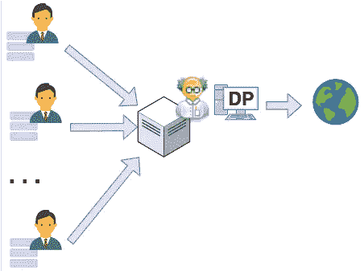
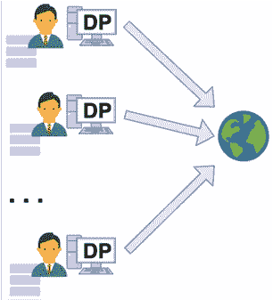

# 数据科学家如何着手解决人类的实际问题

> 原文：<https://towardsdatascience.com/how-data-scientists-can-start-to-work-on-humanitys-real-problems-d9a89e882daf?source=collection_archive---------17----------------------->

## 不要只预测数字

图片由[安娜从](https://www.pexels.com/@shvetsa)[派克斯](https://www.pexels.com/photo/woman-with-hands-on-her-face-in-front-of-a-laptop-4226215/)拍摄。

> 让那个从未使用 MNIST 数据集预测数字的人来投第一块石头吧。
> —世界上每一位数据科学家

大家都知道，我们都用 MNIST 预测数字。有时，当论文坚持在 MNIST 数据集上测试新想法时，我们仍然会这样做。

学习使用 MNIST 数据集是 ***而不是*** 这里的实际问题。

事情是这样的，最终，经过大量的研究，我们最终得到了一份真正的工作，从事现实世界的数据科学，希望能够解决更有趣的问题。

但是，当第一个真正的大问题最终到来时，我们会预测点击量、销售额，或者测试黄色的*是否比蓝色的*更适合那个左下角的按钮。**

**当然，我有点夸张了。有许多公司正在解决更重要的问题。**

**但我在这里的观点是，我们经常忽视许多对人类来说最重要的问题。**

> **只有极少数数据科学团队正在解决预防疾病、向有需要的人分发食物或研究人类思维以避免精神崩溃等问题。**

**上面的例子是我们人类面临的真正问题。这些问题如果得到解决，可以极大地改善我们的生活，真正让世界变得更加美好。**

**不幸的是，预测数字或者将猫和狗的图像分开**没有**有同样的影响。**

# **不同的视角**

**想象一下，如果我们没有一个大的 MNIST 数据集，而是有一个包含来自世界各地的新冠肺炎患者症状的大数据集，还有:**

*   ****人口统计**信息(如年龄、性别、种族)；**
*   ****地理**数据(例如，城市、州、国家)；**
*   ****血液**检测结果；**
*   ****肺部**扫描图像；**
*   **每日**温度**结果；**
*   **每日**氧气**水平。**

**我相信你能看到这样一个数据集中的巨大价值。**

**我在这里用新冠肺炎只是作为一个一般的例子。还有许多其他健康问题，有更长的数据线索，甚至有更大的潜力拯救数百万人的生命——如癌症、抑郁症和糖尿病。**

**你可能同意我的观点，许多数据科学家都愿意在这些问题上工作。**

> **那么，是什么阻止了我们这样做呢？**

# **问题是:我们没有这种数据集。**

**当我们考虑健康数据时，许多医院肯定至少有大量非常有用的数据。**

**但是你可能知道，他们不会公开分享这些信息。所以主要问题应该是:**

> **是什么阻止了医院、研究机构和公司共享个人数据？**

**毫不奇怪，答案很简单:这里的**潜在原因是隐私**。**

**许多机构有**法律义务**，阻止他们公开分享敏感数据。**

**他们中的一些人可能还想保持竞争优势，因为他们可能是唯一拥有大量特定类型数据的人。**

**另一方面，很容易看出，锁定数据阻碍了重要的研究。**

**因此，我们无法进行探索性分析，而且我们没有**也没有**合适的数据来为人类最紧迫的问题训练机器学习模型。**

**尽管如此，我知道现在你们大多数人可能在想:**

> **“我们不能简单地公布我们所有的个人数据。大家也很在意隐私。人们不希望自己的敏感信息被披露。”**

**是的，你是对的，但并不是一切都没了。**

# **那么我们能做什么呢？**

**过去的失败告诉我们，匿名化在实践中往往不太奏效。**

**[网飞](https://arxiv.org/abs/cs/0610105)和[美国在线](https://www.nytimes.com/2006/08/09/technology/09aol.html)是两家分享**所谓的**“匿名化”数据的公司，后来遭遇用户重新识别。**

**幸运的是，2006 年[**【DP】**](https://link.springer.com/chapter/10.1007%2F11681878_14)被创造出来。DP 是一个框架，已经成为隐私保护的黄金标准，并被学术界和工业界广泛采用。**

> **如果分析师使用 DP 算法处理数据集，那么这意味着能够访问输出结果的对手或攻击者**不能**对数据集中出现的任何特定个人的贡献做出高度可信的陈述。**

**换句话说，如果使用的数据集中有任何一个人**是**或者**不是**，那么 DP 输出应该与*大致*相同。**

**这就像**个人贡献被隐藏**，同时仍然给出整个数据集的总体有用结果。**

> **DP 的一个巨大优势是为个人提供的隐私保护是完全可量化的，并且独立于对手先前可能拥有的关于数据集的知识。**

# **差异隐私到底有什么帮助？**

**我将带你看两个例子。**

## ****1。中央模型****

**假设我们想收集来自个人的新冠肺炎数据，并发布关于该病毒对不同个人概况的影响的一般见解。**

**对于这个例子，我们还考虑到医院可能会选择一个“可信的”中心医院。在这种模式下，敏感数据首先集中在一个中心位置。然后，可信管理人使用**差分私有算法**进行分析，并发布结果。**

****

**在“中央模型”上使用差分隐私。它需要一个值得信任的馆长。图片由作者提供。**

**差分隐私(DP)为我们提供了正式的保证，通过使用 DP 计算的结果，对手**无法**非常确定地告诉我们任何个人是否在用于生成该结果的数据集中。**

> **因此，差分隐私基本上为数据集中的用户提供了"**似是而非的可否认性**，即用户可以否认他们在用于生成结果的数据集中，因为他们的存在无法从输出中得到保证。**

## **2.本地模型**

**然而，在某些情况下，可能很难选择一个可信方来收集所有数据。**

**考虑到这一点，使用[**Local**Differential Privacy(LDP)](https://en.wikipedia.org/wiki/Local_differential_privacy)，每个医院可以在共享任何数据之前，在本地添加隐私保证。**

**这是如何工作的:**

*   **每个医院将**在本地**计算**一些结果**，仅使用他们自己的数据，使用 **LDP** 方法。**
*   **例如，他们可以通过添加一些精心设计的随机噪声来做到这一点。**
*   **之后，医院可以安全地公开分享吵闹的结果。**
*   **有了来自所有医院的嘈杂的结果，**任何人都可以汇总**这些输出来得到一个更精确的最终结果。**

****

**在“本地模型”上使用差分隐私。数据在共享前被随机化。图片由作者提供。**

**这也适用于**机器学习**。例如，在应用 **LDP** 技术后，每个医院可以**在本地**训练一个模型并且**共享模型更新**。这与[联邦学习](https://en.wikipedia.org/wiki/Federated_learning)的概念密切相关。**

> **我们可以想出每个人都可以单独提供帮助的方法。例如，我们每个人都可以在使用 LDP 算法后共享一些数据。通过这种方式，如果人们也能单独分享(不仅仅是通过医院)，新冠肺炎的数据集也能被聚合起来。**

****

**图片由[卡洛琳·克里斯汀](https://unsplash.com/@carolynchristine)从 [Unsplash](https://unsplash.com/photos/D7bmnvGJA2Q) 拍摄。**

# **这什么时候才能成为现实？**

**公司和政府已经开始使用差别隐私了！例子包括:**

*   **[美国人口调查局](https://www2.census.gov/cac/sac/meetings/2017-09/statistical-disclosure-limitation.pdf)；**
*   **[谷歌](https://static.googleusercontent.com/media/research.google.com/pt-BR//pubs/archive/42852.pdf)；**
*   **[亚马逊](https://www.amazon.science/publications/differentially-private-query-release-through-adaptive-projection)；**
*   **[微软](https://www.microsoft.com/en-us/ai/ai-lab-differential-privacy)；**
*   **[领英](https://arxiv.org/pdf/2002.05839.pdf)。**

**希望不久之后，更多的数据科学家能够从关键和重要的数据集中收集见解。尤其是那些真正有助于解决人类最紧迫问题的项目。**

**如果你喜欢阅读这样的故事，并想支持我成为一名作家，可以考虑[注册成为一名媒体会员](https://medium.com/@ryancarters/membership)。每月 5 美元，你可以无限制地阅读媒体上的故事。如果你用我的链接注册，我会赚一点佣金。**