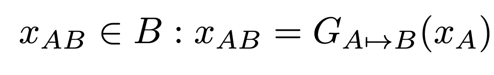
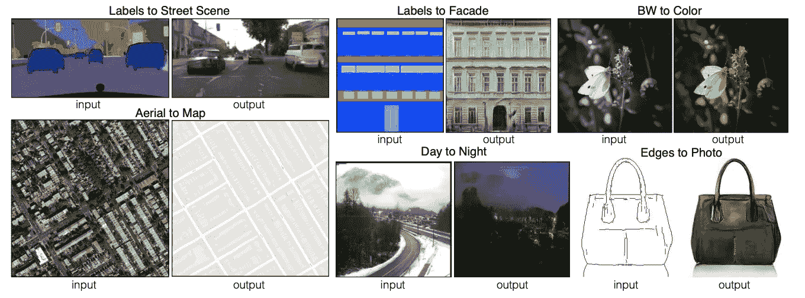
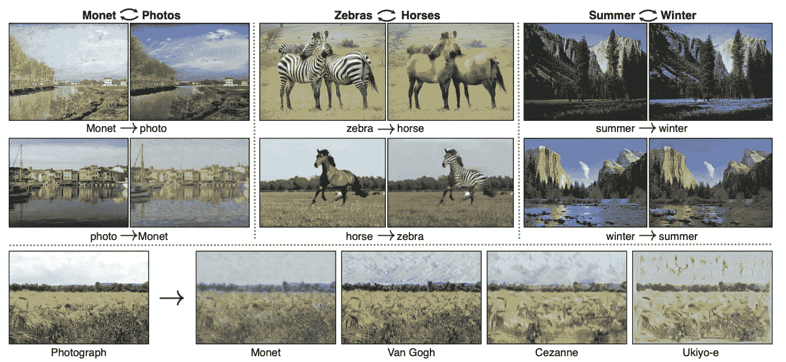

# 你的爱有多深？或者，如何选择你的第一个深度学习项目

> 原文：<https://towardsdatascience.com/how-deep-is-your-love-or-how-to-choose-your-first-deep-learning-side-project-524f3700813d?source=collection_archive---------15----------------------->

## 在你最近学习的新领域开始一个副业可能会相当令人生畏。从哪里开始？如何在自己感兴趣的题目中找到已经做过的内容？如何为你的项目寻找和选择一个合理的目标？当我们开始致力于我们的深度学习项目时，我们对这些问题都没有答案。我们就是这样找到他们的。

***由*** [***李龙索夫***](https://medium.com/@lironsoffer)[***达芙娜***](https://medium.com/@dafna.mordechai)*[***李奥【达甘】莱布***](https://medium.com/search?q=Lior%20Dagan%20Leib)*

**

*[马里奥·高](https://unsplash.com/@mariogogh?utm_source=unsplash&utm_medium=referral&utm_content=creditCopyText)在 [Unsplash](https://unsplash.com/?utm_source=unsplash&utm_medium=referral&utm_content=creditCopyText) 上的照片*

# *从哪里开始？*

*由于我们都参加了深度学习课程，并熟悉神经网络的基本概念，我们知道我们最感兴趣的技术挑战是建立 GAN(生成对抗网络)。很快我们也意识到我们都对艺术相关的项目感到兴奋。我们决定选择一个结合两者的文件，理解它的架构，然后从头开始实现它。话虽如此，有公开代码的论文更好。*

*我们知道我们在寻找类似于神经风格转移的东西，在这种情况下，你拍摄两张图像，A 和 B，然后以 B 的艺术风格创建第三张内容为 A“绘画”的图像。当我们在网上搜索它时，我们遇到了[艺术风格的神经算法](https://arxiv.org/pdf/1508.06576.pdf)和 Raymond Yuan 的这篇伟大的博文:[神经风格转移:使用 tf.keras 和热切的执行来创建深度学习的艺术](https://medium.com/tensorflow/neural-style-transfer-creating-art-with-deep-learning-using-tf-keras-and-eager-execution-7d541ac31398)。
这对我们来说是一个很好的起点，因为它展示了我们所寻找的艺术功能，然而，这不是 GAN 架构，而是在 2015 年发布的。*

**

*一张照片的内容(A)结合几幅知名艺术品的风格(b-f)来自[一种艺术风格的神经算法](https://arxiv.org/pdf/1508.06576.pdf)，arXiv:1508.06576*

# *外面还有什么？*

*随着我们对这个主题的进一步探索，我们发现风格转换只是图像到图像翻译的一种类型。如“[图像到图像转换:方法和应用](https://arxiv.org/abs/2101.08629)”中所定义的，“图像到图像转换的目标是将输入图像从源域 A 转换到目标域 B，同时保留固有的源内容并转换外部的目标风格。”为了实现这个目标，我们需要训练一个映射 G，它将从 A 中获取一个输入源图像，并在目标域 B 中生成一个图像，从而使得结果图像与其他目标域图像无法区分。*

**

*在[图像到图像转换:方法和应用](https://arxiv.org/abs/2101.08629)，arXiv:2101.08629 中提出的图像到图像转换的数学建模*

*在使用 GANs 执行图像到图像的翻译领域，一个值得注意的工作是[使用条件对抗网络的图像到图像的翻译](https://phillipi.github.io/pix2pix/)(又名 pix2pix)。这篇文章演示了许多类型的图像到图像的转换，包括从标签图合成照片，从边缘图重建对象，以及给图像着色(从黑白到全色)。*

**

*使用条件对抗网络从[图像到图像翻译的结果图像](https://arxiv.org/abs/1611.07004) (pix2pix)，arXiv:1611.07004*

*第二个值得注意的作品是[使用循环一致对抗网络的不成对图像到图像翻译](https://junyanz.github.io/CycleGAN/)(又名 CycleGAN)，它将照片的图像到图像翻译成著名艺术家如莫奈、梵高、塞尚等人的艺术作品。此外，CycleGAN 出色地介绍了图像中特定对象的翻译，例如将马转换为斑马或将苹果转换为橙子。*

**

*使用循环一致的对抗网络 (CycleGAN)，从[不成对的图像到图像翻译得到的结果图像，arXiv: 1703.10593](https://arxiv.org/pdf/1703.10593.pdf)*

# *怎么搜？怎么挑？*

*接下来，我们搜索了引用 pix2pix 和 CycleGAN 的文章。然而，这种方法产生了太多的结果。我们在寻找一种快速回顾最新作品的方法，我们发现 Károly Zsolnai-Fehér 的 youtube 频道 [Two Minute Papers](https://www.youtube.com/channel/UCbfYPyITQ-7l4upoX8nvctg) 在这个过程中非常有效。*

*我们浏览了几十篇似乎与艺术领域相关的论文，并把它们缩小到大约 20 篇。在我们为该项目考虑的作品中，有 [Nvidia 的 paint](https://www.youtube.com/watch?v=hW1_Sidq3m8&t=2s) 、[基于 AI 的运动传输](https://www.youtube.com/watch?v=cEBgi6QYDhQ)，以及[这个神经网络恢复旧视频](https://www.youtube.com/watch?v=EjVzjxihGvU)。然而，我们都被 [GANILLA](https://arxiv.org/abs/2002.05638) 所吸引，它在应用艺术风格的同时保留了原始图像内容，表现出了令人印象深刻的效果。最后，甘尼拉被选中了。*

# *结论*

*我们从这个搜索过程中学到了很多。我们最终找到了我们正在寻找的东西，即使在这个过程的开始，我们没有术语来定义它到底是什么。我们还了解了以前和现在将 GAN 用于各种目的的工作。现在我们手中有了一份获奖论文，实际工作开始了。在这篇[博客文章](/ganilla-fantasy-enhanced-d4918681820c)中，我们回顾了 GANILLA 的架构，并让你感受一下我们实现它的结果。*