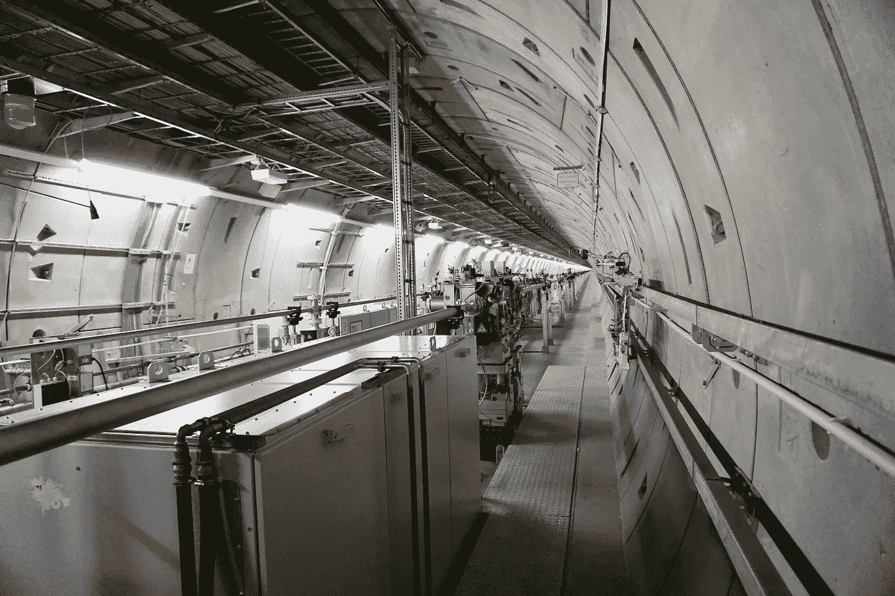
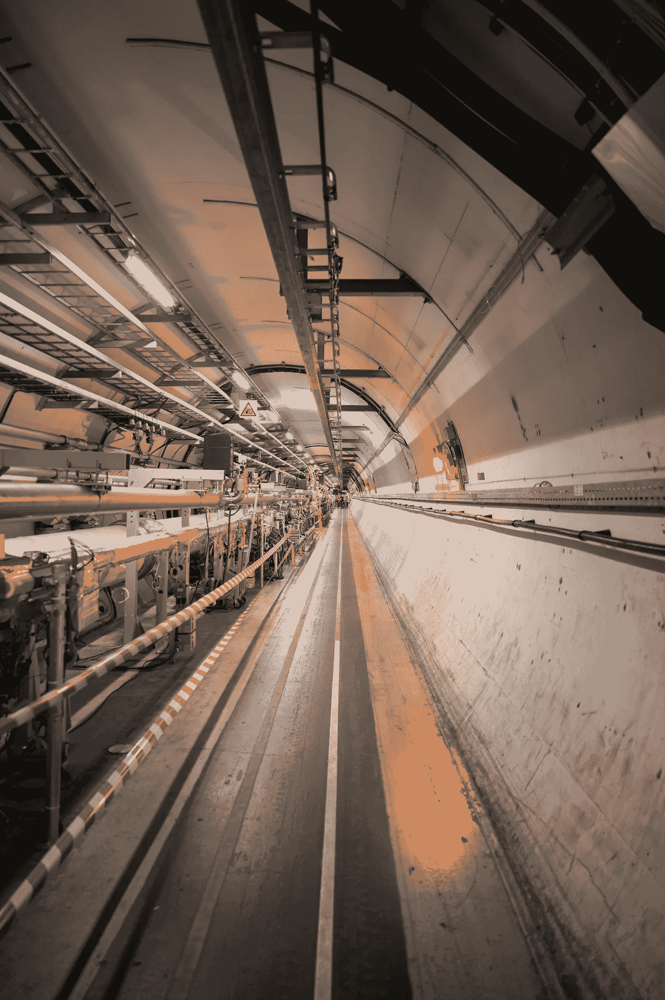
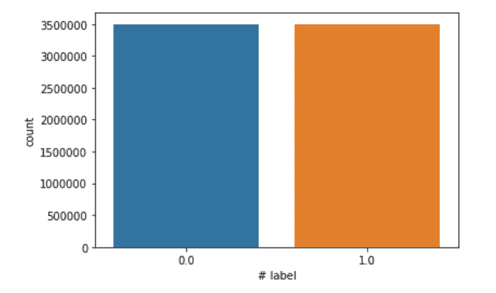
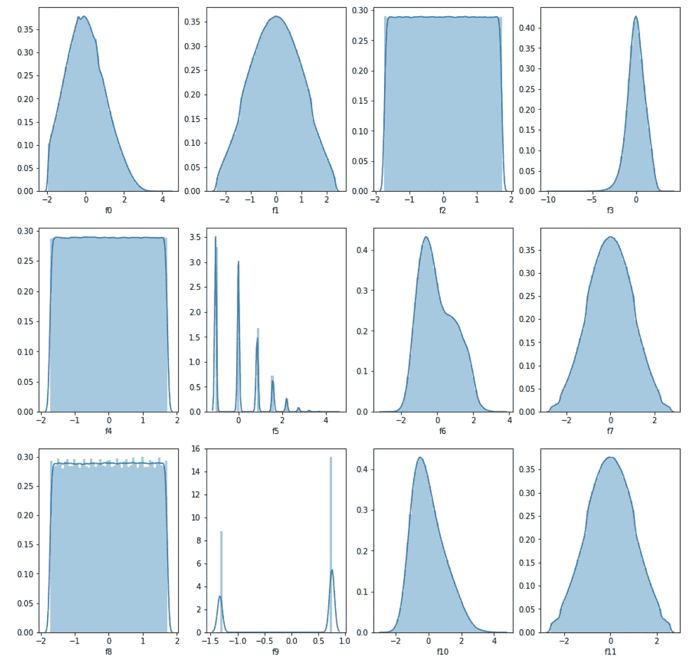

# 深度学习如何解决高能物理中的问题

> 原文：<https://towardsdatascience.com/how-deep-learning-can-solve-problems-in-high-energy-physics-53ed3cf5e1c5?source=collection_archive---------34----------------------->

## 利用高能碰撞的数据来探测新粒子



尤利娅·布查茨卡娅在 [Unsplash](https://unsplash.com/s/photos/particle-accelerator?utm_source=unsplash&utm_medium=referral&utm_content=creditCopyText) 上的照片

今天仍在研究和发展的物理学的一个有趣分支是对亚原子粒子的研究。世界各地粒子物理实验室的科学家将使用粒子加速器高速撞击粒子，以寻找新的粒子。寻找新粒子包括从背景过程中识别感兴趣的事件(信号过程)。

在 UCI 机器学习库中公开的 [HEPMASS 数据集](https://archive.ics.uci.edu/ml/datasets/HEPMASS)，包含了来自 1050 万次粒子碰撞的[蒙特卡罗模拟](https://en.wikipedia.org/wiki/Monte_Carlo_method)的数据。该数据集包含带有 27 个归一化特征的标记样本和每个粒子碰撞的质量特征。你可以在论文[高能物理的参数化机器学习](https://arxiv.org/pdf/1601.07913.pdf)中读到更多关于这个数据集的内容。

**在这篇文章中，我将演示如何使用 HEPMASS 数据集来训练一个深度学习模型，该模型可以区分产生粒子的碰撞和背景过程。**

# 粒子物理学简介

粒子物理学是对构成物质和辐射的微小粒子的研究。这个领域通常被称为高能物理学，因为寻找新粒子涉及使用粒子加速器以高能级碰撞粒子，并分析这些碰撞的副产品。世界上有几个粒子加速器和粒子物理实验室。由欧洲核研究组织(CERN)建造的大型强子对撞机(LHC)是世界上最大的粒子加速器。LHC 位于法国和瑞士边境附近的一个地下隧道中，有一个 27 公里长的超导磁体环。



大型强子对撞机。[二万·马丁](https://unsplash.com/@vnffwa?utm_source=unsplash&utm_medium=referral&utm_content=creditCopyText)在 [Unsplash](https://unsplash.com/s/photos/particle-accelerator?utm_source=unsplash&utm_medium=referral&utm_content=creditCopyText) 上的照片。

想象一下，在像 LHC 这样的粒子加速器中进行数百万次粒子碰撞，然后试图从这些实验中理解数据。这就是深度学习可以帮助我们的地方。

# 导入库

在下面的代码中，我简单地导入了一些用于数据操作、分析和可视化的基本 Python 库。请参考这个 [GitHub 库](https://github.com/AmolMavuduru/HEPMASS_DeepLearning)来找到本文中使用的完整代码。

```
import numpy as np
import pandas as pd
import matplotlib.pyplot as plt
import seaborn as sns
%matplotlib inline
```

# 读取数据

HEPMASS 数据集带有单独的训练和测试集。为了使模型评估过程不偏不倚，我决定先读取训练集，在训练和验证我的模型之前不动测试集。

```
train = pd.read_csv('all_train.csv.gz')
```

在这个数据帧上调用 Pandas info 函数会为每一列生成以下摘要。

```
<class 'pandas.core.frame.DataFrame'>
RangeIndex: 7000000 entries, 0 to 6999999
Data columns (total 29 columns):
 #   Column   Dtype  
---  ------   -----  
 0   # label  float64
 1   f0       float64
 2   f1       float64
 3   f2       float64
 4   f3       float64
 5   f4       float64
 6   f5       float64
 7   f6       float64
 8   f7       float64
 9   f8       float64
 10  f9       float64
 11  f10      float64
 12  f11      float64
 13  f12      float64
 14  f13      float64
 15  f14      float64
 16  f15      float64
 17  f16      float64
 18  f17      float64
 19  f18      float64
 20  f19      float64
 21  f20      float64
 22  f21      float64
 23  f22      float64
 24  f23      float64
 25  f24      float64
 26  f25      float64
 27  f26      float64
 28  mass     float64
dtypes: float64(29)
memory usage: 1.5 GB
```

数据集中的第一列对应于指示碰撞是否产生粒子的类标签。预测这个标签基本上是一个二元分类任务。

# 探索性数据分析

现在我们有了数据，我们可以使用 seaborn 来创建一些可视化并更好地理解它。

## 可视化类别分布

我们可以使用 Seaborn 的 **countplot** 函数来看看类的分布，如下所示。

```
sns.countplot(train['# label'])
```



分类标签的分发。

根据上面的图，我们可以看到这些类是均匀分布的，350 万个样本对应于背景过程，另外 350 万个样本对应于产生粒子的信号过程。注意，标号 1 对应于信号处理，而标号 0 对应于背景处理。

## 可视化不同特征的分布

我们还可以可视化从每个模拟碰撞中提取的特征的分布，如下面的代码所示。

```
cols = 4
fig, axes = plt.subplots(ncols=cols, nrows=3, sharey=False, figsize=(15,15))for i in range(12):
    feature = 'f{}'.format(i)
    col = i % cols
    row = i // cols
    sns.distplot(train[feature], ax=axes[row][col])
```



前 12 个特征的分布。

上面的几个特征倾向于遵循相似的概率分布。许多特征似乎遵循近似正态分布，稍微向左或向右倾斜，而其他特征(如 f2、f4 和 f5)大致遵循均匀分布。

# 数据预处理

## 缩放质量

与缩放特征不同，质量特征没有被归一化或缩放，因此我们应该缩放它，以便使深度学习模型更容易使用它。

```
from sklearn.preprocessing import StandardScalerscaler = StandardScaler()
train['mass'] = scaler.fit_transform(train['mass'].values.reshape(-1, 1))
```

## 培训和验证分离

在下面的代码中，我使用了 Scikit-learn 的经典 train_test_split 函数将数据分成训练集和验证集。根据代码，70%的数据用于训练，剩下的 30%用于验证。

```
from sklearn.model_selection import train_test_splitX = train.drop(['# label'], axis=1)
y = train['# label']X_train, X_valid, y_train, y_valid = train_test_split(X, y, test_size=0.3, random_state=42)
```

# 训练深度学习模型

现在我们终于准备好训练深度学习模型来识别产生粒子的碰撞。在这一部分，我遵循了创建最佳深度学习模型的三个步骤:

1.  **定义了网络的基本架构和超参数。**
2.  **调整了网络的超参数。**
3.  **用表现最好的超参数重新训练模型。**

我使用验证数据来测量具有不同超参数配置的模型的性能。

## 定义神经网络架构和超参数

在下面的代码中，我使用了一个名为 [Keras Tuner](https://keras-team.github.io/keras-tuner/) 的 Keras 扩展来优化具有三个隐藏层的简单神经网络的超参数。您可以使用 [Keras Tuner 文档页面](https://keras-team.github.io/keras-tuner/)了解有关该工具以及如何安装它的更多信息。

```
from keras.regularizers import l2 # L2 regularization
from keras.callbacks import *
from keras.optimizers import *
from keras.models import Sequential
from keras.layers import Dense
from kerastuner import Hyperbandn_features = X.values.shape[1]def build_model(hp):

    hp_n_layers = hp.Int('units', min_value = 28, max_value = 112, step = 28)
    model = Sequential()
    model.add(Dense(hp_n_layers, input_dim=n_features, activation='relu'))
    model.add(Dense(hp_n_layers, activation='relu'))
    model.add(Dense(hp_n_layers, activation='relu'))
    model.add(Dense(1, activation='sigmoid'))
    hp_learning_rate = hp.Choice('learning_rate', values = [1e-2, 1e-3, 1e-4]) 
    # Compile model
    model.compile(loss='binary_crossentropy', 
                  optimizer=Adam(learning_rate=hp_learning_rate), 
                  metrics=['accuracy'])
    return modeltuner = Hyperband(build_model,
                  objective = 'val_accuracy', 
                  max_epochs = 10,
                  factor = 3,
                  directory = 'hyperparameters',
                  project_name = 'hepmass_deep_learning')
```

在上面的代码中，我使用 Keras Tuner 为网络的每个隐藏层中的单元数和训练网络时使用的学习率定义了超参数选项。我为每个超参数测试了以下选项:

*   **隐藏层数:28，56，84，112。**
*   **学习率:0.01，0.001，0.0001。**

这绝不是一个详尽的列表，如果你想真正找到这个问题的最佳超参数，你可以尝试更多的超参数组合。

## 超参数调谐

现在已经定义了神经网络架构和超参数选项，我们可以使用 Keras Tuner 来找到最佳的超参数组合。

下面的代码段是一个可选的回调，我添加它是为了在超参数搜索中的每个模型的训练运行结束时清除训练输出。这个回调使得 Jupyter 笔记本或 Jupyter 实验室环境中的输出更加清晰。

```
import IPythonclass ClearTrainingOutput(Callback):

    def on_train_end(*args, **kwargs):
        IPython.display.clear_output(wait = True)
```

在下面的代码中，我对超参数进行了简单的搜索，以找到最佳模型。这个搜索过程包括训练和验证不同的超参数组合，并对它们进行比较，以找到性能最佳的模型。

```
tuner.search(X_train, y_train, epochs=4, 
             validation_data = (X_valid, y_valid), 
             callbacks = [ClearTrainingOutput()])# Get the optimal hyperparameters
best_hps = tuner.get_best_hyperparameters(num_trials = 1)[0]print(f"""
Optimal hidden layer size: {best_hps.get('units')} \n
optimal learning rate: {best_hps.get('learning_rate')}.""")
```

运行搜索产生以下最佳超参数。

```
Optimal hidden layer size: 112 

optimal learning rate: 0.001.
```

## 培训最佳模特

既然超参数搜索已经完成，我们可以用最佳超参数重新训练模型。

```
model = tuner.hypermodel.build(best_hps)
history = model.fit(X_train, y_train, epochs=4, validation_data = (X_valid, y_valid))
```

上面的训练过程为每个时期产生以下输出。

```
Epoch 1/4
153125/153125 [==============================] - 150s 973us/step - loss: 0.2859 - accuracy: 0.8691 - val_loss: 0.2684 - val_accuracy: 0.8788
Epoch 2/4
153125/153125 [==============================] - 151s 984us/step - loss: 0.2688 - accuracy: 0.8788 - val_loss: 0.2660 - val_accuracy: 0.8799
Epoch 3/4
153125/153125 [==============================] - 181s 1ms/step - loss: 0.2660 - accuracy: 0.8801 - val_loss: 0.2645 - val_accuracy: 0.8809
Epoch 4/4
153125/153125 [==============================] - 148s 969us/step - loss: 0.2655 - accuracy: 0.8806 - val_loss: 0.2655 - val_accuracy: 0.8816
```

根据上面的训练输出，我们可以看到最佳模型的验证准确率刚刚超过 88%。

# 测试最佳模型

现在，我们终于可以使用单独的测试数据来评估模型了。我像往常一样缩放 mass 列，并使用 Keras evaluate 函数来评估上一节中的模型。

```
test = pd.read_csv('./all_test.csv.gz')
test['mass'] = scaler.fit_transform(test['mass'].values.reshape(-1, 1))X = test.drop(['# label'], axis=1)
y = test['# label']
model.evaluate(X, y)
```

上面的代码产生了下面的输出。

```
109375/109375 [==============================] - 60s 544us/step - loss: 0.2666 - accuracy: 0.8808[0.26661229133605957, 0.8807885646820068]
```

基于这个输出，我们可以看到该模型实现了大约 0.2667 的损失，并且在测试数据上的准确率刚刚超过 88%。根据训练和验证结果，这种性能水平是我们所期望的，我们可以看到模型没有过度拟合。

# 摘要

在本文中，我演示了如何使用 HEPMASS 数据集训练神经网络来识别产生粒子的碰撞。这是深度学习在粒子物理领域的一个有趣应用，随着这两个领域的进步，它可能会在研究中变得更受欢迎。和往常一样，你可以在 [GitHub](https://github.com/AmolMavuduru/HEPMASS_DeepLearning) 上找到这篇文章的完整代码。

# 来源

1.  欧洲粒子物理研究所，[关于 LHC 的事实和数字](https://home.cern/resources/faqs/facts-and-figures-about-lhc)，(2021)，欧洲粒子物理研究所网站。
2.  维基百科，[蒙特卡洛法](https://en.wikipedia.org/wiki/Monte_Carlo_method)，(2021)，维基百科免费百科。
3.  页（page 的缩写）巴尔迪，k .克拉默等。阿尔，[高能物理的参数化机器学习](https://arxiv.org/pdf/1601.07913.pdf)，(2016)，arXiv.org。