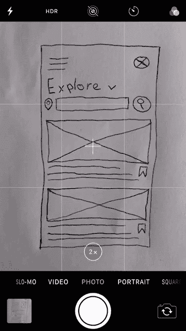
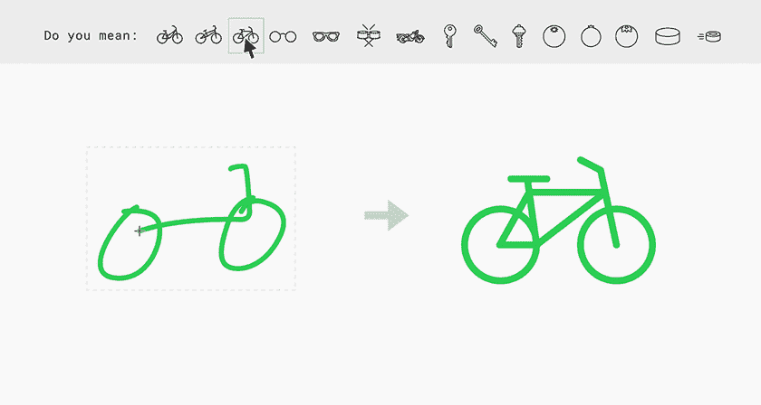
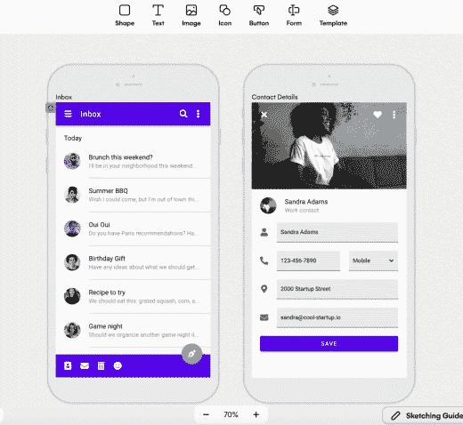
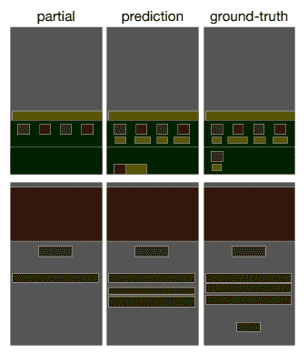

# deep‌ ‌learning‌ ‌is 如何改变设计:NLP 和 CV 的应用

> 原文：<https://towardsdatascience.com/how-deep-learning-is-transforming-design-cv-and-nlp-applications-4518c50690e6?source=collection_archive---------16----------------------->

## 了解自然语言处理和计算机视觉在当今设计领域的应用

如果你曾经尝试过创建一个用户界面，你可能会很快意识到设计是困难的。选择正确的颜色，使用匹配的字体，使你的布局平衡…所有这些都要考虑到用户的需求！我们能否以某种方式降低所有这些复杂性，让每个人都能设计，即使他们不知道间距规则或颜色对比理论？如果软件能帮你搞定这些不是很好吗？

这个问题并不新鲜。这是一个长期存在的问题，人机交互(HCI)社区多年来一直在努力解决这个问题。**深度学习最近才开始被应用**(例如，查看[这篇](https://arxiv.org/pdf/2109.08763.pdf)或[这篇](https://arxiv.org/pdf/2105.11941.pdf)论文)，正如它在其他领域发生的那样，它已经迅速成为使这些技术在实际产品中工作的核心使能因素。事实证明，收集其中一些问题的数据比提出一个完整的数学公式来解释某个设计为什么有效更可行。然而并非没有挑战。作为一个复杂、高维、多解的问题，通常很难定义您的模型输入、输出，甚至是优化什么！

虽然当前的深度学习方法还没有准备好承担设计师的同等责任，但它已经开始消除摩擦，并部分自动化设计过程的步骤。这使得非设计师能够在没有设计师直接参与的情况下设计出他们自己的想法。

无论你是否是设计师，这些都是深度学习在该领域的一些令人兴奋的应用:

# 计算机视觉

计算机视觉作为一个视觉领域，在设计领域有大量的应用。

## 草图到设计的转换

来源:[uizard . io](https://uizard.io/)——[试试看](https://app.uizard.io/auth/sign-up)

对于非设计师来说，使用复杂的设计软件可能是一个令人生畏的挑战，但是一支笔和一张纸？非常低的准入门槛意味着每个人都可以很快上手。

然而，这并非易事。在计算机视觉层面上解决这个问题不仅需要理解形状，还需要理解意图。识别线条是一个简单的问题，但是知道那条线意味着什么可能是真正的挑战。

而且即使你设法从视觉的角度理解一切，你仍然需要经历定义不良的布局建模任务“让一切看起来都好”。

## 基于草图的设计资源查询

来源:[谷歌自动绘图](https://www.autodraw.com/)

如果您已经有了一组想要使用的视觉资产，该怎么办？仅仅通过传统的基于语言的搜索来探索这些资源是具有挑战性的。你心中有一个你想要的图像，但是这个特定的图标/图画是如何命名的呢？赶紧素描一下就好！

这是一个复杂的视觉问题，特别是当我们假设资产集不固定时，因为草图表示可能与实际资产有很大差异。

# 基于视觉的主题创作

来源:[uizard . io](https://uizard.io/)——[试试看](https://app.uizard.io/auth/sign-up)

当然，你也许能得到一些基本的组件和形状，但是颜色、排版、复杂的组件设计等呢？？这些都是非常耗时的任务，设计师们要为每个新项目花费数周的时间来开发。这里的想法是，你只需选择一个现有项目的图像，你的网站的网址，甚至是互联网上的任何随机图像，在几秒钟内你就可以节省设计师数周的工作！一个完整的“设计系统”是由你的视觉灵感创造出来的。

听起来很有用，但是如何建模呢？第一步是对图像中的像素达成一个**复杂的理解，从那里我们可以提取一组颜色、字体、组件等。但是当然，也可能不是所有的组件都在，所以你也需要设计你看不到的组件。[阅读更多](https://tbeltramelli.medium.com/generating-design-systems-using-deep-learning-abe8d1195960)。**

# 自然语言处理

虽然一开始将自然语言处理应用于视觉领域听起来可能有些违反直觉，但**设计是一个多模态领域**，它提供了许多应用 NLP 技术的机会。当你想到这一点时，**设计中的组件可以被建模为单词，屏幕可以被建模为句子**，而你的整个应用程序可以被建模为一个长文本。这意味着我们可以利用过去几年在 NLP 领域所做的大量工作，并利用它来学习布局。这种方法已经在 [LayoutLM](https://arxiv.org/abs/1912.13318) 以及无数其他应用于设计的论文中被证明是有效的，比如[这个](https://www.aaai.org/AAAI21Papers/AAAI-3167.HeZ.pdf)或者[这个](https://arxiv.org/pdf/2105.11941.pdf)。

设计的组成部分，不管是文本的还是其他的，都是你的“句子”的“词”。然后，这可以被输入到一个变压器，以解决众多的任务。[来源](https://arxiv.org/pdf/2105.11941.pdf)

# 设计生成描述

但是，当我们可以描述我们想要的东西时，为什么还要费心去解决组成设计问题的单个问题呢？好吧，虽然已经有这样做的原型，但不要期待一个完美的解决方案。人类仍然需要迭代一个设计问题的无限解，按照自己的喜好调整事物，等等。
不过，这确实是个有趣的多模态问题。**混合形式总是一个挑战**，这里我们将从常规英语转向 2D 布局，你不仅需要预测标记，还需要预测它们的位置、内容、风格等。

# 设计自动完成

给定一个部分设计布局(每个盒子是一个组件)，一个模型的任务是完成它[来源](https://arxiv.org/pdf/2001.05308.pdf)

自动补全通过让在微型手机屏幕上书写文本的体验更加高效，为世界节省了数百万小时。是时候在设计时也利用这一点了。

我的意思是，如果设计可以像文本一样建模，为什么我们在设计的时候不能有自动完成功能？实际上，类似的建模方法可以应用于这两个问题，我们不是预测下一个单词，而是预测下一个设计组件。

# 最后的话

凭借丰富的数据和较低的错误成本，**设计领域是深度学习研发的完美游乐场**。这里我们只提到了少数几个项目，但是还有许多其他具有挑战性的任务，其中**NLP 和 CV** 建模技术都是成功的关键。从[代码生成](https://arxiv.org/pdf/1705.07962.pdf)%EC%9D%98)到[屏幕链接预测](https://www.aaai.org/AAAI21Papers/AAAI-3167.HeZ.pdf)或者[设计检索](https://arxiv.org/pdf/2105.11941.pdf)，不一而足。

如果你对通过深度学习构建设计的未来感兴趣，记得[在 Twitter 上关注我](https://twitter.com/JavierFnts)。只要我们在 [Uizard](https://uizard.io/) 有空缺职位，我会随时通知你。