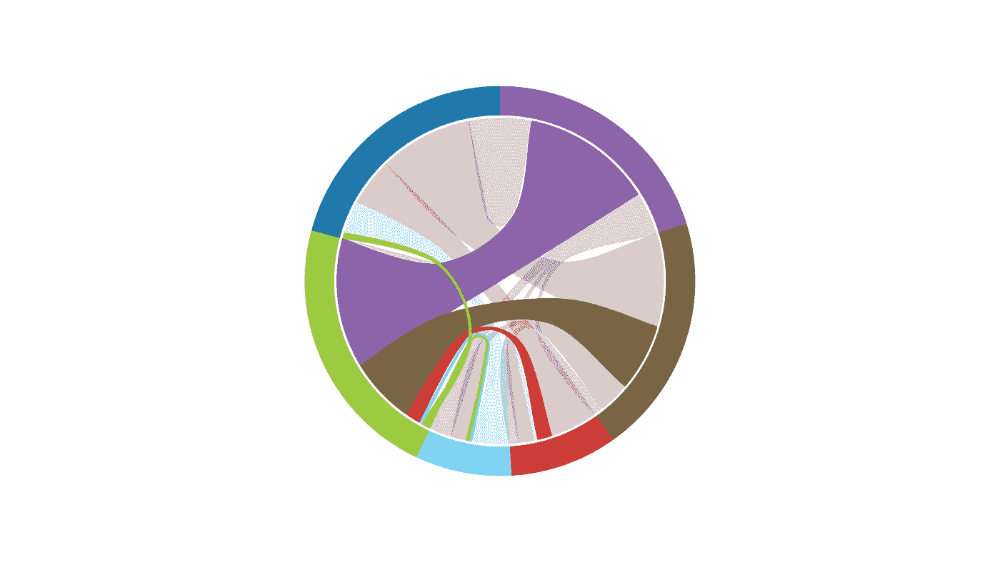

# 我是如何根据目的对 50 种图表类型进行分类的？

> 原文：<https://towardsdatascience.com/how-did-i-classify-50-chart-types-by-purpose-a6b0aa5b812d?source=collection_archive---------18----------------------->

## 数据可视化

## 可视化的目的是洞察力，而不是图片

艾萨克·史密斯在 [Unsplash](https://unsplash.com?utm_source=medium&utm_medium=referral) 上拍摄的照片

大家好😘！

今天，我很高兴地向大家介绍 50 多个通常被商业人士使用的图表。我希望你会喜欢它。它们分为以下五类。

*   ***趋势*** :折线图、棒棒糖图、迷你图、条形图(和柱形图)、面积图、凹凸图、瀑布图、斜率图和股价图。
*   ***关系*** :散点图、平滑散点图、气泡图、相关图、斜率图、热图、弦图、雷达图、平行坐标图、镶嵌图、脊线图、气泡图。
*   ***比较*** :簇状条形图、堆积条形图、面积图、堆积面积图、克利夫兰点状图、折线图、棒棒糖图、迷你图、凹凸图、子弹图、漏斗图、镶嵌图、脊线图、分类图、choropleth 图、hexbin 图、以及 cartogram。
*   ***分布*** :直方图、密度图、威尔金森点状图、茎叶图、盒状&须状图、带状图、小提琴图、等高线图、三维面积图、点状图、径向流图、网络流图、等值线图。
*   ***整体的一部分*** :饼图、圆环图、簇状条形图(和柱形图)、堆积条形图(和柱形图)、百分比堆积条形图(和柱形图)、面积图、100%面积图、瀑布图、树形图、旭日图。

# 趋势

当你展示随着时间的推移发生了什么时，有趣的事情会变得更加有趣。绘制时标值可以显示季节性、增长、减少和趋势，以帮助预测未来。

## 折线图

折线图通常用于显示时间数据，或数值随时间的变化。x 轴代表时间间隔(*年、季度、月、一天中的小时)。等等*)，y 轴代表观察值。

## 凹凸图

它是折线图的变体，用于探索等级随时间的变化。它有助于比较多个观察值的位置、性能和排名，而不是实际值本身。

## 柱状图

柱形图是最常用的图表类型之一。柱形图只有 12 个或更少的数据点，是可行的，也是有用的。

当超过 12 个数据点时，最好切换到没有单个数据点的折线图。折线图可以轻松显示数百个周期的趋势。

## 条形图

条形图是翻转过来的柱形图。所有相同的原则和最佳实践都适用于柱形图和条形图。

## 棒棒糖图表

棒棒糖图是条形图的一种便捷变体，其中条形图由线条和末端的点代替。

## 迷你图

迷你图是工作表单元格中的一个小图表，提供数据的可视化表示。

*您可以使用迷你图来显示一系列数值的趋势，如季节性增减、经济周期，或者突出显示最大值和最小值*。将迷你图放在其数据附近以获得最佳效果。

## 对比图

面积图结合了折线图和条形图，以显示一个或多个组的数值如何随着第二个变量(通常是时间)的变化而变化。

## 瀑布图

当您想要显示主要的变化或说明总额的构成，同时显示总额以便比较时，瀑布图是一个不错的选择。

## 斜率图

当您有两个时间段或比较点，并且想要快速显示两个数据点之间不同类别的相对增减或差异时，斜率图会很有用。

## 股票图表

(*又叫烛台图*)

股价图有一条垂直线，表示证券价格从低到高的范围。粗柱表示开盘价和收盘价。

在上面的第一组烛台中，蓝色表示价格上涨，红色表示价格下跌。

# 关系

许多数据集包含两个或多个变量，我们可能对这些变量之间的关系感兴趣。

## 散点图

这是一种非常重要的图表类型，特别是，为了绘制两个定量变量之间的关系，我们通常会使用散点图。下图显示了一个散点图示例。

使用回归分析，您可以使用散点图直观地检查数据，以查看 X 和 Y 是否线性相关。

## 泡泡图

气泡图通过数据标记的多重编码扩展了散点图的潜力。这些标记代表不同大小的圆(*数据点不一定是圆*)，然后根据它们的分类关系进行着色。

气泡图很有用，因为它能画出三个数据元素的交叉点。

## 相关图

在数据分析中，相关图是*相关统计的图表*。

## 热图

(*称为矩阵图*)

热图使我们能够执行快速模式匹配，以检测分类组合矩阵中不同定量值的顺序和层次。

使用饱和度降低或亮度增加的配色方案有助于创建数据量级排序的感觉。

## 弦图

弦图是一种显示矩阵中数据之间相互关系的图形方法。它比较一个数据集内或不同数据组之间的相似性。

例如，它绘制了从 A 公司到 B 公司的员工数量，每有一名员工向另一个方向流动。

## 雷达图

(*称为极坐标图*)

雷达图是显示多个数据点以及它们之间变化的一种方式。它们通常用于比较两个或更多不同数据集的点。

## 平行坐标图

平行坐标图显示了多个垂直轴上两个或多个变量之间的相关性。

## 马赛克图

(*也称为马里梅科图*)

镶嵌图是一种将两个或多个定性变量的数据可视化的图形方法。

## 脊柱图

(*亦称旋图*)

脊线图*是仅用于两个变量*的镶嵌图的特定类型。它类似于复合条形图，但现在条形的宽度是由每个水平类别的比例来设置的。

## 气泡图

这张地图用来帮助我们描述一个主题。中间的圆圈代表主题，而外面的圆圈代表主题的质量。

# 比较

## 簇状条形图和柱形图

簇状条形图用于使用水平方向比较某一指标上的分类变量的类别。条形的高度代表 x 轴上显示的测量值。我们使用条形图来显示大的文本标签。

簇状柱形图与簇状条形图类似，用于比较某个指标上的分类变量的类别。它是簇状条形图的垂直版本。

## 堆积条形图和柱形图

**堆积条形图**

堆积条形图将标准条形图从查看一个分类变量的数值扩展到两个分类变量。

**堆积柱形图**

堆积柱形图是一种基本的图表类型，允许随时间或跨类别进行部分与整体的比较。

## 对比图

## 堆积面积图

堆积面积图*是基本面积图*的延伸。它在同一个图形上显示了几个组的值的演变。

最有用的类型是堆积面积图，它最适合结合前面提到的两个概念:显示整体的一部分(像饼图)和一段时间内的连续数据(像折线图)。

## 克利夫兰点阵图

克利夫兰点图是条形图的替代方案，可以减少视觉混乱，并且更易于阅读。

## 折线图

多系列折线图用于比较不同组之间的表现。

## 棒棒糖图表

像条形图一样，棒棒糖图用于比较不同的项目或类别。

## 迷你图

我们可以使用迷你图来比较数据趋势。

## 凹凸图

## 项目符号图

## 漏斗图

## 马赛克图

镶嵌图用于显示关系，并提供组的直观比较。

## 脊柱图

脊柱图是一种流行的可视化方式，它可以一目了然地显示一个区域与一系列指标中的其他区域相比的情况

## 分类地图

## 等值区域图

## 图表

图表是一种地图，其中区域的几何形状被扭曲，以传达替代变量的信息。

## Hexbin 图

# 分配

## 柱状图

直方图是以连续(接触)条的形式显示频率或相对频率的条形图。

直方图可用于查看分布的形状，并确定数据是否对称分布。

## 密度图

密度图*是数值变量*分布的表示。它使用核密度估计来显示变量的概率密度函数。

## 威尔金森点阵图

威尔金森点图显示连续数据点的分布，就像直方图一样，但显示的是单个数据点，而不是条块。

## 茎叶图

茎和叶图是一个特殊的表格，其中每个数据值被分成“茎”(第一个数字)和“叶”(通常是最后一个数字)。

## 盒须图

箱线图，也称为盒须图，是一种显示数据集的分布和中心的方法。

## 带状图

带状图是提供单个变量观察值分布信息的众多图表类型之一。

它通过简单地将每个观察值显示为沿代表数据值范围的刻度线绘制的点，来提供数据集内包含的整体结构的有用视图。

## 小提琴情节

小提琴图是一种绘制数字数据的方法。它类似于一个箱形图，在每一侧增加了一个旋转的核密度图。

## 等值线图

等高线图用于将一组三维数据表示为高程等高线。它有三个强制系列组件，*位置*、*深度*和*值*。

*   位置和深度分量中的数据必须在 xz 平面上形成 2D 矩形网格。
*   每条等高线包括在值分量中具有相同高程值的点。

## 三维面积(表面)图

## 点阵图

点地图是一种专题地图，它使用点符号来显示大量相关现象的地理分布。

## 径向流动图

径向流动图显示了从一个源头到多个目的地的*流动，反之亦然。*

## 网络流程图

网络流程图显示了通常基于运输或通信互连的已建立网络的移动。

## 等值线

等值线是在地图上画的一条线，它穿过具有相同值的所有可测量的量。

# 作文

(*或整体的一部分*)

在此类别中，图表类型描述了组成部分如何构成整体、整体各部分之间的关系以及各部分对整体的累积影响。

## 圆形分格统计图表

典型的局部图是饼图。通常用于显示总数的简单分类，如人口统计数据。

饼图对于突出显示比例很有用。

## 圆环图

圆环图通常被用作饼图的替代品，以显示部分与整体的关系。

它们也经常被用作关键绩效指标(KPI)

## 簇状条形图和柱形图

**簇状柱形图**

**簇状条形图**

## 堆积条形图和柱形图

堆积条形图是呈现部分到整体关系的另一种方式。

## 百分比堆积条形图和柱形图

**百分比堆积条形图**

**百分比堆积柱形图**

## 对比图

面积图通常用于显示如何将一个整体分割成组成部分。

## 百分比面积图

百分比堆积面积图显示整体的组成部分如何随时间变化。

## 多堆栈瀑布图

## 树形图

树形图是可视化树形图层次结构的另一种方式，同时也通过面积大小显示每个类别的数量。

## 旭日图

旭日图非常适合显示分层数据。层次结构的每个级别都由一个环或圆表示，最里面的圆作为层次结构的顶部。

没有任何分层数据(一个类别级别)的旭日图看起来类似于圆环图。

# 结论

最后，我按用途分类了 50 多种图表类型。数据可视化的目标不仅仅是制作关于数字的图片，而是精心制作一个真实的故事，让读者相信你的解释如何以及为什么重要。

让我们展示您的数据故事…！