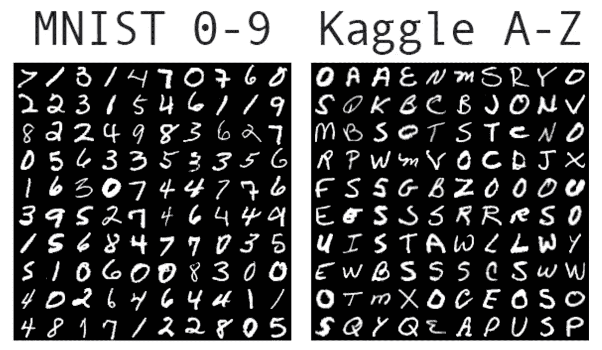
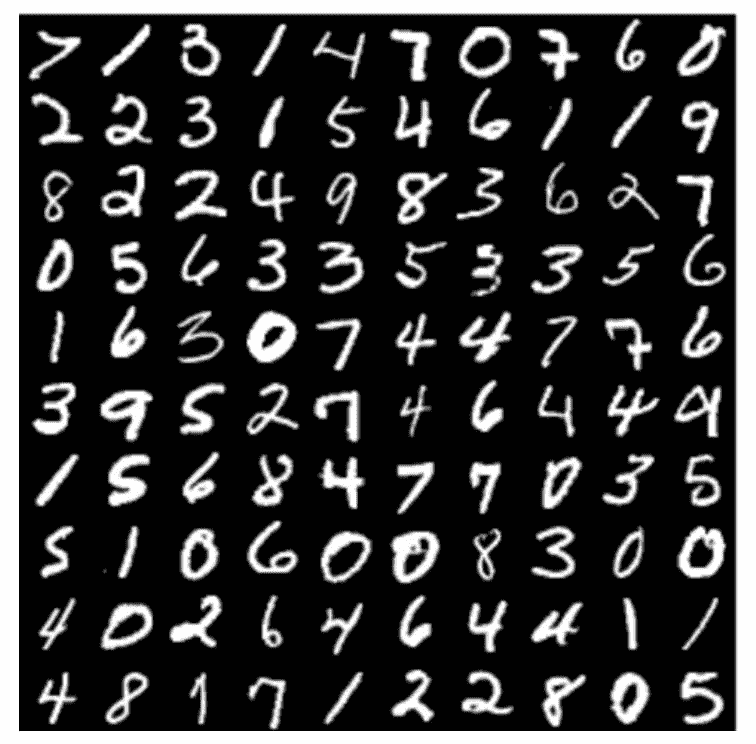
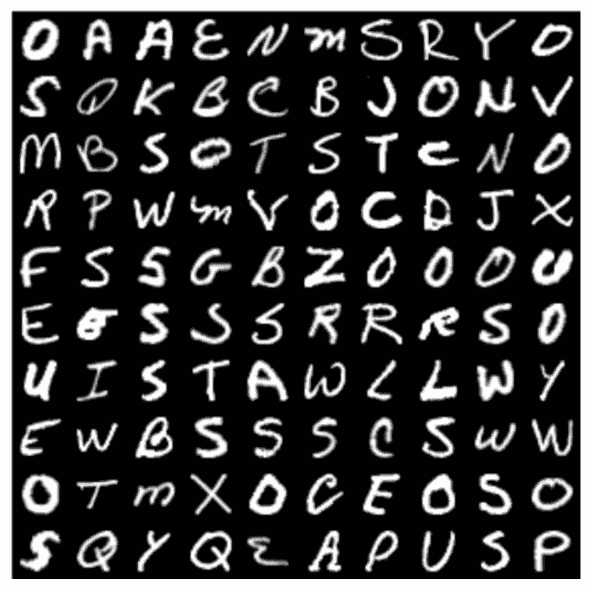
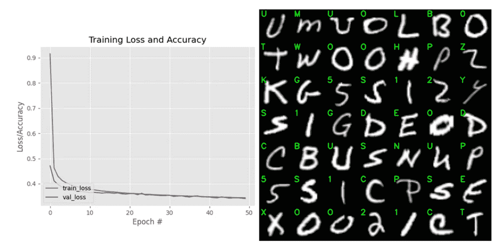
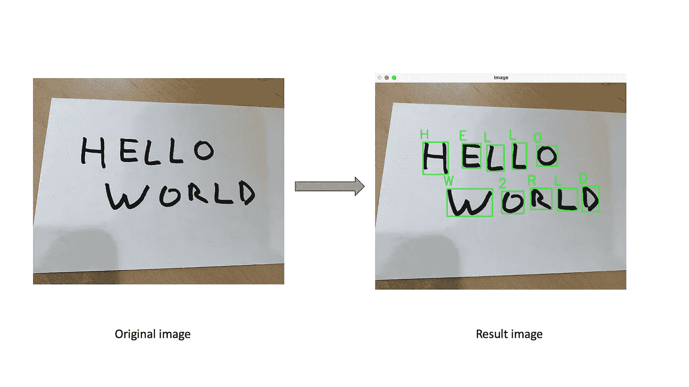

# 我是如何用 Python 中的 Keras 和 TensorFlow 编写自己的 OCR 程序的

> 原文：<https://towardsdatascience.com/how-did-i-train-an-ocr-model-using-keras-and-tensorflow-7e10b241c22b?source=collection_archive---------9----------------------->

## 数据科学家

## 如今，OCR 在数字劳动力的眼中



作者图片

光学字符识别(或光学字符阅读器，又名 OCR)是过去二十年来用于识别和数字化图像中出现的字母和数字字符的技术。在行业中，这项技术可以帮助我们避免人工输入数据。

在这篇文章中，我想带你了解深度学习技术如何应用于 OCR 技术来分类手写的步骤。

*   准备用于训练 OCR 模型的 0–9 和 A-Z 字母数据集。
*   从磁盘上加载字母的数据集。
*   在数据集上成功训练了 Keras 和 TensorFlow 模型。
*   绘制训练的结果，并可视化验证数据的输出。
*   预测某些图像中出现的文本。

# 准备数据集

我们使用以下两个数据集来训练我们的 Keras 和 TensorFlow 模型。

*   0–9:MNIST
*   A-Z: Kaggle

## 标准的 MNIST 0–9 数据集

这个数据集是从 NIST 的特殊数据库 3 和特殊数据库 1 构建的，它们包含手写数字的二进制图像。

```
Itis built into popular deep learning frameworks, including Keras, TensorFlow, PyTorch, etc. The MNIST dataset will allow us to recognize the digits 0–9*.*Each of these digits is contained in a 28 x 28 grayscale image.
```



MNIST 0 比 9

## ka ggle A–Z 数据集

Kaggle 用户 Sachin Patel 发布了一个简单的逗号分隔值(CSV)文件。

```
This dataset takes the capital letters *A–Z* from NIST Special Database 19.Kaggle also rescales them from 28 x 28 grayscale pixels to the same format as our MNIST data.
```



卡格尔公司

# 从磁盘加载数据集

由于我们有两个独立的数据集，首先我们必须加载两个数据集，并将它们合并成一个数据集。

*   加载 Kaggle A-Z 字母。

*   加载 MNIST 0-9 位数。

*   将它们合二为一。

# 在数据集上训练模型

我使用 Keras、TensorFlow 和 ResNet architecture 来训练我的模型。

使用以下命令训练该模型需要大约 30-45 分钟。

```
python train_model.py --az dataset/a_z_handwritten_data.csv --model trained_ocr.model[INFO] loading datasets...
[INFO] compiling model...
[INFO] training network...
Epoch 1/50
 34/437 [=>……………………….] — ETA: 7:40 — loss: 2.5050 — accuracy: 0.2989
...
```

# 标绘结果

我们将绘制一个可视化图，以便我们可以确保它正常工作。



# 作出预测

一旦模型被训练。我们可以用它来做预测。

```
python prediction.py — model trained_ocr.model — image images/hello_world.png[INFO] H - 92.48%
[INFO] W - 54.50%
[INFO] E - 94.93%
[INFO] L - 97.58%
[INFO] 2 - 65.73%
[INFO] L - 96.56%
[INFO] R - 97.31%
[INFO] 0 - 37.92%
[INFO] L - 97.13%
[INFO] D - 97.83%
```



完整的源代码可以在这里看到:[https://github . com/house cricket/how-to-train-OCR-with-Keras-and-tensor flow](https://github.com/housecricket/how-to-train-OCR-with-Keras-and-TensorFlow)

```
├── __init__.py
├── dataset
│   └── a_z_handwritten_data.csv
├── images
│   ├── hello_world.png
│   └── vietnamxinchao.png
├── models
│   ├── __init__.py
│   └── resnet.py
├── prediction.py
├── requirements.txt
├── train_model.py
├── trained_ocr.model
└── utils.py
```

# 结论

最后，总结本文，我们可以说使用 Keras、TensorFlow 和 Python 来训练 OCR 模型是很容易的。此外，我们可以通过使用更好的数据集来提高该 OCR 模型的准确性。

你有什么想法吗…？很简单，对吧？

# 参考

[1]http://yann.lecun.com/exdb/mnist

[2][https://www . ka ggle . com/sachin Patel 21/az-handled-alphabets-in-CSV-format/metadata](https://www.kaggle.com/sachinpatel21/az-handwritten-alphabets-in-csv-format/metadata)