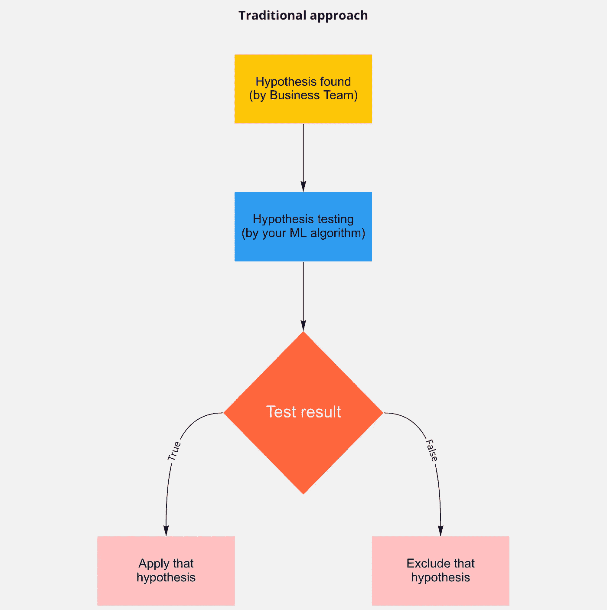
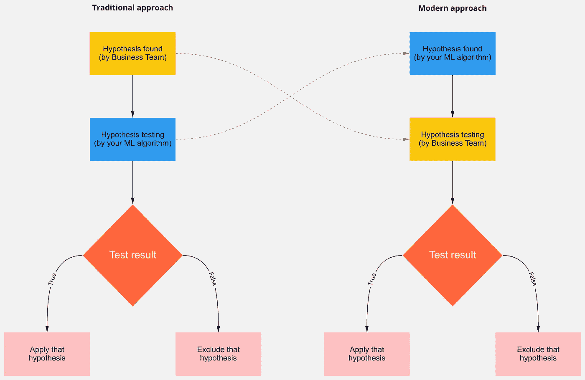
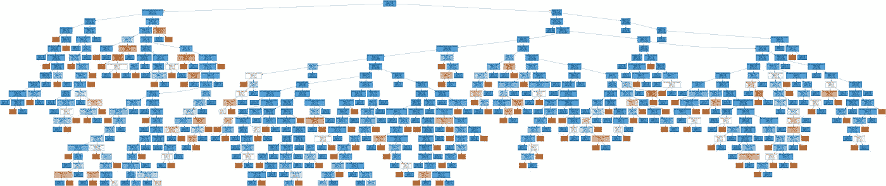
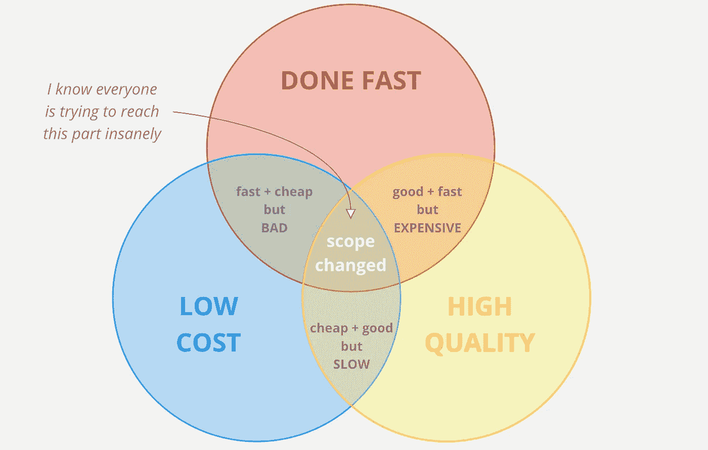
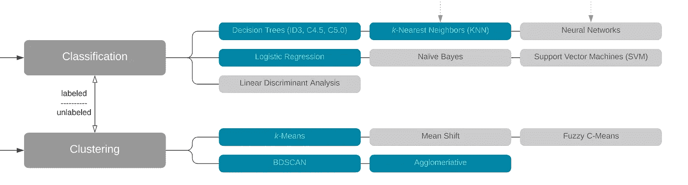
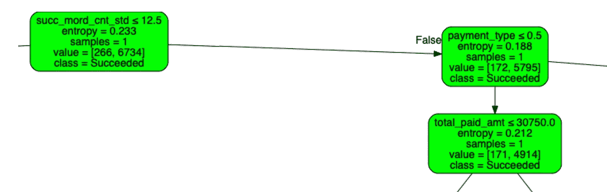
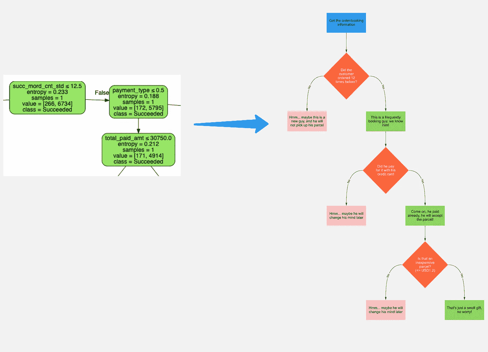
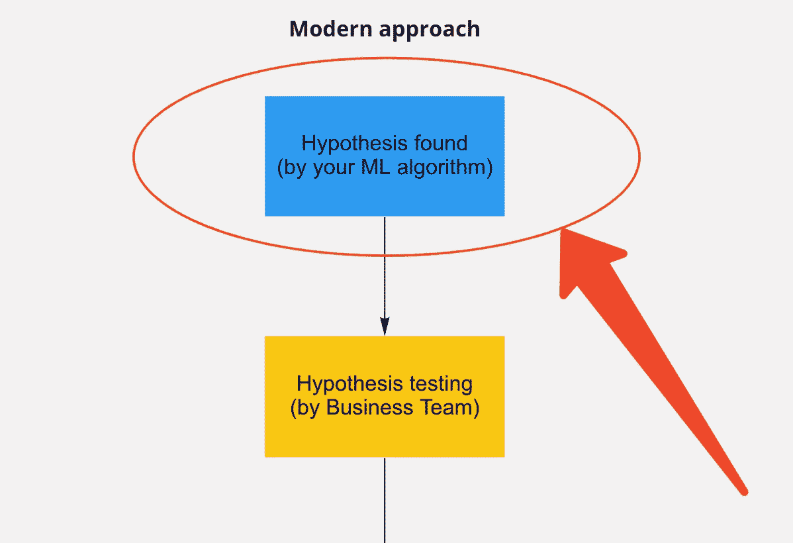

# 机器学习如何解释问题并为电子商务公司节省成本

> 原文：<https://towardsdatascience.com/how-did-machine-learning-interpret-problems-and-save-cost-for-ecommerce-companies-6c92796e5ed8?source=collection_archive---------6----------------------->

## [行业笔记](https://towardsdatascience.com/tagged/notes-from-industry)

## *让我给你分享一个我公司应用机器学习的成功案例*

在我们深入研究解决方案之前，这里有一个问题

> 该公司面临着很高的交货率失败的可能性——买家(那些在 Shopee、Lazada、亚马逊、易贝等电子商务平台上购买商品的人。)会在最后一刻拒绝他们的包裹。这浪费了大量资金，管理委员会希望降低这一比率。

两年前，那是我第一次担任新的角色，开始领导数据团队。有一天，有一个重要的会议，我是一屋子高管中唯一的数据员。人们在其中一个后续会议中，讨论总的****【FD】**失败交付案例、其增量、每个案例的潜在根本原因、主要原因、其趋势以及更多，而只有我一个人对此一无所知。这是我第一次触及那个棘手的问题。**

## **会议室里发生了什么？**

**提出了许多问题，有些得到了回答，有些没有。最终，我意识到有两类人:**

1.  ****提问**小组:首席执行官、首席财务官、营销团队，他们问了很多问题。大多数问题以*【什么】*和*【为什么】*开头，其他一些是*【如何】*和*【如果】*。**
2.  ****回答**组:、CCO、BI 团队，他们回答了约 30%的提问，其中大部分回答了**【为什么】*组，而*【如何】**【如果】组*则作废。***

**(当然，还有第三组人保持沉默，那就是我)**

**那是一个两小时的会议，我从一开始就完全迷失了。1 个半小时过去了，我开始质疑自己“这是怎么回事？这不是讨论，这是调查”。人们试图了解发生了什么，为什么会发生，但他们无法阻止它在未来发生。他们还根据数据小组的结果提出了一些假设。不幸的是，这些假设似乎不是那么一致，它们几乎不能证明什么。**

**那一刻，我知道我可以使用一些机器学习算法来解决问题，但遗憾的是机器学习这个术语对业务来说相当陌生，我没有机会展示我的方法。然而，机器学习不是火箭科学。我将向您展示我是如何应用并获得业务价值的。**

# **传统方法的缺陷**

**承认吧，你也看到你们公司的问题了吗？在讨论中，业务团队或财务团队是否一直在问这个问题发生的原因。然后他们还把你放在一些具体的情况下比如*“如果我们做* ***这个*** *呢？”*或者*“我觉得这是因为* ***那个****。而你，作为一个数据员，你会查看你的数据，做一些你称之为*的分析*并且输出大部分是*是/否*或*真/假*。***

**该程序称为*假设检验*，即:**

> **你得到了一些假设(某人认为如果你做他的假设中陈述的事情，结果会改变)；然后你必须检查你的数据，看看这是真假设还是假假设。如果这是真的，你的公司会应用这个假设来达到预期的结果。如果是假的，他们会尝试给你另一个假设。你不得不一次又一次地重复这个过程，直到他们找到一个合理的假设。**

**这是一个好方法吗？绝对不是。这是一个无限循环，因为公司永远不会满足于他们所得到的，所以他们会试图给你越来越多的假设，以销售更多的产品，节省更多的成本。你永远也走不出那个虚空的迷宫。**

**这种方法的问题是:**

1.  **每个人都可以提出这个假设(认为自己发现了很酷的东西)，**
2.  **假设列表无法排序(因为它们在某种程度上都是合理的)，**
3.  **你需要时间来验证每一个假设(这个列表会一天比一天长)。**

**那怎么走出那个迷宫呢？**

# **不要相信任何随机的假设**

**说起来挺讽刺的，因为我是数据团队的一员，我唯一信任的就是我的数据。假设可以来自任何参与问题的人，它看起来像一个原始数据集。在投入时间之前，我必须对其进行验证、清理和分类(就像我对数据所做的那样)，以确保获得最佳结果。那么问题就是*“我怎么知道哪个假设有用，哪个没用？”*。啊，是的，*“你必须用你的数据来测试它”*你一定在想这个问题，对吗？但是等等，你不应该只是测试列表上的所有假设，你在清理它，对吗？宾果，发现死锁。**

**让我重述一下整个过程:**

****

**传统的进场工作流程([来源](https://miro.com/app/board/o9J_lOiAwGQ=/)通过 [**芽变**](https://www.linkedin.com/in/huunhantran/) )**

**那一刻我意识到，真正的问题来自人类，而不是假说，或者数据，因为假说的来源可以来自任何人。如果他们没有足够的知识去理解和分析问题怎么办？他们没有能力提供假设！即使他们可以提供一些假设，这也不会是最好的解决方案，因为所有人都是人，都有我们的局限性。最好的解决方案应该在计算机的帮助下产生，同意吗？那这个问题怎么利用机器的计算能力呢？**

# **相反，向计算机寻求假设！**

**我的脑海中突然冒出一个想法*“为什么我不把所有的东西都放入某种无人监管的学习算法中，看看结果是什么，然后把这些东西带给业务团队，让他们验证？”***

**是的，当其他人在思考新的假设并和我的团队核对时，我也是这么想的！**

****

**传统方式 VS 现代方式([来源](https://miro.com/app/board/o9J_lOiAwGQ=/)作者[芽庄 T7)](https://www.linkedin.com/in/huunhantran/)**

**就在那里，我决定提取 10%的数据，放入决策树算法中。代码已经可以使用了(当然，我做了一个代码模板可以重用，只需更改数据集)，包含 12，000 条记录的数据集被清理了。我花了将近 2 分钟才得到结果。**

****

**订单(预订)分类使用决策树([源代码](https://drive.google.com/file/d/18E7NoF_orFu-hHG21YZubqudt-fv1T9Z/view?usp=sharing)托管在 Google Colab 上；[数据集](https://docs.google.com/spreadsheets/d/1JX4BiZgqwKs2NeUv5I_244-VcyTuroPrU_9uW_MwnX4/edit?usp=sharing)和[导出模型](https://drive.google.com/file/d/1kfNPC8UYCOalqGNMJJiPFBpVD7CYyhcn/view?usp=sharing)和[导出可视化](https://drive.google.com/file/d/1-5GafyPkXUSu7oBrLh1TEvmfWtrPfN8R/view?usp=sharing)由 [**芽庄**](https://www.linkedin.com/in/huunhantran/) **托管在 Google Drive 上。**免责声明:[数据集](https://docs.google.com/spreadsheets/d/1JX4BiZgqwKs2NeUv5I_244-VcyTuroPrU_9uW_MwnX4/edit?usp=sharing)是一个 10k 样本，有 315 个特征被标记，而原始数据集由大约 20k 个样本组成，有 3k 个特征。在这篇文章中，我不去详细的源代码和数据集，这只是一个例子)**

# **准确率不是唯一的目标**

**好吧，如果你是一个有经验的数据科学家，你会有一个问题“*为什么你不在使用你的预测之前应用预处理和特征工程？”*。这个问题问得好！我的回答是*“是准时的问题”*。事实上，我并不想获得高准确率的预测，我只是需要看到*“我的数据看起来怎么样，以及每个特征的重要性”*。在现实生活中，您通常需要牺牲质量(在这种情况下是准确率)来换取响应时间(在这种情况下，您需要多长时间才能理解您的数据)。当然，企业不会等太久才得到数据团队的决定，他们只需要**一些听起来足够合理的东西**来做出决定。当数据科学家倾向于投入大量时间来获得最佳预测模型时，这是他们的另一个陷阱。这里有一个你需要理解的小权衡图:**

****

**你工作努力的基本平衡([来源](https://miro.com/app/board/o9J_lOiAwGQ=/)由 [**芽变**](https://www.linkedin.com/in/huunhantran/) )**

# **让我们谈一谈决策树**

**承认吧，我打赌你经常坚持向他们解释一些可以解决问题的技术，但这对他们来说太难理解了，因为大多数机器学习算法是无法解释的。那怎么处理呢？好吧，让我们先谈谈决策树。**

**决策树是分类组中的算法，是监督学习的子集。该算法的输出可以是二进制值，例如**真/假**，或者**是/否**，或者**好/坏**，或者**公/母**，或者仅仅是 **0/1** 。输出有时可以是一组标签，如**红/绿/蓝**，或**低/中/高**，或**XS/S/M/L/XL**(t 恤尺寸)。**

**树是通过将构成树的根节点的源集分割成子集来构建的，这些子集构成了后继的子节点。分类领域的每个元素称为一个*类*。以下是一些与决策树相关的流行术语:**

*   ****根节点:**它代表整个总体或样本，并进一步分成两个或更多同类集合。**
*   ****拆分:**是将一个节点分成两个或两个以上子节点的过程。**
*   ****决策节点:**当一个子节点分裂成更多的子节点时，则称之为决策节点。**
*   ****叶/端节点:**不分裂的节点称为叶或端节点。**
*   ****剪枝:**当我们删除一个决策节点的子节点时，这个过程叫做剪枝。你可以说分裂的相反过程。**
*   ****分支/子树:**整个树的一个子部分称为分支或子树。**
*   ****父节点和子节点:**被分成子节点的节点被称为子节点的父节点，而子节点是父节点的子节点。**

# **试着解释你的模型**

**你一定想知道为什么我选择决策树而不是随机森林或逻辑回归。原因是:**我在寻找一个假设，而不是预测**。**

**我们有许多机器学习算法，它们可以分为有监督的、无监督的、回归的、分类的等等。每个算法都会给你一个不同的结果，例如，当你想预测结果是 A 还是 B(真或假，或者你需要的任何一种分类)，你可以使用分类组中的任何算法。但是对你来说，只使用一种算法而不使用其他算法，或者随机使用它们，并不是最好的做法。在目前的情况下，有什么问题呢？它是:**

> ****“如何降低交付失败案例率？”****

**不是*“如果我给你一个新的订单信息会怎么样？到底会不会送成功？”*。例如，如果你选择逻辑回归，你可以预测结果，但你不知道如何防止它。这是数据团队的另一个大陷阱，特别是对于 ML 工程师来说，他们一直专注于他们的算法，失去了与业务团队的沟通。事实上，我自己和我的团队过去也犯过同样的错误，所以如果你有同样的问题也不用担心。好消息是现在我们得到了教训和经验。**

****

**分类和聚类算法组([完整版](https://lucid.app/documents/view/bfd84196-5c9a-422e-9133-fc203b52031a)由 [**芽变**](https://www.linkedin.com/in/huunhantran/) )**

**因此，在这些算法中，决策树是解释你的数据的最简单的方法(KNN 和 SVM 也不错，但在这篇博客中，我选择了决策树，因为它是最简单的方法)。**

# **我们从决策树中得到的教训**

**让我们深入了解决策树的输出，我们有前 3 个分支:**

1.  ****succ_mord_cnt_std:** 此功能表示买方成功订购的订单/预订总数(已订购和已收到)。**
2.  ****payment_type:** 此功能代表买家为订单/预订付款的方式。我们有许多不同的方式，如:*通过信用卡支付，交货成本，银行转账，凭证代码，50%的成本存款…* 我做了一个快速的标签编码器，然后才运行这个例子。**
3.  ****total _ payed _ AMT:**该功能表示已支付订单/预订的总费用**

****

**前 3 名分支样本(按 [**韩川**](https://www.linkedin.com/in/huunhantran/) )**

**好的，在检查了前 3 个分支后，我试着将它们解释为*的一句话“如果这个包裹的买家* ***【做了某事】*** *，那么这个包裹将有可能被成功交付”*就像:**

*   ****第一个分支:**如果该包裹的买方 ***在过去*** 中已经订购了超过 12 个订单/预订，则该包裹将有可能被成功交付。**
*   ****第二分支:**如果这个包裹的买家 ***使用的方法≤ 0.5*** (编码的是*“信用卡支付”*)，那么这个包裹就有可能被成功送达。**
*   ****第三分支:**如果此包裹的买方 ***购买的总金额少于 30，750 越南盾(又名此包裹花费少于 30，750 越南盾)*** ，则此包裹可能会被成功交付。**

**之后，我试图用非技术技能(或我的常识)来理解我的假设，我向业务团队解释如下:**

*   ****第一个分支:**对于所有过去订购少于 12 个订单/预订的买家来说，他们是新用户，他们可能是垃圾邮件发送者(制造假订单)，因此他们是潜在没有收到包裹的高风险用户，或者只是因为他们对平台非常陌生，所以他们偶然下了订单，他们可能想取消订单，但不知道如何做。另一方面，订购超过 12 个订单/预订的买家是某种忠诚用户(经常在我们的平台上买东西)，我们可以信任他们。因此**如果这个包裹的买家*在过去*已经订购了超过 12 个订单/预订，那么这个包裹将有可能被成功交付。****
*   ****第二个分支:**对于所有使用信用卡支付的买家来说，他们都是有工作的人(银行只给信用评分高的人发放信用卡，有稳定收入的人是合格的)，所以他们有足够的钱购买东西(即使他们改变主意，他们也会接受这些东西，因为对他们来说这不是什么大事)。或者，我们可以说，没有预付任何款项的人后来会改变主意，或者他们会花光所有的钱，无法在送货时付款，或者，无论如何，我们无法从他们那里得到保证，所以**如果这个包裹*的买家使用的方法≤ 0.5* (这是被编码的*“用信用卡支付”*)，那么这个包裹就有可能被成功送达。****
*   ****第三个分支:**对于所有价格昂贵(超过 30，750 越南盾)且未提前付款的包裹，退货的风险很高(比如说，如果我在未提前付款的情况下从你的商店订购了一台 70 英寸的电视，你认为我会收到它并在你将它送到我家后付款吗？这是 50%的可能性，甚至更低。因此**如果此包裹*的买家购买的总金额低于 30，750 越南盾(也就是此包裹的价格低于 30，750 越南盾，相当于 1.2 美元)*，则此包裹可能会成功交付。****

**以下是我从决策树解读到非技术语言的假设总结:**

****

**解读我的决策树模型([source](https://miro.com/app/board/o9J_lOiAwGQ=/)by[Nhan TranT19)](https://www.linkedin.com/in/huunhantran/)**

**现在，从商业角度来看，这个问题似乎更容易理解。这是我之前提到的现代方法的第一步:**

****

**第一步:使用机器学习算法找到假设([来源](https://miro.com/app/board/o9J_lOiAwGQ=/)乘[芽庄 T25)](https://www.linkedin.com/in/huunhantran/)**

# **现代问题需要现代解决方案**

**好了，经过一个漫长的过程，现在我们有 3 个由机器学习算法生成的假设，让我们看看企业如何解决它并关闭案例？不要！是时候稍微换个话题了。让我们检查一下我们的 3 个假设，即:**

1.  **过去的订单数量**
2.  **付款方式**
3.  **预订费用**

**…你从他们身上学到了什么？是人之常情！**

****

**理解人类的行为有助于解决他们的问题(图片来自<https://www.pexels.com/@fotografierende?utm_content=attributionCopyText&utm_medium=referral&utm_source=pexels>**[**像素**](https://www.pexels.com/photo/hands-of-people-reaching-to-each-other-5541019/?utm_content=attributionCopyText&utm_medium=referral&utm_source=pexels) **)******

****根据我在尼尔森公司工作期间对客户洞察团队的个人研究，我发现我们的行为驱动我们的行动，这间接意味着:你可以通过改变人们的行为来改变他们的行动。那如何适用于我们的问题呢？****

*   ****对于**“过去的订单数量”**问题，我们可以与客户服务团队合作，为新用户提供更多支持，持续跟踪他们的订单，并采取适当的行动，如当他们下任何高额订单时，拿起电话并确认他们的订单。或者我们可以给他们更多的指导，告诉他们如何下单，当他们需要帮助时如何联系我们，以及当他们失去兴趣时如何取消任何订单。****
*   ****对于**【支付方式】**问题，我们有一个活动，我们预留了 30000 越南盾(相当于 1.2 美元)，分成 3 张代金券(每张 10000 越南盾)。当他们下订单并选择“货到付款”方式时，如果他们同意改用另一种预付方式，我们会向他们提供一张优惠券(10，000 越南盾)以减少运费。当然，我们主动提出“记住我的支付方式”以便他们以后使用(实际上这是我们驱使他们将来再次使用这种方式的方式)，并持续这样做 3 次。在大多数情况下，我们成功地让他们在第三次订购后继续使用预付费方式，并且他们会一直使用这种方式。之后，在第二次活动中，我们应用了前 3 个免费运费，以获得更大的效果。****
*   ****对于**“预订成本”**问题，我们使用了与**“过去订单数量”**问题相同的方法，让呼叫中心与有高价值采购的买家保持互动。****

********

****免费礼物是现代世界的一个神奇词汇(图片来自 [**Unsplash**](https://unsplash.com/photos/IPx7J1n_xUc) )****

# ****BLUF****

****好了，该写完我的长文了。在这篇博客中，我没有过多地谈论机器学习或分享任何代码，因为这是为在现代数据行业工作的人准备的，他们需要使用他们的技术技能为非技术人员服务。这就是数据团队的价值。****

****然而，猜猜我在几次竞选后得到了什么？交付不良率比上年同期降低了 7%！这是我的团队在 2 年多的时间里为组织做出的最大贡献，他们面临着高 FD 率，6 个以上的项目旨在降低 FD 率(所有项目都失败了，因为他们是由业务团队领导的，他们坚持传统的方法)。****

****现在让我们来看看我们讨论了什么！****

******3 个常见陷阱:******

1.  ****从随机人群中获取假设；****
2.  ****花太多时间改进你的模型；****
3.  ****选择了无法解释的错误算法。****

******重要提示:******

1.  ****我们的行为驱动我们的行动；****
2.  ****数据团队的价值是帮助企业获得其价值(实际上不是我们很酷的预测模型)；****
3.  ****现代问题需要现代解决方案；****
4.  ****如果长期效果不好，就停止做(但可以反过来做)****

****天天快乐学习！****