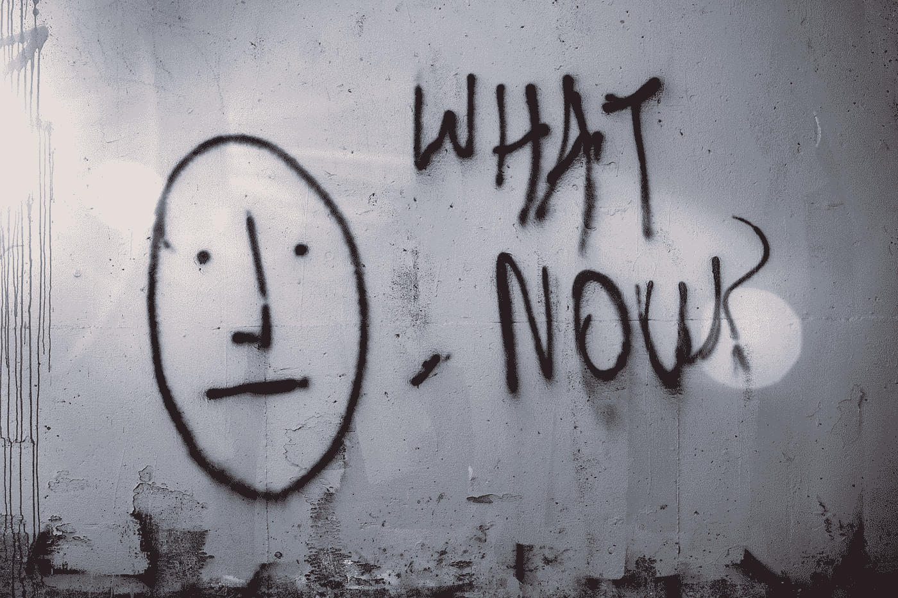
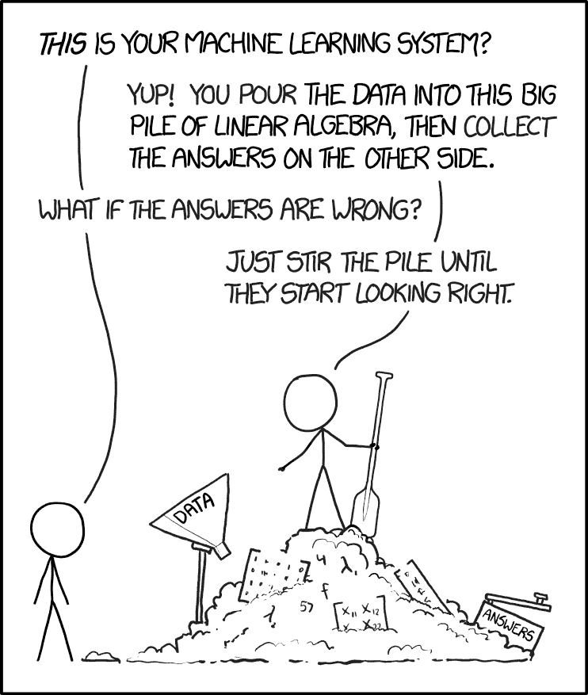
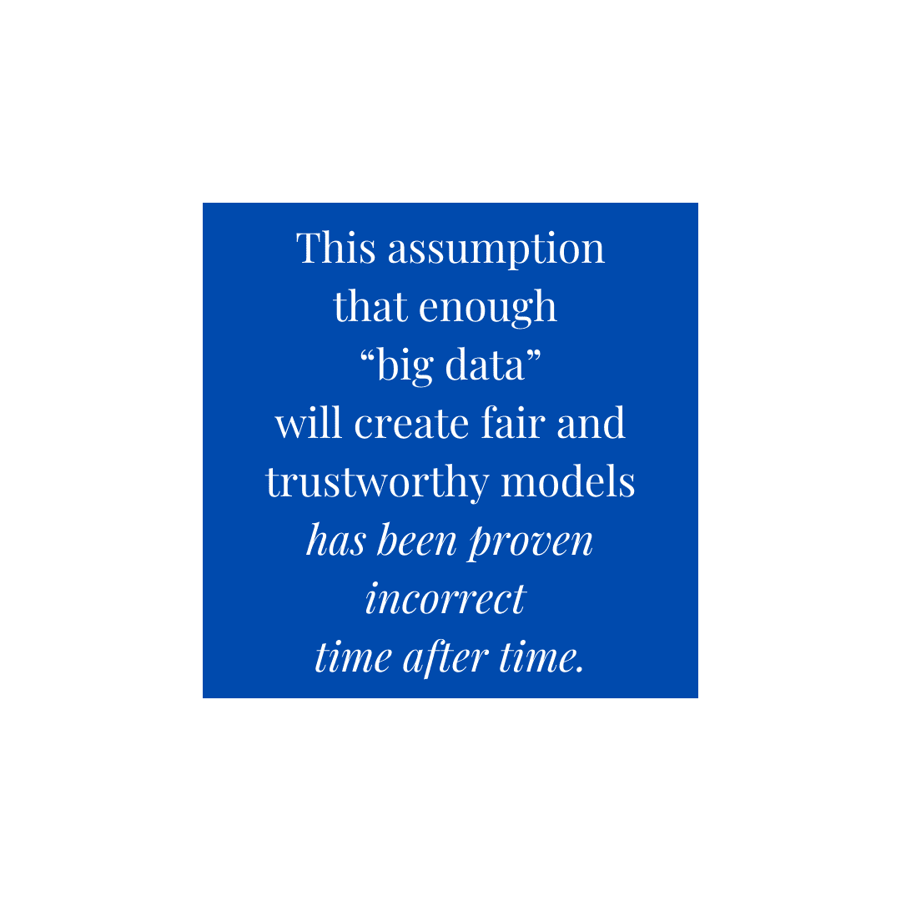

# 我的机器学习模型怎么变得不公平了？

> 原文：<https://towardsdatascience.com/how-did-my-machine-learning-model-become-unfair-c6508a795989?source=collection_archive---------24----------------------->

## [公平与偏见](https://towardsdatascience.com/tagged/fairness-and-bias)，值得信赖的 AI

## 你建立模型的初衷是好的。那么，为什么它表现出不公平呢？

由[蒂姆·莫斯霍尔德](https://unsplash.com/@timmossholder?utm_source=unsplash&utm_medium=referral&utm_content=creditCopyText)在 [Unsplash](https://unsplash.com/s/photos/question?utm_source=unsplash&utm_medium=referral&utm_content=creditCopyText) 上拍摄的照片

在本公平系列的[前一篇博文中，我们讨论了创建全面公平工作流以确保机器学习模型结果公平的三个关键点。它们是:](/what-does-it-mean-to-be-fair-measuring-and-understanding-fairness-4ab873245c4c)

*   **识别偏倚**(两个或更多组的不同结果)
*   **执行根本原因分析**以确定差异是否合理，以及
*   采用**有针对性的缓解策略**。

但是 ML 从业者大概是怀着最好的意图来建立他们的模型的。那么一个模型怎么可能一开始就变得不公平或有偏见呢？

其核心是，ML 模型可能存在两大类不公平，这是我们从 [Barocas & Selbst 2016](http://www.californialawreview.org/wp-content/uploads/2016/06/2Barocas-Selbst.pdf) 改编而来的:

1.  由于**观察到的模型性能差异**，模型可能会出现偏差。这是由于模型的训练程序或训练数据集中的不足(例如，缺乏数据)，模型在特定人群中表现出更多错误的时候。
2.  由于**未观察到的模型性能差异**，模型可能存在偏差。在这种情况下，该模型在一个比较的组上并没有明显“更差”,并且可能正确地匹配测试数据集中的基本事实标签，但仍然被认为是不公平的，因为它复制或放大了数据集中现有的偏差。

让我们更深入地研究一下每一个问题。

# 由于观察到的模型性能差异造成的不公平

在 AI/ML 环境中听到的一个常见格言是“垃圾进，垃圾出；也就是说，如果输入训练数据在任何方面有偏差或不正确，模型将反映这些偏差和不准确。然而有时，即使地面真实数据是可靠的，该模型在一组人群中可能比在另一组人群中更容易出错。

XKCD 的漫画。

例如，当研究人员分析商业面部识别系统的准确性时，他们发现与肤色较浅的男性相比，模型在女性和肤色较深的个体身上表现较差，这是因为模型的训练数据中缺乏肤色较深的女性。在这种情况下，训练数据本身并不是“不正确的”，而是表现出了**样本**或**代表性偏差**:它并没有反映出模型要操作的人群。该模型不恰当地将从肤色较浅的男性身上收集的数据推广到其他人身上，因此在人群的子群体上准确性较低。

这种认为足够多的“大数据”必然会创建公平可信的模型的假设已经被一次又一次地证明是不正确的。正如凯特·克劳福德所言，社交媒体是大规模数据分析的一个流行来源，但只有 16%的在线成年人甚至使用推特(Twitter)——因此，仅从推特数据中得出的结论，如声称人们在周四晚上最悲伤(T11)不一定是正确的。我们假设在一个群体中看到的趋势会延续到另一个群体。

图片作者。

为什么一个模型在一组人群中表现更差，从而被认为是不公平的另一个原因是**数据可用性**或**样本大小差异**问题。对于少数群体，输入要素的信息量可能较少，或者收集的信息不可靠。例如，波士顿市试图[从经过坑洞的司机那里收集智能手机数据](https://www.boston.gov/transportation/street-bump)以更快地解决道路问题——但通过依赖需要拥有智能手机的数据，该市意识到，老年人或不太富裕的居民区也不会被捕获。这些[“黑暗地带”或“阴影”](https://foreignpolicy.com/2013/05/10/think-again-big-data/)可能不足以代表甚至忽略关键人群。预测模型通常倾向于在训练数据中更好地表示的组，因为与这些预测关联的不确定性较少。

# 由于未观察到的模型性能差异造成的不公平

一个不公平的模型在一个子群体中的表现并不总是更差(例如，准确性更低)。事实上，如果数据集本身包含有偏见或不正确的标签，该模型可能被认为是完全准确的，但仍然是不公平的。

让我们举一个具体的例子来进一步说明这一点。自然语言模型通常在人类书写的文本的大型语料库上训练，例如新闻文章。然而，在大量谷歌新闻数据上训练的单词嵌入被发现是有偏见的，因为它们[延续了记者如何写男性和女性的性别刻板印象](https://arxiv.org/pdf/1607.06520.pdf)。这项研究背后的研究人员表明，嵌入与性别和特定职业密切相关——根据嵌入，“家庭主妇”和“护士”是非常女性化的职业，而“大师”和“老板”则更男性化。这种**历史偏差**，也被称为 [**负面遗产**](https://www.infoworld.com/article/3607748/3-kinds-of-bias-in-ai-models-and-how-we-can-address-them.html) ，当一个模型被训练在由于不公平的系统或结构而本身存在偏差的数据上时就会发生。

不仅仅是模型简单地复制了这些历史偏见。在特殊情况下，它们[会加剧它们](https://arxiv.org/abs/1812.08999)——这被称为**放大偏差。**现实世界中的一个例子是用于大学招生的[分数算法](https://www.cs.utexas.edu/users/ai-lab/downloadPublication.php?filename=http://www.cs.utexas.edu/users/nn/downloads/papers/waters.iaai13.pdf&pubid=127269)。该模型根据之前的录取数据进行训练，以确定哪些申请构成“良好匹配”然而，一旦模型投入生产，它只是过度适应先前的录取决定，而不是实际评估候选人的质量。如果这些决定被用于实践，它只会放大招生官员的现有偏见。

不仅仅是数据集的地面真实标签会有偏差；在模型开发生命周期的早期，错误的数据收集过程会破坏数据或使数据有偏差。这个问题被称为**测量偏差**。如果机器学习模型根据复杂管道生成的数据进行训练，就会出现这种情况。作为一个例子，我们可以使用 Yelp 的餐厅评论系统:Yelp 允许餐厅付费，以在 Yelp 平台上推广他们的餐厅，但这自然会影响有多少人看到给定餐厅的广告，从而影响谁选择在那里吃饭。通过这种方式，Yelp 的评论可能会不公平地偏向高收入社区的大型餐厅，因为 Yelp 的餐厅评论和推荐管道合并了。

在听到一个模型可能有各种各样的偏见时，一个自然的建议是限制它的访问:为什么不在不包含性别或种族等敏感属性的数据上训练模型？例如，[早期的预测性警务算法](https://www.technologyreview.com/2020/07/17/1005396/predictive-policing-algorithms-racist-dismantled-machine-learning-bias-criminal-justice/)在进行预测时无法获得种族数据，但这些模型严重依赖于与种族相关的地理数据(如邮政编码)。通过这种方式，对性别和种族等人口统计数据“视而不见”的模型仍然可以通过与受保护属性统计相关的其他特征来编码这些信息——这种现象被称为**代理偏差**。可能很难理清代理偏差，因为模型的输入特征通常是相互关联的，但仔细考虑数据来源并寻找偏差较小的替代数据来训练模型的从业者可以减轻其影响。

# 我如何修正一个不公平的模型？

一个善意的数据科学家有很多方法可以无意中训练出一个不公平的模型。但是有了正确的工具，就有可能理解并减轻这些偏见，这样你就可以在部署模型之前信任它。

在我们的下一篇文章中，我们将详细介绍一个公平的工作流程，数据科学家和验证者可以用它来理解、测量和调试他们模型中的偏差。

Russell Holz 对本文有贡献。