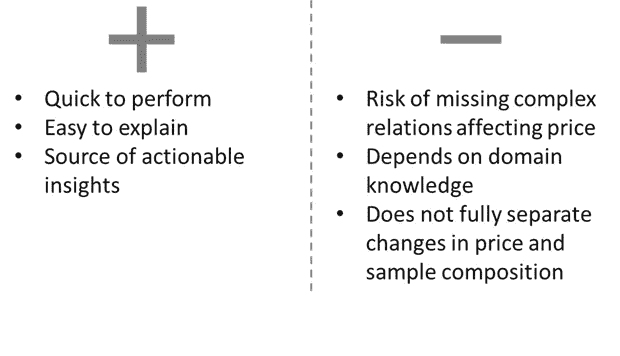
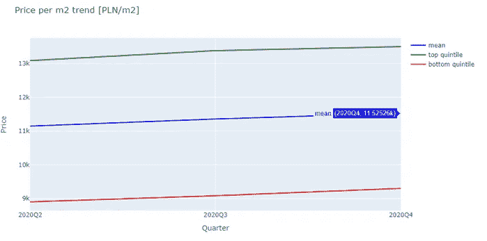
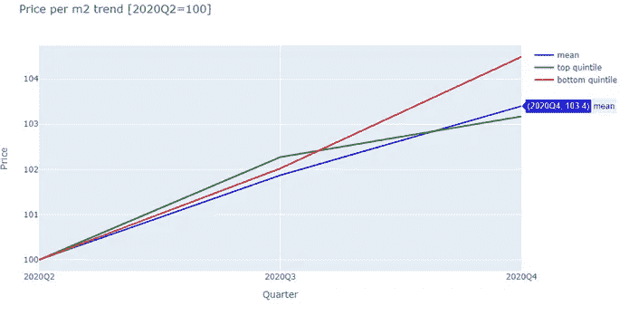
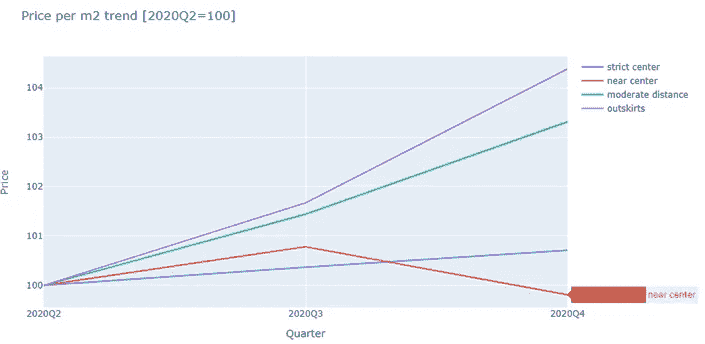
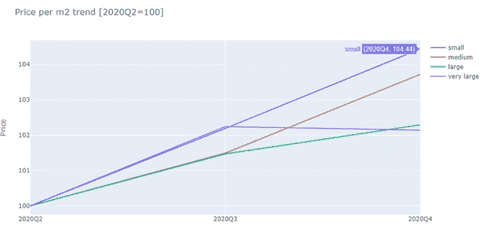
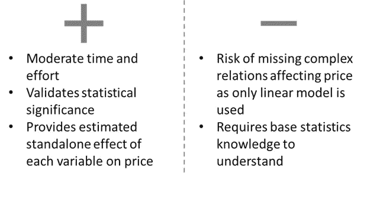
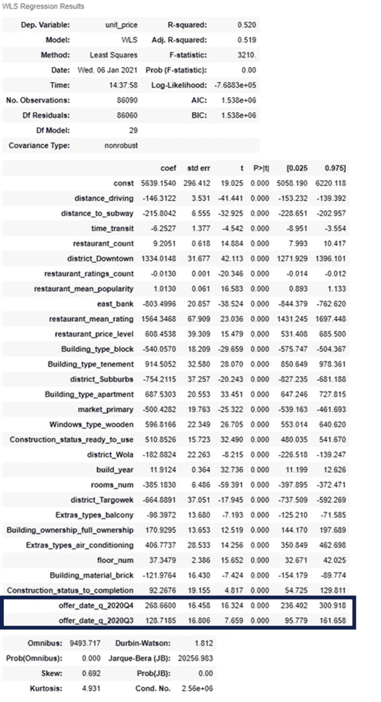
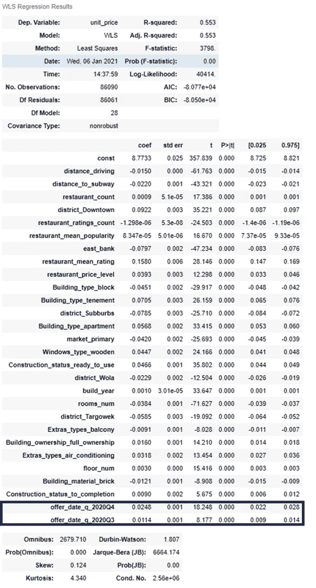

# 去年房地产价格如何变化？

> 原文：<https://towardsdatascience.com/how-did-the-real-estate-prices-change-last-year-38242f692722?source=collection_archive---------40----------------------->

## 用非面板数据分析商品价格演变的三种方法

照片由 Jason Dent 在 Unsplash 上拍摄

# 1.介绍

## 价格演变问题的不同方面

对于任何与分析相关的工作来说，分析任何商品的价格都是一项很常见的任务。回答“去年 x 的价格变化了多少”这个问题的难度很大程度上取决于我们所研究的商品的一致性和现有数据的特征。

如果我们想分析股票、黄金或石油等统一的商品，这项任务可能是微不足道的。如果我们能够访问样本组成在整个研究期间保持不变的面板数据，这是非常简单的，这种数据在研究受控群体或分析忠诚客户群的行为时很常见。

然而，许多现实生活中的分析并不适合使用上述任何数据类型，因为商品和数据样本都会随着时间而变化。

## 房地产价格——商品价格和特征的演变

房地产市场是这种挑战的一个很好的例子——如果我们每月收集数据，每个样本将只包含给定月份的有效报价。由于房地产是一种变化很大的商品，我们的分析需要回答价格演变问题的两个方面:

a)由于房地产定价的实际变化，价格变化了多少？

b)我们的数据样本的特征改变了多少？这种变化是如何影响价格演变的？

问题 A 是我们真正需要答案的地方，问题 B 是我们需要解决的依赖性，以便对定价问题的答案有信心。

我这篇文章的主要目标是展示解决这个问题的 3 种方法，以及它们的优缺点。

## 已用数据介绍

本文描述的所有分析都基于自 2020 年 4 月以来每月收集的近 20 万份华沙房地产报价数据集。个人报价数据与地理特征(如 Google Drive 和 Google Maps 数据)相结合，创建了 100 多个特征，详细描述了物业和位置特征，可用于精确的价格基准。

由于房地产价格通常变动非常缓慢(10%的年变化被认为是高的)，并且它们具有很大的惯性，尽管有更多的粒度数据，我还是决定使用一个季度作为分析的间隔。对于每个季度，如果报价存在超过一个月，则只选择每个单独资产的最新条目。

本文使用的所有代码以及交互式图表都可以在 [Github 获得。](https://nbviewer.jupyter.org/github/Jan-Majewski/Medium_articles/blob/3f9d221b297e492a992cd348229f88d6f2bc649f/03_Price_analysis/03_01_Price_trend_analysis.ipynb)

# 2.回答房地产价格演变问题的三种方法

完成这项任务的最佳方式取决于可用时间、可用数据和分析目标。我准备了 3 种方法，在这些参数之间达到不同的平衡:

*   **商业智能分析** —利用行业知识对数据进行细分，以部分缓解样本不一致的问题。用于获得关于价格演变和关键细分市场行为的可解释的见解
*   **统计测试**—建立一个简单的模型，例如线性回归，并用它来测试时间变量的显著性。通过在模型变量中包含关键特征来减轻样品的不均匀性。这允许在*其他条件不变* 的假设下分析价格演变，这意味着“所有其他因素不变或不变”。
*   **高级分析** —构建一个高级模型，如神经网络，以构建基于基线期数据的精确定价基准。由于该基准已经考虑到了房地产特征之间的复杂关系，我们可以使用它来分析基准期内最新数据的价格。比较基准期基准模型的实际价格和预测价格之间的差异，可以让我们获得价格演变的精确估计。

## 由于其复杂性，第三种方法将在本文[的](/analyzing-price-trends-with-advanced-analytics-benchmarking-model-1aa57928c1b8)中描述。

在这个排名中没有赢家，我根据问题使用以上所有的方法。它们是按复杂程度排序的，这意味着更复杂的模型将更耗时，(通常)更精确但更难解释，并且更需要数据。我将在专门的章节中详细描述每种方法的优缺点。

# **3。商业智能分析**

这种类型的分析可以单独使用，也可以作为更强大流程的 EDA 部分。其主要目标是快速找到价格演变的趋势，并根据关键特征比较其不同行为。

## 底层和顶层五分位数

我通常从一个简单的图表开始分析平均值、顶部和底部五分位数的演变，看看价格在整个范围内是否表现相似。我们可以看到，总体平均价格上涨了 379 波兰兹罗提/平方米。

由于我们对趋势比对绝对价格本身更感兴趣，可视化基线期的变化可能更有用。

将随后的每个时间段除以基线值可以让我们清楚地看到每个部分的相对变化。在上图的例子中，我们可以看到 20%的最低价格(最低的五分之一)比平均价格和最高的五分之一价格增长得更快。平均价格上涨了 3.4%

## 按关键特征细分:位置

为了限制我们趋势分析中的一个关键价格驱动因素:房地产位置的影响，我们可以使用它来细分我们的数据。这降低了总体平均价格受地点样本构成重大变化影响的风险。

例如，如果我们的样本规模较小，50%的 Q2 房产位于价格最低的郊区，但由于市中心的大型建筑完工，这一比例在第四季度将降至 20%，则整体平均水平将会高得多。

这并不能说明整体价格正在大幅上涨，因为价格上涨主要是由我们的样本特征在分析期间的变化引起的。

我们可以看到，选择细分功能是正确的，因为不同的细分市场有不同的价格趋势。在过去的两个季度中，距离市中心 5 公里以上(中等距离和郊区)的价格上涨了 3%以上，而严格的市中心和近中心部分仍然停滞不前。

这种趋势可能与疫情和封锁对我们日常生活的影响有关。随着远程工作变得越来越受欢迎，人们可能更愿意住在离市中心更远的地方，这使得这些地区的价格上涨。

## 按关键特征细分:资产规模

根据房产大小对我们的数据进行细分，也显示了这些细分市场的价格趋势的变化，尽管不如位置示例中的变化显著。中小型公寓的价格增长速度几乎是大型公寓的两倍。

## 方法概述

这种方法的最大优势在于其清晰性——快速呈现不同细分市场的平均价格变动易于解释，并且不需要复杂的假设。

如果数据样本在评估期之间变化很大或规模不足，这种简单性也会产生误导结果的风险。业务知识的应用和有效的细分可以部分减轻这种风险，但是如果我们在多个特征之间有复杂的关系，这就变得困难了。

# 4.统计检验

我们可以利用统计数据使我们的分析更加稳健，并避免在不同时期改变样本构成的缺陷。使用 statsmodels 库中的简单回归模型，我们可以详细分析结果。

由于这种方法在*其他条件不变*的原则下运作，我们的模型估计了每个特征对预测变量
y 的独立影响——在我们的情况下是每平方米的价格。只要可用特征和 y 之间的关系足够简单，可以用线性回归来预测，这就减轻了样本构成对分析周期之间价格变化的影响。

## 基础模型

在第一次尝试中，我选择了使用 SelectKBest 函数选择的 30 个热门功能，并为第三季度和第四季度的数据添加了一个热门功能，以将每平方米价格建模为 y。

首先，我们需要检查我们的模型是否能够根据提供的特征预测 y。值得检查我们的 R 平方。如果 R2 值非常低(<0.1) the relations between variables and y are too complex or too weak to make linear regression work. If the R2 value is close to 1 there is a risk that you omitted the constant which also makes gaining any insights in the following steps impossible. Once we are happy that the model is working at least moderately well we can proceed to examine its features.

The ability to analyze feature significance is a substantial advantage of the statistics-based approach. Examining if the p-value is below our chosen alpha allows us to determine if the given feature has any significant effect on our model or is actually only adding noise.

As I have chosen the standard 0.05 for alpha, all the p-values are significantly below, which means I can analyze their coefficients with some confidence that they are close to their actual effect on the price.

With this approach, we can see that the coefficient for “offer_date_q_2020Q4” is 269, which can be interpreted as the increase of price per m2 for Q4 compared to Q2 under the assumption of ‘all other things being unchanged or constant’. We can already see the change is 30% lower than the 379 PLN/m2 change in the overall average, which suggests that part of the price increase is caused by other factors in sample composition such increase in apartments quality.

## Log model

We can expand further on this approach by modeling log(y) instead of y itself. The logic behind this approach shifts from trying to predict the absolute effect of each feature on y to trying to predict by how much % y will change in relation to each feature. This approach quite often provides better results, especially while working with skewed data such as prices. It also makes interpretation of coefficients translate into % changes in y instead of the absolute values.

It is important to remember that changing the explained variable from y to log(y), makes both models uncomparable in terms of model statistics such as AIC or Log-Likelihood or R-squared.

At this stage, it is hard to compare, which model works better. The main reason for the application of this type of model was the ability to interpret coefficients as relative changes to the price.

We can interpret the “offer_date_q_2020Q4” coefficient of 0.0248 as a standalone increase of price between Q2 and Q4 by around 2.5%.

Analyzing different coefficients can also provide interesting insights — as an example east_bank coefficient of -0.079 means that buildings on the East Bank of Vistula River have prices nearly 8% lower than exactly the same properties on the West Bank. Under the *其他条件不变*原则,“完全相同”意味着除 east_bank 之外的所有特征都不变，这也包括根据其他地理特征的位置，例如到中心的距离。

# 5.摘要

如果你花了将近 10 分钟阅读这篇文章，你应该得到一些关于标题问题的可靠答案。我希望我能够证明，分析一种非统一商品的价格趋势，可能比乍看起来要复杂得多。另一方面，通过这篇文章我们设法收集了足够的证据，所以答案如下:

我们有足够的统计证据来支持我们的假设，即在所分析的三个季度中，价格会上涨。此外，与时间变量本身相关的价格上涨估计为 270 波兰兹罗提/平方米或 2.5%。

由于华沙房地产市场已经经历了十多年的快速价格上涨，一些人预计由于疫情的原因趋势会发生变化，价格的持续上涨可能会令人惊讶。另一方面，如果我们考虑到波兰在 2020 年的通胀率是欧盟最高的，接近 4%(根据欧盟统计局的数据)，那么 5%的年化房价增长就是相对的价格停滞。

将统计测试的结果与普通平均价格的变化进行比较，我们可以看到，大约 30%的价格上涨与市场上可获得的物业的特征变化有关——第四季度市场上物业的整体质量略好于 Q2。更好的质量可能与位置、市场类型、楼龄或任何其他价格驱动因素有关。

我将在下一篇[文章](/analyzing-price-trends-with-advanced-analytics-benchmarking-model-1aa57928c1b8)中使用高级分析来跟进这一分析，在文章中，我们可以调查增加的复杂性是否会提供不同的答案，并试验高级模型的更好灵活性是否能让我们获得对定价趋势的更多见解。