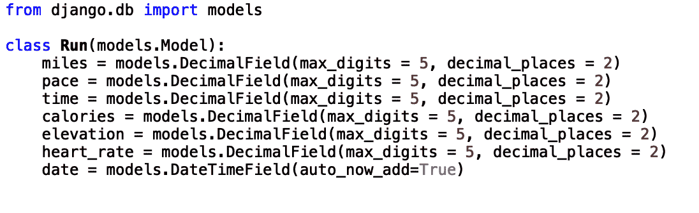

# Django 如何快速开发可维护的 Web 应用程序

> 原文：<https://towardsdatascience.com/how-django-enables-rapid-development-of-maintainable-web-applications-f58e36db5b74?source=collection_archive---------42----------------------->

## 了解 Django Web 框架

凯文·Ku 在 T2 拍摄的照片

***本帖原载于*** [***内置博客***](https://builtin.com/software-engineering-perspectives/) ***。原片可以在这里找到***<https://builtin.com/software-engineering-perspectives/django-overview-introduction>****。****

*Django 是 Python 中的一个高级 web 框架，它允许用户用最少的代码轻松快速地构建 web 应用程序。Django 框架遵循模型-视图-控制器(MVC)设计模式。这种设置简化了复杂的数据库驱动的 web 应用程序的开发。通过这些设计模式，Django 强调了组件的可重用性。它还遵循不重复自己(DRY)原则，通过抽象和数据标准化来避免冗余代码，从而减少软件中的重复。*

*Django 可用于各种 web 应用程序，包括客户关系管理系统(CRMs)、社交媒体应用程序、在线市场、按需交付应用程序等等。许多熟悉的网络应用程序目前都使用 Django，包括 Instagram、Dropbox、Spotify 和 Mozilla 等。根据 MVC 设计模式的广泛使用，您可能会怀疑它能够在 web 应用程序中实现快速开发、可伸缩性和安全性。*

***模型-视图-控制器***

*MVC 是设计 web 应用程序的一种流行的软件设计模式。它使用三个相互连接的组件将信息的内部表示与信息向用户显示的方式分开。*

**型号**

*第一个元素，模型，是 MVC 设计模式的主要组成部分。它充当 web 应用程序的动态数据结构，并且独立于用户界面。该模型还负责管理数据以及 web 应用程序的逻辑。在实践中，这种结构对应于 web 应用程序如何处理原始数据以及应用程序的基本组件。例如，如果您要创建一个跟踪您跑步的应用程序，模型类将定义一个“Run”类，该类具有相应的类属性，如英里、速度、时间、卡路里、海拔、心率和日期。*

*在 Django 的上下文中，模型是一个 Python 类，其中每个属性代表一个数据库字段。在我们的示例中，英里、速度、时间、卡路里、海拔、心率和日期属性都是数据库中的字段，模型类将定义这些字段并与之交互。Django 中运行类的结构如下所示:*

**

*“运行”类是运行细节的抽象。这很有用，因为它将运行的细节提取到一个与用户最相关的列表中。跑步的详尽描述可能包括与用户无关的信息。例如，除了以英里为单位报告跑步距离之外，距离还可以以英尺、公里和码为单位报告。这些附加信息对用户来说并不重要。该类允许您仅根据基本属性来简化跑步，如英里数、配速、时间、卡路里、海拔、心率和日期属性。*

*模型元素还允许您规范化数据，这有助于防止冗余和异常。冗余是指数据库在不同的位置保存相同的信息。由于模型元素被很好地定义，它们防止数据被复制并保存在多个地方。例如，如果地址字段出现在多个位置，则需要在每个位置对地址进行任何更新。这使得数据库容易出错，并可能导致不可靠/无意义的信息。数据规范化还有助于防止几种类型的异常。例如，它可以防止插入异常，即由于缺少其他数据而无法插入数据。它还可以防止删除异常，即由于删除其他数据而导致的数据意外丢失。*

*此外，Django 中的模型元素专注于使 web 组件简单和松散耦合。应用程序中的松散耦合意味着它的各个部分并不强烈地相互依赖。web 组件的松散耦合简化了开发人员的生活，因为他们可以轻松地添加新功能、更新现有功能和修复错误，而不必重写大量代码。这导致更快的软件更新和更好的用户体验。*

**视图**

*视图代码由所有与用户直接接触的功能组成。这些功能负责让事物看起来更好(UI)，并决定用户与应用程序交互的方式(UX)。视图允许您指定您希望每个页面的外观。在我们的 run 应用程序中，您可以指定一致或特定的元素，如背景颜色、文本字体、导航栏和每个页面的页脚。*

**控制器**

*控制器代码将模型连接到视图。在实践中，这归结为在视图级别获取用户输入，并在模型中决定如何处理它。在 run app 示例中，控制器将从视图级别的用户输入中获取原始数据，并使用“run”模型类来构建运行的内容。鉴于此，控制器处理视图中的显示顺序，并使用新数据更新模型数据库。*

***可扩展性***

*在当前的技术环境下，构建 web 应用程序时，您必须考虑可伸缩性。虽然一个新应用的用户数量可能开始很少，但开发者应该为增长做好适当的准备。随着用户群的增长，活跃访问者和服务器请求的数量也在增长。 [Django 使扩展变得容易](https://coderbook.com/@marcus/how-scalable-are-websites-built-in-django-framework/)，因为它允许你逐步增加你的用户群。它具有松散耦合的组件，这使得调试瓶颈变得容易。例如，使用 SQLite3 数据库，而不是 MySQL 或 Postgres 数据库，这是一个非常常见的问题。幸运的是，Django 允许您轻松地将数据从 SQLite3 数据库迁移到更强大的数据库，比如 MySQL 或 Postgres，只需修改两到三行代码。要证明它在扩展方面的效用，只要看看使用它的公司名单就知道了，包括 Spotify、Instagram 和 YouTube。*

*Django 特别支持水平扩展，这包括产生多台机器来服务请求总数中的一小部分。例如，如果您有 5，000 个请求，您可以在 10 台不同的机器上分别处理 500 个请求，而不是在一台机器上处理它们。Django 在这里很有用，因为它的特性允许您完全无状态地运行应用程序，这意味着服务器不会存储来自一个会话的信息供将来在另一个会话中使用。*

*无状态允许您扩展应用程序，降低 REST APIs 的复杂性，并轻松缓存请求的结果。在 Django 中，可以通过修改来启用无状态，将数据存储在远程数据库上，而不是存储在默认数据库上。这里的关键是 Django 使得在许多远程机器上运行应用程序变得简单明了，允许应用程序无状态运行。这是因为每个新会话独立于来自过去会话的客户端数据，这消除了可能出现的任何状态相关问题。由于这些特性，用 Django 构建的应用程序可以无缝地从 500 个用户扩展到 500，000 个用户。*

***安全***

*Django 的另一个吸引人的地方是它有许多免费的内置安全特性。*

*Django 提供的一种保护是防止跨站点脚本(XSS)，从而保护用户的浏览器。Django 还可以防止跨站请求伪造(CSRF)，这可以防止攻击者在另一个用户不知情或未同意的情况下使用该用户的凭证执行操作。最后，Django 可以防范 SQL 注入，防止未经授权的数据删除或数据泄露。与其他流行的框架相比，Django 有更多的内置保护。例如，Flask 是另一个流行的 web 框架，它依赖第三方软件来提供相同的保护。这给软件开发团队带来了更大的压力，他们需要通过确保第三方软件是最新的来监控安全性。由于 Django 提供了大部分免费的内置保护，因此在应用程序的生命周期内，更容易预先保护您的应用程序并监控安全性。如果你有兴趣进一步阅读，可以阅读 Django 关于安全性的文档，Django 中的 [Security。](https://docs.djangoproject.com/en/3.1/topics/security/#clickjacking-protection)*

***Instagram***

*现在我们已经看到了 Django 的一些好处，让我们看看它在实践中应用的一个具体实例。Instagram 的用户体验和服务质量很大程度上是因为它的许多核心功能都是用 Django 编写的。例如，Instagram 使用 Django 应用程序 Sentry 进行错误报告。这使得 Instagram 开发者可以诊断 bug，修改代码，优化应用组件的性能。Instagram 也是建立在 Django 工具 Dynostats 之上的，该工具也允许您监控应用程序组件的效率。使用 Dynostats，开发人员可以监控用户请求、应用程序响应、应用程序延迟等。这使得开发人员可以轻松地确定应用程序变慢的原因，从而更快地找到解决方案。*

***结论***

*通过遵循 MVP 设计原则，Django 框架实现了 web 应用程序的快速开发、可伸缩性和安全性。Django 中模型的模块化架构使得更新/维护 web 应用程序的特定组件变得很容易，同时安全地保持其他组件不变。Django 不仅允许公司为他们的应用程序快速开发 web 组件，还允许公司对不断增加的复杂代码进行小的修改。此外，Django 防止了大多数常见的安全漏洞，从而节省了额外的开发时间。总而言之，Django 是一个非常棒的 web 框架，它通过 MVP 设计实现了快速开发，确保了安全性，并支持可伸缩性，从而消除了构建 web 应用程序的许多麻烦。*