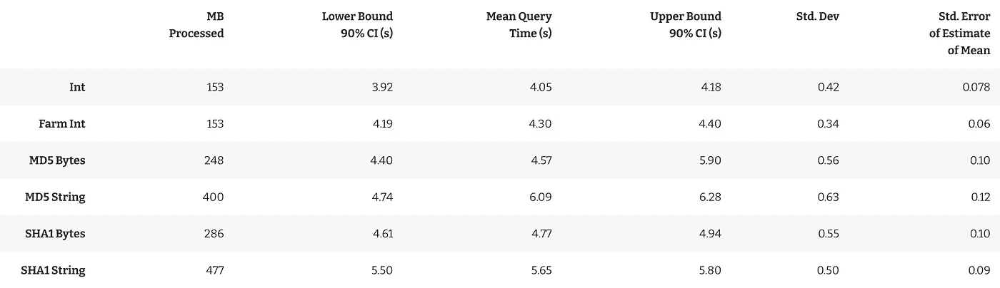
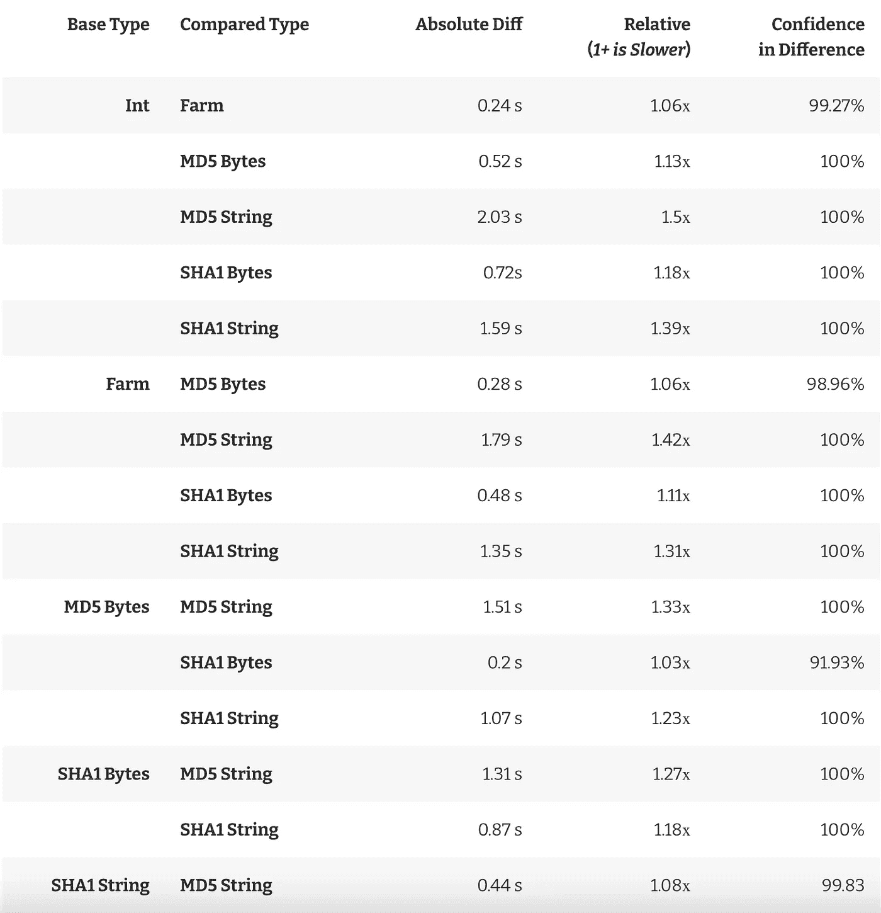
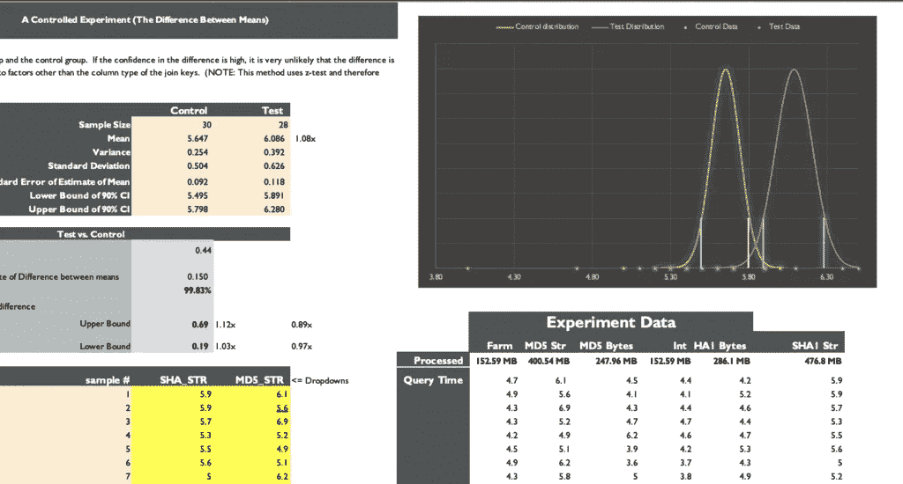

# 列类型如何影响数据仓库中的连接速度？

> 原文：<https://towardsdatascience.com/how-do-column-types-effect-join-speeds-in-data-warehouses-5ddd1933211e?source=collection_archive---------20----------------------->

## 数据工程

## 受控实验

当我第一次在 [Georgian](https://georgian.io/) 开始构建数据仓库时，我无法决定使用什么列数据类型作为我的表的主键。

我听说整数连接大大优于字符串连接，我担心随着数据的增长，连接性能会下降。

在操作世界的 SQL 数据库中，这个决定基本上是由开箱即用的自动递增的**整数**主键为您做出的。

然而，在数据仓库世界中，无论您是构建 Kimball、Data Vault 还是其他什么，您都需要明确地做出这个选择。

你可以生成一个**整数**，一个 **UUID 字符串**，或者**散列**你的键到一个单独的列中，这[带来了很多好处](https://showmethedata.blog/generating-unique-keys-in-bigquery)。如果这还不够复杂的话，您的散列键可以存储为由**字节**组成的**字符串**，并且每个算法的输出长度可能不同。

这就带来了一个问题:

> 键的列类型如何影响数据仓库中连接的速度？

经过一番挖掘，我找到了一些事务数据库的基准，但这不是我想要的。从逻辑上讲，**整数** *一定要*比字符串和字节串快，因为一般要扫描的字节比较少。但是……差了多少！？

知道答案似乎非常重要，因为在数据仓库中，一个错误的选择可能会增加十亿倍。

我终于在好奇心的压力下屈服了，决定在 BigQuery 上运行一个基准来为自己回答这个问题。

# 试验设计

我决定生成 500 万行随机数，并在以下类型的键上测试连接它们(没有缓存):

下面是我用来生成我想要连接的表的代码:

```
/* GENERATE_ARRAY has a limit of 1M rows
   so I had to union a bunch of them together */

WITH
  keys_1 AS (SELECT * FROM UNNEST(GENERATE_ARRAY(1,1000000)) AS key),
  keys_2 AS (SELECT * FROM UNNEST(GENERATE_ARRAY(1000001,2000000)) AS key),
  keys_3 AS (SELECT * FROM UNNEST(GENERATE_ARRAY(2000001,3000000)) AS key),
  keys_4 AS (SELECT * FROM UNNEST(GENERATE_ARRAY(3000001,4000000)) AS key),
  keys_5 AS (SELECT * FROM UNNEST(GENERATE_ARRAY(4000001,5000000)) AS key),
  keys_union AS (
    SELECT key FROM keys_1 UNION ALL
    SELECT key FROM keys_2 UNION ALL
    SELECT key FROM keys_3 UNION ALL
    SELECT key FROM keys_4 UNION ALL
    SELECT key FROM keys_5
  ),
  keys_hashed AS (
    SELECT
      key,
      MD5(CAST(key AS STRING)) as key_md5_bytes,
      TO_HEX(MD5(CAST(key AS STRING))) as key_md5_str,
      FARM_FINGERPRINT(CAST(key AS STRING)) AS key_farm,
      SHA1(CAST(key AS STRING)) AS key_sha_bytes,
      TO_HEX(SHA1(CAST(key AS STRING))) AS key_sha_str
     FROM keys_union
  )
  SELECT *, rand() AS val FROM keys_hashed
```

下面是我用来测试 make join 的代码:

```
SELECT
  t1.val, t2.val
FROM bq_benchmark.t1
JOIN bq_benchmark.t2
USING(<key column here>);
```

我对每种键类型运行了 30 次交互式连接查询，这样我就可以使用 Z 测试来测试平均查询次数之间的差异，并获得可靠的置信区间。

# 实验结果

在解释结果时，您可能会发现一些有用的定义:

**下限 90%置信区间:**真实的平均查询时间有 5%的概率低于这个数字。

**上限 90%置信区间:**真实的平均查询时间有 5%的概率比这个数字高。

**标准偏差:**衡量我们在样本中观察到的平均查询时间的偏差程度。

**均值估计的标准误差:**真实的平均查询时间与样本的估计平均查询时间的偏差。



每种列类型的查询次数统计

您可能也对上述数据的对比视图感兴趣。为了简单起见，我将只比较平均查询时间的差异，并忽略差异的置信区间(我在下面的 excel 下载中提供了该置信区间)。



平均查询时间的相对比较

# 结论

这是我从这个实验中得到的一切。

1.  整数比字节快大约 1.2 倍的 T4，比字符串快大约 1.4 倍的 T6。
2.  如果您可以访问 FARM_FINGERPRINT，并且您只使用 BigQuery，那么继续使用它(您可以在以后切换它)
3.  否则，简单地使用 MD5 作为你的散列函数**存储为字节。**
4.  如果你选择使用字符串，不要像我一样使用十六进制编码。Base64 编码将产生更小的字符串，因此查询时间比这更快(但不如原始字节快)

我已经把我的整个实验做成了 Excel 表格供你下载。我已经让它简单易用了。您可以随意向其中添加自己的数据，并在您选择的数据仓库上进行实验！

## [点击此处下载 Excel 表格](https://showmethedata.blog/wp-content/uploads/2021/01/BQ-Join-Benchmarks.xlsx)



## 这篇文章最初发表在 [Show Me The Data](https://showmethedata.blog/how-do-column-types-effect-join-speeds-in-data-warehouses?utm_source=medium&utm_campaign=post) 博客上，并被重新格式化为 Medium 格式。