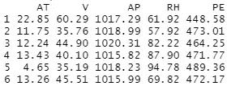
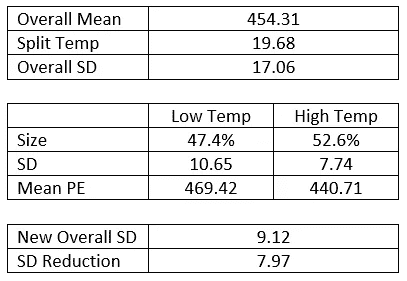
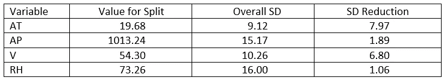
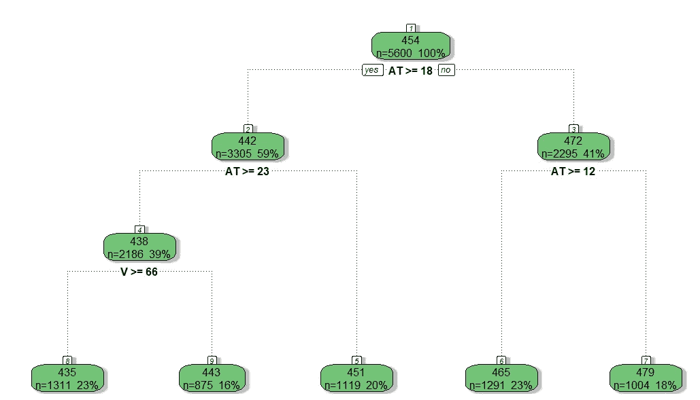
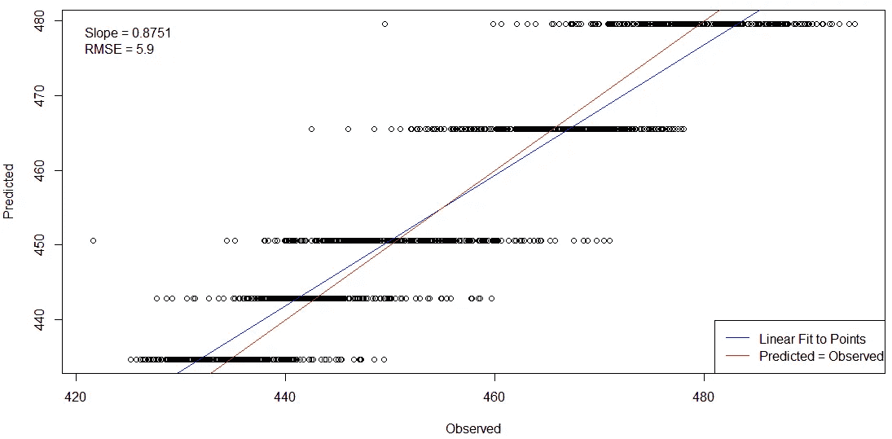

# 决策树和随机森林是如何工作的？1b

> 原文：<https://towardsdatascience.com/how-do-decision-trees-and-random-forests-work-15cc2a925788?source=collection_archive---------27----------------------->

## 回归树

杰里米·毕晓普在 [Unsplash](https://unsplash.com/s/photos/tree?utm_source=unsplash&utm_medium=referral&utm_content=creditCopyText) 上的照片

在本系列的[第 1 部分](/how-do-decision-trees-and-random-forests-work-66a1094e6c5d)中，我谈到了决策树是如何工作的。(如果你还没看过那篇文章，我建议你回去读一读再继续。去吧。我会等的。)那篇文章主要集中在分类上，例如是/否、活/死等。好吧，决策树也可以用于回归——例如，预测一个连续变量。决策树的许多方面都是相同的，但是预测答案的方式略有不同。

对于这篇文章，我将使用来自 [Dockship.io 挑战赛](https://dockship.io/challenges/5fa1f40ac2a4984b34ef0a66/power-plant-energy-prediction-ai-challenge/overview)的数据集:发电厂能源预测人工智能挑战赛。这项挑战使用四个输入变量来预测发电厂的能量输出(PE)。以下是数据集中的前六条记录:

作者截图

在哪里，

*   AT =环境温度
*   AP =环境压力
*   V =排气速度
*   RH =相对湿度

回归树所做的是对某一组条件取平均值，并将其用作预测。整个数据集的 PE 平均值是 454.31，所以这是对根节点的预测。

如果您还记得第 1 部分，在分类树中，熵用于决定如何将数据分成不同的分支。熵本质上是无序或不确定性的度量。对于连续变量，我们可以使用标准差(SD)来达到同样的目的。然后我们想尽可能地降低整体标准差。我们数据集的标准偏差是 17.06。计算总体标准差的方式与我们之前计算总体熵的方式非常相似——它只是一个加权平均值。将分数百分比和每个分数的标准偏差的乘积相加。

所以，让我们从温度开始，从平均温度 19.68 开始。如果我们观察功率输出的平均值和标准差，我们得到:

作者截图

在这里，我们看到标准偏差通过这种简单的分割大大降低了(从 17.06 到 9.12)。如果 AT 小于 19.68，这个极其简单的模型将预测 469.42 的功率输出，如果 AT 为 19.68 或更大，将预测 440.71 的功率输出。

如果我们用其他三个输入变量的平均值做同样的事情，我们得到:

作者截图

由此，我们看到平均温度为我们提供了最佳的 SD 降低。当然，正如我们在第 1 部分中看到的，我们不必(也不应该)满足于此。例如，如果我们以中位数(20.32)而不是平均值分割温度，我们得到的总标准差为 9.22，减少了 7.84。所以平均温度是一个比中位数更好的分割值。该算法将为每个变量尝试不同的分割值，以获得可能的最佳 SD 减少。

一旦我们有了第一次拆分，我们可以尝试进一步拆分前两个组。然后这些可以被分割，等等。这是从 R 的 rpart()函数得到的树，带有标准参数。(注意:只有整个数据集的 70%被用作创建此决策树的训练集。)

作者截图

如您所见，在这个决策树中，只有两个变量是有用的。如果我用这个作为预测模型，你会发现它非常粗糙。毕竟只有五个叶节点，你的预测只能得到五种可能的答案。

作者截图

这是回归树模型的一个局限性。它处理平均值。一个相关的限制是 ***它不能外推训练数据之外的*** 。毕竟你不可能得到一个小于最低值或者大于最大值的平均值。

虽然我们对后者的限制无能为力，但我们*可以*避开前者。如果我们可以创建许多略有不同的决策树，我们可以得到许多不同的可能叶节点，以及许多不同的可能答案。如果我们可以将所有不同树的结果平均，我们可以得到更好的预测能力。这就是随机森林的用武之地，这将是本系列下一部分的主题。

# 进一步阅读

</how-do-decision-trees-and-random-forests-work-66a1094e6c5d> [## 决策树和随机森林是如何工作的？

towardsdatascience.com](/how-do-decision-trees-and-random-forests-work-66a1094e6c5d)   </use-rattle-to-help-you-learn-r-d495c0cc517f> 