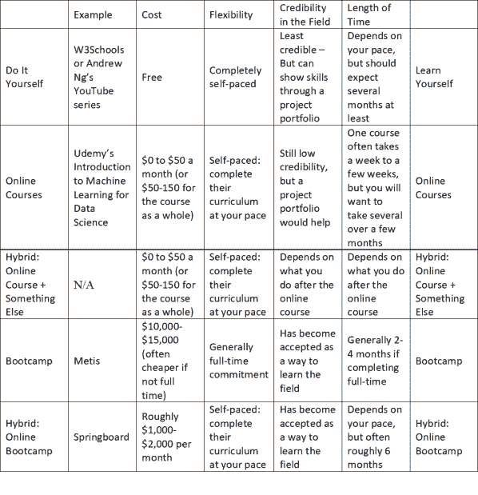

# 我如何成为一名数据科学家？学习数据科学的四个基本策略

> 原文：<https://towardsdatascience.com/how-do-i-become-a-data-scientist-the-four-basic-strategies-to-learn-data-science-64b64b6b20e7?source=collection_archive---------51----------------------->

图片来自 [geralt](https://pixabay.com/photos/woman-programming-glasses-reflect-3597101/)

有抱负的数据科学家会经常向我询问学习数据科学的最佳方法。他们应该尝试训练营或参加在线数据科学课程，或者其他无数的选择吗？

在过去的几年中，我们看到了许多不同类型的教授数据科学的教育计划的发展，从免费的在线教程到训练营到大学的高级学位，疫情似乎已经促进了更多计划的建立，以满足日益增长的远程学习需求。虽然总体来说可能是一件好事，但有更多的选择增加了决定选择哪一个的复杂性，也增加了推销其服务的程序的潜在噪音。

本文是对四种基本类型的数据科学教育计划的高级调查，旨在帮助您思考哪种计划最适合您。在不了解数据科学的情况下，很难评估一个项目在教授数据科学方面有多有效。希望这篇文章将有助于打破这个先有鸡还是先有蛋的难题。

这是学习数据科学的四种基本方法:

1.  自己动手学习
2.  在线课程
3.  训练营
4.  数据科学(或相关领域)硕士学位或其他大学学位

我将按从最便宜到最贵的顺序讨论它们。我还包括了两种混合策略，这两种策略结合了一些值得考虑的策略。下表提供了每一项的简要概要:

图片来自 [Anastase Maragos](https://unsplash.com/photos/OaFESrP2hhw)

# 选择 1:在网上自己动手

有大量免费的在线数据科学资源，可以从头开始教授数据科学，也可以解释您可能想知道的任何数据科学内容。这些内容包括为那些像 [W3Schools](https://www.w3schools.com/datascience/) 一样通过做来学习的人提供的教程，YouTube 和其他网站上为音频学习者提供的视频，如[吴恩达的 YouTube 系列](https://www.youtube.com/watch?v=PPLop4L2eGk&list=PLLssT5z_DsK-h9vYZkQkYNWcItqhlRJLN)，为喜欢阅读的视觉学习者提供的文章，如[走向数据科学](https://towardsdatascience.com/)。你可以上网自学。它的优点是自由和完全灵活，可以根据你的时间表量身定制。

但作为一名前教师，我发现自主学习并不适合每个人。你必须完全自我激励和自我组织才能这样自学。所以，了解你自己:你是那种能像这样完全独立地学好的人吗？

教育项目往往会提供这些资源，如果你单干，可能会缺乏这些资源:

1)课程监督:任何教育项目中的数据科学专家通常会为您建立某种数据科学课程，其中包括该领域的必要主题。许多数据科学新手还不知道哪些数据科学概念和技能是最需要学习的。这对自学者来说是一个先有鸡还是先有蛋的问题，自学者必须至少了解一点这个领域，才能知道首先要学习的最重要的内容。数据科学课程通过给你一个初始课程来帮助你避开这个问题。

2)领域规范的指导:除了教授材料，教育计划隐含地向学生介绍数据科学规范和思维方式。尽管有时会偏离既定的习惯，但当第一次与数据科学家同事一起在团队中工作时，这是很重要的。有时，自学者学习文字材料，但没有收集隐含的观点，使他们能够融入数据科学社区。

3)外部社会责任:教育项目提供了一种社会责任形式，潜移默化地鼓励你完成工作。自学者必须几乎完全依靠自己的自我激励和自我负责，以我的经验来看，这对一些人有效，但对另一些人无效。

4)社会资源:教育项目(尤其是面对面或虚拟会面的项目)提供了各种各样的人——老师、学生，在某些情况下还有学员/下属——可以与他们一起讨论问题，帮助你发现自己的弱点和缺点，并确定解决它们的方法。初学者很容易忽略的微小编程细节，但专家可能很容易发现，这可能会导致整个程序失败。要独立学习，你必须自己解决所有这些问题，或者找到愿意帮助你的数据科学朋友或家人。

5)技能认证:教育项目授予学位、等级和其他认证，作为你事实上拥有数据科学角色所需技能的外部证明。靠自己学习，你必须靠自己向雇主证明你有这些技能。开发一个发人深省的项目组合，你所做的就是证明这一点的最佳方式。

6)形成项目的指导:一个令人印象深刻的项目可以创造奇迹，展示你的数据科学技能。根据我的经验，数据科学的初学者通常还不具备创建、完成和营销一个发人深省但可行的项目的技能，而数据科学教育工作者最重要的角色之一就是帮助学生思考如何开发一个项目。一个人学习的时候一定要自己做到这一点。

人们可以克服这些缺陷。我发现，对于独立学习的人来说，它的成本和灵活性优势很容易超过这些缺点。因此，关键问题是，这种形式的独立学习对你有用吗？以我的经验来看，它对相对较少的人有效，但是对那些有效的人来说，它是一个很好的选择。

如果你决定自学，我建议你考虑以下几点:

1)在制作材料时，对你的学习风格要认真负责。例如，如果你是一个视觉学习者，那么阅读在线材料资源将是最好的，但如果你是一个听觉学习者，那么我会建议你在 YouTube 上观看视频教程/讲座。

2)如果您有愿意帮助您的数据科学朋友，他们可能是一笔巨大的财富，特别是在确定要学习哪些数据科学资料、解决您可能遇到的任何编码问题和/或开发一个好项目方面。

3)一般来说，人们通过学习数据科学来学习数据科学。避免只阅读数据科学的常见陷阱，而不亲自动手做实验(最好是不干净、令人讨厌、真实世界的数据，没有经过修整的“教科书般完美”的数据)。首先使用原始数据来学习概念是好的，但是要确保你能够用真实生活中的脏数据来练习。

图片来自[穆罕默德 _ 哈桑](https://pixabay.com/photos/training-course-3207841/)

# 选项 2:在线课程

网上课程有各种各样的 T2 形式。大部分都比较便宜(通常一个月 20-50 美元左右，或者每个课程 100-200 美元)。例如，在撰写本文时，Udemy 有一门[数据科学入门](https://www.udemy.com/course/machine-learning-for-data-science/)课程，统一收费 94.99 美元，Coursera [有一门课程](https://www.coursera.org/learn/machine-learning)每月收费 19.99 美元(两者的价格都因折扣和其他特殊交易而异)。在线课程通常是你能报名参加的课程中最便宜的，而且由于 most 的长度，你可能需要参加几个级别的课程(入门到高级)来学习这个领域。

另一个优点是他们很灵活:你可以根据你的时间表的需要，按照你自己的速度学习。这对那些一边工作一边学习的人来说真的很有价值，因为他们有家庭责任和/或其他义务使他们的时间表变得复杂。请记住，虽然，因为你经常每月支付，你需要几个月往往决定了最终的成本。说到底，多花 100 美元左右，再花几个月完成课程，仍然比其他课程选择便宜得多。

然而，另一方面，就像自己做一样，他们往往缺乏课堂学习的社会效益:教师提问并提供外部社会责任，同学们一起工作。以我的经验来看，这对一些学习者来说是一个很大的挑战，但是其他人相对来说不会受到它的影响。

此外，许多在线课程更多地提供了数据科学的粗略总结，缺乏学习数据科学和向他人推销自己所必需的复杂项目。即使有例外，在线课程通常擅长介绍数据科学概念，而不是深入探索。许多人专注于已经清理好的现成数据中的罐装问题，而不是让您在大多数数据科学家实际工作中必须使用的杂乱、复杂、通常只是简单而愚蠢的数据上练习。他们还经常缺乏一对一辅导的人员，通过复杂数据的投资组合建设项目来指导每个学生。

因此，在线课程往往会提供良好、经济高效的数据科学介绍，有助于了解您是否喜欢该领域(参见下面的混合#1)，但通常不会提供成为数据科学家所需的精细培训。现在，一些项目正在发展他们的课程。特别是随着疫情对远程学习需求的增加，在线学习平台正在开发更强大的在线数据科学课程。如果你选择通过参加在线课程来学习，我建议用你自己的项目来补充，以获得实践数据科学工作的经验，并在求职面试中展示。

图片来自 [Jukan Tateisi](https://unsplash.com/photos/bJhT_8nbUA0)

# 混合#1:使用在线课程介绍数据科学(或编程)

如果你对数据科学完全陌生，在线课程可以提供一个低成本的结构化空间，让你了解这个领域需要什么，并确定它是否适合你。我看到许多人参加了几千美元的训练营或大学学位课程，却发现他们不喜欢从事数据科学工作。在线课程是辨别这一点的一个更廉价的空间。

你总是可以自己免费探索数据科学，以决定你是否喜欢它(见选项 1)，而不是参加在线课程，但我发现许多以前从未见过数据科学的人不知道在该领域查找什么来开始。一门介绍性的在线课程并不昂贵，而且对主要话题领域的初步定位也是值得的。

这种方法有三种基本版本:

1)如果你还不知道编程语言，参加在线编程课程。我在本文的[中解释了为什么我会推荐 Python 作为学习的语言(Julia 紧随其后)。如果你不喜欢编程，那么你已经吸取了教训，你不应该成为一名数据科学家，即使你最终没有从事数据科学，编程也是一项非常有价值的技能，接受一些培训只会有助于你在大多数其他相关领域的职业前景。](https://ethno-data.com/the-best-machine-learning-programming-languages/)

2)如果你确实懂一门编程语言，那就去上一门数据科学入门课程。这些通常提供了数据科学的高级概述，对于需要与数据科学家一起工作并理解他们所谈论的内容的人来说尤其有用。如果你需要数学复习，这也是一个很好的选择。

3)我见过未来的数据科学家参加在线数据分析课程，为他们准备并确定他们对数据科学的潜在兴趣。然而，我不建议这样做。尽管数据科学家有时会将数据分析视为数据科学的“食谱”或“基础”版本，但数据分析是需要不同技能的不同领域。例如，数据分析课程通常不包括严格的编程。如果他们教编程的话，他们通常专注于 R 和 SQL，这些语言对于数据分析和统计来说是很好的语言，但对于数据科学来说还不够(对于数据科学来说，你可能需要像 [Python](https://ethno-data.com/the-best-machine-learning-programming-languages/) 这样的语言)。数据分析和数据科学通常也强调不同的数学领域:例如，数据分析往往依赖于统计学，而数据科学依赖于线性代数。因此，你在这些课程中学到的东西并不像你想象的那样适用于数据科学。现在，如果你不确定你是否想成为数据科学家或数据分析师，那么数据分析课程可能会帮助你了解和感受数据分析，但我不会用它们来评估数据科学是否适合你。

完成在线课程后，如果您仍然认为自己喜欢从事数据科学工作，那么您可以选择任何选项来更深入地学习该领域。这似乎只是让你回到起点，但通过参加一门介绍性的编程或数据科学课程，可以说你已经让自己变得更好，并且更准备好面对成为数据科学家的“老板之战”。

图片来自[heylogostechie](https://unsplash.com/photos/IgUR1iX0mqM)

# 选项 3:数据科学训练营

[数据科学训练营](https://www.coursereport.com/blog/best-data-science-bootcamps-the-complete-guide)也变得流行起来。他们往往是几个星期长(以我的经验，通常是 2 到 6 个月)的强化训练项目。传统的疫情前训练营是面对面的，通常花费大约 10，000 到 15，000 美元。[梅蒂斯人的训练营很好地展示了他们通常的样子。](https://www.thisismetis.com/bootcamps/online-data-science-bootcamp)

它们最大的优点是，与获得大学学位相比，它们能以更低的成本和更少的时间提供课堂教育的优势。与之前的选项相比，它们在成本方面有了显著提高(见下面的第 2 个选项)，但它们试图以低得多的价格和很少的时间提供与数据科学硕士学位相当的(但学术上不太先进和深入的)知识范围。尽管这经常会让他们的步伐感觉紧张，但好的训练营往往能成功做到这一点。这使得他们成为任何想成为数据科学家的人的绝佳选择。最后，与前面的选项不同，你会有一位老师向你提问并激励你，还有一群同学和你一起思考概念。最好的项目提供职业指导，并在数据科学社区建立强大的网络，以帮助他们的学生以后找到工作。

然而，它们有一些主要的缺点:

1)他们能感受到快节奏，在短时间内理解复杂的概念。我的许多参加过训练营的朋友都报告说感觉到了认知上的扭伤。预计那几周/几个月会是精神紧张的，会淹没你的生活。数据科学训练营通常是朝九晚五的全职工作，你可能会在晚上或周末精疲力尽，无法做其他事情(而且在某些情况下，你无论如何都要完成作业)。对于这样的考验来说，几周或几个月的时间并不算太长，但这让他们比之前的选择更不灵活。例如，这迫使许多学生从目前的工作中抽出时间来完成训练营，并在训练营期间尽可能多地限制他们的社会、家庭和其他义务。这使得那些无法从工作中抽出时间，忙于社交或家庭生活，或其他许多事情的人很难做到。

2)几千美元，显然比以前的选择要贵得多(但仍然比大学便宜得多)。一些学校根据需要提供奖学金和其他服务，但即使这样，不得不暂停工作的机会成本仍然很高。鉴于他们普遍的高薪，获得一份数据科学的工作可能会收回投资，但这需要大量的初始投资。

这使得它对于任何考虑数据科学但不确定是否想做的人来说都是一个非常糟糕的选择。10，000 美元对于简单地了解你不喜欢这个领域来说是一笔很大的开支，而且有许多更便宜的方法来初步探索这个领域(尤其参见混合#1)。然而，对于任何真正想成为数据科学家但还不具备关键技能和知识的人来说，这个成本可能还是值得的。

3)在写这篇文章的时候，新冠肺炎疫情已经迫使大多数数据科学训练营进行远程会面，使他们的服务更类似于便宜得多的在线课程。也就是说，许多人寻求虚拟模拟课堂环境，试图提供某种类型的社会环境，但课堂环境是一个主要优势，使他们比以前的选择显著增加的成本是值得的。

4)它们往往存在于大城市(尤其是科技中心)。例如，美国的训练营往往集中在纽约市、洛杉矶、芝加哥、旧金山等地。在疫情之前，任何不住在这些地方的人都必须旅行并临时居住在他们选择的训练营所在地，这是一笔额外的费用。

5)对于不了解编程的人和不了解大学水平的数学如线性代数、微积分和统计的人来说，它们通常很难。如果你不懂编程，我建议你先通过廉价的在线课程和/或在线教程来学习像 Python 这样的编程语言(更多信息请参见[我写的这篇文章](https://ethno-data.com/the-best-machine-learning-programming-languages/)解释了为什么要学习所有语言的 Python)。一些数据科学训练营提供预备入门在线课程，为那些不懂的人教授必要的编码和数学技能。它们也值得考虑，但是请记住，同等的在线课程在教育价值大致相同的情况下可能更便宜。

如果你决定参加训练营，在研究选择哪个训练营时，这些标准很重要:

1)项目导向:它们在多大程度上使您能够通过项目组合构建项目实践数据科学，以及它的校友所做的项目给人的印象如何？最好的数据科学训练营通常以面向项目的方式授课。

2)找工作资源和/或工作保障:他们给你什么资源或辅导，帮助你事后找工作？例如，帮助建立关系网、展示自己和面试是找到数据科学家工作的重要技能，除了教你技术课程，最好的项目往往会找到职业教练，专门帮助你寻找工作。此外，一些项目提供工作保证:如果你毕业后几个月没有找到数据科学的工作，他们会退还学费。这通常表明他们把找工作看得足够重要，以至于不惜自己的钱去冒险(尽管要检查保证书上的细则，看看他们同意的确切条款)。

3)校友资源:一个令人惊讶的重要细节是，训练营在培养校友网络方面投入了多少资源。我很惊讶地发现，我是多么容易接受与网上训练营的校友见面/建立关系网，而且校友们对训练营是多么的满意。训练营努力与校友一起工作并保持关系，这一点影响很大。在远程研究项目时，与明矾的联系可能很难评估，但询问你是否可以与明矾交谈以了解他们对该项目的体验，查看训练营明矾在 LinkedIn 和其他社交媒体网站上的活动，并询问他们促进了哪些与明矾的社交机会，这些都是评估项目对培养关系的有意程度的好方法。

4)奖学金选项:一些项目根据需要提供全额或至少部分奖学金。显然，降低训练营成本的方法会很好，特别是如果训练营对你来说似乎是一个理想的选择，但成本似乎太令人生畏。

图片来自[布鲁克·卡吉尔](https://unsplash.com/photos/WHWYBmtn3_0)

# 混合#2:在线训练营

在线训练营往往拥有在线课程的时间安排灵活性，但提供更严格的个人(尽管是远程)学习，允许您结合数据科学训练营和在线课程的最佳方面。它们通常也比传统训练营便宜(但也比在线课程贵)。最后，对于那些不住在碰巧有本地数据科学训练营项目的大城市的人来说，他们往往是更好的选择。如果说有什么不同的话，那就是疫情可能帮助产生了更多的在线训练营项目，因为它迫使数据科学训练营进行虚拟教学。

2017 年，我参加了[跳板的在线数据科学训练营](https://www.springboard.com/courses/data-science-career-track/)，这是在线训练营的一个很好的例子。当时，他们的费用大约是每月 1000 美元(在撰写本文时，他们的标准费用是每月 1490 美元，并表示他们的计划通常需要六个月)。这比传统的训练营便宜，但仍有一些为期六个月的总费用在 10，000 美元左右。他们有典型的在线课程，但也提供每周与讲师的虚拟会议，讨论材料和你遇到的任何问题。现在他们似乎包括网上虚拟课程。这种个性化培训和远程课堂环境是在线课程的主要附加值，你必须评估对你来说，这些额外的费用是否值得。它们是自定进度的，与典型的训练营相比，在工作时间和频率上提供了更大的灵活性。如果你在毕业后的六个月内没有找到工作，他们也会退还你的钱。

如果你选择这个选项，请注意在线课程和传统训练营的潜在陷阱。就像在线课程一样，你需要评估自己是否适合自学课程(即使你可以一周见一次主要问题的导师，你也要在一周内自学)。像传统的训练营一样，预计学习将是精神紧张的，并确保他们帮助你开发投资组合建设项目，并提供求职资源和培训。

图片来自 [A_Ginard](https://pixabay.com/photos/architecture-modern-buildings-5084075/)

# 选项 4:硕士学位或其他大学学位

最后的选择是回到学校去获得数据科学的学位。这是最昂贵和最耗时的选择:硕士学位(如果你已经有学士学位，这是一个合理的选择)通常是最短的，需要两年时间。但它们的价格超过 10 万美元。即使部分或全额奖学金降低了这一成本，在学校度过几年的机会成本仍然高于其他任何选择。然而，如果你知道如何恰当地利用它，它可以提升你的简历，这可能会增加你的工资，以弥补最初的成本。如果你已经知道自己热爱数据科学(比如说，因为你已经在这个领域工作过，最好是你也已经搞清楚了你想做的数据科学的具体领域)，但想把你的技能、技术和/或模型如何工作的理论知识提升到一个新的水平，我只会建议你去攻读硕士学位。

提高数据科学技能的最佳方式是学习数据科学:在实践数据科学时，寻找或创造推动你的环境。研究生院并不是提炼一个人的数据科学技能的唯一潜在环境(例如，如果做得好，所有之前的选择都可能涉及到这一点)，即使研究生院在提供严谨性方面很棒，这些其他选择也可能更便宜、更灵活。最后，在撰写本文时，至少对数据科学家的需求超过了该领域的实际人数，因此在没有数据科学“官方”大学学位的情况下获得数据科学工作是非常现实的。

大学数据科学学位课程相对较新，通常只有几年的历史。因此，并不是所有的大学都有真正的数据科学学位或系，而是要求你注册一个相关的项目，如计算机科学、统计学或工程学，以学习数据科学。这并不总是意味着这些其他项目不好或没有帮助，但这通常意味着为了完成学位，你将不得不执行与数据科学本身无关或半无关的任务(在某些情况下，来自其他领域的教员的帮助很少)。

在考虑一个项目时，你应该确保他们积极主动地教授专业知识，而不仅仅是学术数据科学技能。这些是我会研究的具体问题，以评估它们对你从事非学术数据科学工作的准备程度:

1)他们的教师中有多大比例的人目前在行业中担任或至少曾经担任过数据科学家(或其他类似的职位)？

2)该部门与当地组织的关系如何，他们是否能够利用这些关系来帮助你通过勤工俭学项目或项目期间的实习和/或之后的就业与这些组织合作？

3)他们会帮助你将论文转化为应用数据科学项目，或者至少给你一定的灵活性，让你的简历在未来的雇主面前大放异彩吗？

如果你选择的项目缺乏这些，我强烈建议你在完成项目的同时，建立简历/投资组合提升项目，并与当地的数据科学家建立联系。这需要相当多的时间和精力，所以理想情况下，你的部门会积极地帮助你完成这项工作，而不是要求你在完成他们所有工作的同时独立完成。

融资选择是另一个需要考虑的问题。他们愿意为你的学位提供全额资助还是至少部分资助？在获得硕士学位的同时工作的勤工俭学项目是一个很好的方式，可以让你毕业时没有债务，并获得建立简历的工作经验(尽管它们会让你很忙)。在完成硕士学位的同时，我作为一名数据科学家受益匪浅，不仅因为我毕业时没有负债，还因为这让我能够练习和完善我的技能。

最后，大多数大学要求你住在附近，并且亲自出席(至少在疫情之前，可能在之后)。因此，如果附近没有数据科学学位项目，你可能不得不在附近找一个地方，或者愿意搬迁几年。如果是这样的话，你应该把搬家费用算进项目的成本中。

# 结论

学习数据科学可能是一个可怕而令人生畏的前景，找到适合你的策略是复杂的，特别是考虑到所有的教学、后勤和财务因素。希望这篇文章能帮助你思考如何前进。

*此处原创发布:*【https://ethno-data.com/data-science-training-programs/】T2*。有关该网站和其他文章的更多信息，请访问*[*https://ethno-data.com/*](https://ethno-data.com/)*。*

*也感谢《数据科学》杂志发表这篇文章。关于他们工作的更多细节，见* [*本*](/about-towards-data-science-d691af11cc2f) *。*