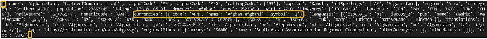

# 学习用 Python 提取嵌套字典数据

> 原文：<https://towardsdatascience.com/how-do-i-extract-nested-data-in-python-4e7bed37566a?source=collection_archive---------1----------------------->

## 辅导的

## 揭开 Python JSON、字典和列表的神秘面纱

JSON:字典和列表数据结构(类型)，作者图片。

> “生活就像洋葱，你只能一次剥开一层，有时还会流泪”――卡尔·桑德伯格

我想从嵌套的 JSON 结构中提取值也是如此。当处理由深度嵌套的数据结构混合组成的 JSON 对象时，即使是最熟练的程序员也会流泪。提取值的过程充其量只能说是混乱无序的。数据越多，越乱。

作者创建的课程

在本教程中，我将带您一步步地从任何 JSON 中提取您需要的值。**给你一个警告**:这个教程不是给 JSON、列表或字典的新手看的。如果你从未听说过列表索引或字典键值对，我建议你查阅一下**网站**或 **YouTube** 上的许多优秀教程。一旦你对这门课感觉更舒服了，再回来继续学习和成长。

# 家政

## JSON 与列表和字典

首先，当谈到术语“JSON”、“list”和“dictionary”时，我们必须做一些重要的整理工作。JSON 或 JavaScript Object Notation 是一种更广泛的格式，用于包含字典和列表结构，如下图所示。

JSON:列表和字典结构，作者图片。

[技术文档](https://www.json.org/json-en.html)称 JSON 对象建立在两种结构上:一个键值对列表和一个有序的值列表。在 **Python 编程**中，键值对是**字典**对象，有序列表是**列表**对象。实际上，提取嵌套数据的起点**是从字典或列表数据结构开始的。提取嵌套数据时，问题应该是:数据是嵌套在字典还是列表数据结构中？使用的数据结构组合是什么？使用的第一个数据结构是字典还是列表？**

> "长期以来，我的一条公理是，小事永远是最重要的。"——阿瑟·柯南·道尔爵士，

如果看起来我在术语上小题大做，那是因为我确实如此。当提取嵌套数据时，细节很重要。数据结构**变化**数据在 JSON 结构中嵌套得越深，知道这些区别就越重要**。最初的数据结构可能是一个列表，但在提取数据时会变成一个字典。从 JSON 对象中提取数据的关键是识别用于存储数据的混合数据结构。如果您**努力**识别 JSON 对象中的数据结构，很可能您会努力提取您想要的值。在大多数情况下，这会导致应用错误的**提取技术。****

**下表简要回顾了用于从 JSON 结构中提取数据的技术。**

****

**数据类型和提取方法，按作者分类的图像**

****在开始我们的例子之前，最后一点需要注意。在 Python 编程中，术语“数据结构”在描述列表和字典时很少使用。常用的术语是“数据类型”。在本教程中，我会交替使用数据类型和数据结构这两个术语。我使用术语数据结构，因为它传达了数据结构是 JSON 对象的基本构建块的思想。在 Python 中，术语“数据类型”的使用同样重要，但是它与理解嵌套数据提取的关键意义不同。****

# **真实世界数据**

## **我们开始吧**

**最好的学习方法之一是通过混合使用列表和字典数据结构来处理真实数据。在本教程中，我们将使用来自 [REST 国家 API](https://restcountries.eu/#api-endpoints-all) 的真实数据。这个 API 返回大约 250 条记录，混合了字典、列表和其他数据类型。我们的目标是从字典键值对`'code':'AFN'`中提取`'AFN’`值，如下图所示。`'AFN'`嵌套在两个列表结构和一个字典结构中。**

****

**其他国家 API 数据，按作者分类的图片**

## **示例代码**

**单击此[链接](https://www.borisj.com/courses/your-first-course)将允许您访问以下示例中的示例代码。该链接将带您进入我开发的关于学习提取嵌套 JSON 数据的课程。这门课程已经帮助数百名学生学会了提取嵌套数据。您不必购买课程来获取文件。文件名是 single_json.py 和 multiple_json.py。**

## **提取单个项目**

**在本例中，我们将从使用列表和字典提取技术的组合来提取数据开始，如上表所示。在下面的 Python 代码中，我首先提供了用于导入数据的**逻辑**、用于导出解决方案的**解决方案**以及用于导出解决方案的**工作流**。我建议遵循如下所示的所有步骤。Python 代码下面解释了工作流步骤。**

****Python 代码:****

****工作流程步骤:****

*   **`**Step 1: import requests**`:这一行为 Python 导入请求 HTTP 库。它是我们用来连接 Restful API 的库。如果您还没有安装它，您可以使用 **pip 安装请求**命令从命令提示符或虚拟环境安装它。**
*   **`**Step 2:** **url = 'https://restcountries.eu/rest/v2/all'**`这一行存储了 REST API 的网址。地址存储在`url`变量中。**
*   **`**Step 3: response = requests.get(url)**` **:** 该方法用于连接 Restful API[https://restcountries.eu/rest/v2/all](https://restcountries.eu/rest/v2/all)，提取数据。返回的数据存储在`response`变量中。在技术术语中，这被称为响应对象。**
*   **`**Step 4: storage = response.json()**`返回结果的一个 JSON 对象(如果结果是用 JSON 格式写的，如果不是就抛出一个错误)。把`.json()`想象成一种用来交换数据的存储格式。在这个实例中，我们将内容存储在`**storage**` 变量中。**
*   **`**Step 5: print(type(storage))**` **:** 返回用于存储数据的 Python 数据类型。在这种情况下，返回的数据类型将是一个列表(`<class 'list'>`)。回头看看我之前提供的表格，可以使用 list index [0，…]提取数据。您应该**始终**使用`type()`函数来确定数据类型。如果您知道数据类型，您就知道要使用的正确提取技术。**
*   **`**Step 6: print(len(storage))**` **:** 提供列表中的项目数。每个数字代表列表中某项的索引，该索引可用于提取值。**
*   **`**Step 7: print(storage[0])**`**:**0 代表列表中的第一项**，**用于从列表中提取该项。一旦项目被提取出来，一个新的数据类型就暴露出来了。步骤 8 中的`type()`函数用于显示数据类型。**
*   **`**Step 8: print(type(storage[0]))**` **:** 新的数据类型将是`<class 'dict’>`。字典意味着可以使用一个键提取数据。在我们的数据中，用于提取值的键是`currencies`。在步骤 9 中使用`currencies`键。取**注**，数据类型从第 5 步的`<class 'list'>`变为第 8 步的`<class 'dict'>`。**
*   **`**Step 9: storage[0]['currencies']**` : 字典中的`currencies`键用于输出`[{code:'AFN,'name':'Afgahn afghani','symbol':''}]`。一旦项目被提取，一个新的数据类型现在被暴露。步骤 10 中的`type()`函数用于显示数据类型。**
*   **`**Step 10: print(type(storage[0]['currencies']))**` **:** 新的数据类型将是`<class 'list'`。列表数据类型意味着我们使用索引操作符`[]`来提取下一组值。在这种情况下，索引值将为 0。所以我们在步骤 11 中使用它。注意，数据类型从步骤 8 中的`<class 'dict'>`变为步骤 10 中的`<class 'list'>`。**
*   **`**Step 11: print(storage[0]['currencies'][0])**`:指标`[0]`用于输出`{code:'AFN,'name':'Afgahn afghani','symbol':''}`。一旦项目被提取，一个新的数据类型**现在被暴露。步骤 12 中的`type()`函数用于显示数据类型。****
*   **`**Step 12: print(type(storage[0]['currencies'][0]))**`:新的数据类型为`<class 'dict'>`。字典意味着数据可以用一个键提取。在我们的数据中，用于提取值的键是`code`。在步骤 13 中使用`code`键**
*   **`**Step 13: print(type(storage[0]['currencies'][0]['code']))**`**:**`code`键用于输出`AFN`，这是我们希望输出的值。**

**所以，让我们总结一下**两个步骤**，重复这两个步骤直到我们得到我们想要提取的值。**第一步**是确定数据类型，而**第二步**是应用提取方法。如果数据类型是 list，那么使用带方括号的索引操作符。但是，如果数据类型是字典，请使用带花括号的字典键。**

## **提取多个项目**

**虽然从 JSON 结构中提取单个列表项是重要的第一步，但只提取单个值并不常见。在真实世界的数据中，JSON 对象中的值存储为集合。在下图中，`currencies`和`code`字典键和值在列表数据结构中有多个条目。我们在现实世界中的例子有 250 个这样的条目，所以我们在本节教程中的目标是提取这些和剩余的值。**

****

**其他国家 API 数据，按作者分类的图片**

**幸运的是，我们可以通过构建用于从 JSON 结构中提取单个值的工作流步骤来提取这些值。我就不再列举那些步骤了。由于列表和字典数据结构是可迭代的，我们可以使用一个`for loop`结构来遍历我们的值。所以，让我们在第 14 步把它添加到我们的代码中。我们还需要使用`range`和`len`函数来枚举列表中的条目数。Python 代码下面解释了工作流步骤。**

****Python 代码:****

****工作流程步骤:****

**`**Step 14:** for item in range(len(storage)):``storage`变量包含步骤 4 中返回的列表`<class 'list'>`。`len`功能用于统计列表中的项目数。`range`函数根据列表中项目的数量生成一个数字序列。每当`for loop`遍历`storage`列表时，该数字被传递给`item`变量。在第 48 行，步骤 14 中显示的`**print(storage[item]['currencies'][0]['code'])**`来自步骤 13。我们将它封装在`for loop`结构中，并将代码从`storage[0]`修改为`storage[item]`。`storage[0]`引用列表中的单个项目。然而，`storage[item]`在`storage`列表中捕获多个项目。每次`for loop`迭代时，`storage[item]`递增以捕获下一组值。**

# **结论**

**挖掘嵌套数据的过程有时会让人感到畏惧、迂回和恼怒。它不太适合介绍性的技术，比如彻底迭代`dict.items(), dict.keys(), dict.values() or list indexes[]`。不可避免的是，JSON 结构的复杂性要求在多个字典和列表提取技术之间交替使用来提取数据。掌握它需要一个可重复的过程，但更重要的是实践。我已经包括了几个附加的练习题和解答([点击这里](https://www.borisj.com/courses/your-first-course))。**

> **当你不练习的时候，有人在进步——阿伦·艾弗森**

**祝你好运。**