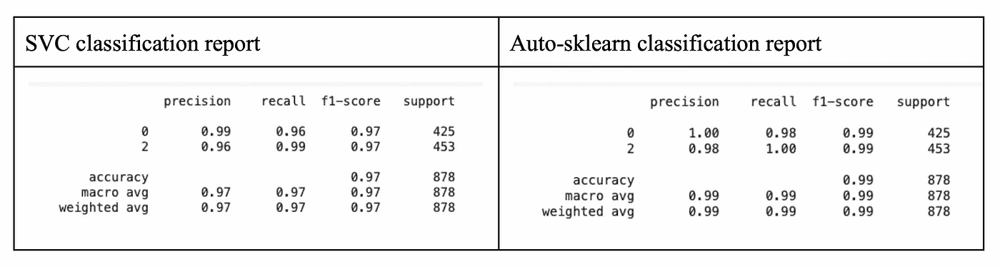
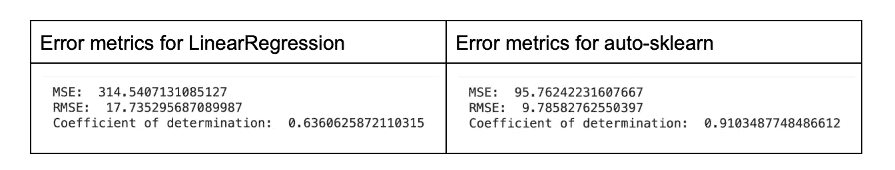
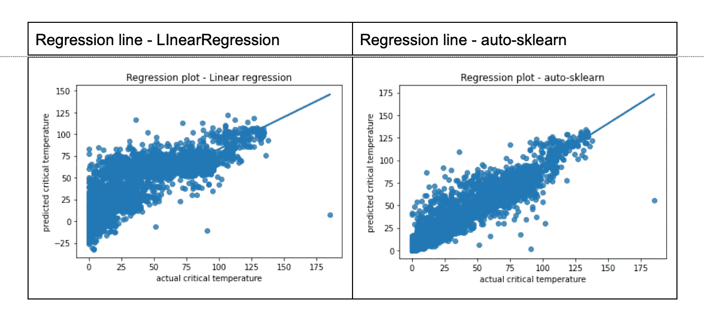
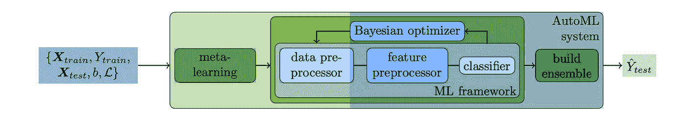
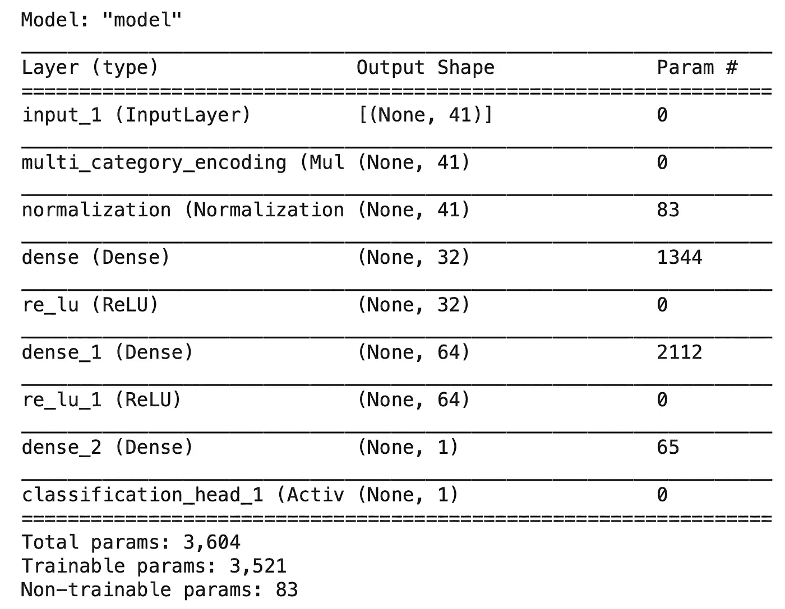
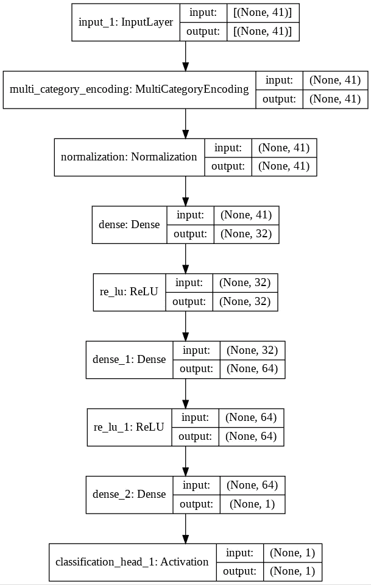

# 如何快速完成我的数据科学项目？

> 原文：<https://towardsdatascience.com/how-do-i-finish-my-data-science-projects-quickly-c5890233ff17?source=collection_archive---------19----------------------->

## 数据科学家不为人知的秘密


照片由 [**活动创作者**](https://unsplash.com/@campaign_creators) 于 [Unsplash](https://unsplash.com/)

如今，机器学习模型开发甚至已经到了非数据科学家的手中。你只需要知道解决问题的正确方法。这不是一个大秘密，这只是一个意识到机器学习的高级发展和理解有助于更快更好开发的可用框架的问题。在本文中，我将首先描述数据科学家在过去许多年中遵循的传统方法，然后讨论数据科学家在当今遵循的现代方法。

# 传统方法

这些年来，当接受一个数据科学项目时，数据科学家会首先从探索数据集开始。他会清理数据，估算缺失值，查看列值的方差，搜索相关性，进行特征工程，等等。他将执行“n”个任务来创建一个数据集，用于训练他的机器学习算法或将其输入他设计的神经网络。这个清单是无止境的，耗时的，而且大部分是费力的。

在他为学习设置数据集之后，他的下一个任务将是尝试他根据自己的知识和经验选择的机器学习算法。在训练模型之后，他可能会发现他选择的算法只给出了 60%的准确度，这肯定是不可接受的。因此，他可能会回到数据预处理、特征工程、降维等方面来提高模型的准确性。他可能会摆弄超参数来检查性能改进。如果所有这些都不奏效，他将采用另一种算法。这个过程一直持续，直到他为他的数据集找到具有微调超参数的最佳执行算法。在这个阶段，他会称他的模型为准备部署。

# 现代方法

到目前为止，我所描述的过程，你很容易理解，是非常费力和耗时的。不仅如此，你还需要精通统计学、EDA(探索性数据分析)、机器学习算法、用于评估算法性能的指标等等。

如果有人能自动化这整个过程，那不是很好吗？听起来很难，但是是的，这种工具在行业中已经存在很长时间了。你需要学习如何在你的项目中使用它们。我们称之为 AutoML。我将向您快速介绍这类工具。作为参考，我将讨论基于广泛使用的 sklearn ML 库的工具。Auto-sklearn 就是这样一个工具，它采用了经典的 ML 方法，并自动模仿了 ANN 的方法。有几个其他的商业和免费使用的工具包可用。我将在最后提到几个，这样你可以选择一个适合你的目的。

# 经典 ML 方法

有了 auto-sklearn，你只需要知道你的任务——回归或者分类。首先，我将讨论分类的汽车模型开发。

## 分类任务

在 auto-sklearn 中，只需两行代码就可以在数据集上获得性能最佳的模型。对于分类任务，您可以使用如下代码:

```
model = AutoSklearnClassifier(time_left_for_this_task=4*60, 
per_run_time_limit=30, n_jobs=-1)model.fit(X_train, y_train)```
```

AutoSklearnClassifier 变魔术了。它需要几个参数来控制执行时间。找到最合适的模型需要很长时间，有时甚至需要几个小时，因此这种时间控制是必不可少的。 *fit* 命令运行很长时间，最后，它会给出适合数据集的最佳模型。一旦这样做了，你就可以直接用它来推断:

```
predictions = model.predict(X_test)
```

如果好奇想知道幕后发生了什么，可以打印一些统计数据。

```
print(model.sprint_statistics())
```

我在 Kaggle [数据集](https://www.kaggle.com/kyr7plus/emg-4)上的一次测试产生了以下统计数据:

```
auto-sklearn results:
Dataset name: 1e3ad955125d649ab6cd828885a8d3fb
Metric: accuracy
Best validation score: 0.986602
Number of target algorithm runs: 24
Number of successful target algorithm runs: 15
Number of crashed target algorithm runs: 0
Number of target algorithms that exceeded the time limit: 9
Number of target algorithms that exceeded the memory limit: 0Accuracy: 0.993
```

你可以看到它尝试了 24 种算法——我没有耐心这样做。这个模型给了我 99%的准确率——你还能要求什么？如果我有进一步的好奇心想知道最后一个模型由什么组成，我可以要求它向我展示最终的模型配置:

```
model_auto.show_models()
```

这是我在测试运行中得到的输出。这只是部分输出，显示了在集合中使用的一个分类器( *extra_trees* )。

```
‘[(0.340000, SimpleClassificationPipeline({‘balancing:strategy’: ‘none’, ‘classifier:__choice__’: ‘extra_trees’, ‘data_preprocessing:categorical_transformer:categorical_encoding:__choice__’: ‘one_hot_encoding’, ‘data_preprocessing:categorical_transformer:category_coalescence:__choice__’: ‘no_coalescense’, ‘data_preprocessing:numerical_transformer:imputation:strategy’: ‘median’, ‘data_preprocessing:numerical_transformer:rescaling:__choice__’: ‘minmax’, ‘feature_preprocessor:__choice__’: ‘no_preprocessing’, ‘classifier:extra_trees:bootstrap’: ‘True’, ‘classifier:extra_trees:criterion’: ‘gini’, ‘classifier:extra_trees:max_depth’: ‘None’, ‘classifier:extra_trees:max_features’: 0.5033866291997137, ‘classifier:extra_trees:max_leaf_nodes’: ‘None’, ‘classifier:extra_trees:min_impurity_decrease’: 0.0, ‘classifier:extra_trees:min_samples_leaf’: 2, ‘classifier:extra_trees:min_samples_split’: 14, ‘classifier:extra_trees:min_weight_fraction_leaf’: 0.0},\ndataset_properties={\n ‘task’: 1,\n ‘sparse…’
```

大多数时候，我甚至都懒得看这些细节。只要模型在测试数据上给出了很好的准确性(在上面的例子中非常好)，我就将它部署在生产服务器上。

只是为了与手动建模方式进行比较，我在同一个数据集上尝试了 SVC 分类器。这是比较结果:



作者图片

现在，告诉我为什么我要尝试手动方式？

甚至对于回归任务也采用类似的方法。

## 回归任务

对于回归，使用这三行代码:

```
model_auto_reg = AutoSklearnRegressor(time_left_for_this_task=4*60, per_run_time_limit=30, n_jobs=-1)model_auto_reg.fit(X_train_scaled,label_train)
print(model_auto_reg.sprint_statistics())
```

最后一行只是打印统计数据，这是我在 UCI [数据集](https://archive-beta.ics.uci.edu/ml/datasets/superconductivty+data)上运行测试的结果。

```
auto-sklearn results:   
Dataset name: 17f763731cd1a8b8a6021d5cd0369d8f   
Metric: r2   
Best validation score: 0.911255   
Number of target algorithm runs: 19   
Number of successful target algorithm runs: 6   
Number of crashed target algorithm runs: 0   
Number of target algorithms that exceeded the time limit: 11   Number of target algorithms that exceeded the memory limit: 2
```

再一次，你看，它尝试了 19 种算法——对一个人来说，这是很大的耐心。我甚至尝试了 sklearn 中的 *LinearRegression* 实现，将上面的模型与人工努力进行比较。这是我的两次测试运行的误差指标:



作者图片

出于进一步的好奇，您可以检查通过调用上面讨论的用于分类任务的 *show_models* 方法开发的模型。

作为对开发模型的进一步检查，我绘制了这两种方法的回归线，如下图所示:



作者图片

## 自动 sklearn 功能

在内部，auto-sklearn 不仅仅是对算法进行彻底的搜索。我们可以在他们网站上给出的架构图中很快观察到这一点。



图片来源:[高效健壮的自动化机器学习](https://github.com/automl/auto-sklearn/blob/master/README.md)

如您所见，除了算法选择，它还提供超参数调整。它集成了最高性能的算法。它使用元学习和贝叶斯优化来创建一个高效的管道。它还允许您检查模型细节。你可以控制整个过程。想象一下自己一个人做这些事情。

> *我发现唯一缺少的是，它没有给我一个基于所选模型的* ipynb *文件，以便我可以对我的数据管道、系综和超参数做进一步的调整。*

现在，安汽车开发公司来了。

# 安/DNN 方法

随着人工神经网络/DNN 在解决使用经典 ML 无法解决的问题方面取得辉煌成功，数据科学家正在探索，或者更确切地说，使用它来完成他们的 ML 任务。一些数据科学家设计他们自己的人工神经网络架构和/或使用预先训练的模型来实现他们的业务目标。设计和使用人工神经网络架构需要除了统计学家以外的其他技能。我们要求你适应 ML 工程师的工作，并具备优化和数学知识。幸运的是，你有自动化的工具来完成这种任务。

像 auto-sklearn 一样， *AutoKeras* 有助于回归和分类任务的网络设计。不仅如此，它还处理结构化的图像和文本数据。

同样，使用这个库相当简单。对于结构化数据的分类，代码如下所示:

```
search = StructuredDataClassifier(max_trials=10,num_classes=3)
search.fit(x=X_train_s, y=y_train, verbose=0, epochs=5)
```

对于图像数据，它将类似于以下内容:

```
clf = ak.ImageClassifier(num_classes=10, overwrite=True, max_trials=1)
```

对于回归任务，由于需要回调，代码会更复杂一些。如下所示:

```
from tensorflow.keras.callbacks import ReduceLROnPlateau
lr_reduction = ReduceLROnPlateau(monitor=’mean_squared_error’, patience=1, verbose=1, factor=0.5, min_lr=0.000001)regressor = StructuredDataRegressor(max_trials=3,loss=’mean_absolute_error’)regressor.fit(x=X_train_scaled, y=label_train,
callbacks=[lr_reduction],verbose=0, epochs=200)
```

在库创建网络模型后，您可以评估其在测试数据上的性能、获取其评估分数、查找错误度量、使用它来预测未知数据，等等。我不会在这里讨论所有这些细节。相反，我将向您展示由该库创建的网络模型。您使用一个内置函数来导出模型。我在 UCI[数据集](https://archive-beta.ics.uci.edu/ml/datasets/qsar+biodegradation)上进行分类测试时，创建的模型如下:



作者图片

这是同样的网络图:



这不是很棒吗？作为一名数据科学家，你甚至不需要学习 ML 工程师的技能。虽然我使用了上面的两个工具来演示 AutoML 功能，但是市场上还有几个可用的工具，可能有更多的功能。

# 几个框架

仅举几个框架——你有 H2O.ai、TPOT、MLBox、PyCaret、DataRobot、DataBricks，还有最近[宣布的](https://medium.com/@sanket_sarang/introducing-blobcity-autoai-ecc01db2915b) BlobCity AutoAI。这份清单并非详尽无遗。我只是把它限制在我评估过的几个范围内。其中一些提供付费服务，其他的免费使用，开源。一些支持 R。特别是，H2O 支持 R、Python、Java 和 Scala——所以你在编码方面有更广泛的选择。其中一些有很好的 GUI，所以不需要命令行编码。一些在云上运行。您可能希望为自己的目的选择一个合适的 AutoML 框架。

我在这里肯定会提到的一件事是，新诞生的汽车社区 *AutoAI* 为我生成了代码，这是迄今为止我所见过的汽车领域中没有人能做到的。它生成一个 *ipynb* 文件以及一个详细的文档。在其他库中，这就像使用黑盒模型一样。这个特性对我来说是一个很大的好处，因为我所有的客户都要求在接受交付之前提交源代码。

该公司还声称，他们在经典 ML 和 ANN 之间进行自动选择。这对所有数据科学家来说都是一个很大的帮助，因为他们总是面临在经典和人工神经网络之间选择的困境。他们还声称在回归和分类之间进行自动选择，其他工具也是这样做的，因此，这对我来说没什么大不了的。

我必须在这里说，到目前为止，我还没有完全核实他们的说法。这是一个开源项目，给了我一个验证这种说法的机会。都说了，我就不直接跳进去了。该项目是新推出的，正在开发中，很可能有很多错误，除非他们已经深入测试过。他们正在谈论的功能，如果他们坚持下去，这将是数据科学家和整个数据科学领域的一大福音。

# 结论性建议

我分享了我最近处理数据科学项目的方法。我使用自动化工具。我不想说是哪一个——有时不止一个。提到这些名字可能看起来像是一种认可，所以我在避免。也就是说，作为一名数据科学家，使用 AutoML 工具将会节省您大量的精力。有一点需要提醒的是——目前为止我测试过、使用过的所有工具都有一个或多个 bug——我在他们的 GitHubs 上看到了这些问题。我建议，如果你发现一个问题是可重复的，一定要提交给他们。这样的工具会让我们的生活变得更容易，但不会让我们(数据科学家)灭绝。

## 一些有用的链接

*   [自动 sklearn](https://automl.github.io/auto-sklearn/master/)
*   [AutoKeras](https://autokeras.com/tutorial/overview/)
*   [H2O.ai](https://www.h2o.ai/hybrid-cloud/make/)
*   [TPOT](http://epistasislab.github.io/tpot/examples/)
*   [MLBox](https://mlbox.readthedocs.io/en/latest/features.html#id1)
*   [PyCaret](https://pycaret.org/models/)
*   [数据机器人](https://www.datarobot.com/platform/automated-machine-learning/)
*   [数据块](https://docs.databricks.com/applications/machine-learning/automl.html?_ga=2.199357678.1937287323.1637863321-558222820.1637863319)
*   [Blobcity AutoAI](https://github.com/blobcity/autoai)
*   [高效、稳健的自动化机器学习](https://papers.nips.cc/paper/2015/hash/11d0e6287202fced83f79975ec59a3a6-Abstract.html)

## 信用

[**Pooja Gramopadhye**](https://pub.towardsai.net/@poojagramo)—文字编辑

乔治·萨维德拉—项目开发

<https://medium.com/@profsarang/membership> 