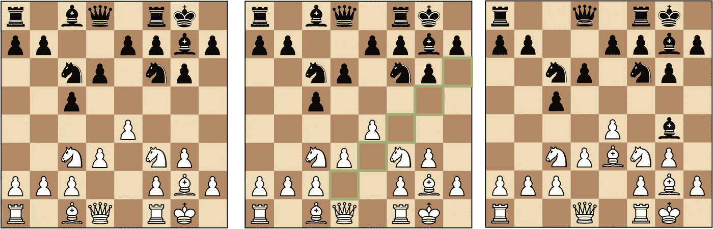

# 机器是如何规划的？—介绍

> 原文：<https://towardsdatascience.com/how-do-machines-plan-an-overview-a96a1aaa6dfa?source=collection_archive---------17----------------------->

## [思想和理论](https://towardsdatascience.com/tagged/thoughts-and-theory)

## 图搜索算法和马尔可夫决策过程的简明介绍

规划未来的能力似乎是智力的关键特征之一。步行、骑自行车、做运动或开车等身体动作需要极大的协调性，而最佳的可能动作高度依赖于外部环境(如果你的路上有石头、障碍或对手，你必须适应并改变你的策略)。此外，我们每天做的大多数事情——通勤、购物、烹饪、学习、工作等等。—包括短期和长期规划。像国际象棋和围棋这样的战略游戏也是超前思维发挥重要作用的著名例子。

早在 20 世纪 50 年代，人们就已经提出用数学方法来描述规划的过程。现在这些方法的变体随处可见，从机器人运动规划到在谷歌地图上寻找最佳路线。在本文中，我们将研究一些关键的公式和规划算法，为以后关于规划和强化学习(RL)的文章奠定基础。

# 状态、行动和奖励(成本)

在导航设置中，想象一个典型的规划问题是什么样子是最容易的。想象你在一个迷宫里。你在某个位置(x，y ),你可以向四个方向移动——上、下、左、右——只要你不碰到墙。如果你达到目标，你成功地终止。

网格迷宫中的机器人(图片由作者提供)

我们用**状态**来描述我们所处的现状。如果你在 location (x，y)，x 和 y 可以认为是在对你所处的状态进行编码，因为只要你知道 x 和 y，假设迷宫环境不发生变化，我们就能把自己放在正确的位置，重构当前的情境。通常，我们认为**状态是一组足以概括我们可能遇到的特定情况**的细节，并且可以用来区分一种独特的情况。

如果你想到一个更现实的机器人，你可以用一组数字概括它的配置——它的姿势(位置和角度)和它的许多关节的所有角度，这些可以被认为是状态。

一旦我们对状态的定义感到满意，我们就可以考虑在不同的状态之间移动，以达到我们想要的状态。对于上面的例子，这将到达宝箱的位置。我们可以通过采取**动作**在状态之间移动。在上述情况下，机器人可以采取的行动仅限于上下左右移动。但这并不限制我们思考更复杂的动作，比如迈出更大的步伐或跳过树篱，尽管我们现在不会考虑它们。

规划问题的最后一个要素是“成本”或“回报”的概念。在最短路径搜索或机器人学中，更典型的是考虑每一步的成本，并试图使路径上的总成本最小化。在游戏或环境中的计划背景下，你可以潜在地提高你的分数、能量水平、净值等。，更常见的是考虑奖励并试图最大化你能获得的总奖励。

# 作为搜索问题的规划

早期的规划工作集中在有限状态的问题上，每一个动作都导致状态间的确定性转换。换句话说，每当你采取一个行动时，你都可以确信你接下来会进入哪个状态。这和我们刚刚看到的网格迷宫问题一模一样。

因为我们想要评估到达目标的最短路径，所以我们将每次移动的成本指定为 1，并尝试在到达目标之前最小化总成本。现在，我们可以将网格迷宫问题转化为状态转换的最短路径问题，如下图左侧所示。可以将我们从初始状态带到目标状态的最短路径也将最小化总转换成本。

评估最短路径的图表(图片由作者提供)

在更一般的情况下，我们可以解决任何给定的连接网络的最短路径问题(例如，通过右边的路径连接的房子)。这种网络在数学上被称为“图”。节点(蓝色)代表状态，边(棕色)代表状态之间的转换。Dijkstra 和 A*等图搜索算法可以找到图上最短路径问题的最优解。Dijkstra 的算法带有最少的假设，而如果你粗略地猜测(启发式的)扩展节点的优先级，A*在搜索中会更有效。

鉴于本文篇幅有限，我将转到更一般的规划公式，即马尔可夫决策过程。然而，图搜索算法对于解决复杂的现实世界问题非常重要，例如机器人和最短路径搜索。如果你想了解更多关于 Dijkstra 的算法和 A*的知识，我推荐这篇有着惊人交互图形的文章。

<https://www.redblobgames.com/pathfinding/a-star/introduction.html>  

# 如何描述一个更一般的规划问题

当有限数量的状态之间存在确定性转换时，图搜索算法非常有用。然而，如果在转换中有一些不确定性，或者如果有无限多的状态和转换可以进行呢？

让我们来看一个稍微复杂一点的规划例子——象棋。在这种情况下，国家和行动会是什么样子？

由于每个国家都应该捕捉当前局势的独特细节，一个合理的选择可能是对棋盘上每个棋子的位置进行编码({ '黑国王':G8，'黑王后':D8，…，'白国王':G1，'白王后':D1……})。编码的确切方式并不太重要，只要它们与棋盘状态有一对一的映射，事实上，许多国际象棋游戏引擎已经提出了不同的棋盘状态编码方式。

象棋游戏的状态、动作和过渡(图片由作者提供，[来自维基百科](https://en.wikipedia.org/wiki/Chess_piece)的棋子)

国际象棋中有更多可能的动作(从一种状态移动到另一种状态可以做的事情)。平均来说，每回合你可以走 30 步左右，因为你可以选择走哪一步，每一步都有一系列的走法。假设我们选择了主教。在这种情况下，我们可以采取的措施以绿色突出显示。一旦我们选择了一个动作，我们就进入了下一个棋盘状态，如右图所示。

有趣的是，因为国际象棋是一个双人游戏，我们不能仅仅通过选择我们的行动来完全确定下一个游戏状态。对手也开始行动了，所以虽然我们对下一个可能的状态有所了解，但是下一个可能的状态还存在一些不确定性。

和大多数游戏一样，国际象棋中也有更令人向往的游戏状态。最明显的是当你拿了对手的国王并且你赢了的时候。不太明显的是那些你还没有赢，但已经非常接近赢的。

最后，让我们想象一个更真实的问题，驾驶通过一些障碍课程。正如我们已经讨论过的，汽车的状态可以通过它的姿态(位置和角度)以及车轮速度、加速度、转向角、剩余燃油量等来总结。使汽车从一种状态进入另一种状态的动作可能是你加速、刹车、转向和加油的程度。

一般来说，驾驶或机器人技术的难点在于，与网格迷宫或象棋不同，状态和动作通常是连续的。如果你在开车，你不只是向左或向右打方向盘；你可以加速、刹车或平稳地转动方向盘，由此产生的汽车及其车轮的位置、速度、加速度和角度都取连续值。这使得在这种状态空间中进行规划成为一个很难解决的问题。

与国际象棋类似，驾驶是一个多智能体规划问题，这意味着你必须与街上同样驾驶、骑自行车或步行的其他人协调。由于我们还没有心灵感应，我们不得不在不完全了解他人可能会做出什么决定的情况下做出决定。还有一些我们并不完全了解的环境状态，比如下一个红绿灯什么时候改变，下一个十字路口是否堵车，或者如果我们在隧道里没有 GPS 信号，我们现在到底在哪里。

在现实世界中，有更多难以解决的规划问题。如果你在一次公路旅行中，你的目标是尽可能多地游览风景名胜，那该怎么办？在这种情况下，没有一个明显的目标可以达到。如果你想让你的人工智能学习股票投资的最佳策略，并不断将你的收益进行再投资，该怎么办？如果这个任务没有一个明确的结束，你会在什么时候评估人工智能的性能？

## 规划问题的范围

在我们可能有兴趣解决的规划问题中，我们已经看到了许多相似之处和不同之处。我们在一些例子中做了更多的假设，添加或删除假设会使问题看起来完全不同，不同的问题会产生不同的解决方案。

**共性:**

*   目的是找到一个好的策略，让我们能够决定在给定的情况下(在给定的状态下)采取什么行动
*   在不同的情况和状态之间存在某种映射
*   动作可以影响从一种状态到另一种状态的转换
*   在每一次转变过程中，都会有某种回报或代价
*   有一个处于某种状态的可取性(价值)的概念

**根据问题不同的假设:**

*   有时候，在你采取行动后，你最终会处于哪种状态是不确定的，要么是因为状态转换是嘈杂的/概率性的，要么是因为还有其他人也在做出决策。有专门为双人游戏开发的算法，比如 minimax 和 alpha-beta 剪枝。在更一般的情况下，我们可以将概率状态转移建模为马尔可夫决策过程(MDP ),这将在下面讨论。涉及其他代理的问题被称为多代理问题，并且可以基于代理是合作还是竞争以及它们是否被允许相互通信来进行额外的考虑。
*   有时候，你每一次转型能得到的回报也可以是概率性的。
*   在许多情况下，环境的状态转换和回报动态是未知的，直到你尝试一些事情，看看会发生什么，所以没有一些尝试和错误，很难提前计划事情。这是强化学习的主要假设，这种困境被称为“开发 vs 探索”。
*   有时，状态和/或行动可以是连续的，这意味着离散的规划算法，如 Dijkstra 和 A*将不再工作。在机器人学中，一种常见的方法是对状态空间进行离散化或采样，产生一个粗略的最短轨迹估计，然后应用控制理论找到一个合适的连续控制输入，使轨迹估计和机器人实际轨迹之间的误差最小。然而，随着深度学习的成功，使用神经网络对连续函数进行建模已经成为可能，开辟了在连续空间中直接规划的一系列可能性。
*   有时候，我们所处的状态是无法精确衡量的。在机器人学中，传感器输入范围有限，最常见的问题是定位，即知道机器人此刻的确切位置。卡尔曼滤波器是在给定一些噪声测量和观察的情况下用于估计状态的技术之一。 [SLAM(同步定位和绘图)](https://medium.com/swlh/how-robots-make-maps-an-intro-to-slam-simultaneous-localisation-and-mapping-37370c3e7dfe)是一个完整的领域，致力于根据摄像机输入估计机器人的当前位置。更一般地说，真实的状态是未知的，因为我们无法直接观察状态(比如我们是否患有癌症，或者宇宙中每个粒子的确切位置和速度)，所以我们必须根据有限的观察值来估计它们。强化学习中的一个相关领域叫做 POMDP(部分可观察马尔可夫决策过程)。

这就是引入一个考虑到这些不确定性的更一般的规划范例——马尔可夫决策过程的动机。

# 马尔可夫决策过程(MDP)

让我们想一个一般的规划问题。无论是机器人、象棋还是驾驶，总有一个决策实体通过采取行动来改变局面。我们称决策实体为**代理**，外部的一切为**环境**。通常，如果我们是下棋、在房间里走动或开车的人，我们人类就是代理人。当我们用算法解决这些问题时，计算机算法本身就成了代理。代理可以在环境中采取行动以达到新的状态。环境为代理提供关于当前状态的知识，以及代理发起的每个状态转换的回报。

**状态** s *s* ∈ *S* (我们将可能状态的集合表示为 *S* ，每个状态表示为 *s* )，如前所述，是特定情况的唯一编码。当前状态可以直接测量或观察(如棋盘状态完全已知的国际象棋，或关节配置完全已知的机器人手臂)，或者必须从环境提供的观察中推断(如驾驶，其中驾驶员必须推断汽车的当前位置和速度，或机器人不完全本地化)。

代理可以通过采取**动作***A*∈*A*(*s*)来启动从一个状态到另一个状态的转换(可用的动作可以取决于您所处的状态，因此动作集可以是状态 *s* 的函数)。这将触发环境的变化，环境将向代理更新对新状态的观察，以及**奖励** *r* 。奖励可以是正面的，比如你在国际象棋中走了一步棋，赢了对方，或者正确预测了股票的上涨，但也可以是负面的，比如输掉了比赛，耗尽了燃料，或者撞上了障碍物。奖励通常是当前状态 *s* 、代理 *a* 采取的动作以及新状态*s’*的函数，并被写成 *R* ( *s* 、 *a* 、*s’*)。

最后，我们还可以定义一个从当前状态 *s* 到新状态*s’*的转移概率，基于某个动作 *a* 为*P*(*s’*|*s*， *a* )。这是一个条件概率，因为我们想知道我们将最终处于哪个状态，假设我们处于状态 *s* 并且已经采取了动作 *a* 。

让我们用一个假设的场景来说明这一点，在这个场景中，我们想决定是骑着扫帚去上学好，还是通过心灵传输去上学好。(注意:我最初想找一个更日常的例子，但是很难找到既可信又容易检验的概率，所以让我们用一个假设的例子。)

假设运输系统的简单马尔可夫决策过程(图片由作者提供)

如图所示，你的起始状态 *s* 是“家”，有三种结果——学校、医院和被绑架。如果你传送，它会更快，所以去学校的回报会更高，但它也更有风险，所以你更有可能因严重受伤而住院。另一方面，乘扫帚旅行速度较慢，而且更加暴露，所以你有可能被外星人绑架。

让我们来决定我们是应该采取“扫帚旅行”还是“瞬间移动”的行动。我们可以计算出每个行动的期望回报(概率的平均回报)(σ*P*(*s’*|*s*，*a*)*R*(*s*， *a* ，*s’*))

*a=* “扫帚”:0.8 * 1+0.1 *(10)+0.1 *(100)=-10.2

*a=* 《瞬移》:0.7 * 5+0.25 *(15)+0.05 *(100)=-5.25

因此，在这个简单的例子中，我们发现心灵运输给了我们最大的预期回报。

# 最大化总预期回报

虽然上面的例子只有一个带有即时奖励的单步转换，但在典型的计划问题中，如国际象棋，你需要提前计划，并根据你对未来奖励的估计采取战略性的行动，而不仅仅是即时奖励。更具体地说，我们应该最大化我们未来期望的回报总和。未来回报的总和被称为**回报** *G* ，我们的目标是找到一个使其最大化的策略。

回报的定义

回到我们的网格迷宫示例，起点的回报将是来回移动的所有成本和达到目标的最终奖励的总和。假设机器人走了 6 步到达宝箱，每走一步获得-1 的奖励，但到达宝箱时获得 10 的奖励。在这种情况下，返回是(-1) * 6 + 10 = 4。

注意，在回报的定义中，有一个贴现因子γ。有些规划问题是没有明确的终点的，所以奖励一直无限累积下去。为了防止回报变得无穷大，我们通过乘以γ < 1 来贴现未来回报(类似于γ≈0.99)。

# 思想

我希望这有助于获得一些关于规划问题如何数学描述的直觉，以及如何用 MDP 规划的公式比图搜索更复杂，但这也允许我们对更一般的规划问题建模。

通常，状态、动作和奖励的概念是作为 MDP 公式的一部分引入的，用于强化学习。然而，在这篇文章中，我想更普遍地介绍状态、行动和奖励(成本)的概念，因为这些概念并不是 RL 或 MDPs 所独有的，也出现在机器人学、控制理论和概率论中，它们都有着悠久的历史和大量伟大的工作。一旦我们开始看到这些关系，我们就开始看到，例如，Dijkstra 算法中的累积成本和强化学习中的值在某些假设下是相同的，只是以不同的方式表述。

在以后的文章中，我们将更深入地研究强化学习，研究不同的方法来得出一个好的策略，并讨论它们背后的直觉。

## 相关文章

<https://medium.com/swlh/how-robots-make-maps-an-intro-to-slam-simultaneous-localisation-and-mapping-37370c3e7dfe>  

## 参考

*   理查德·萨顿和安德鲁·巴尔托。[强化学习:导论，第二版](http://www.incompleteideas.net/book/the-book.html) (2018)，麻省理工学院出版社
*   史蒂文·拉瓦勒。[规划算法](http://lavalle.pl/planning/) (2006)，剑桥大学出版社