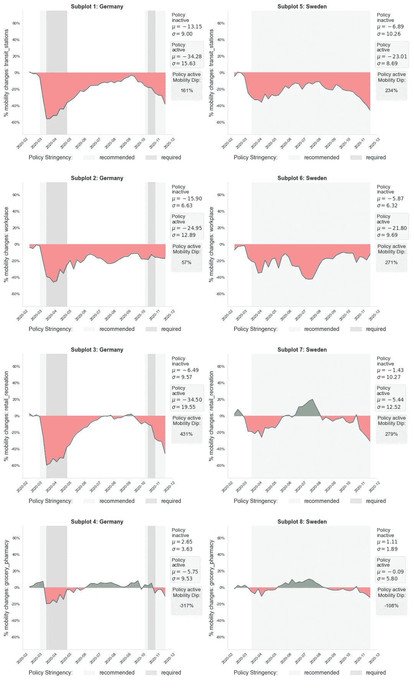

# 当社交距离成为规则时，人们如何移动？

> 原文：<https://towardsdatascience.com/how-do-people-move-when-social-distancing-becomes-the-rule-64af52857640?source=collection_archive---------9----------------------->

## [实践教程](https://towardsdatascience.com/tagged/hands-on-tutorials)

## 揭示就地安置要求对早期进入新冠肺炎疫情的德国和瑞典居民流动行为的影响

由[丁满·斯图德勒](https://unsplash.com/@derstudi)在 [Unsplash](https://unsplash.com/s/photos/social-distance) 上拍摄的照片

许多国家强制执行就地安置要求，以遏制新冠肺炎在本国领土上的传播。这些非药物干预(NPI)已经以政策研究人员急于破解的方式影响了人们的流动习惯。其目的不仅是为了更好地应对新的疫情疫情，也是为了及时发现那些尚未度过最糟糕时期的国家的经验教训。Bryant & Elofsson(2020 年)声称，不同国家的人们会以不同的方式改变他们的流动模式，以应对类似的 NPI，受此启发，我决定通过以下问题进行探索性分析来加入这场辩论:

随着时间的推移，德国和瑞典的公民如何减少个人流动性以应对各自政府颁布的就地安置要求？

德国和瑞典的比较预示着有趣的发现。两国在疫情早期采取了看似相反的策略来控制病毒。瑞典一再禁止这一消息，称其“轻锁”战略非常信任其居民的自愿自我监督。另一方面，德国很早就采取了严厉的政府干预措施，并被誉为榜样反应。

# 设置

我转向可公开访问的 OxCOVID19 数据库(Mahdi 等人，2020 年)来查询这两个国家的流动性和政策数据。OxCOVID19 数据库是一个大型的多模型存储库，收集了大量国家的流行病学、政府应对措施、流动性和社会人口数据。所有可用的数据都是作为 [OxCOVID19 项目](https://covid19.eng.ox.ac.uk)的一部分进行整理的，该项目旨在增进我们对疫情的了解，并促进基于统计分析的缓解策略的发展。我将 2020 年 2 月下旬至 11 月下旬的数据考虑在内，以探索两国疫情早期阶段的政策执行动态以及公共流动性的变化。

我的分析利用了 OxCOVID19 数据库中的两个表。就地安置政策颁布数据来源于*政府反应* *表*整理关于颁布的遏制政策的国家级顺序数据。在任何给定时间点执行政策的严格程度跨越三个层面。值为 0 表示给定的策略当前不活动，而值为 1 表示策略符合性是推荐的。最后，值 2 意味着必须遵守。我从*移动性表*中检索谷歌移动性趋势数据，捕捉不同位置类别(例如工作场所、公交车站、公园)相对于前疫情基线值的每日移动性偏差百分比。我将流动性数据汇总到国家一级，以便进行跨国比较，并匹配可用政策数据的粒度，以便进行后续关联。我进一步将移动性数据重新采样到周箱中，以消除周末、银行假日和分析未明确控制的其他环境因素(如天气)的影响。

# 描述性分析

用一些描述性的统计数据来开始它从来都不是一个坏主意。表 1 记录了两个国家在时间跨度范围内的就地安置严格程度的百分比分布。有几件事很突出。

***表 1*** *。德国和瑞典就地安置严格水平的覆盖范围。*

德国在 66%的时间里暂停了就地安置令，而瑞典在 86%的时间里发布了就地安置建议。然而，瑞典从未将该建议转化为要求，而德国在 20%的时间里实施了最严格的政策水平，几乎跨越了政策发布时间框架的三分之二。

接下来，我绘制了随着时间的推移，德国和瑞典公民按地区分类的流动性变化百分比。我进一步用竖条覆盖每个时间序列图，竖条的宽度和颜色对应于两国政府实施就地安置政策的持续时间和严格程度。

**图一。**个人流动性的变化与颁布的就地安置要求之间的关系

相对于瑞典，德国将更大的流动自由时期限制在更短、更紧缩的政策实施时期内，自 3 月中旬政策出台以来，瑞典仅仅建议就地避难就成为了新常态。这种视觉叙事与学术界和媒体强调存在两种截然不同的病毒遏制路线图的声音不谋而合。瑞典采取了一种独特的政策组合，温和的命令与公众呼吁自我监管相结合，而不限制个人自由，因为社会不喜欢明确的政府遥控。相比之下，德国主张早期、严格的干预，然后通过较软的措施在感染曲线周围安全地跳舞(Jung et al .，p.363，2020)。

无论严格程度如何，只要有就地安置要求，这两个国家的地点类别的流动性百分比都比疫情前参考值显著下降。每个图旁边的汇总统计数据突出显示，当就地安置政策是积极的而不是取消时，平均流动性变化显著下降。用相对值表示，只要实施就地安置政策，这两个国家在不同地点类别的流动性都会出现两位数和三位数的下降。

# 显著性检定

好的，我们可以说，到目前为止，德国和瑞典的流动模式在时间范围上有所不同。但是，我们能确信隐现的差异不仅仅是由于偶然吗？为了解决这个问题，我继续计算 95%的置信区间。这是为了评估德国和瑞典居民之间个人流动性的平均变化是否有显著差异。用外行的话来说，95%的置信区间告诉我们，我们有 95%的信心，两国之间平均流动性的真正差异位于区间下限和上限之间的某个位置，我将为 4 个位置类别中的每一个计算区间。现在假设给定置信区间的界限不包括 0。在这种情况下，我们可以确信，与瑞典居民相比，德国居民流动性的相对下降实际上更高(即，如果两个区间边界都是负的)或更低(即，如果两个区间边界都是正的)。表 2 报告了范围内 4 个位置类别的置信区间。

***表 2*** *。高于零的严格性水平的迁移率类别的平均差异。*

德国引入了家庭避难所的建议和要求，在所有类别中，德国的平均相对流动性下降幅度都比瑞典大。“高客流量”地点类别*零售&娱乐* (-29.1%)和*中转站* (-11.3%)的差异尤为明显。相反，在类别*工作场所* (-3.1%)和*杂货店&药房* (-5.7%)中，差异不那么明显。这些差异是有意义的，因为无论就地安置政策颁布时多么激烈，去办公室、购买食物和获得药品仍然是基本权利，特别是在疫情开始时，远程工作等替代方案尚未成熟。最重要的是，我发现，除了类别*工作场所*之外，我的 95%置信区间将统计显著性归因于所有位置类别的已识别差异。在所有条件相同的情况下，图 1 中的时间序列图显示，在 5 月初政策暂停后，德国公民以惊人的速度重新发现了他们对个人流动性的喜悦。这些上升趋势甚至超过了他们的瑞典同龄人的流动性水平，他们在夏末仍然受到在家避难的建议。我建议您修改图 1，比较德国和瑞典的交通时间序列如何针对类别*中转站*(子情节 1 & 5)和*工作场所*(子情节 2 & 6)演变，以见证这些动态变化。

为了弄清这些观察结果，我计算了另一组 95%的置信区间，以评估当德国暂停就地安置政策而瑞典没有暂停时，是否存在确定的流动性差异。

***表 3*** *。按流动类别的平均差异，比较德国的政策暂停*(即当严格级别= 0 时)*和瑞典的政策条例*(即当严格级别> 0 时)*。*

*令人震惊的结果:*德国居民在 4 个地点类别中的 3 个地点的流动性确实下降得更少。与瑞典同行相比，工作场所类别*、*、*中转站类别*和*杂货店类别&药店类别*的流动性变化比疫情前基线值少 9.9%至 2.7%。

# **这一切意味着什么？**

我的分析结果证实，个人流动性的降低与两国的政策部署相一致，但随着时间的推移，关于时机和严格性的不同部署战略可能会引发不同的反应。Murphy 等人(2020 年)关于公民遵守遏制政策的动机的研究声称，一旦法规取消，合规就不会持续。基于这一论点，对政府诱导的健康干预的规范性承诺可能是德国和瑞典公民个人流动性暂时下降背后的主要动机。从这个意义上说，随着限制解除后规范压力的消失，德国公民可能会回归到更为机会主义的行为模式。相反，正在进行的就地安置建议继续缓和瑞典居民的流动模式。

与此同时，瑞典公民的流动模式表现出高度可变性的实例表明，动态远不像乍看上去那样黑白分明。例如，让我们考虑瑞典居民对于位置类别*零售&娱乐*(例如，图 1 中的子情节 7)的移动性的变化。在没有任何政策转变的情况下，流动性水平有时甚至超过了疫情之前的水平。为了解释这一发现，让我们回顾一下，就地安置要求一直是瑞典的一项建议。因此，人们的流动行为可能会受到同时发生的更严格的政策变化的影响，而我的研究没有考虑到这一点。这种情况代表了统计学家通常所说的“遗漏变量偏差”。当一个模型或分析遗漏了一个或多个相关变量，可能会混淆所包含变量之间的真实关联时，就会发生这种情况。在我们的案例中，就地安置需求和个人流动性变化之间的关系。

# **局限性**

每项研究都有其局限性。是时候告诉你我的故事了。您可能还记得，我曾有意参与数据聚合和重采样。聚合意味着在粒度方面均衡移动性和策略数据，而重采样意味着消除分析无法控制的星期效应或特殊事件的影响。归根结底，在数据预处理方面，没有免费的午餐。从这个意义上来说，重采样和聚集度量是一把双刃剑，它可以提高清晰度和抑制噪声，但代价是模糊微妙的信号，这些信号只有在较低的粒度级别才会变得明显。最后，一些限制与我使用的数据有关。在研究谷歌(2021 年)[新冠肺炎社区移动性报告](https://support.google.com/covid19-mobility/answer/9825414?hl=en&ref_topic=9822927)中的*了解数据*部分时，我了解到移动性数据来自拥有谷歌账户并允许访问其位置历史的智能手机用户。在排除没有谷歌账户的智能手机用户，有谷歌账户但位置共享设置不同的智能手机用户，以及没有智能手机的人(是的，他们仍然存在！)，样本代表性有风险。类似地，谷歌声明，如果地方不够繁忙，无法防止重复识别，数据就会被保留。这个善意的隐私门槛违背了可靠地捕捉脚步的实际目的。最后，谷歌以 1 月 3 日至 2 月 6 日之间的固定五周时间为基准来衡量移动性变化。使用两个冬季月份作为参考框架来评估今年剩余时间内的流动性变化会引起严重的数据有效性问题。

# **结论**

本文以提问开始:*随着时间的推移，德国和瑞典的公民如何减少个人流动性以应对各自政府颁布的就地安置要求？*通过分析德国和瑞典 8 个月的流动性和政府政策数据，我发现强制执行就地安置要求的严格程度似乎影响了人们的流动性行为。德国采取了更为保守的就地安置政策，在执行时个人流动性急剧下降，随后在放松时流动性水平出现更大幅度的反弹。最终，研究结果暗示了个人流动性变化和政策制定之间的复杂关系，而我的分析才刚刚开始揭示这种关系。在强调游戏中的局限性时，我渴望批判性地反思我的分析结果，并在更普遍的意义上，善意地提醒人们，看似令人信服的发现必须始终有所保留。最重要的是，我希望这篇文章能激发这类进一步的探索，以提高政府在面对像新冠肺炎这样的威胁性传染病爆发时的决策能力。

# 参考

布赖恩特，p .和埃洛夫松，A. (2020 年)。评估流动模式对 11 个欧洲国家新冠肺炎感染率的影响。 *medRxiv* 。

Jung，f .，Krieger，v .，Hufert，F. T .，，Küpper，J. H. (2020 年)。我们应该如何应对新型冠状病毒冠状病毒的爆发:德国的观点。*临床血液流变学与微循环*， *74* (4)，363–372。

马赫迪、布拉什奇克、德洛特科、萨尔维、陈、T. S. T .、哈维和扎雷布斯基(2020)。OxCOVID19 数据库:更好理解新冠肺炎全球影响的多模态数据库。medRxiv。