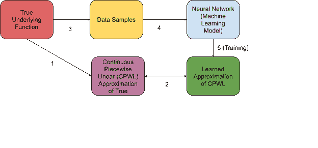
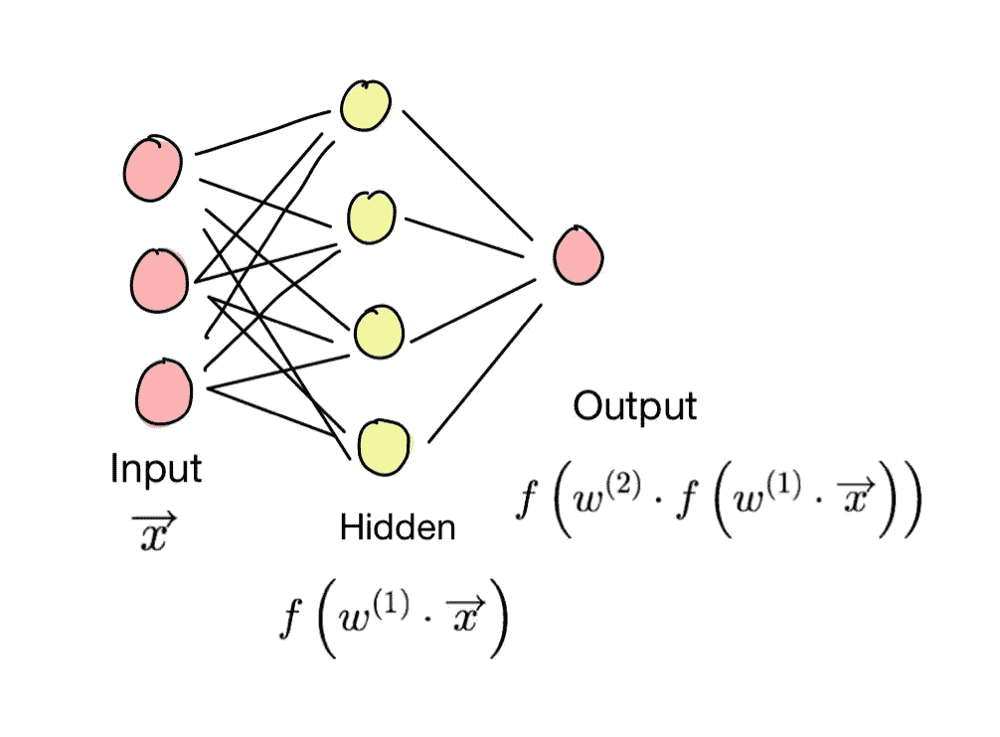
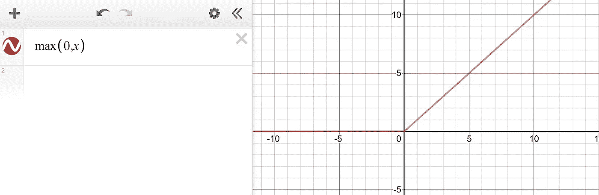
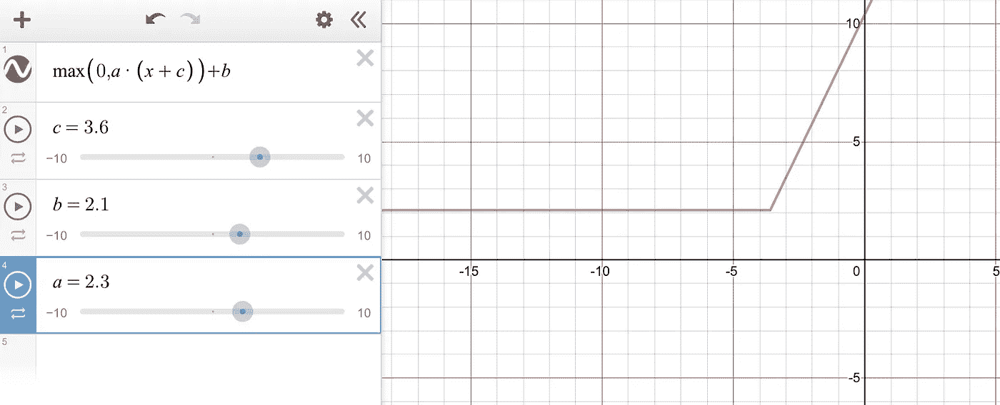
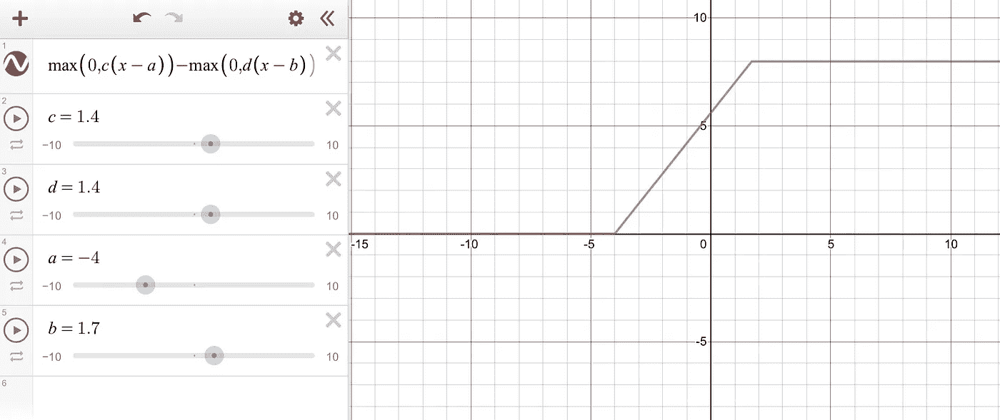
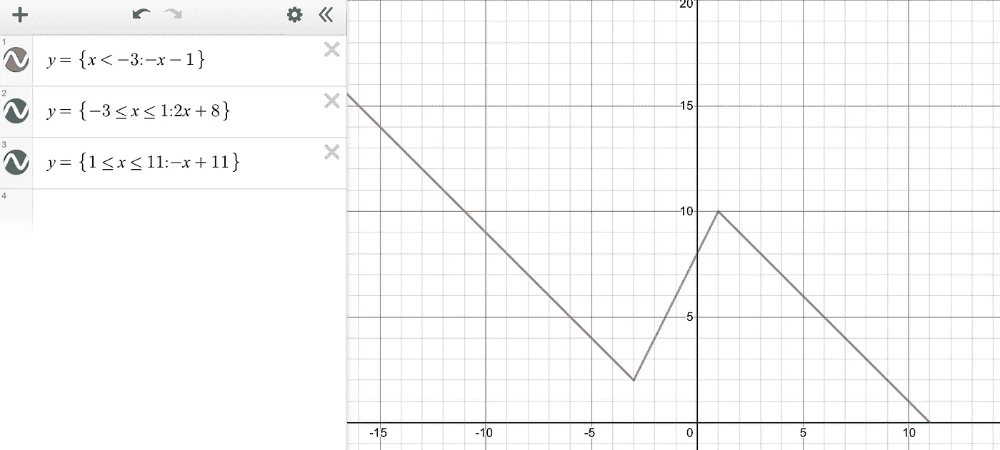
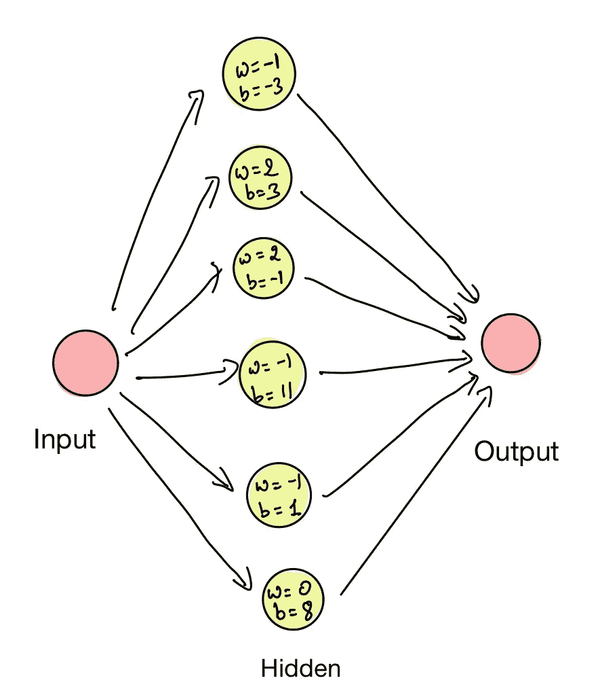
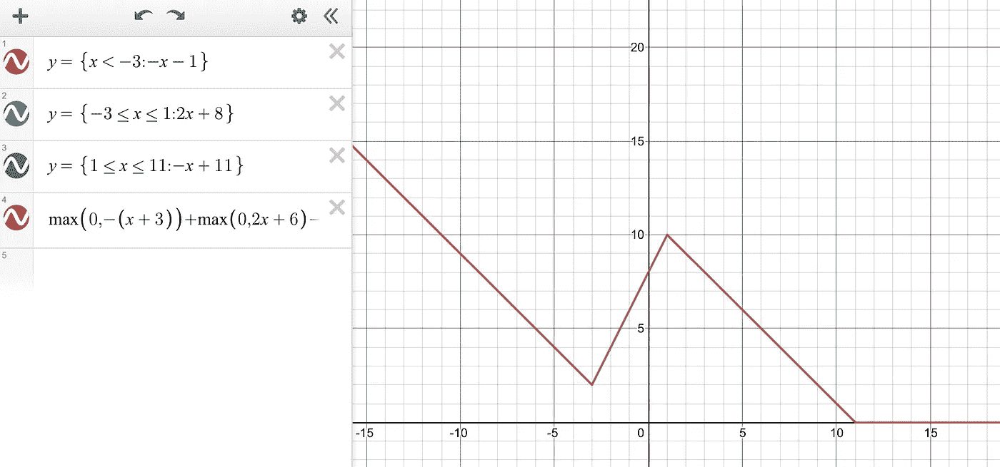
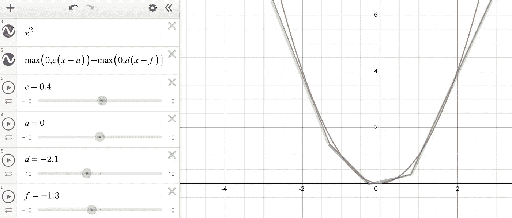

# ReLU 神经网络如何逼近任意连续函数？

> 原文：<https://towardsdatascience.com/how-do-relu-neural-networks-approximate-any-continuous-function-f59ca3cf2c39?source=collection_archive---------15----------------------->

作者:[凯沙夫·阿格拉瓦尔](http://linkedin.com/in/kasince2k)，[阿尤什·卡诺迪亚](http://linkedin.com/in/kanodiaayush)

从根本上说，机器学习模型是函数逼近器。例如，在试图从一个人的教育程度来预测其工资时，我们试图通过查看函数中的样本点来逼近单个输入函数。更复杂的任务，如图像分类是多维函数近似[1]。

神经网络在机器学习中无处不在，因为它们可以逼近各种各样的函数——所有连续的分段线性函数(CPWLs)，只要给定足够的隐藏单元。[通用逼近定理](https://en.wikipedia.org/wiki/Universal_approximation_theorem)保证了良好逼近函数的存在，这篇文章将讨论只有一个隐藏层和许多隐藏单元的神经网络如何使用 [ReLU](https://machinelearningmastery.com/rectified-linear-activation-function-for-deep-learning-neural-networks/) (校正的线性单元)非线性来逼近一元函数。这个想法延伸到多元输入空间。

**作为函数逼近的学习**

我们可以把学习过程理解为:

从数据中学习(作者绘制)

在这篇文章中，我们的目的是演示箭头 2，并给出一个箭头 1 的简短例子。神经网络异常强大的另一个原因是，它们可以通过反向传播(箭头 5)进行良好的训练[3]

# 神经网络的功能形式

考虑具有一个隐藏层的全连接神经网络。

神经网络的简单表示(由作者绘制)

不失一般性，输出层的最终功能是具有一个隐藏层的神经网络的功能形式。(x 向量是输入，权重用 w 表示)。这里的激活函数用 f 表示。

# 定义 ReLU 的使用

假设激活函数 f(x)是 R(x)—ReLU(整流线性单位)函数。ReLU 是分段线性函数，对于 x 的所有负值为 0，否则等于 x。

ReLU 函数(Desmos)

通过将函数 R(x)乘以“a”，将函数移位“b”，并将域移位“c”，来修改函数 R(x)，(“a”和“b”是可学习的参数)给出了一个函数，该函数成为我们近似的构建块。

修改 ReLU (Desmos)

在一个神经网络中，有几个激活(ReLUs)聚集在一起逼近一个函数。ReLU 函数可以通过减法以下列方式折叠。

聚集 ReLUs (Desmos)

# 详细示例

为了更具体，让我们以一个只有一个隐藏层的神经网络为例。考虑图像中定义的连续分段线性函数。

分段线性函数(Desmos)的示例

因为这是一个三段函数，我们需要隐藏层中的 6 个神经元来表示这个函数(每段 2 个神经元)。下图说明了代表上述分段线性函数的神经网络的外观(及其权重和偏差)。

ReLu 函数精确表示分段线性函数(Desmos)

这可以推广到任何连续的分段线性函数，可以用神经网络来表示。现在让我们看看神经网络是如何逼近连续函数的。

# 接近

对于任意连续函数 g(x)，我们可以证明它可以由它的无穷小部分的斜率之和来近似。由于 ReLU 可以用来表示任意直线，它可以构成这些斜率，最终逼近函数 g(x)。

注意，神经网络仅在受限域中在逼近函数方面做得很好，因为对于无限域，可能存在这样的情况，其中给定数量的神经元总是可以改进逼近，因此，不会获得成本函数的最小值。然而，在一个受限的领域中，神经元总是能够找到最小成本并很好地逼近函数。

下图显示了 x 在一个小区域内的近似值。这是为了演示 ReLU 函数如何聚合。由于函数的参数是可学习的，神经网络调整这些参数(以权重和偏差的形式)并逼近一个函数。

x 的近似值

这篇文章试图简化和展示神经网络是如何表现一个功能的。我意识到解释不是微不足道的，并决定写这篇文章，以 ReLU 为例。在这篇[论文](https://arxiv.org/pdf/1909.03731.pdf)中可以找到一个更加严谨和详尽的解释。

希望这能有意义的帮助到某个人！

# 笔记

[1]这里，输入是图片的每个像素中的像素颜色，输出是图片在输出类别之一中的概率(例如猫/狗)

[2]深度神经网络甚至是更好的近似器，因为它们需要更少的单元来近似相同的函数，并且概括得更好更快([链接](https://stats.stackexchange.com/questions/222883/why-are-neural-networks-becoming-deeper-but-not-wider)

[3]理解反向传播([环节](/understanding-backpropagation-algorithm-7bb3aa2f95fd)