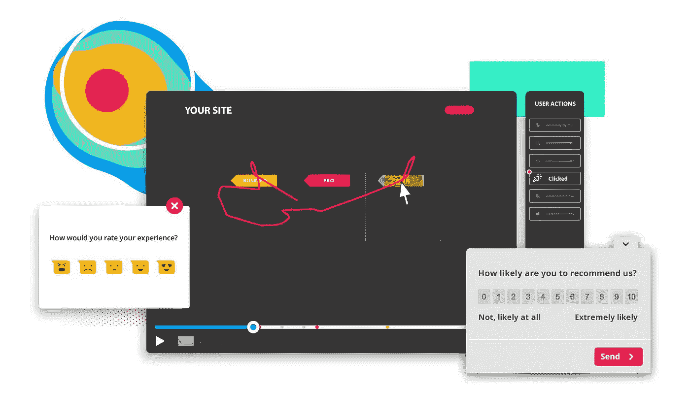

# 访问者如何使用你的网站？

> 原文：<https://towardsdatascience.com/how-do-visitors-use-your-website-1187b8bd6357?source=collection_archive---------42----------------------->

Hotjar 制作的信息图

## 什么是 Hotjar，它是如何工作的？

# 介绍

你刚刚推出了一个新网站。或者您在 web 应用程序中添加了新功能。你急切地期待反馈、询问、申请等。

然而，什么也没有发生。

你不会收到电子邮件，没有人注册使用你的产品，你会问自己为什么。毕竟，你肯定有人访问过你的网站。

嗯，结果是联系表坏了，这就是为什么你没有收到任何电子邮件。或者，一些访问者无法查看您网站的其他部分，因为在移动设备上使用导航很混乱。这些是你在创建网站或改变功能时可能面临的一些潜在问题。

这篇文章旨在介绍 Hotjar，以及如何通过一个真实的用例来理解网站访问者的行为。

# 热罐

[Hotjar](https://www.hotjar.com) 是一项行为分析和用户反馈服务，帮助您了解网站用户的行为，并通过以下工具获得他们的反馈:

*   [**热图**](https://www.hotjar.com/heatmaps/) :通过直观地表现用户的点击、点击和滚动行为，了解用户想要什么、关心什么、在你的网站上做什么
*   [**记录**](https://www.hotjar.com/session-recordings/) :通过查看访问者的点击、轻拍和鼠标移动，您可以即时识别可用性问题以及他们遇到的问题
*   **反馈调查**:针对网络和手机网站上的特定访问者提出问题
*   [**调查**](https://www.hotjar.com/feedback-surveys/) :使用简易编辑器构建您自己的响应调查。

Hotjar 补充了您从 Google Analytics 等传统网络分析工具中获得的数据和见解。这是一项行业领先且易于使用的服务，结合了用户行为分析和网站反馈工具，帮助您了解您的网站上实际发生了什么，您的用户关心什么，以及他们想说什么。

所以，如果你是营销人员、产品经理或用户界面设计师，Hotjar:

*   给你**清晰和直观的数据点**关于*在你的网站上发生了什么*
*   帮助你了解一些背景知识，比如为什么人们会有这样的行为
*   上面的**是否快速**而不需要陡峭的学习曲线

# 如何使用 HOTJAR

1.  创建 Hotjar 帐户。要开始，您可以选择免费版本，它每天记录 500 个会话，持续 14 天。
2.  包括你从 Hotjar 网站上获得的脚本。Hotjar 建议将脚本放在 HTML 页面的`<head>`部分，但是您也可以将脚本放在`<body>`部分。
3.  请检查 Hotjar 仪表板以验证安装。如果验证无效，请尝试禁用广告拦截器。

# 用例

像其他几位数据科学家一样，我着手建立了一个[新冠肺炎数据报告门户](https://portalcovidcymru.co.uk/)。你可能会翻白眼，但它有一个真正的用例。在我所在的英国威尔士，对数据不感兴趣的人并不清楚新冠肺炎的数据报告。所以，我继续做了一个，几个月后，这个门户已经有了 509，000 的浏览量！😱

[门户网站新冠肺炎·西姆鲁](https://portalcovidcymru.co.uk/)(威尔斯的新冠肺炎门户网站)

门户网站最受欢迎的功能之一是每日地图。这个页面提供了威尔士每个特定地区的每日病例数字——我认为它为人们提供了一点安慰，让他们看到疫情在他们家门口的实际情况，而不仅仅是整个国家的情况。

每日地图报告威尔士特定地区的新冠肺炎病例

我绝不是一个用户界面设计师。所以为了构建门户，我使用了[小英莱利](https://themes.3rdwavemedia.com/)的免费自举门户设计。你绝对应该去看看她——她的设计棒极了！

我深入研究了她的文件，修改了设计以适应用例。然后，我开始在 Twitter 上报告案例，并将用户引向门户网站。我的 Google Analytics 报告说，我的大多数用户都是在移动设备上访问门户的，对此我想都没想。由于门户是使用 Bootstrap 构建的，因此可扩展到移动和平板电脑屏幕。

在 Twitter 上，我分享了一张地图附带的表格截图，我经常被问到它在门户网站的什么位置。

这让我想知道——用户看不到表格吗？

答案是，没有…

下图显示了两周后 Hotjar 在地图页面的移动视图上制作的热图。地图本身(出于安全考虑，地图所在的 iframe 无法通过 Hotjar 查看)，显然是吸引力的一个特征。深红色热图区域表明了这一点。导航和地图视图选择也经常使用。但是如果我们注意桌子，几乎没有热量。因此，这表明移动用户没有意识到，如果他们在设备上向下滚动，表就位于地图下面。因此，为了改善这个可用性缺陷，用户需要某种可操作的指示，让他们知道要查看表格，他们必须滚动地图。

# 结论

正如你所看到的，将 Hotjar 嵌入到你的网站是很容易的。Hotjar 物有所值，它的免费层提供了有价值的信息！它帮助你建立更好的网站，让你的用户更有效地使用，降低跳出率。

虽然它有助于跟踪错误并帮助识别和修复网站中的漏洞，但 Hotjar 等工具可以帮助您解决 UX 问题并更好地了解您的受众。我们可以通过了解用户如何与我们的网站互动来消除这种猜测，而不是将我们的时间和资源集中在我们认为可行的事情上。