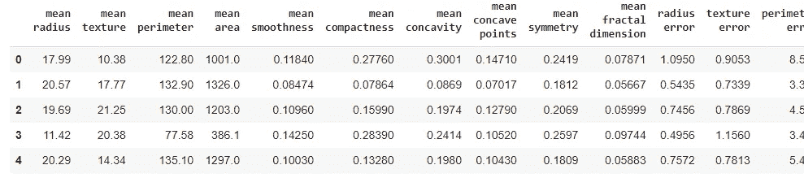
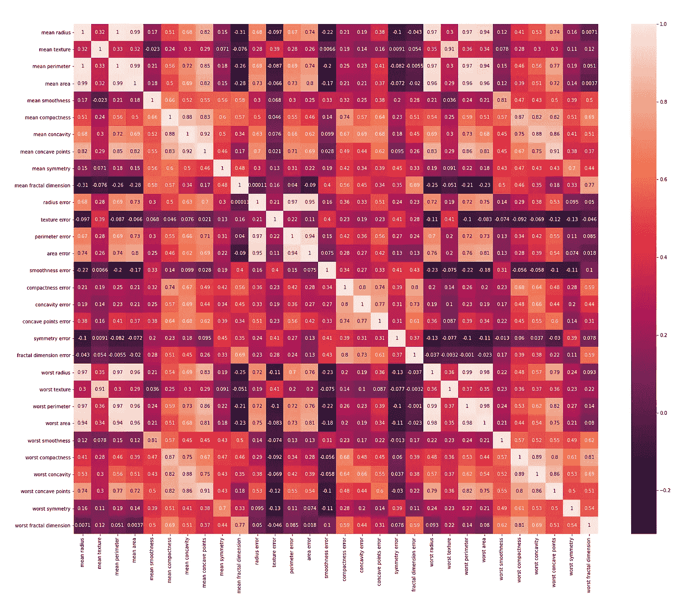
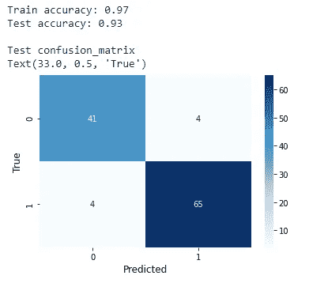
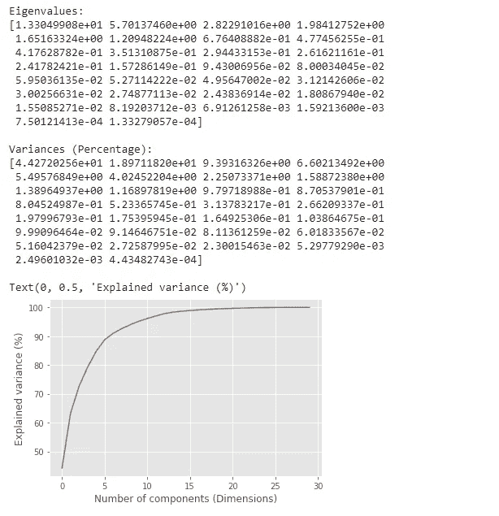
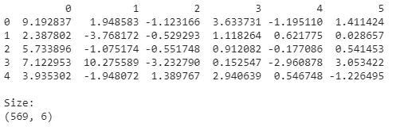
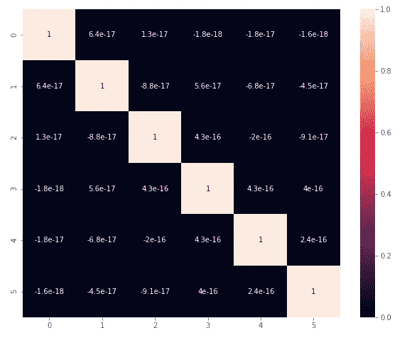
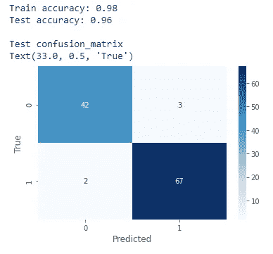
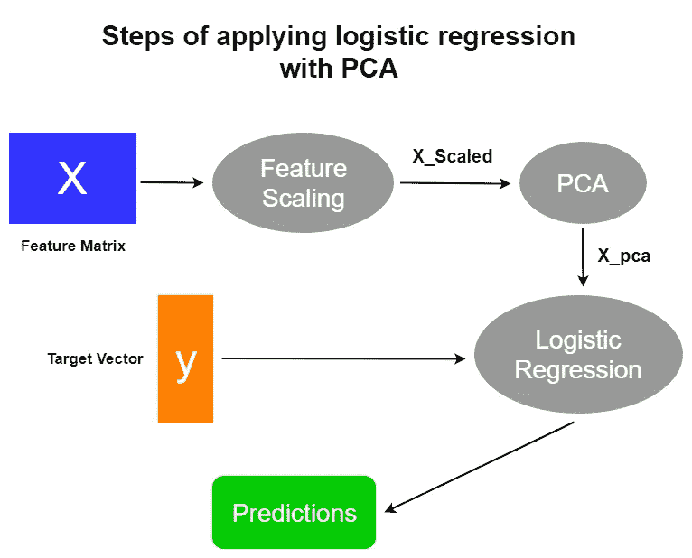

# 如何将主成分分析应用于逻辑回归以消除多重共线性？

> 原文：<https://towardsdatascience.com/how-do-you-apply-pca-to-logistic-regression-to-remove-multicollinearity-10b7f8e89f9b?source=collection_archive---------2----------------------->

## PCA 在消除多重共线性中的作用


Gabriella Clare Marino 在 [Unsplash](https://unsplash.com/?utm_source=unsplash&utm_medium=referral&utm_content=creditCopyText) 上拍摄的照片

***当要素(输入变量)与数据集中的一个或多个其他要素高度相关时，会出现多重共线性*** 。它会影响回归和分类模型的性能。PCA(主成分分析)利用多重共线性，将高度相关的变量组合成一组不相关的变量。因此，PCA 可以有效地消除特征之间的多重共线性。

在本帖中，我们将在名为*乳腺癌*数据的分类数据集上构建一个逻辑回归模型。初始模型可以被认为是基础模型。然后，我们将对*乳腺癌*数据应用主成分分析，并再次建立逻辑回归模型。之后，我们将比较基本模型和这个模型之间的性能。最后，我们将建立一个机器学习管道，将应用逻辑回归和 PCA 的多个步骤结合起来。读完这篇文章后，你将能够将 PCA 应用于逻辑回归模型。

我们开始吧！

# 探索*乳腺癌*数据集

该数据集是 Scikit-learn 中的内置数据集之一。根据 [Scikit-learn 文档](https://scikit-learn.org/stable/modules/generated/sklearn.datasets.load_breast_cancer.html)，它有 569 个样本的 30 个特征。目标变量有两个类别，称为 0(没有乳腺癌)和 1(有乳腺癌)。由于目标变量只有 2 个类，因此数据集用于二进制分类。数据集中没有缺失值。所有的值都是数字。所以，不需要清洗！

## 加载数据集

等到加载 Python 代码！



*乳腺癌*数据集的一部分(图片由作者提供)

## 创建热图

热图可以用漂亮的彩色图来显示连续变量的相关系数。

等到加载 Python 代码！



(图片由作者提供)

正如您在热点图中看到的，数据集中的一些要素彼此高度相关。因此，存在多重共线性。

# 构建逻辑回归模型(基础模型)

以下代码块基于*乳腺癌*数据构建逻辑回归模型。

等到加载 Python 代码！



基本模型的输出(图片由作者提供)

基础模型非常好。一点也不合身。它在新的未知数据上表现良好。让我们看看是否可以通过应用主成分分析来提高模型的性能。

# 对*乳腺癌*数据应用主成分分析

## PCA 概述

> PCA 是一种线性降维技术(算法)，它将一组相关变量(p)转换成较小的 k (k
> 
> *主成分* ，同时尽可能多地保留原始数据集中的变化。在机器学习(ML)的背景下，PCA 是一种用于降维的无监督机器学习算法。如果变量不是在相似的尺度上测量的，我们需要在对我们的数据应用 PCA 之前进行特征缩放。这是因为 PCA 方向对数据的规模高度敏感。PCA 中最重要的部分是为给定的数据集选择最佳数量的组件。

## 为我们的数据选择最佳数量的电脑

首先，我们应用 PCA，保持所有组件等于原始维数(即 30 ),并观察 PCA 如何很好地捕捉我们的数据的方差。

等到加载 Python 代码！



(图片由作者提供)

第一个分量单独捕获数据中约 44%的可变性，第二个分量捕获数据中约 19%的可变性，依此类推。前 6 个分量一起捕获了数据中约 88.76%的可变性。我们有兴趣保留前 6 个组件。

## 使用 6 种成分再次运行 PCA

现在，我们得到了包含 6 个组件的转换数据集。为此，我们需要通过设置 **n_components=6** 再次运行 PCA。

等到加载 Python 代码！



转换数据集的一部分(作者提供的图像)

现在，我们可以使用这个转换后的数据集代替原始的*乳腺癌*数据集来建立逻辑回归模型。这是两个数据集之间的区别。

*   原始数据集有 30 个要素，而转换后的数据集有 6 个组件。
*   转换后的数据集仅捕获原始数据集中约 88.76%的可变性。
*   两个数据集对应的值完全不同。
*   原始数据集中的一些变量与一个或多个其他变量高度相关(多重共线性)。转换后的数据集中没有变量与一个或多个其他变量相关。

## 创建转换数据集的热图

```
fig = plt.figure(figsize=(10, 8))
sns.heatmap(X_pca.corr(), 
            annot=True)
```



(图片由作者提供)

我们看不到组件之间的任何关联。这是因为 PCA 已经将原始数据集中的一组相关变量转换为一组 ***不相关*** 变量。

## 对转换后的数据建立逻辑回归模型

下面的代码块在转换后的数据集(通过应用 PCA 获得的数据集)上构建逻辑回归模型。

等到加载 Python 代码！



(图片由作者提供)

您可以将这个输出与我们基本模型的先前输出进行比较。测试精度提高了 3%。假阳性和假阴性也减少了。然而，转换的数据集(通过应用 PCA 获得的数据集)仅捕获原始数据集中约 88.76%的可变性。所以， ***这款车型的性能提升背后的原因是什么？*** 显而易见的答案是***PCA 有效地消除了多重共线性！***

# 构建机器学习管道

机器学习管道通过将应用逻辑回归的多个步骤与 PCA 相结合，简化了整个过程。以下是步骤:



(图片由作者提供)

等到加载 Python 代码！

***log _ reg _ model***流水线通过顺序应用变压器列表和最终预测器来简化训练过程。在我们的渠道中:

1.  **StandardScaler()** 是一个变压器。
2.  **PCA()** 是变压器。
3.  **LogisticRegression()** 是预测者。

现在，我们可以通过一个**训练所有的估计器。**称之为合体()。

```
log_reg_model.fit(X,y)
```

现在，我们已经完成了引言中承诺的工作。

# 摘要

PCA 对于消除多重共线性是有用的。它充当数据预处理步骤。PCA 还有很多其他的用例。这只是降维技术之一。你可以通过阅读我写的下面这篇文章找到更多关于那些事情的信息:

[](/11-dimensionality-reduction-techniques-you-should-know-in-2021-dcb9500d388b) [## 2021 年你应该知道的 11 种降维技术

### 减少数据集的大小，同时尽可能保留变化

towardsdatascience.com](/11-dimensionality-reduction-techniques-you-should-know-in-2021-dcb9500d388b) 

我的读者可以通过下面的链接注册成为会员，以获得我写的每个故事的全部信息，我将收到你的一部分会员费。

**报名链接:**[https://rukshanpramoditha.medium.com/membership](https://rukshanpramoditha.medium.com/membership)

非常感谢你一直以来的支持！下一个故事再见。祝大家学习愉快！

特别感谢 Unsplash 上的**加布里埃拉·克莱尔·马里诺**，她为我提供了这篇文章的封面图片。本帖提供的文字内容、代码示例、其他图片和内容链接，版权归作者所有。

[**鲁克山普拉莫迪塔**](https://medium.com/u/f90a3bb1d400?source=post_page-----10b7f8e89f9b--------------------------------) **2021–06–15**