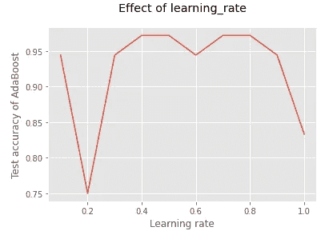

# 如何用 Python 实现 AdaBoost？

> 原文：<https://towardsdatascience.com/how-do-you-implement-adaboost-with-python-a76427b0fa7a?source=collection_archive---------15----------------------->

## 助推技术

## 机器学习中的助推算法——第二部分


[约翰·普莱斯](https://unsplash.com/@johnprice?utm_source=unsplash&utm_medium=referral&utm_content=creditCopyText)在 [Unsplash](https://unsplash.com/?utm_source=unsplash&utm_medium=referral&utm_content=creditCopyText) 上拍照

我们继续机器学习系列文章中**提升算法的[第 1 部分](/introduction-to-boosted-trees-2692b6653b53)。看过[第一部](/introduction-to-boosted-trees-2692b6653b53)吗？它向您简要介绍了 boosting 以及一些关键技术术语的定义，这些术语对于理解今天的内容非常重要。**

今天，我们将学习最流行的增强算法之一:AdaBoost(自适应增强)。更多的重点将放在算法的实现部分，在以下主题。

*   sci kit-AdaBoost 的学习类
*   在葡萄酒数据上训练和评估 AdaBoost 分类模型
*   将 AdaBoost 模型与决策树残肢进行比较
*   AdaBoost 中的重要超参数
*   测量超参数的效果 ***n_estimators***
*   测量超参数**的效果*学习 _ 速率***
*   使用网格搜索找到最佳超参数值

所有代码示例都将作为 GitHub gists 包含在内，以便您可以轻松地使用它们！在本文的最后，您将能够在具有最佳超参数值的给定数据集上实现 AdaBoost 算法。

我们开始吧！

# sci kit-AdaBoost 的学习类

AdaBoost 的 Python 实现由两个 Scikit-learn 类完成:[**AdaBoostClassifier()**](https://scikit-learn.org/stable/modules/generated/sklearn.ensemble.AdaBoostClassifier.html)用于分类(二进制和多类)，以及[**AdaBoostRegressor()**](https://scikit-learn.org/stable/modules/generated/sklearn.ensemble.AdaBoostRegressor.html)用于回归。导入惯例是:

```
from sklearn.ensemble import AdaBoostClassifierfrom sklearn.ensemble import AdaBoostRegressor
```

# 创建决策树树桩模型

通过用 **max_depth=1** 提前停止树的生长，我们将在葡萄酒数据上构建一个决策树桩。这是为了比较决策树桩和 AdaBoost 模型。我们也使用这个树桩模型作为 AdaBoost 的基础学习器。

下面的 Python 代码在 Wine 数据上创建了一个决策树，并评估了它的性能。

基于葡萄酒数据的决策树树桩模型


(图片由作者提供)

模型的性能很差。这并不奇怪，因为我们*通过设置 **max_depth=1** 来严格*调节树的生长。

# 创建 AdaBoost 分类模型

现在，我们将在葡萄酒数据上构建一个 AdaBoost 分类模型。

基于葡萄酒数据的 AdaBoost 分类模型


(图片由作者提供)

哦那个分数！与决策树残肢相比，AdaBoost 模型表现得非常好。

# AdaBoost 中的重要超参数

以下是 **AdaBoostClassifier()** 和 **AdaBoostRegressor()** 中最重要的超参数。

*   **base_estimator:** 这是 AdaBoost 算法中使用的基本学习器。默认的也是最常见的学习者是我们前面讨论过的决策树 stump(max _ depth = 1 的决策树)。
*   **n_estimators:** 顺序训练的估计器(模型)的最大数量。默认值为 50。我们将很快测量这个超参数的影响。
*   **learning_rate:** 确定在增强过程中应用于每个估计器的权重。默认值为 1。较小的值(如 0.05、0.1)会强制算法训练较慢，但具有高性能分数。我们将很快测量这个超参数的影响。

# 测量效果 ***n_estimators***

我们将通过将超参数 **n_estimators** 的值从 2 变化到 100 来手动测量其效果，并绘制 AdaBoost 模型给出的测试分数。

n _ 估计量的影响


(图片由作者提供)

在大约 30 次估计之后，我们之前获得的准确度分数恒定在 0.972。您可以使用 30 以上的任何整数。但是请记住，如果您增加该值，该算法将需要很长时间进行训练。因此，在这种情况下，最好使用默认值 50。

# **衡量效果*学习 _ 速率***

我们将通过从 0.1 到 1 改变超参数 **learning_rate** 的值来手动测量其效果，并绘制 AdaBoost 模型给出的测试分数。

学习率的影响



(图片由作者提供)

最高精度为 0.4、0.5、0.7 和 0.8。我们在上面的模型中使用了 0.5。

两种测量都是手动完成的。有一种更简单的方法来找到 **n_estimators** 和 **learning_rate** 的最优值。

# 使用网格搜索找到最佳超参数值

这里，我们通过使用 [**网格搜索**](/python-implementation-of-grid-search-and-random-search-for-hyperparameter-optimization-2d6a82ebf75c) ，同时自动调整(找到最佳值)两个超参数*。相比之下，在前面的步骤中，我们一次调优一个超参数。*

*执行网格搜索*

**

*(图片由作者提供)*

*我们可以使用这些值来获得 AdaBoost 模型的最高精度。给出相同精度的一些其他可能的组合是:*

*   *学习率=0.5，n 个估计值=50*
*   *学习率=0.8，n 个估计值=50*
*   *学习率=0.8，n 个估计值=100*
*   *学习率=0.4，n 个估计值=50*

# *摘要*

*用 Python 构建 AdaBoost 模型非常简单。你所要做的就是确定你想要解决的问题类型(回归/分类)并选择 Scikit-learn 中提供的合适的 AdaBoost 类。然而，超参数调整过程是一个真正的挑战。你需要做一些可视化，为超参数调整做并行计算。实际上，您将创建数千个模型。幸运的是，我们可以使用本文中讨论的高级方法来自动化调优过程。*

*模型的输出很大程度上受随机数据分割的影响。根据在 **random_state** 中指定的整数，您可能会得到不同的准确度分数。总是建议指定一个整数，以便在不同的执行中获得静态结果。*

*与决策树和随机森林等其他基于树的方法相比，AdaBoost 等 boosting 算法的性能非常好。这是因为考虑到前几轮初始树产生的误差，升压中的树被顺序训练。*

*在[第三部](/under-the-hood-of-gradient-boosting-and-its-python-implementation-99cc63efd24d)中，我们将讨论**梯度增强**，另一种流行的增强算法。下一个故事再见。祝大家学习愉快！*

*我的读者可以通过下面的链接注册成为会员，以获得我写的每个故事的全部信息，我将收到你的一部分会员费。*

*[](https://rukshanpramoditha.medium.com/membership) [## 通过我的推荐链接加入 Medium

### 作为一个媒体会员，你的会员费的一部分会给你阅读的作家，你可以完全接触到每一个故事…

rukshanpramoditha.medium.com](https://rukshanpramoditha.medium.com/membership) 

非常感谢你一直以来的支持！

特别感谢 Unsplash 上的**约翰·普莱斯**，为我提供了这篇文章的精美封面图片。

[鲁克山普拉莫迪塔](https://medium.com/u/f90a3bb1d400?source=post_page-----a76427b0fa7a--------------------------------)
**2021–10–22***