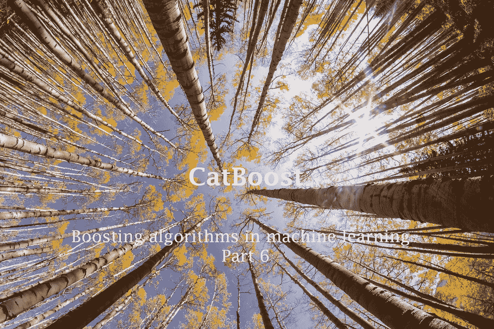
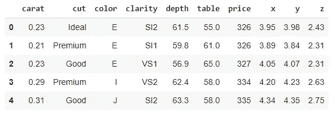
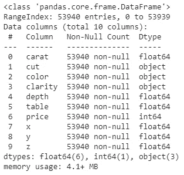
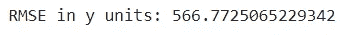
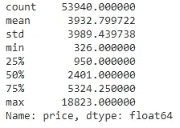
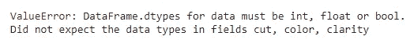
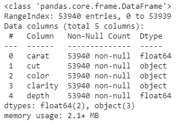
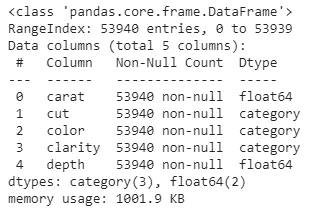

# 如何在 CatBoost 中直接使用分类特征？

> 原文：<https://towardsdatascience.com/how-do-you-use-categorical-features-directly-with-catboost-947b211c2923?source=collection_archive---------5----------------------->

## 助推技术

## 机器学习中的助推算法——第六部分



妮可·詹皮耶罗在 [Unsplash](https://unsplash.com/?utm_source=unsplash&utm_medium=referral&utm_content=creditCopyText) 上的照片

这是我们在 ***“机器学习中的 boosting 算法”*** 文章系列中涉及的第四个(最后一个)Boosting 算法。到目前为止，我们已经详细讨论了 [AdaBoost](/how-do-you-implement-adaboost-with-python-a76427b0fa7a) 、[梯度增强](/under-the-hood-of-gradient-boosting-and-its-python-implementation-99cc63efd24d)、 [XGBoost](https://rukshanpramoditha.medium.com/unlock-the-power-of-xgboost-738536b9f36f) 和 [LightGBM](/can-lightgbm-outperform-xgboost-d05a94102a55) 算法及其 Python 实现。

CatBoost(分类增强)是 XGBoost 的替代方案。它具有以下特点:

*   可以直接处理分类特征，无需编码
*   具有更简单的超参数调谐过程
*   运行速度比 XGBoost 快

在本教程中，我们将讨论如何在 CatBoost 中直接使用分类特征。我们还将它与 LightGBM 进行比较，后者也可以处理分类特征，但需要一些额外的工作！

我们开始吧！

# 安装 CatBoost

CatBoost 的安装超级简单。在 Anaconda 提示符或 Google Colab 编辑器中运行以下命令之一。

```
pip install catboost
#OR
conda install catboost
```

这两个命令都可以安装既支持 CPU 又支持 GPU 的 catboost 包。

# 在 CatBoost 中直接使用分类特征

与其他 boosting 算法相比，CatBoost 的一个独特特性是我们可以通过 CatBoost 直接使用分类特征(如果数据集中有分类特征的话)(无需编码)。为了验证这一点，我们将使用具有一些分类特征的[“钻石”数据集](https://drive.google.com/file/d/1iFSgksCgFNSiEN__yE_QcRoenVKsaTAS/view?usp=sharing)构建一个 CatBoost 回归模型。

## 钻石数据集

现在，我们来看看[“钻石”数据集](https://drive.google.com/file/d/1iFSgksCgFNSiEN__yE_QcRoenVKsaTAS/view?usp=sharing)的一些重要细节。

```
import pandas as pddf = pd.read_csv('diamonds.csv')
df.head()
```



(图片由作者提供)

让我们在数据集中找出一些关于特征(变量)的信息。

```
df.info()
```



(图片由作者提供)

如你所见，变量**切割**、**颜色**和**净度**是分类变量。它们都有**对象**数据类型。这些分类变量没有数值。通常，我们需要将它们编码成数值，因为大多数算法在训练过程中只接受带有数值的数据。

但是，CatBoost 的情况并非如此。我们可以在 CatBoost 中直接使用分类特征，而无需对它们进行编码。为此，我们需要通过使用 [**Pool()**](https://catboost.ai/en/docs/concepts/python-reference_pool) 类将我们的数据转换为 CatBoost 的特殊 ***Pool*** 数据类型。我们还需要在 **cat_features** 参数中指定分类特征的名称。

如果我们的数据只有数字特征，我们也可以使用 CatBoost，而无需将数据转换为 Pool 数据类型。如果我们的数据具有分类特征，我们必须在使用 CatBoost 之前将数据转换为 Pool 数据类型。

基于钻石数据的 CatBoost 模型的设计过程非常简单。我们可以选择**价格**变量作为目标列(y)，其余变量作为特征矩阵(X)。我们还从数据集中删除了*表*、 *x* 、 *y* 和 *z* 变量，因为它们对数据没有太大价值。然后，我们可以将 X 和 y 定义如下:

```
X = df.drop(columns=['price', 'table', 'x', 'y', 'z'])
y = df['price']
```

因为**价格**是一个连续值变量，这里我们需要建立一个回归模型(实际上是一个 CatBoost 回归模型！).为了构建模型，我们使用了[**CatBoostRegressor()**](https://catboost.ai/en/docs/concepts/python-reference_catboostregressor)**类及其相关的超参数值。对于分类任务，有一个单独的类叫做[**CatBoostClassifier()**](https://catboost.ai/en/docs/concepts/python-reference_catboostclassifier)。**

## **基于钻石数据构建 CatBoost 回归模型**

**这是代码。**

**等到加载代码！**

****

**(图片由作者提供)**

**这个值吗？这是预测误差(残差)的标准差。值越低，模型越好。让我们仔细看看价格变量。**

```
y.describe()
```

****

**(图片由作者提供)**

**范围(最大-最小)是 18497。标准差是 3989。因此，我们得到的 RMSE 值对于我们的模型来说是非常好的。另外，请注意，我们是在没有进行任何超参数调整的情况下获得这个值的！**

# **具有分类特征的 LightGBM**

**在[第 5 部分](/can-lightgbm-outperform-xgboost-d05a94102a55)中，我们已经讨论了 LightGBM 也可以不经过编码直接用于分类特征。但是，LightGBM 没有任何内部机制来处理分类特征。**

**让我们看看如果使用带有分类特性的 LightGBM 会发生什么。**

**等到加载代码！**

****

**(图片由作者提供)**

**您将得到一个值错误，提示您应该将分类值编码为数值。**

**但是，等等！LightGBM 有一个简单的方法。我们不需要对我们的分类值进行编码。相反，我们只需要在训练算法之前对 *X* 做一个数据类型转换(*对象*数据类型→ *类别*数据类型)。**

## **转换前:**

```
X.info()
```

****

**(图片由作者提供)**

## **转换过程:**

```
for col in X.select_dtypes(include=['object']):
  X[col] = X[col].astype('category')
```

## **转换后:**

```
X.info()
```

****

**(图片由作者提供)**

**现在，所有分类变量都有*类别*数据类型。因此，我们可以无任何误差地重建模型。**

**等到加载代码！**

****

**(图片由作者提供)**

**这个 RMSE 值比之前从 CatBoost 得到的值稍微好一点！**

# **结论**

**CatBoost 是 XGBoost 的一个很好的替代品。如果您有一个包含分类变量的大型数据集，这应该是您的选择。当我们考虑性能和执行时间时，CatBoost 可以优于 XGBoost。但是，LightGBM 比 CatBoost 好多了！**

**今天的帖子到此结束。在第 7 部分的[中，我们将讨论 XGBoost 与 CatBoost 以及 LightGBM 与 CatBoost 的一些性能比较。除此之外，我们还将讨论一些指导原则，帮助您为您的任务选择正确的提升算法。](/performance-comparison-catboost-vs-xgboost-and-catboost-vs-lightgbm-886c1c96db64)**

**下一个故事再见。祝大家学习愉快！**

**我的读者可以通过下面的链接注册成为会员，以获得我写的每个故事的全部信息，我将收到你的一部分会员费。**

**[](https://rukshanpramoditha.medium.com/membership) [## 通过我的推荐链接加入 Medium

### 作为一个媒体会员，你的会员费的一部分会给你阅读的作家，你可以完全接触到每一个故事…

rukshanpramoditha.medium.com](https://rukshanpramoditha.medium.com/membership) 

非常感谢你一直以来的支持！

特别要感谢 Unsplash 网站上的 Nicole Giampietro，她为我的这篇文章提供了一张漂亮的封面图片。

[鲁克山普拉莫迪塔](https://medium.com/u/f90a3bb1d400?source=post_page-----947b211c2923--------------------------------)
**2021–10–31****