# 如何用 NumPy，SciPy 和 SymPy 解线性方程组？

> 原文：<https://towardsdatascience.com/how-do-you-use-numpy-scipy-and-sympy-to-solve-systems-of-linear-equations-9afed2c388af?source=collection_archive---------5----------------------->

## 让我们用唯一解、无解或无穷多解来求解线性系统


安托万·道特里在 [Unsplash](https://unsplash.com/?utm_source=unsplash&utm_medium=referral&utm_content=creditCopyText) 上拍摄的照片

在线性代数中，线性方程组被定义为具有相同变量集的两个或多个*线性*方程的集合。同时考虑系统中的所有方程。线性方程组用于不同的领域，如制造、营销、商业、运输等。

当方程和变量的数量增加时，线性方程组的求解过程会变得更加复杂。解必须满足系统中的每个方程。在 Python 中，**NumPy**(**Num**erical**Py**thon)、**SciPy**(**Sci**entific**Py**thon)和**SymPy**(**Sym**bolic**Py**thon)库可以用来解线性方程组。这些库使用向量化的概念，通过避免许多 *for* 循环，允许它们有效地进行矩阵计算。

不是所有的线性系统都有唯一的解。其中有些无解或无穷多解。

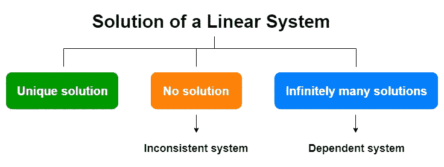

(图片由作者提供)

我们将用 NumPy、SciPy 和 SymPy 实现来涵盖这 3 种类型的线性系统。可以用几种不同的方式来实现。我们还将在必要时讨论这些不同的方式。在本文结束时，您将能够求解一个线性系统(如果存在唯一的解)，并使用强大的 NumPy、SciPy 和 SymPy 库识别无解或无限多解的线性系统。

## 先决条件

强烈建议学习 NumPy 的基础知识(数组创建、一维数组和二维数组的识别等)。如果你不熟悉他们，不要担心。要获取基础知识，可以看下面这篇我写的文章。

</numpy-for-data-science-part-1-21e2c5ddbbd3>  

我们开始吧！

# 线性系统的一个例子

请看下图，它包含了一个线性方程组。

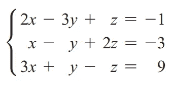

线性方程组(图片由作者提供)

该系统中有 3 个线性方程。每个方程都有一组相同的变量，称为 **x** 、 **y** 和 **z** 。求解这个线性系统意味着找到满足所有方程的 **x** 、 **y** 和 **z** 的值(如果存在)。

# 线性系统的矩阵表示

上述线性方程组可以表示为一个称为 ***增广矩阵*** 的特殊矩阵，它为通过矩阵计算求解线性方程组开辟了道路。

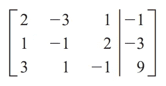

扩充矩阵(图片由作者提供)

这个扩充矩阵有两个部分:

*   **系数矩阵—** 这是一个矩形数组，仅包含变量的系数。在我们的示例中，这是上图中垂直线左侧的一个 3 x 3 的正方形矩阵。第一列包含每个方程的系数 **x** ，第二列包含系数 **y** 等等。行数等于线性系统中方程的数量。列的数量等于线性系统中不同变量的数量。在 NumPy 中，这可以表示为一个二维数组。这经常被赋给一个用大写字母命名的变量(比如 **A** 或者 **B** )。

```
import numpy as npA = np.array([[2, -3, 1],
              [1, -1, 2],
              [3, 1, -1]])
```

*   **增大—** 这是上图中垂直线右侧的列向量。它包含线性方程的常数。在我们的例子中，这是一个 3 x 1 的列向量。在 NumPy 中，这可以表示为一维数组。这通常被赋给一个用小写字母命名的变量(比如 **b** )。

```
import numpy as npb = np.array([-1, -3, 9])
```

# 用唯一解求解线性系统

让我们用 NumPy 解下面的线性系统。


(图片由作者提供)

为了马上解决这个问题，我们使用 NumPy ***linalg*** 子包中的 **solve()** 函数。

```
import numpy as npA = np.array([[2, -3, 1],
              [1, -1, 2],
              [3, 1, -1]])b = np.array([-1, -3, 9])np.linalg.solve(A, b)
```

输出是:

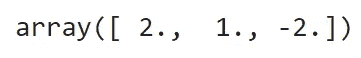

(图片由作者提供)

哇！上述线性系统有一个独特的解决方案:

*   **x = 2**
*   **y = 1**
*   **z = -2**

**注意:**类似的实现可以用 SciPy 来完成:

```
from scipy import linalglinalg.solve(A, b)
```

## 这在内部是如何工作的？

直接实现并没有给出这在内部如何工作的清晰概念。让我们推导矩阵方程。

## 矩阵方程

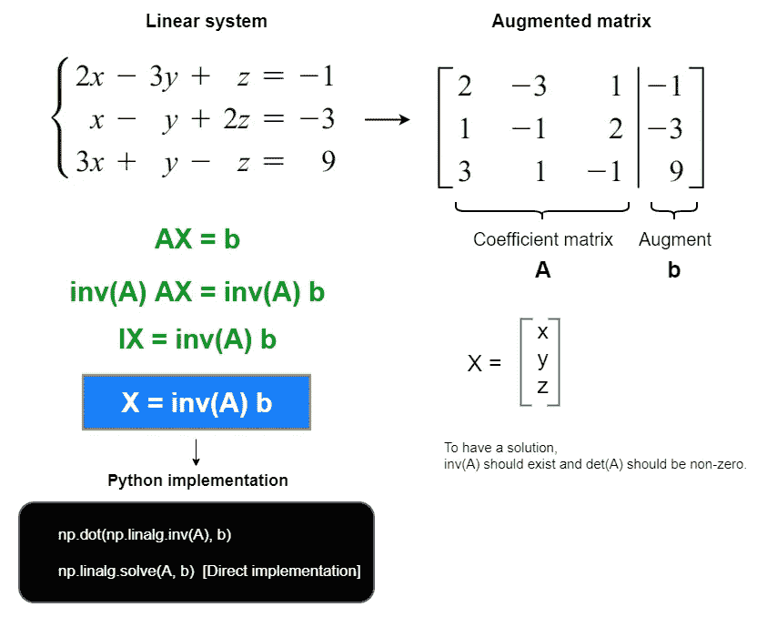

(图片由作者提供)

让我们用矩阵方程得到同样的解:

```
np.dot(np.linalg.inv(A), b)
```


(图片由作者提供)

为了有一个解，应该存在 **A** 的倒数，并且 **A** 的行列式应该非零:

```
np.linalg.det(A)
```

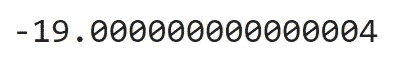

(图片由作者提供)

# 求解无解的线性系统

当线性方程组无解时，这样的系统称为**不相容系统**。让我们看看当我们试图用 NumPy 解下面的线性系统时会发生什么:

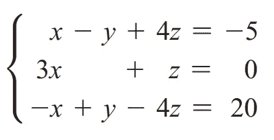

(图片由作者提供)

```
import numpy as npA = np.array([[1, -1, 4],
              [3, 0, 1],
              [-1, 1, -4]])b = np.array([-5, 0, 20])np.linalg.solve(A, b)
```

输出是:

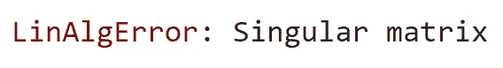

错误消息(图片由作者提供)

错误消息说我们的系数矩阵(A)是奇异的。用代数术语来说，就是行列式为零的不可逆矩阵。让我们检查一下:

```
np.linalg.det(A)
```

输出是:

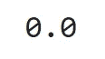

(图片由作者提供)

行列式为零。因此，我们的系数矩阵(A)是奇异的。正因为如此，上述线性方程组无解！

**注意:**如果您用 SciPy 实现它，将会返回一个类似的错误消息。

# 求解具有无穷多解的线性系统

当一个线性方程组有无穷多个解时，这样的系统被称为**相关系统**。让我们看看当我们试图用 NumPy 解下面的线性系统时会发生什么:

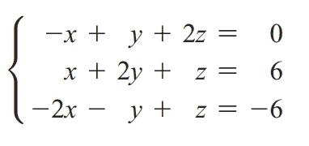

(图片由作者提供)

```
import numpy as npA = np.array([[-1, 1, 2],
              [1, 2, 1],
              [-2, -1, 1]])b = np.array([0, 6, -6])np.linalg.solve(A, b)
```

输出是:


错误消息(图片由作者提供)

这与前一个案例相同。

**注意:**如果您用 SciPy 实现它，将会返回一个类似的错误消息。

现在，有一个问题。**如何区分*无解线性系统*和*有无穷多解线性系统*？**有方法。

> 我们试图将系数矩阵简化为行梯队形式，其对角线上为 1，其他地方为 0(单位矩阵)。如果我们成功了，这个系统有一个独特的解决方案。如果我们无法将系数矩阵放入单位矩阵，要么无解，要么无穷多解。在这种情况下，我们可以通过查看简化矩阵的最后一行来区分无解线性系统和有无穷多个解的线性系统。

## 得到简化的行梯队形式

我们可以使用 **SymPy** Python 包来获得简化的行梯队形式。首先，我们创建增广矩阵，然后使用 **rref()** 方法。让我们用一个具有独特解决方案的线性系统来尝试一下:


(图片由作者提供)

```
from sympy import *augmented_A = Matrix([[2, -3, 1, -1],
                      [1, -1, 2, -3],
                      [3, 1, -1, 9]])augmented_A.rref()[0]
```

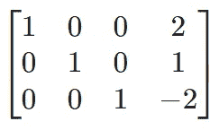

(图片由作者提供)

我们成功了！我们得到了简化的行列形式。第 4 列是解决方案列。解是 **x=2** ， **y=1** ， **z=-2** ，这与之前使用 **np.linalg.solve()** 得到的解一致。

让我们用一个无解的线性系统来试试:


(图片由作者提供)

```
from sympy import *augmented_A = Matrix([[1, -1, 4, -5],
                      [3, 0, 1, 0],
                      [-1, 1, -4, 20]])augmented_A.rref()[0]
```

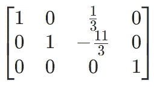

(图片由作者提供)

这一次，我们没有成功。我们没有缩小的排梯队形式。这个表格的第三行(等式)是 0=1，这是不可能的！因此，线性系统无解。线性系统是不一致的。

最后，我们用一个有无穷多解的线性系统来尝试:


(图片由作者提供)

```
from sympy import *augmented_A = Matrix([[-1, 1, 2, 0],
                      [1, 2, 1, 6],
                      [-2, -1, 1, -6]])augmented_A.rref()[0]
```

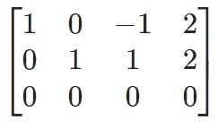

(图片由作者提供)

这一次，我们也没有成功。我们没有缩小的排梯队形式。此表格的第三行(等式)是 0=0，这总是正确的！这意味着变量 **z** 可以取任何实数，并且 **x** 和 **y** 可以是:

*   z =任何数字
*   x-z = 2 (x = 2+z)
*   y+z = 2 (y = 2-z)

将任意一个实数代入 **z** ，可以得到无穷多个解！线性系统是依赖的。

我们已经完成了任务。现在，您能够求解一个线性系统(如果存在唯一的解)，并使用强大的 NumPy、SciPy 和 SymPy 库区分无解的*线性系统*和有无限多个解的*线性系统*。

一般的实现是:

> 先试试 **np.linalg.solve()** 。如果你得到了一个独特的解决方案，你就完成了任务。如果你得到一个错误信息(“奇异矩阵”)，线性系统要么无解，要么有无穷多个解。然后，如上所述，尝试使用 SymPy Python 包获得简化的行梯队形式。通过查看简化表格的最后一行，你就可以决定事情了！

另外，请注意以下几点。

*   上面讨论的方法只能应用于线性系统。换句话说，系统中的所有方程都应该是线性的。
*   如果一个线性系统的方程比变量少，那么这个系统一定是依赖的或不一致的。它永远不会有唯一的解决方案。
*   方程比变量多的线性系统可能无解、唯一解或无穷多解。

我的读者可以通过下面的链接注册成为会员，以获得我写的每个故事的全部信息，我将收到你的一部分会员费。

**报名链接:**[https://rukshanpramoditha.medium.com/membership](https://rukshanpramoditha.medium.com/membership)

非常感谢你一直以来的支持！下一个故事再见。祝大家学习愉快！

特别感谢 Unsplash 网站上的 **Antoine Dautry** ，他为我提供了这篇文章的封面图片。本帖提供的文字内容、代码示例、其他图片和内容链接，版权归作者所有。

[**鲁克山普拉莫迪塔**](https://medium.com/u/f90a3bb1d400?source=post_page-----9afed2c388af--------------------------------) **2021–06–12**