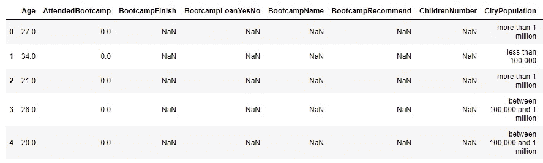
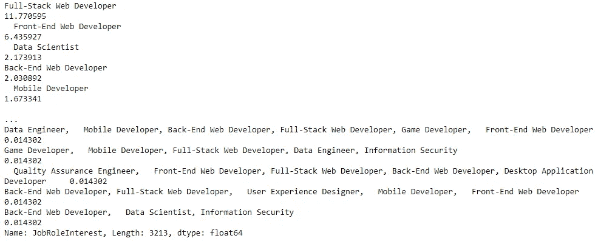
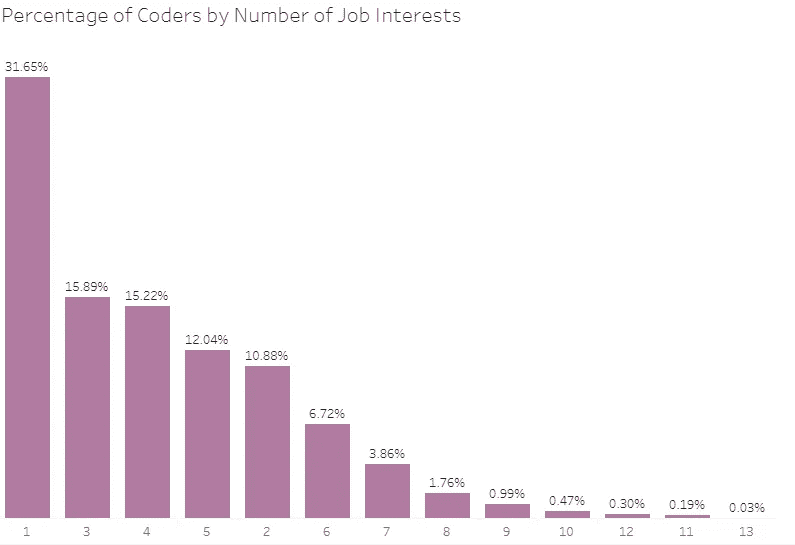
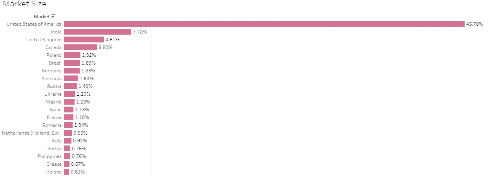
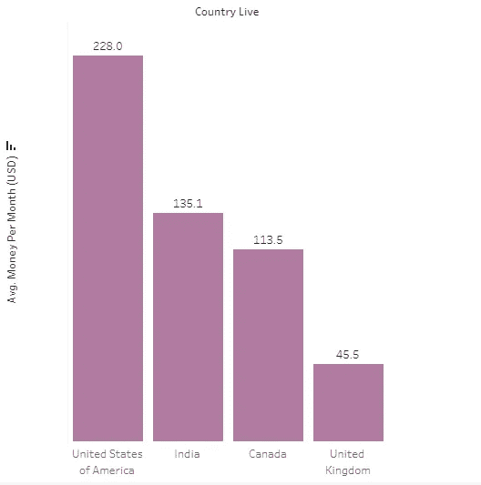
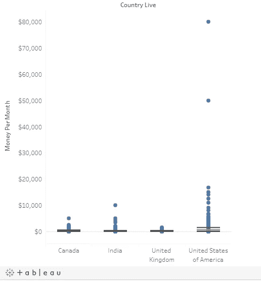
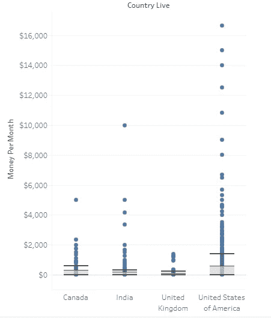
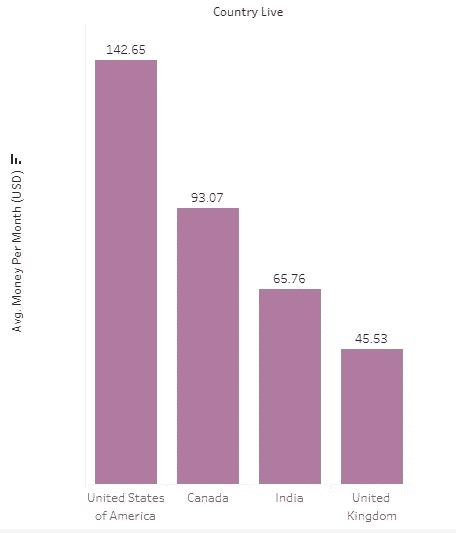
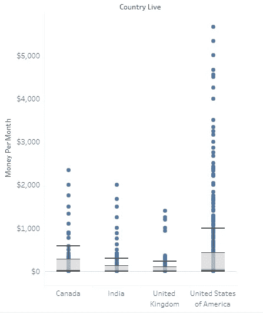
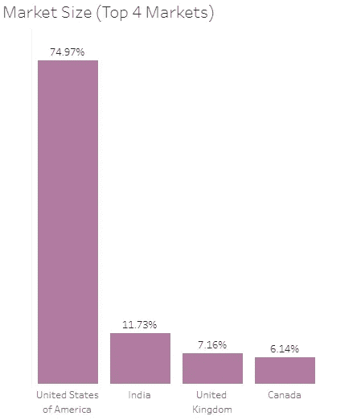

# 一个公司如何找到最好的市场来投放广告？

> 原文：<https://towardsdatascience.com/how-does-a-company-find-the-best-market-to-target-their-ads-a717a3c828c7?source=collection_archive---------42----------------------->

## 使用 Plotly 和 Tableau 识别最佳广告市场。


[马约菲](https://unsplash.com/@mayofi?utm_source=medium&utm_medium=referral)在 [Unsplash](https://unsplash.com?utm_source=medium&utm_medium=referral) 上的照片

一家虚构的电子学习公司，目前总部设在美国，要求我进行一项调查，以确定推广其产品的最佳市场。他们也想知道学习者愿意为哪种内容付费。

这家公司提供不同的编程课程，包括 web 开发、移动开发、数据科学和游戏开发。Web 开发和移动开发占据了所提供课程的最大份额，学习者需要**支付 59 美元**的月费才能访问课程内容和资源。

在这篇文章中，我将带你了解我为公司寻找最佳市场的步骤；利用情节和画面。

# 收集数据

我有两种选择来找到合适的数据——对不同的市场进行调查，或者使用可靠来源的可用数据。考虑到我进行调查的时间和资源限制，我选择使用 [freeCodeCamp 2017 新编码器调查](https://medium.freecodecamp.org/we-asked-20-000-people-who-they-are-and-how-theyre-learning-to-code-fff5d668969)。

freeCodeCamp 是一个完全免费的电子学习网站，提供各种网络开发课程。我选择了他们的数据，因为他们经营着一家流行的媒体出版物，目前拥有 60 多万名粉丝。更重要的是，2017 年的调查吸引了兴趣不同的新程序员。

你可以在这里下载数据集[。](https://github.com/freeCodeCamp/2017-new-coder-survey)

# 初始数据探索

我使用以下代码来研究数据集:

```
import pandas as pd
survey_data = pd.read_csv(‘2017-fCC-New-Coders-Survey-Data.csv’, low_memory = 0)#low_memory prevents dtype warning
survey_data.shape
```

以下是熊猫数据框的截图:



熊猫数据框中数据集的前 5 行(截屏来自 Yeside Okelana 写的 [Jupyter 笔记本](https://github.com/YesideO/Finding-the-Best-Market-to-Advertise-In/blob/main/Finding%20the%20Best%20Market%20to%20Advertise%20In.ipynb)

数据集有 18，175 行和 136 列。列名也是不言自明的；这使得分析变得简单明了。

因为我要分析 Tableau 中的数据集，所以我将 Pandas 数据框从我的 Jupyter 笔记本导出到。包含以下代码的 csv 文件:

```
df.to_csv(r'Path where I wanted to store the exported CSV file\New File Name')
```

# 新编码者的利益分配

回想一下，尽管该公司提供的大多数课程都是关于移动和 web 开发的，但他们也提供数据科学和游戏开发等领域的课程。

但是首先，我们需要知道这个数据集有多大的代表性——**web 和移动开发也是新程序员的兴趣所在吗？**

为了回答这个问题，我为数据集中的`JobRoleInterest` 列创建了一个频率表，并做了以下观察:

*   相当多的新程序员只对 web 开发感兴趣(全栈、前端或后端开发)。
*   有些人对移动开发感兴趣。
*   少数人对移动和网络开发以外的主题感兴趣。



编码员的兴趣截图(图片来自 Yeside Okelana 的 [Jupyter 笔记本](https://github.com/YesideO/Finding-the-Best-Market-to-Advertise-In/blob/main/Finding%20the%20Best%20Market%20to%20Advertise%20In.ipynb)

可以查看 [Jupyter 笔记本](https://github.com/YesideO/Finding-the-Best-Market-to-Advertise-In/blob/main/Finding%20the%20Best%20Market%20to%20Advertise%20In.ipynb)查看频率表。

同时，频率表还显示，相当多的人有多重工作兴趣。因此，找出只对一个主题感兴趣的程序员和对多个主题感兴趣的程序员的比例是很有用的。

为此，我:

*   分割`JobRoleInterest`列，找出每个参与者选择的选项(我先去掉空值)，然后
*   使用选项为变量生成频率表。

下面是我为完成这一任务而编写的 Python 脚本:

为编码人员创建频率表的 Python 脚本(由 Yeside Okelana 编写)

然后，我用 Tableau 制作了这个条形图来形象化这个比例。



按兴趣数量划分的编码者百分比(在[表格](https://public.tableau.com/profile/yeside.okelana#!/vizhome/NumberofInterests/Sheet1)中创建的条形图，由 Yeside Okelana 提取)

显然，大约 32%的程序员对他们想从事的特定编程领域很有把握。

但是，公司是否应该考虑扩展他们的课程设置；事实上，68%的程序员有不止一个兴趣，这将有助于他们决定引入哪种内容。

但是由于我们的重点是 web 和移动开发，让我们看看有多少程序员对这两个主题中的至少一个感兴趣。

我用 Plotly 创建了一个饼图，来直观地展示 web 和移动开发兴趣与其他兴趣的比较

程序员对 Web 或移动开发与其他主题的兴趣(饼状图由[耶塞德·奥克拉纳](https://www.linkedin.com/in/yeside-okelana/)使用 Plotly for Python 制作)

图表显示，大多数(约 86%)编码人员对 web 或移动开发感兴趣。这表明新编码员的兴趣分布与公司的课程分布相匹配。

下一步是确定花费广告预算的最佳市场。

为此，我发现:

*   这些新编码员的位置，
*   编码员数量最多的地点，以及
*   这些地方的新程序员愿意花多少钱来学习。

# 新编码员的位置和密度

在这个数据集中，我们有两列国家级数据的特权:

*   `CountryCitizen`哪一项描述了编码者的原产国和
*   `CountryLive`描述编码者居住的国家。

然而，为了这个分析的目的，我与`CountryLive`专栏一起工作，因为营销团队对在人们目前居住的地方投放广告感兴趣。

此外，由于数据提供了国家层面的信息，我将每个国家视为一个市场。

> 在这个分析中，我通过市场中编码者的数量来定义感兴趣的市场。本质上，一个市场的潜在客户数量越多越好。

我们来看看市场规模…



总体市场规模(图表由 Yeside Okelana 的 [Tableau dashboard](https://public.tableau.com/profile/yeside.okelana#!/vizhome/MarketSize_16142866601080/Dashboard1) 生成)

从这个图表中可以看出，45.7%的程序员生活在美国。这是一个相对较大的数据比例。由于 freeCodeCamp 的总部设在美国，预计很大一部分受访者将来自美国。

我们还看到，像印度(7.7%)、英国(4.6%)和加拿大(3.8%)这样的国家构成了前四大潜在市场。

虽然带着这些信息在美国市场进行营销活动很有诱惑力，但为了盈利，了解这些市场的程序员愿意在学习上花费多少也很重要。

# 收入潜力

我和`MoneyForLearning`栏目一起工作，了解该公司在这些市场的收入潜力。本栏描述了参与者愿意为学习花费的金额。

**回想一下，订阅费是每月 59 美元。**

同时，我将剩下的分析限制在 4 个市场——美国、印度、英国和加拿大，原因如下:

*   这些市场有最高的绝对频率。
*   因为课程是用英语编写的，所以这些国家的官方语言也是英语是有帮助的。因此，广告有更高的机会接触到正确的受众。

接下来，我创建了一个名为`money_per_month`的新列，它描述了一个学习者每个月在学习上花了多少钱。我通过将`MoneyForLearning`列除以`MonthsProgramming`列来创建这个列。然后，我将每个市场的价值可视化在一个条形图中，如下所示:



前 4 大市场每月的平均收入(在[表格](https://public.tableau.com/profile/yeside.okelana#!/vizhome/InitialMoneyPerMonth/Sheet1)中创建了图表)

从柱状图中，我们可以看到，平均来说，美国的学习者愿意支付最高的月费。

然而，如果我们考虑一些社会经济因素，如人均国内生产总值，那么人们可能会问为什么印度的学生愿意比英国甚至加拿大的学生支付更多的钱。

可能是加拿大和英国的数据代表性不足，或者是印度数据中存在异常值，使得平均值过高，或者是英国数据中存在异常值，使得平均值过低。也有可能数据是正确的。

让我们进一步调查，以得出结论。

# 处理极端异常值

我利用`money_per_month`列来可视化可能的异常值。

下面的方框图显示了 4 个市场的`money_per_month`值。



前四大市场每月的资金分布情况(图表由 Yeside Okelana 在 [Tableau](https://public.tableau.com/views/InitialMoneyPerMonth/Sheet2?:language=en-GB&:retry=yes&:display_count=y&:origin=viz_share_link) 中创建)

乍一看，我们无法从这个箱线图中确定印度、加拿大和英国是否存在极端异常值。但是美国有明显的极端异常值——2 个人表示他们每月支付超过 50，000 美元，这很奇怪，但并非不可能。

然而，出于分析的目的，我排除了大于$20，000 的值。

排除大于 20，000 的`money_per_month`值后，平均值发生变化。看看新的价值观:


Yeside Okelana 制作的[条形图](https://public.tableau.com/profile/yeside.okelana#!/vizhome/InitialMoneyPerMonth/Sheet4?publish=yes)截图

下面是一个显示剩余值分布的箱线图:



图片来自[方框图](https://public.tableau.com/views/InitialMoneyPerMonth/Sheet3?:language=en-GB&:display_count=y&publish=yes&:origin=viz_share_link)由叶塞德·奥克拉娜在 Tableau 中创作

看方框图，很明显还是有几个极端的异常值。印度的值大于 2500 美元，美国的值大于 6000 美元，加拿大的值大于 5000 美元。

我进一步分析了这些值，并根据某些标准剔除了一些异常值。

例如，我观察到，印度有 6 名受访者表示，他们花了 2500 多美元学习，但没有人参加训练营。

我认为，受访者输入如此高价格的一个可能原因是他们误解了“*除了大学学费，到目前为止，您在学习编程上花了多少钱(以美元计)？*“所以，他们一定输入了他们的学费。我消除了这样的争吵。

你可以在 [Jupyter 笔记本](https://github.com/YesideO/Finding-the-Best-Market-to-Advertise-In/blob/main/Finding%20the%20Best%20Market%20to%20Advertise%20In.ipynb)中获得我使用的淘汰标准的全部细节。

这是一个条形图，显示了每月花费的重新计算的平均值。



前四大市场每月平均收入(截图摘自 Yeside Okelana 制作的 [Tableau 图表](https://public.tableau.com/views/FinalMoneyPerMonth/Sheet1?:language=en-GB&:display_count=y&publish=yes&:origin=viz_share_link)

…以及每个市场中`money_per_month`分布的最终箱线图。



前 4 个市场的每月货币值分布(方框图由 Yeside Okelana 在 [Tableau](https://public.tableau.com/views/FinalMoneyPerMonth/Sheet2?:language=en-GB&:display_count=y&publish=yes&:origin=viz_share_link) 中创建)

我们现在已经非常接近确定最佳广告市场了。

# 选择最佳市场

很明显，在这 4 个市场中，美国是我们绝对应该做广告的一个市场，因为大多数新程序员目前都住在那里，他们愿意花高价学习(平均 143 美元)。

加拿大似乎是第二个要考虑的市场，因为学习者愿意支付比在印度和英国更高的价格。

然而，有几个原因可以解释为什么将印度视为第二好的市场会更好。他们在这里:

*   对于印度的潜在客户来说，每月 59 美元的订阅费似乎并不贵，因为他们平均可以支付 66 美元。
*   印度的潜在客户几乎是加拿大的两倍。



前四大市场中每个市场的规模(由耶塞德·奥克拉纳用[画面](https://public.tableau.com/views/FinalMoneyPerMonth/Sheet3?:language=en-GB&:display_count=y&publish=yes&:origin=viz_share_link)创建)

不清楚我们应该在印度和加拿大这两个市场中选择哪一个。因此，我们有三个选择。

**选项 1**

把广告预算全部花在美国市场上。

**选项 2**

利用市场规模的比例，**在美国和印度**或**美国和加拿大**之间划分广告预算，如下所示:

*   美国为 86%，印度为 14%。
*   美国为 92%，加拿大为 8%。

**选项 3**

利用市场规模的比率，**在美国、印度和加拿大之间划分广告预算**如下:

*   美国为 80%，印度为 13%，加拿大为 7%

然而，这些选项最好由营销团队仔细检查，然后他们将利用他们的领域知识在印度和加拿大进行新的调查。有了新的调查，我就可以对新数据进行进一步分析，做出更明智的决策。

同时，根据现有数据，没有考虑英国市场，因为平均`money_per_month`低于订阅费。

# 结论

这个项目的目标是找到做广告的最佳市场。根据我对 [freeCodeCamp 2017 年新程序员调查](https://medium.freecodecamp.org/we-asked-20-000-people-who-they-are-and-how-theyre-learning-to-code-fff5d668969)的分析，很明显美国是一个很好的广告市场。但是在印度和加拿大之间做决定并不容易。

然而，我认为，营销团队将处于最佳位置，要么使用此分析的结果来确定要考虑的其他市场，要么创建一个新的调查，以便做出更明智的决策。