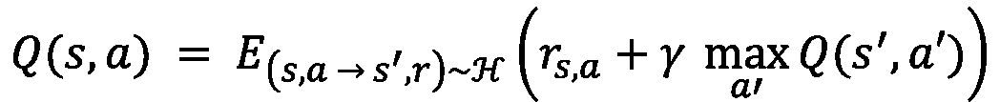
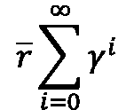
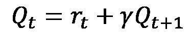
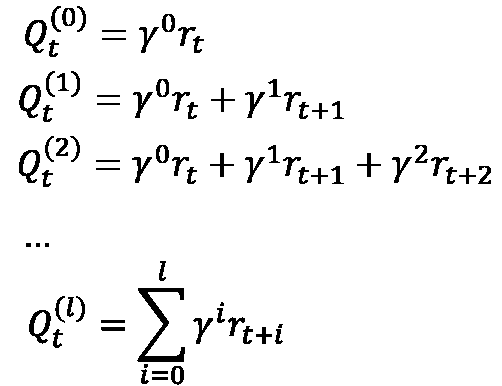
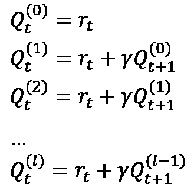
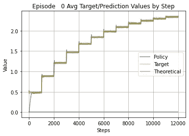
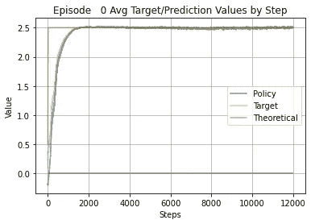
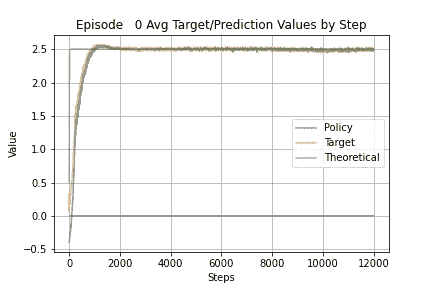

# DQN 如何逼近贝尔曼方程？

> 原文：<https://towardsdatascience.com/how-does-a-dqn-approximate-bellmans-equation-53e591d5e33?source=collection_archive---------35----------------------->

## 建立直觉

这是那些可能比自己发现更难解释的事情之一。在深度 Q 学习中，贝尔曼方程由 DQN 近似的方式在直觉上并不明显。这篇文章是关于我对正在发生的事情的探索。一个简单的 DQL 模型，其代码可在[这里](https://github.com/kamfonas/DQN-Bellman)获得，有助于可视化 DQN 学习，并揭示了算法如何迭代和向固定点前进。如果感兴趣，下载模型并调整参数，以探索它们的效果和相互依赖性。

为什么这种洞察力是有用的？因为它导致在配置与经验重放相关的超参数(如缓冲区大小、采样批量大小、目标更新频率)时做出更明智的决策。它也有助于解释意外结果或不稳定性的一些原因，特别是在训练有限数量的数据时。

本文假设读者熟悉深度 Q-Learning，并且具有经验重放和双(策略和目标)DQN 实例的典型实现的工作知识。有太多关于强化学习、Q 学习和深度 Q 学习的参考文献。DeepLizard 的这一系列[四教程、](https://deeplizard.com/learn/video/xVkPh9E9GfE) [Tambet Matiisen](https://neuro.cs.ut.ee/author/tambet-matiisen/) 的文章“[揭秘深度 RL](https://neuro.cs.ut.ee/demystifying-deep-reinforcement-learning/) ”以及 Jonathan Hui 的 [RL - DQN 深度 Q-Network](https://jonathan-hui.medium.com/rl-dqn-deep-q-network-e207751f7ae4) 就是这样三个参考资料，它们为本文奠定了基础，并提供了引入该主题的补充方式。

DQN 被训练来近似的贝尔曼方程的形式是:

> 采取行动 a 后状态 s 的 Q 值是括号中表达式的期望值，由此从(s，a)到新状态 s '和奖励 r 的映射从经验重放历史 h 中导出。括号中的表达式是该步骤的奖励与新状态 s '的贴现最大 Q 值的总和，其中 a '是最大化行动。贴现因子为 ***γ。***

双 DQN 的实现，使用两个相同的神经网络实例:策略 DQN 和目标 DQN。政策——DQN 是用于制定每一步决策的地方，也是所有培训发生的地方。目标 DQN 只是策略 DQN 的快照的被动副本，每*步都会被替换。这是通过简单地复制其权重来完成的。设 ***l*** 为跟踪这些 ***τ*** 步循环的序号。在周期 ***l*** 期间的目标 DQN 近似于在周期 ***l-1*** 期间学习的策略 DQN 函数。当然，这假设 DQN 的架构是正确的，并且能够学习接近目标 Q 值，我们认为这是给定的，这超出了本文的范围。*

*为了直观显示目标和政策 Q 值随时间的变化，并展示它们如何捕捉任意大量的未来贴现回报，我们将进行两种简化:*

1.  *我们将我们的环境限制为只有一个动作，使动作选择具有确定性。这消除了在比较不同轨迹的累积未来回报时的任何模糊性，并确保我们是在比较苹果与苹果。*
2.  *我们用五个随机特征(可以是任何数字)构建状态，取值从 0 到 1，奖励总是设置为这五个值的平均值，即每一步的期望值相同。因此，累积奖励单调增加并接近一个固定点，即平均奖励乘以γ的幂的和的渐近极限:*

**

*我们使用这个数学表达式来生成未来奖励的每个深度级别的理论贝尔曼方程结果，并将这些值与每个步骤中相应的目标和政策 DQN 生成的值进行比较。*

*考虑到这两种简化，我们可以将贝尔曼方程简化为:*

**

*其中 t 表示沿着确定性轨迹的步骤序列。上面的函数是尾递归的，和原来的贝尔曼方程一样，可以简化为一次迭代。此外，如我们所见，第二项形成一个收敛于一个不动点的级数。为了说明这是如何工作的，让我们用循环序列 ***l*** 来解开递归标记级数的每一级:*

**

*未来奖励的进展*

*第一个公式简单地计算 Q 作为步骤 t 的奖励。第二个和每个后续公式通过增加一个未来折扣奖励的步骤使计算更加精确。显然， ***l*** 的每一次增加都对应于贝尔曼方程右侧的一个额外嵌套项:*

**

*用贝尔曼方程研究未来报酬的级数*

*这个 Q 函数阶梯对应于由目标 DQN 在由 ***l*** 表示的周期序列中捕获的快照阶梯。最初，目标 Q 函数是第一个方程，其中 ***l*** *=0* 。每个新周期 ***l*** 开始于将目标与策略 DQN 同步，随后训练策略 DQN 以接近贴现未来奖励的附加水平( ***l+1*** )。在每个周期中，DQN 接近由贝尔曼方程定义的固定点。*

*这看起来像是可以通过迭代实现的递归函数的教科书示例。不同之处在于，该循环不是简单地聚集数据，而是“递归地改进”非线性函数，即策略 DQN，其模拟收敛序列，即贝尔曼方程。在每次迭代期间，DQN 被训练到极限的更好的近似值，即固定点。因为我们使用迭代而不是递归，我们的过程要求我们在训练期间覆盖策略 DQN 的相同实例。目标 DQN 就像一个“变量”,它保存了在生成目标时使用的最后一次迭代的策略 DQN 的副本。每一次迭代都需要 ***k*** 步，但是如果我们选择设置 k=1，那么我们的双 DQN 实现将会崩溃(或者变得类似于)为单个 DQN 实现。*

*让我们来看看所有这些与 DQN 架构和相关超参数相关的一些含义。但是首先，我们总结一下我们使用的符号:*

****k*** 是目标更新事件之间的步数
***m*** 是一集的步数(假设没有终端状态)
***m/k*** 是一集的目标更新事件数
***l*** 是截至时间 ***t* 的目标权重更新总数
***b*** 是来自重放缓冲区的每批重放样本的经验数***

****DQN 的训练不能捕获比 l 更多的未来折扣奖励水平:***【DQN】不能将比执行的目标权重更新的次数更长的未来折扣奖励范围纳入其贝尔曼方程的近似中。即使 ***k*** 比成功训练策略 DQN 所需的时间长得多，也是如此，因为用于训练的目标被限制为比前一周期的目标多一个级别。即使每个周期的训练都很完美，目标也会被训练到 ***l*** 的水平。*

****γ的高值需要更大数量的目标权重更新:*** 考虑选择**= 0.95*需要***l****= 45*次迭代来覆盖在折扣 Q 值中贡献 10%或更多的所有项。这是因为***γ****⁴⁵=0.10*。对于***γ****= 0.8*只需要大约***l****=*10 次迭代自***γ****⁰= 0.11*。这说明了为什么设置***γ****= 1*或非常接近它会有问题。通常，我们希望接近渐近极限的 10%以上，因此我们必须确保允许足够的目标更新来充分训练 DQN。为了包括所有贡献超过 1%的未来奖励，这两种情况所需的迭代次数分别为 90 和 21。最小迭代次数由表达式***log(d)/log(γ)***给出，其中 ***d*** 是最小可接受折扣，而 ***γ*** 是折扣因子:**

> *****log(0.01)/log(0.95)= 90*****
> 
> **log(0.01)/log(0.80)= 21**

*****用于将策略 DQN 训练到每个新目标的示例数量是 b*k:*** 可能需要调整一批中的经验数量，以便在一个训练周期中使用足够的经验。当然，训练可以持续不止一集。**

*****第 1 次迭代期间的训练对于所有级别 i ≤ l 连续进行:*** 学习通常比上面的讨论所表明的更流畅且更少条块化。例如，一个目标迭代的训练可能在分配的 ***k*** 步骤中只部分完成。对于单个 DQN 的情况或者如果 k = 1，这显然是这种情况。训练优化所有未来奖励等级，最高(但不超过) ***l*** 。**

****设置 k=1 模拟单个 DQN 的情况:**使用单个 DQN 作为政策和目标，只要它收敛，将可能近似于贝尔曼方程。这个场景相当于有两个实例，并且在每一步都更新权重，即***k****= 1*，从而策略 DQN 的训练量只受批量 ***b*** 的控制。**

****避免重放缓冲区中的陈旧体验:**较长的重放缓冲区可以容纳更多种类的体验和更大的批量样本。根据应用，这可能是所希望的。然而，如果缓冲区跨越多个情节，特别是如果相同的数据集范围被重复用于训练，这可能导致不稳定。原因是，从混合了新的和陈旧的经验的缓冲区中取样可能会导致不同的轨迹和不同的奖励，从而导致不一致或倒退的学习行为。这更有可能发生在有噪声的数据中。比方说，在训练的早期阶段，一个特定的状态倾向于动作 1，而在训练的后期，同样的状态倾向于动作 2。如果两个体验都存在于重放缓冲区中，选择较早的一个将会适得其反。避免这种情况的一种方法是让重放缓冲区安全地变大，但不要大到有采样陈旧体验的风险。**

*****DQN 有效性，低 l 和/或嘈杂的数据可以被混杂:*** DQN 架构的不足之处，或嘈杂的环境可以造成跳动的损失。不仅绘制损失图，而且分别绘制目标 Q 值和预测 Q 值也有助于分析。如果平台以与目标重量更新相对应的间隔出现，则有理由怀疑训练没有充分渗透到足够的未来折扣水平，或者更新必须更频繁，或者可能需要更大批量或更长时间的训练。如果这发生在训练过程中，请考虑在以前没有训练过的数据中形成新机制的可能性。**

*****对于较小规模的训练数据，考虑到γ，k，l，b，m:*** 之间错综复杂的依赖关系， ***γ*** 的值越高，说明足够的目标更新 ***l*** 对于确保未来奖励折扣的足够深度越重要。请记住，正是目标更新频率扩展了未来折扣奖励的范围，因此如果您需要 ***γ*** 非常接近 1，您可以考虑单个 DQN(如果它收敛)，或者具有较小*k 的双 dqn 增加批量 ***b*** 可以补偿较短的迭代。为了提高稳定性，尽量允许足够多的例子***b*********k***在每个目标迭代内进行训练。每个周期培训所需的示例数量也取决于数据的性质和 DQN 体系结构。***

**一个具有单一动作环境的普通工作 DQL 有助于说明这些要点。你可以在 [this GitHub](https://github.com/kamfonas/DQN-Bellman) repo 获取代码。该状态包含五个取值在 0.0 和 1.0 之间的随机特征。回报总是这五个特征的平均值。下图显示了以三种不同方式产生的随机批次经验样本的平均 Q 值:(1)政策 DQN，(2)目标 DQN，以及(3)根据前面所示的每个 ***k*** 步骤的 Bellman 方程的扩展计算出的理论值。该情节长 12000 步，目标更新每 1000 步发生一次，并且批量样本大小为 250 次经历。该图清楚地显示了从 Q=0.5 开始，每 1000 步增加一个折扣项，这些值如何在理论级数后达到平稳状态。我们用贴现因子 ***γ*** *= 0.8。*奖励的期望值总是 0.5，作为(0，1)中 5 个随机值的平均值。**

****

**k=1000，b=250，m=12000**

**大批量和长(1000 步)目标更新间隔导致低方差并允许快速收敛。数列收敛到的渐近极限是***r***/(1-***γ****)= 2.5*for****γ****= 0.8****r****= 0.5。****

**通过将目标更新频率加倍到 2000 步，如下图所示，适合该集的六个周期不会从上一次运行的前六个周期扩展未来的奖励深度，并且它们最终与目标更新频率为 1000 时处于相同的水平。正是级别的数量将贝尔曼方程的精确度限制在未来奖励折扣的 6 个级别。实际上，每一级似乎都可以通过少量的步骤被充分训练到新的水平。当然，在更复杂的环境中，可能需要更多的示例来实现充分的培训。**

****

**k=2000，b=250，m=12000**

**接下来，我们将更新目标频率设置为 1，并将批处理设置为 1000。下图显示了理论线如何以接近垂直的方式达到渐近值，而目标值和政策值需要接近 1500 步才能达到该水平。这演示了如何同时训练多个深度级别，最多可达权重更新事件的数量。**

****

**k=1，b=1000，m=12000**

**我们重复相同的运行，但使用较小的批量:250。请注意，方差增加，训练变得更加紧张，**

****

**k=1，b=250，m=12000**

**你可以尝试批量大小、目标更新间隔、未来奖励折扣因子的不同组合，甚至尝试 1、2 或 3 个隐藏层的不同 dqn。“readme”文件概述了代码以及如何通过配置文件更改超参数。**