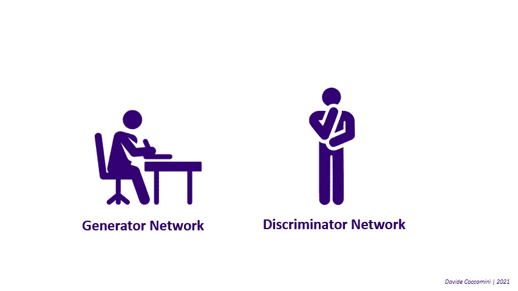
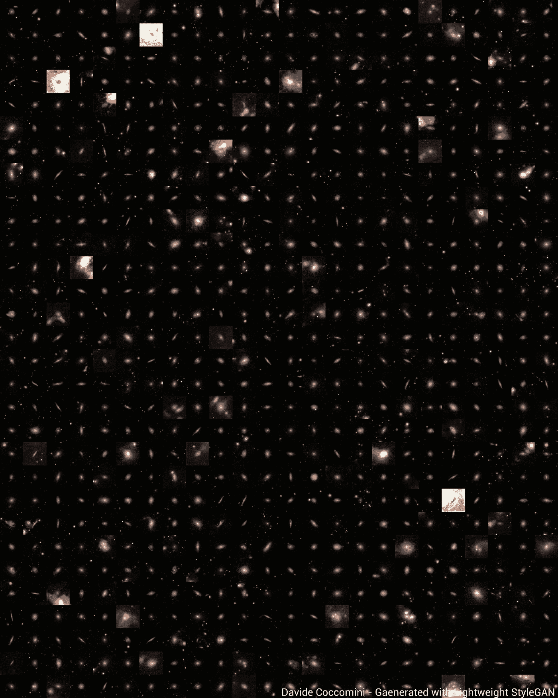

# 一个 AI 是如何想象宇宙的？

> 原文：<https://towardsdatascience.com/how-does-an-ai-imagine-the-universe-d1d01139b50a?source=collection_archive---------29----------------------->

## 利用生成性对抗网络生成新的世界、星系和恒星

由 [Unsplash](https://unsplash.com?utm_source=medium&utm_medium=referral) 上 [Greg Rakozy](https://unsplash.com/@grakozy?utm_source=medium&utm_medium=referral) 拍摄的照片

外面有什么？在这个浩瀚、无限、不可思议的宇宙中……有史以来，恒星、行星、星云、天体都在碰撞、绕行、诞生、消亡。

照片由[腾雅特](https://unsplash.com/@tengyart?utm_source=medium&utm_medium=referral)在 [Unsplash](https://unsplash.com?utm_source=medium&utm_medium=referral) 上拍摄

人类总是着迷地仰望天空，想象着梦幻般的世界和遥不可及的星系，这促使人类利用科学来更好地了解宇宙。

多亏了现代望远镜，我们现在可以仰望星空，发现许多关于宇宙和我们自己的真实面貌。

杰里米·珀金斯在 [Unsplash](https://unsplash.com?utm_source=medium&utm_medium=referral) 上拍摄的照片

太空也一直是全世界艺术家的灵感来源，他们甚至创造了一个专门用于天文学的特殊流派，即“太空艺术”，来展示宇宙的奇迹。几个世纪以来，产生了无数的艺术作品，从 1301 年乔托的《东方三博士的崇拜》中天空中的彗星，到展示遥远、迷人和想象中的星系的现代艺术作品。

杰里米·珀金斯在 [Unsplash](https://unsplash.com?utm_source=medium&utm_medium=referral) 上拍摄的照片

因此，几个世纪以来，我们已经看到了科学家是如何发现宇宙的，艺术家是如何想象和抽象宇宙的，**但人工智能会怎么想呢？它会如何想象宇宙？**

我们现在能够回答这些问题，这要归功于生成性对抗网络(GANs)，这是一种能够查看一系列图像并生成新的可信图像的神经网络！

gan 由两个截然不同的网络组成，一个是生成器，一个是鉴别器，这两个网络是相互对照的。生成器查看输入数据，试图生成新的可信图像，以欺骗鉴别器。另一方面，鉴别器试图理解给定的图像是生成的还是原始的。当生成器在生成图像方面变得足够好以至于骗过鉴别器时，除了输入数据中存在的例子之外，它还可以用于创建其他可信的例子。

作者图片

然后，我创建了一个小型数据集，其中包含 600 个真实空间场景的例子，包括行星、星云、星系和恒星，以及虚构的空间主题绘画和艺术品。这些图像将成为我们的 GAN 的输入，并将作为它理解空间是什么的知识库。

有了这些数据，我首先训练了一个能够生成 128x128 像素图像的小型 GAN，然后是一个轻量级的 StyleGAN，这是目前最强大的 GAN 之一。

## 让我们来看看由**小**甘生成的一些最精彩的图像！

图片由[作者](https://www.linkedin.com/in/davide-coccomini/)

在这个奇妙的网络生成的宇宙中，行星、太阳和星系可以清晰地分辨出来，它们明亮的颜色照亮了黑暗的空间，这是通过一个相当小的网络和一些样本图像获得的。

但是网络是如何实现这些结果的呢？这一切都始于简单的噪声，图像以一种几乎随机的方式生成，生成器网络逐渐学会进化以欺骗鉴别器网络。

让我们来看看随着时代的推移，甘是如何生成图像的:

图片由[作者](https://www.linkedin.com/in/davide-coccomini/)

## 这些是小 GAN 获得的结果，现在让我们看看轻量级版本的 StyleGAN 能够生成什么！

图片由[作者](https://www.linkedin.com/in/davide-coccomini/)

惊人的和非常现实的图像！以下动画展示了 GAN 实现这一奇妙结果的过程:

图片由[作者](https://www.linkedin.com/in/davide-coccomini/)

但是我们想要更多。为什么要满足于产生单一的天体呢？我们想要创造一个完整的宇宙！

好吧，也许让一个 GAN 自己生成宇宙的一部分有点过分了。然而，我们可以从[哈勃望远镜中获得灵感，该望远镜能够通过将对宇宙各个部分的观察结合在一起而组合出一幅广阔的宇宙图](https://www.nasa.gov/feature/goddard/2019/hubble-astronomers-assemble-wide-view-of-the-evolving-universe)。我们不能做些类似的事情吗？

幸运的是，我们不需要建造一个巨大的望远镜来获得我们的观测结果，因为七年前在 Kaggle 上开始了一场比赛，以训练一个可以区分不同类型星系的分类器。一个巨大的数据集被建立起来并公之于众，该数据集包含了由望远镜捕捉到的成千上万的各种大小、形状和颜色的星系的真实图像。

有了这么多数据，不尝试利用我们的星系来产生新的星系将是一种浪费，你不这样认为吗？我已经完成了，这些是模型生成的图像:

图片由[作者](https://www.linkedin.com/in/davide-coccomini/)

太棒了。有了这些结果，我们可以将这些图像组合在一起，生成一个广阔的宇宙视图！为了做到这一点，我们的 GAN 生成的图像将与其他正方形和中性图像相结合，以在空间的各种随机区域中给出空白空间的感觉。

一些中性瓷砖的例子。图片由[作者](https://www.linkedin.com/in/davide-coccomini/)提供。

所有这些图像将被随机混合，调整大小，旋转，最后组合成一个大图像！

**各位，这就是，甘宇宙！**

图片由[作者](https://www.linkedin.com/in/davide-coccomini/)

我们已经到达了旅程的终点。我们让自己陶醉在这些奇幻的世界里，在无尽的宇宙中迷失了自己的心智。当然，那里有无限的星系和行星，迷人而遥远，还有更多我们可以想象和绘制，今天甚至可以自动生成，但有一点是肯定的，我们所有人都应该清楚:

*在无限的宇宙中，只有一个地球。*

美国宇航局在 [Unsplash](https://unsplash.com?utm_source=medium&utm_medium=referral) 拍摄的照片

这种意识加上我们近年来目睹的可怕的灾难性现象，应该促使我们思考保护我们星球的健康是多么重要。政府间气候变化专门委员会(IPCC)的科学家最近敲响了警钟，称人类为红色代码。人类活动导致气温急剧上升，降雨模式发生变化，海平面上升，全球野火数量显著增加。

法比安·琼斯在 [Unsplash](https://unsplash.com?utm_source=medium&utm_medium=referral) 上的照片

在日常生活中养成良好的习惯当然是抵消这种现象的好方法，但最大的影响当然可以由政府通过立即有效的监管来实现。否则，简单地说其他人应该带头并不是一种建设性的态度，因为这篇文章的许多读者都对机器学习的世界感兴趣，[我收集了一些可能的起点，以产生具体的影响](/should-machine-learning-experts-respond-to-climate-change-call-to-action-1ffeb4ba008b)。

看星星，但保护你的地球。

执行类似实验的代码现在可以在 Github 上获得[！](https://github.com/davide-coccomini/gan-universe)

# 参考资料和见解

[1]《大卫·柯考米尼》。"[机器学习专家应不应该响应气候变化号召行动起来？](/should-machine-learning-experts-respond-to-climate-change-call-to-action-1ffeb4ba008b)

[2]“约瑟夫·罗卡”，“[理解生成性敌对网络(GANs)](/understanding-generative-adversarial-networks-gans-cd6e4651a29) ”

[3]“罗汉·贾格塔普”，“[生成性对抗网络(GANs)综合指南](/a-comprehensive-guide-to-generative-adversarial-networks-gans-fcfe65d1cfe4)”

[4] "Ian J. Goodfellow 等人"，"[生成性对抗网络](https://arxiv.org/abs/1406.2661)"

[5]“d .哈维等人”，“[银河动物园——银河挑战](https://www.kaggle.com/c/galaxy-zoo-the-galaxy-challenge)”

[6]“luciduals”，“ [StyleGAN2 Pytorch 实现](https://github.com/lucidrains/stylegan2-pytorch)

[7]“luciduals”，“[轻量级 StyleGAN Pytorch 实现](https://github.com/lucidrains/lightweight-gan)”

[8]“美国国家航空航天局”，“[哈勃天文学家汇集广观不断演化的宇宙](https://www.nasa.gov/feature/goddard/2019/hubble-astronomers-assemble-wide-view-of-the-evolving-universe/)

【9】《维基百科》，[什么是太空艺术或天文艺术？](https://en.wikipedia.org/wiki/Space_art)

[10]“IPCC”，“[气候变化广泛、迅速、加剧](https://www.ipcc.ch/2021/08/09/ar6-wg1-20210809-pr/)