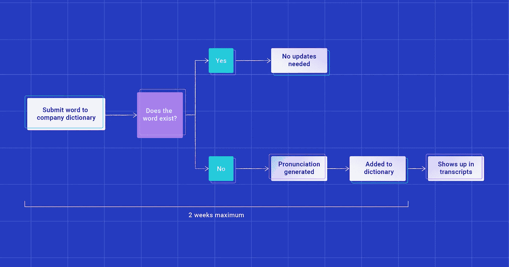

# ASR 系统如何处理从未见过的单词？

> 原文：<https://towardsdatascience.com/how-does-an-asr-system-handle-never-before-seen-words-55a27bc40a4c?source=collection_archive---------36----------------------->

## 语言的教训:Dialpad 的数据科学研究团队正在进行的系列中的第一篇

首先，如果你是自动语音识别(ASR)的新手，一定要看看我同事的 [ASR 101 帖子](https://www.dialpad.com/blog/automatic-speech-recognition/)。这些信息会派上用场，因为今天，我们将更进一步，看看如何训练 ASR 系统。具体来说，就是学习从未见过的新单词。

传统的 ASR(自动语音识别)系统有三个主要组件:

*   声学模型，
*   语言模型，以及
*   发音词典。

发音词典包含单词及其相关发音(在某些情况下是多个发音)。在这种类型的系统中，任何不在本词典中的单词*都不会被输出到抄本中。*

即使字典里有成千上万的单词，我们也需要一种方法来不断更新它，以确保我们为客户提供最准确的抄本。(我们的词汇和俚语总是在进化！)

因此，如果我们的转录系统在音频中遇到一个单词是字典中的*而不是*，它将使用字典中的单词以及听起来与所说的相似的单词来猜测所说的内容。

例如，我们的公司名称可能会出现为“拨号键盘”，而当 COVID 第一次出现时，它被转录为“觊觎”。

我们训练模型的方法之一是将音频发送给一组转录员，他们转录音频，这为我们提供了音频中所说内容的高度准确的表示。我们可以将从这个团队获得的数据与我们自己的词典进行比较，以识别当前不在词典中的单词。

平均来说，每 1000 个单词中大约有 6 个是我们的字典中没有的，我们称之为“词汇之外”的单词，或 OOV。

# OOV 里有什么？(有 6 种类型)

你可能想知道，在一本已经包含成千上万个词条的字典中，还会缺少哪些词呢？我们对其中的一小部分进行了分析。它们主要分为六个不同的类别:

# 1.人名——46%

绝大多数 oov 都是人名。由于各种原因，人名给 ASR 系统带来了相当大的挑战。

许多名和姓有多种拼法和发音。还有大量不同的名字，特别是当我们努力包括来自许多不同起源的名字，而不仅仅是西方国家常见的那些。

例如，这里列出了“基拉”这个名字所有可接受的拼法:凯拉、凯拉、凯拉、基拉、基拉、凯拉、凯尔哈、基利亚、凯拉、基拉和希亚拉。

# 2.真实 OOVs — 24%

大约四分之一的单词是我们确定为“真实”的未登录词。这些英语单词还没有进入我们的系统，可能是因为它们很少使用，或者是最近才被纳入我们的日常用语。

你可能遇到的一些“罕见用法”的例子包括“亚热带”和“嵌入”，而一个最近在使用中爆炸的词的好例子可能是“煤气灯”

# 3.首字母缩写— 20%

我们审查的单词中，大约有 20%是首字母缩写词，它类似于首字母缩写词，但发音是组成它们的字母，而不是单词。

例如，NASA 是首字母缩写，CRM 是首字母缩写 ASAP 可以两者都是！任何一个最近开始新工作的人都会告诉你，公司喜欢用很多首字母缩写！

我们希望确保我们能够识别它们，以正确地设置它们的格式，并能够将它们与说话者实际拼写单词的时间区分开来。

我们需要 EOD 把这个交给首席执行官。

**对**

*我的电子邮件地址在 Dialpad dot com 拼写为 J-O-N-E-S。*

# 4.公司名称— 8%

我们看到的公司名称通常分为两类:

*   那些发音像一个或几个常用词的词——想想 LinkedIn = linked in 和 Zoom = zoom，还有
*   那些没有的，比如 Deliveroo 和 Pinterest。

无论发音如何，我们都需要能够识别这些名称，以便正确地转录和格式化它们。我们遇到的一个公司名称的例子是 Spiceworks。

在不知道有一家公司叫这个名字的情况下，我们的文字记录会简单地将其转录为“spice works”

# 5.语言创新——2%

最后一类英语未登录词，诚然，也是我个人最喜欢的，是我们说话者的语言创新，也就是所谓的“实际上并不存在，但有人说过的单词”

人类非常擅长塑造词语来传达意思，而不会扰乱听者的理解！我最近遇到的一个很好的例子是“informationable”这个词，这个词*没有*出现在韦氏词典，但仍然能够传达“提供信息的能力”的定义

在这一类别中，我们经常看到的另一个例子是通用商标现象，或者当专有商标开始被用作产品或服务整体的描述符时。

当人们把一个品牌名称修改成一个动词时，比如“我在 Craigslisted 上卖了我的旧手机”，它最常以 OOV 的形式出现

# 6.非英语单词— 1%

一小部分单词是非英语单词。在大多数情况下，我们的字典中不包括其他语言，除了那些说英语的人常用的语言。

这方面的一个例子是来自短语“途中”的单词“en”，它源于法语，但在英语会话中常用。

到目前为止，这一直是我们的政策，但在阅读了[一篇关于这种方法相关问题的引人注目的文章](https://slate.com/technology/2021/04/live-captions-language-mixing.html)之后，我们将寻求在我们的产品中更公平地支持来自不同语言和文化的外来词。

# 我们还能如何识别 OOVs？

语言很棒，也很复杂。上面描述的方法甚至还不足以*识别对话中经常使用的所有行话、缩写和名字。*

我们正在处理数百万分钟的对话，而只有极小一部分被发送出去进行转录。

为了尝试和减轻这种情况，我们为客户提供了通过他们的[公司词典](https://help.dialpad.com/hc/en-us/articles/360022554371-Manage-a-Company-Dictionary)直接向我们提交这些单词的选项，这样我们可以快速将它们添加到我们的发音词典中，并在提交后两周内开始在我们的文字记录中识别它们。

这是迄今为止最有效的方法来帮助提高这些单词在你的成绩单上的准确性。完整过程如下所示:

图像由拨号盘提供

添加提交内容不仅有助于提高您自己的文字记录的准确性，也有助于使用相同术语的其他客户！我们还有一种更主要的方式来识别 oov，那就是通过一个叫做**网络搜集**的过程。

本质上，我们从客户的网站上提取数据，并对文本进行分析，以将产品名称或行话等重要术语与“the”等常用词区分开来。

这是一个非常成功的方法，因为它提供了一个团队使用的术语的更全面的视图。虽然使用公司的字典很好，但做条目的人可能会使用与不同团队或不同部门的人不同的词。

将字典与网络搜集的数据配对，可以让我们有一个更完整的可能出现在用户记录中的术语列表！

# 欢迎来到有史以来最大的语言课堂

我们一直在寻找新的关键短语来源，以包含在我们的模型中，并寻找其他方法来提供更准确的副本。

我们为客户的数据[开发最准确的副本的旅程](https://www.dialpad.com/fr/blog/leveraging-our-voice-intelligence-engine/)得到了客户的大力帮助，他们花时间在他们的公司字典中提供了周到的条目。