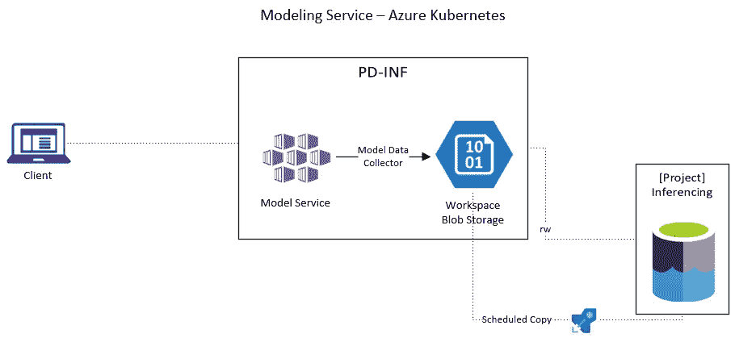

# Azure Kubernetes 服务如何执行零停机更新？

> 原文：<https://towardsdatascience.com/how-does-azure-kubernetes-service-perform-zero-downtime-updates-99820e17a84a?source=collection_archive---------19----------------------->


诺德伍德主题公司在 [Unsplash](https://unsplash.com?utm_source=medium&utm_medium=referral) 上拍摄的照片

## 本文给出了工作流的概述，并演示了如何通过 python 更新已部署的模型

机器学习模型有一个生命周期，这个周期的一部分是再培训/重新部署。模型需要更新的原因有很多(例如，特征漂移、协变量和目标之间的不同关系、改进、定期刷新等)。假设模型是**Azure Kubernetes Services**(AKS)中的一个实时应用，我们如何在不中断服务的情况下更新模型？

***假设*** :熟悉 [Azure 机器学习](https://docs.microsoft.com/en-us/python/api/overview/azure/ml/?view=azure-ml-py)软件开发包(SDK)和 [Kubernetes](https://kubernetes.io/) 。



来源:[史蒂文·洛艾萨](https://github.com/StevenLoaiza/Machine_Learning/tree/master/deployment)

# Kubernetes 更新工作流

Kubernetes 提倡部署模型的零停机更新。换句话说，建模服务不会被更新中断，它将继续处理请求而不会出错。

更新以分阶段的方式执行，以确保应用程序不受影响。假设您已经在 Azure Kubernetes 集群上部署了容器映像(模型)的第一个版本。您已经开发了模型的第二个版本，现在准备更新现有的 web 服务。

1.  创建一个图像并将更新提交给 web 服务(下面是 Python 示例)。
2.  由于这是一个渐进的展示 ***版本 2 创建了一个*** 新 pod，并将其添加到负载平衡器。
3.  映像版本为#1 的 pod 将被删除，负载平衡器将停止向 Pod 发送请求。尽管 pod 被删除，但它仍保持活动状态，以完成它仍在处理的任何请求(默认的终止宽限期为 30 秒[【1】](#1785))。
4.  重复，直到部署中的所有单元都有映像的版本#2。


来源:[史蒂文·洛艾萨](https://github.com/StevenLoaiza/Machine_Learning/tree/master/deployment)

# Python 实现

现在您已经理解了在 AKS 上更新图像的概念，我们将讨论如何通过 python 实现它。代码和配置文件位于 [GitHub](https://github.com/StevenLoaiza/Machine_Learning/tree/master/deployment) 上。

***前置条件***

1.  AML 工作区，计算实例，AKS 推理群集
2.  已部署的 AKS 服务
3.  该模型的新版本

更新方法有许多可以改变的参数[【4】](#3f5d)，默认设置为**无**，保持不变。当更新建模服务时，我包括推理配置(指定环境和评分脚本的路径)、模型、自动缩放和内存。

[config.json](https://github.com/StevenLoaiza/Machine_Learning/blob/master/deployment/config.json)

下面是`azure_utils.py`中定义的`AmlUtility`类。该类有几个函数来加载配置文件、设置环境、定义推理配置、加载新模型和部署更新。

[azure_util.py](https://github.com/StevenLoaiza/Machine_Learning/blob/master/deployment/azure_utils.py)

在终端上运行的示例脚本来自存储实用程序脚本的目录，它是:

```
python azure_util.py --config_path config.json --service_name current_deployment_name --new_model model_name:2
```

只要没有错误，当建模服务更新完成时，终端上的日志将会显示。

# 结论

这篇文章是为了教育目的。更新产品建模服务很可能超出了数据科学家的权限范围。停机会带来成本，因此更新和最小化成本最好留给其他专业团队。但是在开发阶段，当您迭代不同的版本时，这仍然是一个有用的特性。

一如既往地感谢您的阅读。你可以在 LinkedIn 上找到我！

# 参考

[1]:[https://learnk8s.io/graceful-shutdown](https://learnk8s.io/graceful-shutdown)

【2】:[https://www.youtube.com/watch?v=mNK14yXIZF4](https://www.youtube.com/watch?v=mNK14yXIZF4)

https://kubernetes.io/docs/concepts/workloads/pods/

[4]:[https://docs . Microsoft . com/en-us/python/API/azure ml-core/azure ml . core . web service . aks web service？view=azure-ml-py](https://docs.microsoft.com/en-us/python/api/azureml-core/azureml.core.webservice.akswebservice?view=azure-ml-py)

# 附录

## 未来相关文章

*   在 AML 中注册模型
*   在 AK 上部署模型并在本地调试
*   通过 ModelDataCollector()进行日志记录

## 问题

我在测试`AksWebservie.update()`[【4】](#3f5d)时遇到的两个问题:

*   关于第 [#3](#f0b9) 点，您可能会看到一个“ ***错误:副本在回复前关闭连接”。*** 发生这种情况是因为在 pod 被完全删除之前请求没有完成。**解决方案:**配置 pod 的终止宽限期，这可能超出了数据科学家的范围。[【3】](#f7e1)
*   如果映像通过 [ModelDataCollector](https://docs.microsoft.com/en-us/python/api/azureml-monitoring/azureml.monitoring.modeldatacollector?view=azure-ml-py) 转储日志，您可能会在部署过程中丢失日志。我没有找到与此问题相关的文档。**解决方案:**在非高峰时段更新映像，以最大限度地减少请求日志的丢失。