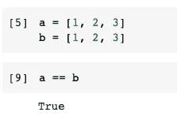
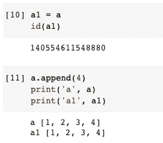
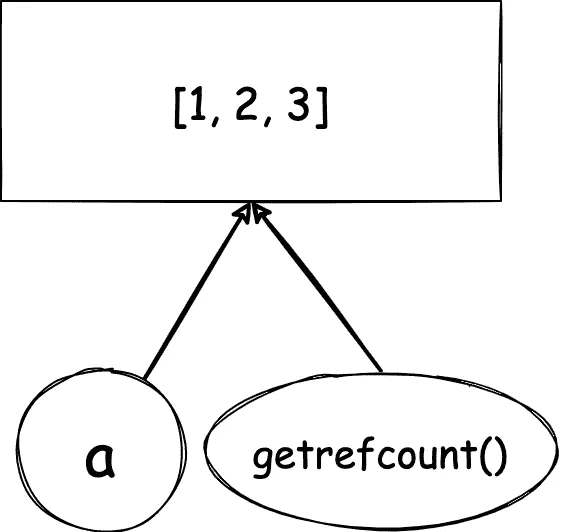
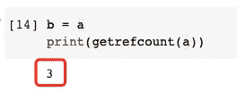
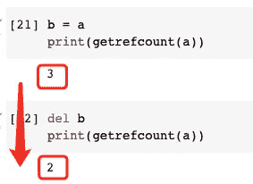
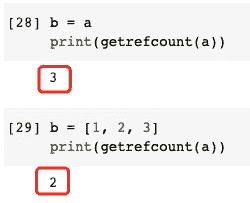
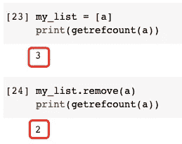
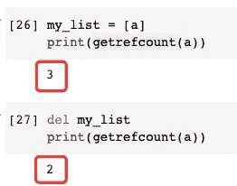
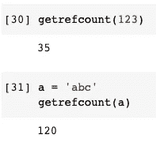
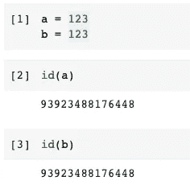

# Python 垃圾收集是如何工作的？

> 原文：<https://towardsdatascience.com/how-does-python-garbage-collection-work-a5dc544d880d?source=collection_archive---------10----------------------->


不幸的是，此时此地，我在 Pixabay 的旅程结束了

## 保持 Python 对象被引用，否则它们将被释放到内存中。

每种编程语言都有其特定的垃圾收集机制。这是指那些未使用的变量，它们仍然占据内存中的一些空间，最终将被删除。这对于更有效地利用存储空间是很重要的。

你有没有想过 Python 垃圾收集是如何工作的？特别是，Python 如何知道一个对象变得无用？在本文中，我将演示这种机制。将使用一些内置功能，如`id()`和`getrefcount()`。

# 显示内存地址


图片来自 [Pixabay](https://pixabay.com/?utm_source=link-attribution&utm_medium=referral&utm_campaign=image&utm_content=6569156)

在我们继续垃圾收集机制之前，有必要建立内存地址的概念。别担心，不一定要深潜。我将演示如何使用`id()`函数，这就足够了。

首先，让我们定义两个 Python 列表。就内容而言，它们可以完全相同。

```
a = [1, 2, 3]
b = [1, 2, 3]
```



显然，变量 a 和 b 是一样的。但是，这是否意味着这两个变量指向同一个内存地址呢？不。我们来验证一下。

```
id(a)
id(b)
```


`id()`函数会给我们一个对象的“身份”，用整数表示。如图所示，整数是不同的。所以，变量 a 和 b 指向不同的内存地址，尽管此刻它们是相同的。

如果我们创建另一个变量 a1，并让 a1 = a，就不会创建新的对象。相反，a1 将指向与 a 相同的内存地址。


有道理，这就是为什么当我们改变 a 时，a1 也会被更新。



# 参考计数


图片来自 [Pixabay](https://pixabay.com/?utm_source=link-attribution&utm_medium=referral&utm_campaign=image&utm_content=5419527)

现在我们可以讨论最重要的概念——引用计数。

基本上 Python 中的**引用计数**表示对某个对象的引用次数。这很重要，因为垃圾收集机制依赖引用计数来决定对象是应该保留在内存中还是应该释放在内存中。

也就是说，当对象的引用计数等于零时，它将被释放。非常直观合理的，当一个对象没有任何引用的时候，就意味着这个对象被抛弃了，没有用了。

那么我们如何获得引用计数呢？事实上，它可以被设计成一个内部机制，而不是简单地向开发者展示。但是，Python 实际上在`sys`模块中提供了一个名为`getrefcount()`的内置函数，可以方便地查询对象的引用计数。

要使用这个功能，我们需要从`sys`模块中导入它。这是 Python 3 的任何版本都内置的，所以您不需要下载或安装任何东西就可以使用它。

```
from sys import getrefcount
```

然后，让我们使用这个函数来查询引用计数。

```
a = [1, 2, 3]
print(getrefcount(a))
```


在这个例子中，我创建了一个变量`a`，并为它分配了一个简单的 Python 列表。然后，`getrefcount()`函数显示这个对象的引用计数是 2。

但是等等，为什么是 2？请看看下面的图表。



事实上，当我们使用`getrefcount()`函数查询一个对象的引用计数时，该函数必须建立对该对象的引用。这就是引用计数为 2 的原因。表示变量`a`和函数`getrefcount()`都在引用列表`[1, 2, 3]`。

# 什么会增加引用计数？


图片来自[Pixabay](https://pixabay.com/?utm_source=link-attribution&utm_medium=referral&utm_campaign=image&utm_content=1452219)s . Hermann&f . Richter

现在我们已经了解了引用计数以及如何查询一个对象的引用计数，但是什么会导致引用计数发生变化呢？以下操作将使引用计数增加 1。

**1。创建对象并将其赋给一个变量。**

这已经在前面的部分中演示过了。当我们创建 Python 列表对象`[1, 2, 3]`并将其赋给变量`a`时，列表对象`[1, 2, 3]`的引用计数被设置为 1。

**2。该对象被分配给另一个变量。**

当对象被赋给另一个变量时，引用计数将加 1。但是，请注意，这并不意味着以下内容。

```
a = [1, 2, 3]
b = [1, 2, 3]  # This will NOT increase the reference count
```

这已在第 1 节中讨论过。虽然列表相同，但它们是不同的对象。要增加引用计数，我们可以执行以下操作。

```
a = [1, 2, 3]
b = a
```



**3。对象作为参数在函数中传递。**

当我们使用函数`getrefcount(a)`时，情况正是如此。变量`a`作为参数被传递到函数中，因此它肯定会被引用。

**4。对象被追加到容器类型中。**

容器类型可以是列表、字典或元组，如下例所示。

```
my_list = [a]
```


# 什么会减少引用计数？


图片来自 [Pixabay](https://pixabay.com/?utm_source=link-attribution&utm_medium=referral&utm_campaign=image&utm_content=463928) 的[迈克尔·施瓦森伯格](https://pixabay.com/users/blickpixel-52945/?utm_source=link-attribution&utm_medium=referral&utm_campaign=image&utm_content=463928)

现在，让我们来看看将减少引用计数的场景。

**1。该对象已从函数范围中删除。这通常发生在函数完成执行时。**

如果我们尝试在函数执行期间打印引用计数，就可以验证这一点。所以，我们可以这样设计实验。

```
def my_func(var):
    print('Function executing: ', getrefcount(var))my_func(a)
print('Function executed', getrefcount(a))
```


但是为什么引用计数是 4 而不是 3 呢？这就涉及到 Python 的另一个概念，就是“调用栈”。

> 当在 Python 中调用一个函数时，一个新的帧被推送到调用栈上用于它的本地执行，并且每次函数调用返回时，它的帧被弹出调用栈。

这个概念不在本文中展开，因为它超出了讨论范围。如果您不熟悉调用堆栈，我可以告诉您的是，您看到的带有回溯和行号的错误消息正是来自调用堆栈。


因此，在执行`my_func()`期间，引用计数为 4。在它被执行之后，引用计数被减少回 2。

**2。当引用对象的变量被删除时。**

这个很好理解。当我们使用`del`命令删除变量时，该变量将不再引用该对象。



请注意，如果我们在这种情况下删除变量`a`，对象的引用计数将变为 0。这正是垃圾收集将释放该对象的场景。然而，这也意味着我们不能再使用`getrefcount()`函数来检查引用计数。

**3。当引用该对象的变量被赋予另一个对象时。**

这种情况可能会更频繁地发生。当一个变量被赋予另一个对象时，当前对象的引用计数将减一。当然，新对象的引用计数会增加。



**4。当对象从容器中移除时。**

当对象被追加到容器中时，引用计数将+1。相反，当它被移除时，引用计数将为-1。



当然，如果我们删除容器，引用计数也会减少。



# 一个特例

请注意，只有一般对象可以通过这种方式进行调查。这意味着当值是一个文字常量，比如数字`123`或字符串`'abc'`时，我们确实有特殊的情况。



如上所示，引用计数可能是意外的。在我的例子中，我使用 Google Colab，这样环境可以被共享，这导致了如此大的引用计数。

另一个值得一提的重要因素是，文字常量保证位于相同的内存位置。



因此，只要在某处使用了数字`123`，引用计数就可能增加。即使我们只有一个变量引用它，引用计数也可能更多。

# 摘要


图片来自 [Pixabay](https://pixabay.com/?utm_source=link-attribution&utm_medium=referral&utm_campaign=image&utm_content=6521720) 的 [Innova Labs](https://pixabay.com/users/innovalabs-22783312/?utm_source=link-attribution&utm_medium=referral&utm_campaign=image&utm_content=6521720)

在本文中，我介绍了 Python 中的垃圾收集机制。这是对象的引用计数。

以下操作将增加对象的引用计数:

1.  创建对象并将其赋给一个变量。
2.  该对象被分配给另一个变量。
3.  对象作为参数在函数中传递。
4.  对象被追加到容器类型中。

相反，以下操作将减少对象的引用计数:

1.  该对象已从函数范围中删除。这通常发生在函数完成执行时。
2.  当引用对象的变量被删除时。
3.  当引用该对象的变量被赋予另一个对象时。
4.  当对象从容器中移除时。

[](https://medium.com/@qiuyujx/membership) [## 通过我的推荐链接加入 Medium 克里斯托弗·陶

### 作为一个媒体会员，你的会员费的一部分会给你阅读的作家，你可以完全接触到每一个故事…

medium.com](https://medium.com/@qiuyujx/membership) 

如果你觉得我的文章有帮助，请考虑加入 Medium 会员来支持我和成千上万的其他作者！(点击上面的链接)