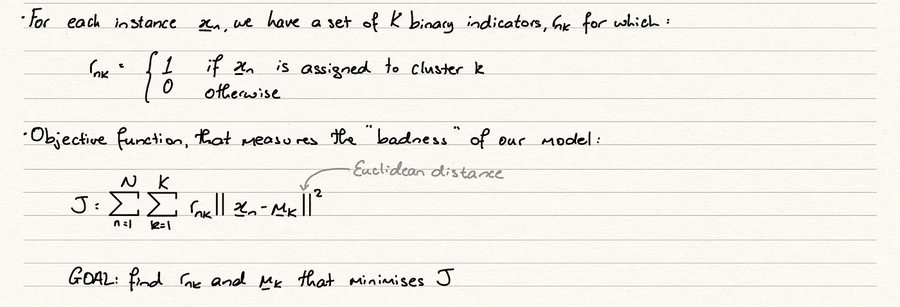
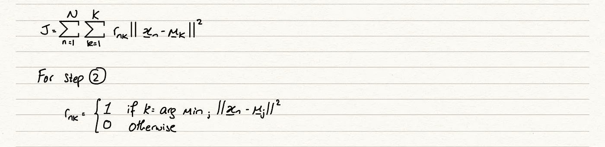
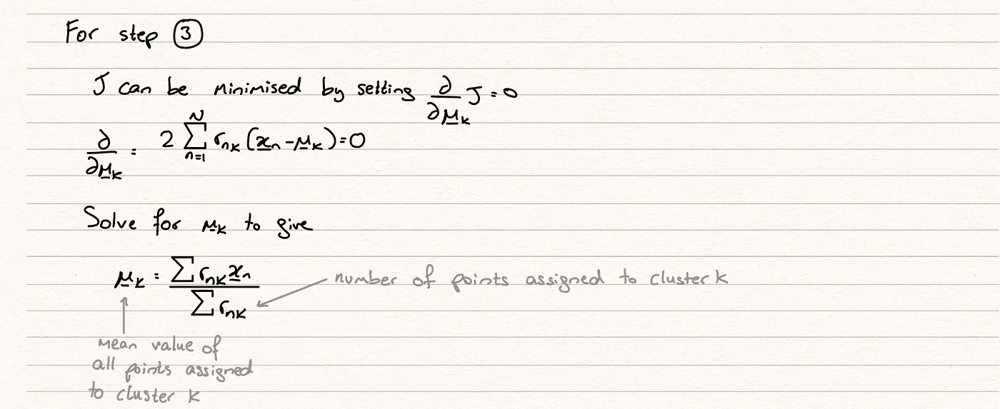
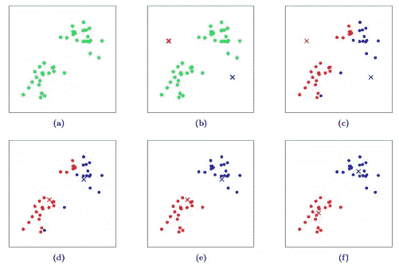
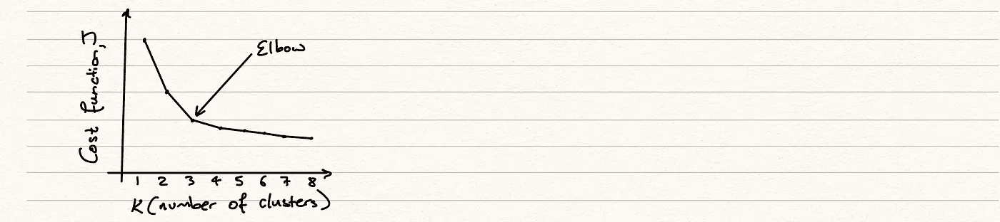

# k-Means 算法是如何工作的？

> 原文：<https://towardsdatascience.com/how-does-the-k-means-algorithm-work-d1e46b42bcfd?source=collection_archive---------55----------------------->

## 查看无监督学习模型背后的数学和伪代码

本文是我正在撰写的关于机器学习关键理论概念的系列文章的延续。本系列其他文章在我的 [*页面*](https://dhruva-krishna.medium.com/) *均有。*

由 [Karen Vardazaryan](https://unsplash.com/@bright?utm_source=unsplash&utm_medium=referral&utm_content=creditCopyText) 在 [Unsplash](https://unsplash.com/s/photos/collection?utm_source=unsplash&utm_medium=referral&utm_content=creditCopyText) 拍摄的照片

**无监督** **学习**又称**模式** **识别**，是一种试图在数据集中寻找内在模式的方法，没有明确的方向或终点，以标签的形式存在。在口语中，在监督学习问题中，我们可能会告诉模型“从一组输入到确切的期望输出(在分类中)或尽可能接近输出(在回归中)找到最佳的一般路径”。然而，在一个无监督的学习问题中，在没有我们明确的输出的情况下，我们将告诉一个模型“揭示数据中一些隐藏的关系，这些关系乍看起来可能不明显，并使用这些关系来区分不同的组”。

无监督学习的好处之一是，它帮助我们发现**潜在** **变量**。潜在变量是在我们的数据集中不明显的变量。它们隐藏在我们的数据集中，通常通过以某种数学方式组合多个特征来推断或产生。在不知道预期目标是什么来影响模型的情况下，它以更抽象的方式查看数据集，找到可能比监督学习问题中找到的关系更健壮的关系。

## k 均值

K-Means 聚类将采用一组变量并找到 K 个聚类或组。这些聚类是不同的，但是它们中的数据点是相似的。这个想法是，我们能够将我们的数据集划分为 K 个组，这可能会告诉我们更多关于它们的隐含特征。每个聚类完全由其中心或平均值 mu_k 定义。

在机器学习工作流程的探索性数据分析阶段，这是一个很好的方法，因为它让我们有机会获取空白的、新鲜的数据集，并允许模型为我们提供一些指示，告诉我们在哪里可以找到有趣的关系。

模型的数学符号及其输出如下所示

作者图片

K-Means 从绘制 n 维空间中的所有数据点开始，其中 n 是我们拥有的特征变量的数量。例如，3 个特征将被绘制在 3D 图上，4 个特征将被绘制在 4 维空间上，以此类推…通过这种可视化，模型将试图在数据中分配点，我们的意思是，在中间有相似数据点的明显分组。迭代地，该模型将继续改进平均值，使用最小化类内距离和最大化类间差异的成本函数。

K-Means 算法的伪代码如下:
1 .随机初始化 mu _ k
2。相对于 r_nk 最小化 J，而不改变 mu_k
3。相对于 mu_k 最小化 J，不改变 r_nk
4。重复直到两个最小值收敛

考虑到我们已经初始化了平均值。我们现在将把它和我们的数据一起绘制在图表上，并根据它最接近的平均值给每个实例分配一个类。这是我们在步骤 2 中最小化的方法。其概念是，我们将转到第 3 步，试图找到一个更好的均值，然后返回第 2 步，看看这个新的均值如何改变 r_nk 值。正如步骤 4 告诉我们的，我们继续这个序列，直到我们找到收敛。

要显示步骤 2 的符号:

作者图片

在上面图像的第二部分，我们说如果 j 值(由我们测量的聚类平均值决定)返回最小距离，即我们将把这个实例 x_n 分配到的聚类，我们将把 r_nk 分配为 1。

第三步涉及到我们试图最小化我们每个集群的平均值。这是一个二次函数，我们可以从等式中看出。因此，我们可以通过微分使 J 最小化，将解设为 0 并求解。

作者图片

下图显示了典型的 k-means 聚类算法的演变。我们可以看到我们的迭代算法将如何收敛到 2 个不同集群的最优解。

【https://stanford.edu/~cpiech/cs221/handouts/kmeans.html 

K-Means 的一些特性是我们应该注意的，如下所示:

*   因为优化算法的可微性，我们保证了收敛，但是我们遇到了达到局部最小值而不是全局最小值的问题，并且因为这个…
*   …我们很大程度上依赖于初始平均值来找到全局最小值
*   很难定义集群的最佳数量，因此这可能需要一些微调和迭代
*   K-Means 是一种昂贵的算法，因为每次迭代需要 K*N 距离比较
*   每个实例都被分配给一个集群，并且只分配给一个集群，如果我们有一些实例可能属于多个集群，这可能会有问题
*   距离计算对异常值很敏感

## 肘法

我们可以更详细地讨论其中的一点。我们如何选择最佳的聚类数 K？肘法就是我们这样做的。通常，当我们增加聚类时，我们会期望成本函数 J 下降，因为每次我们添加另一个均值时，它都会缩短到某些实例的距离。然而，这里有一个权衡，随着我们继续添加更多的聚类均值，过度拟合我们的数据的可能性就越高。这是可以理解的，因为我们在不断增加聚类的数量，以便更好地适应我们的训练数据，而没有注意到这个模型可能如何对我们的测试数据进行操作。记住这一点很重要，我们需要一个可以通用的解决方案，因此不是一个过于固定的训练数据，而是一个可以适应不同的未知输入并仍然给我们带来好结果的解决方案。

作者图片

肘部是我们开始看到回报率递减的点。我们增加另一个集群的好处与我们模型增加的复杂性不成比例。我们将通过对不同数量的集群进行一系列模拟，绘制它们的成本函数并观察图表来找到这个瓶颈，我们希望图表看起来类似于上面的图表。

这就是你对 k 均值的总结。我希望在以后的文章中更详细地介绍更多的概念，所以请密切关注这些概念！如果你对我以前的文章感兴趣，也可以关注我的[页面](https://dhruva-krishna.medium.com/)。在那之前，✌️.