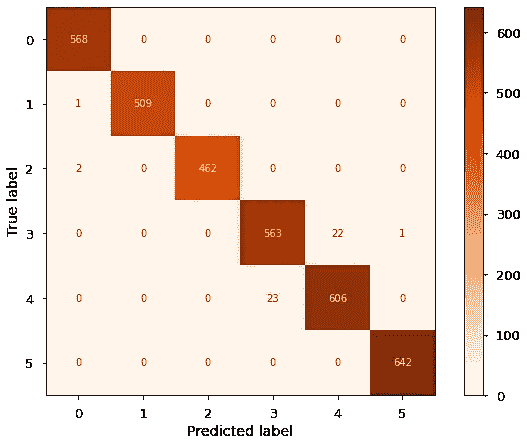

# 你的智能手表怎么知道你站着呢？

> 原文：<https://towardsdatascience.com/how-does-your-smartwatch-know-youre-standing-60c1c33b0be8?source=collection_archive---------27----------------------->

## **用简单的统计预测方法打开智能手表/智能手机健身功能的黑匣子。**

在过去的几年里，我们看到了由臭名昭著的苹果手表引领的智能手表销量的突然激增。这个利基市场的持续增长似乎与现代社会对健康/健身日益增长的关注相一致(如本文 [IDTechEx 文章](https://www.idtechex.com/en/research-report/wearable-sensors-2021-2031/780)所示)，因此，我们看到每一次软件迭代或每一次新推出的产品都增加了越来越多的健康相关功能。


照片由[索伦·费伊萨](https://unsplash.com/@solenfeyissa)在 [Unsplash](https://unsplash.com/) 拍摄

由于手表的大部分功能看起来就像是在你眼前表演的魔术(这个小东西怎么知道我什么时候躺下或者什么时候在走路？)，这似乎是一个很好的数据科学练习，可以更深入地研究这个问题，看看至少其中一些函数是如何工作的。

# **深入挖掘**

**如何为此目的获取信息？**

为了更好地理解这个问题，有必要知道什么可以用于这个目的。可穿戴设备使用传感器来“理解”用户的当前状况。角速度传感器(陀螺仪)和加速度传感器(加速度计)是最常见的运动和位置检测传感器。让我们尝试使用简单的方法重新创建一个身体位置预测器！

**数据集**

关于这一点的数据在 [UCI 机器学习知识库](https://archive.ics.uci.edu/ml/index.php)中提供，更具体地说，在[使用智能手机的人类活动识别数据集](https://archive.ics.uci.edu/ml/datasets/Human+Activity+Recognition+Using+Smartphones)中提供，该数据集由 30 名志愿者构建，他们使用连接到他们的智能手机进行 6 种活动(行走、上楼、下楼、坐着、站着和躺着)，以通过加速度计和陀螺仪捕捉信息。数据集包含以下属性:

*   来自加速度计的三轴加速度(总加速度)和估计的车身加速度。
*   陀螺仪的三轴角速度。
*   具有时域和频域变量的 561 特征向量。
*   它的活动标签。
*   进行实验的受试者的标识符。

让我们来看看数据是如何处理的。

通过存储库下载数据很简单，但它是以一种已经处理过的模式出现的。在数据集文件夹中，已经有包含 train (x_train 具有[7352，561]的形状，y_train 具有[7352，1]的形状)和测试分割的子目录。包含标签索引值的. txt 文件和包含训练/测试拆分中列的索引值的. txt 文件。对于本文和接下来的分析，我们组合所有处理的信息，最终得到一个形状为[10299，562]的数据帧，如下所示:


生成的数据帧。作者

请注意，已经为[-1，1]范围内的要素做好了准备，如下图所示:


功能列的最大值和最小值。作者

知道了这些值带，我们就可以看看特性列是如何表现的(至少是 562 中的一些)。为了对此有一个感觉，我们通过绘制它们的核密度估计(KDE)来看看我们的数据的 8 个随机选择的列的分布。


8 个随机选择的列的核分布。作者

查看 KDE 图，可以看到在这个随机样本中，我们有不同表现的变量。一些以高斯形式分布，一些更接近帕累托分布，这对于预测模型来说似乎很好。现在，我们检查随机列中现有的相关性，考虑到这个数据集的创建，这是完全自然的。


列相关矩阵。作者

查看这个由 10 个随机选择的列组成的相关矩阵，我们注意到，陀螺仪和加速度计注释的大多数信息似乎有很强的关系，为了确保这一点，有一组 15 个随机 10 列的相关图，最终看起来都与上面所示的类似。通过这些关系，可以观察到，即使对于无法承受超级复杂计算的系统，也有可能开发出良好的预测算法(以至于即使是低端智能手表市场也有这种功能)。

## 系统模型化

对于这种类型的预测，我们必须使用不需要高度计算能力的分类算法。这可以通过利用称为逻辑回归的广义线性回归方法来实现。这种建模技术将我们的输出限制在[0，1]的范围内，由于这个原因，给解释这个结果的人一种概率方法来得到函数的结果。输出被置于 0 和 1 之间的事实是输出通过受人喜爱的 **Sigmoid 函数**传递的直接结果，如下所示:


具有示例阈值的 Sigmoid 图。作者

请注意，x 轴上的所有值都被“挤压”到 y 轴上的[0，1]范围内。利用这种回归技术，我们可以说，在这些范围之间确定的预测值是它属于某一类的概率。

知道了哪种模型最适合我们，我们将数据以 66/33 的比例分成训练集和验证集，将训练集的 561 个特征(陀螺仪和加速度计信息)的 6900 个示例留给训练集，将相同数量的外生变量的 3399 个示例留给验证集。由于类别似乎有点不平衡，我们采用分层分割法，在分割数据时考虑了类别分布。用于拆分的代码示例如下。

```
strat_shuf_split = StratifiedShuffleSplit(n_splits=1, 
                                          test_size=0.33, 
                                          random_state=19)feature_cols = data.columns[:-2]
train_idx, test_idx = next(strat_shuf_split.split(data[feature_cols], data.Activity))x_train = data.iloc[train_idx][feature_cols]
y_train = data.iloc[train_idx]['Activity']x_test = data.iloc[test_idx][feature_cols]
y_test = data.iloc[test_idx]['Activity']
```

## **拟合**

为了简单起见，没有做额外的工程来准备我们的特性，因为它们看起来已经适合预测了。当植入可穿戴设备中时，在数据准备步骤中利用的任何额外的计算量都可能导致较慢的预测器。了解这一点后，下一步是使用 LibLinear 解算器拟合逻辑回归模型，解算器选择的原因是 LibLinear 只有 O(n)复杂度，而其他选择(如 sklearn 中的 LinearSVC 解算器)具有 O(n)复杂度，因此需要使用计算资源。三行简单的代码就完成了拟合。

```
logistic = LogisticRegression(solver='liblinear')
fitted_lgstc = logistic.fit(x_train, y_train)preds = fitted_lgstc.predict(x_test)
```

## **评估**

预测输出是一个长度为 3999 的数组，数组中的每个值都是通过模型的要素的标签编码预测活动。

对于模型质量检查，我们使用 F1 分数和混淆矩阵(理解预测的直观方式)。

**F1 比分**

F1 分数是精度和召回率之间的调和平均值，这是分类器的两个最重要的指标。

精度 TP/(FP+TP)是衡量一个类中有多少预测值实际上来自该类的指标(如果模型只预测一个类的示例，并且该指标的值为 1 是正确的，则该指标并不可靠)。


位置预测模型的精度。作者

召回率 TP/(TP + FN)是一个度量值，它告诉我们有多少实际的真值被预测为真，由于向有偏差的模型打开了一扇门，因此也不那么稳健，一旦模型预测了一个类的所有值，我们就会得到一个召回率值。


回忆一下位置预测模型。作者

F1 分数为我们提供了一种数学方法，可以将两种指标结合起来，而不会偏向每一种指标。出于这个原因，我们来看看我们的模型得分。


F1 分数。作者

请注意，对于这样一个简单的技术，分数是很大的，表明在建模技术的所有真阳性中，我们正确地预测了一个非常好的数量，而没有偏向于预测该类的全部或非常少。

**混乱矩阵**



预测的混乱矩阵。作者

混淆矩阵从视觉上确认了 f1 得分指标已知的内容。该模型在大部分时间内都正确处理了所有的类，只是在处理坐着和躺着的类 3 和 4 时有点混乱

## **结论**

用简短的技术术语来说，这基本上是你的手表或手机如何知道你的位置。利用陀螺仪和加速度计传感器创建特征，并将这些特征传递到预先训练的位置模型中，有点像本文中讨论的简单模型。每隔几分钟进行一次预测，就有可能开发出位置计时器，用来提醒用户每隔几分钟移动一点，计算步数以及现代可穿戴设备中广泛使用的许多其他健康/运动功能。

**代号**

此分析中使用的完整代码可在 [**此处**](https://github.com/Davilirio/Human-Activity-Recognition-Article) 获得

**来源**

<https://www.iotforall.com/sensors-that-matter-wearables>  <https://www.idtechex.com/en/research-report/wearable-sensors-2021-2031/780>  

[https://archive . ics . UCI . edu/ml/datasets/Human+活动+识别+使用+智能手机](https://archive.ics.uci.edu/ml/datasets/Human+Activity+Recognition+Using+Smartphones)

[https://machine learning mastery . com/how-to-model-human-activity-from-smart phone-data/](https://machinelearningmastery.com/how-to-model-human-activity-from-smartphone-data/)

**引文**

达维德·安吉塔、亚历山德罗·基奥、卢卡·奥内托、哈维尔·帕拉和豪尔赫·雷耶斯-奥尔蒂斯。使用智能手机进行人类活动识别的公共领域数据集。第 21 届欧洲人工神经网络、计算智能和机器学习研讨会，ESANN 2013。2013 年 4 月 24 日至 26 日，比利时布鲁日。