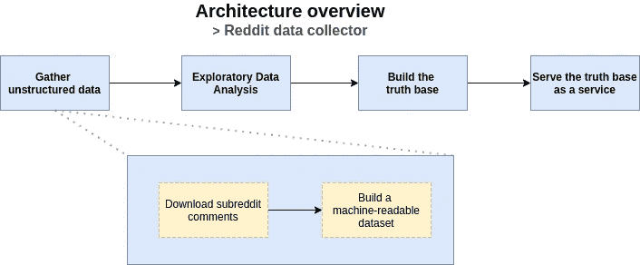
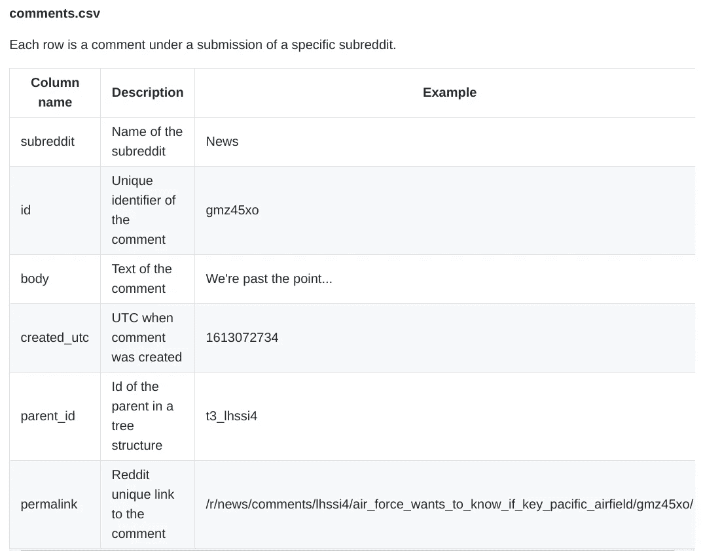
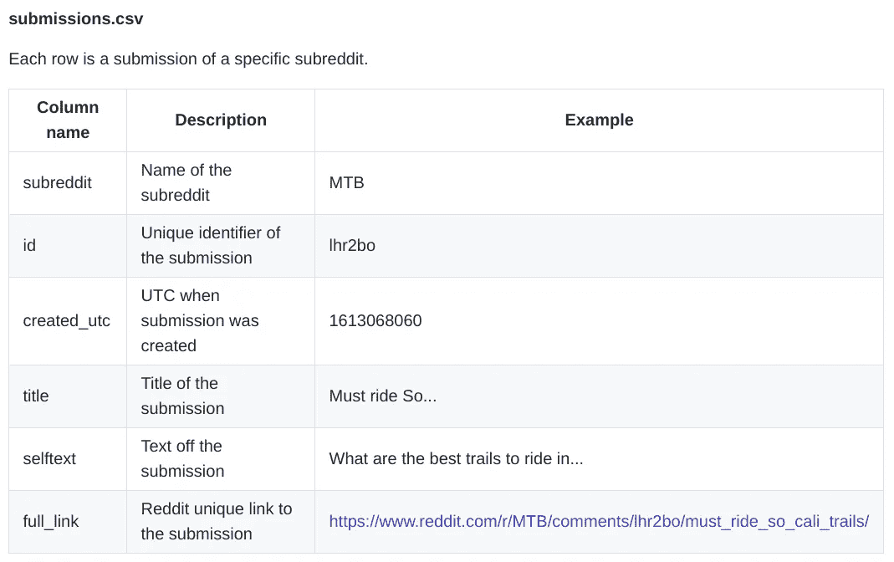

# 如何下载子编辑评论

> 原文：<https://towardsdatascience.com/how-download-subreddit-comments-f79557c99170?source=collection_archive---------22----------------------->

安妮·斯普拉特在 [Unsplash](https://unsplash.com?utm_source=medium&utm_medium=referral) 上的照片

从 NLP 和分析任务的特定子编辑中下载所有评论。🖇github:[pistocop/subreddit-comments-dl](https://github.com/pistocop/subreddit-comments-dl)

> 这个故事是一个更大项目的一部分:“利用 Reddit 评论和 ML 技术创建一个产品知识库”，敬请关注！

# 🏃TL；速度三角形定位法(dead reckoning)

赶时间？运行这段代码！

> *💡*确保正确设置“< … >”参数！

# 👨‍🏫介绍

假设你想做一个市场调查，也许是在某个特定的领域，比如某辆特定的自行车，某个特定的政党，甚至是在 [Gamestop 事件](https://www.nytimes.com/2021/01/27/business/dealbook/reddit-wallstreetbets-gamestop.html)前几周 [wallstreetbets](https://www.reddit.com/r/wallstreetbets/) 上发生了什么。

对于这种特定的任务，分析用户评论可能是一个很好的机会，从 reddit 获取这些评论是一个快速而聪明的想法，因为这些社交评论的质量很好( [OpenAI 也用它来训练 GPT 模型](https://openai.com/blog/better-language-models/))。

是的，确实有一个选择是从 [pushshift](https://pushshift.io/) 下载[Reddit 的](https://files.pushshift.io/reddit/comments/)最新转储，但是获得> 15Gb 的数据以使用少于 100Mb 的数据并不是每个人都可行的方法。我们需要完成的任务也不需要来自 reddit 的新数据，因为 pushshift 转储每月进行一次。

最后但同样重要的是，如果我们能够避免占用无用的 Pushshift 带宽，这是一件好事，例如，我们将使用的代码被定制为调用 Pushshift 最少次数。

因此，让我们探索一种从特定子编辑中收集评论的方法，如果我们需要，可以使用时间约束，以一种简单快捷的方式。

# 🎯主项目

本文探讨了一个更大项目的一个组成部分，该项目旨在利用 reddit 的评论来构建产品知识库。简而言之，这是一个更大链条的第一环:

主体建筑概述——作者形象

# 🛂恢复凭据

首先我们需要一个 reddit 上的[账号和一些账号参数: *reddit_id* 和 *reddit_secret* 。查看下一个表，了解如何检索这些参数。](https://www.reddit.com/register/)

带链接的原始表格可在[pistocop.dev/posts/subreddit_downloader/](https://www.pistocop.dev/posts/subreddit_downloader/)获得

还在纠结`reddit_id`和`reddit_secret`怎么走？
看看这篇好文章:

 [## 如何在 Python 中使用 Reddit API

### Reddit API 数据收集简单指南

towardsdatascience.com](/how-to-use-the-reddit-api-in-python-5e05ddfd1e5c) 

# 🚀下载数据

> 我们假设 python3 已经安装并运行在您的电脑上

在凭证检索之后，让我们使用`src`文件夹下的脚本`subreddit_downloader.py`来面对数据下载部分。
脚本的其他参数有:

*   `--output-dir` →可选输出目录【默认:。/data/]
*   `--batch-size` →每次请求提交“batch _ size 默认值:10]
*   `--laps` →请求提交“batch _ size”Reddit 的次数[默认值:3]
*   `--utc-after` →获取该 UTC 日期之后的提交
*   `--utc-before` →在此 UTC 日期之前获取提交内容

例如，这是从[*AskReddit*](https://www.reddit.com/r/AskReddit/)*和 [News](https://www.reddit.com/r/news/) 下载投稿和相关评论的基本用法:*

*用不同的 subreddit 和不同的时间范围，重复上述过程任意多次。*

> **💡提示:使用一些在线工具，比如 EpochConverter 来计算你想要的 UTC 时间**

# *🏗构建数据集*

*下载完成后，我们可以创建一个机器可读的数据集，以后可以用于分析、机器学习和许多其他目的。*

*要构建新的数据集，只需运行 *dataset_builder.py* 脚本，进度条将显示构建过程中的状态。构建完成后，您可以在*数据集*文件夹下检查您的结果:每当您构建一个新的数据集时，脚本都会创建一个新的文件夹。*

> **💡*如果您使用不同的`*--output-dir*`参数运行 subreddit 下载脚本，请相应地更改 dataset_builder.py `*--input-dir*` 参数*

## *🎭输出文件格式*

*创建的数据集采用 *CSV* 格式，并遵循以下结构:*

**

*[上的原始表格 **GitHub** 上的](https://github.com/pistocop/subreddit-comments-dl)*

**

*[上的原始表格 **GitHub** 上的](https://github.com/pistocop/subreddit-comments-dl)*

# *📌结论*

*在本文中，我们看到了如何使用 [praw](https://praw.readthedocs.io/en/latest/) 和 [pushshift](https://pushshift.io/api-parameters/) API 从特定的子编辑中收集数据。这种介绍希望成为一个更雄心勃勃的项目的第一项任务，该项目侧重于建立一个特定产品或实体的知识库。如果你感兴趣的话，我们会在下一篇文章中用[变形金刚](https://spacy.io/universe/project/spacy-transformers/)从评论中提取信息！*

# *📖词汇表*

*   *reddit 网站上专注于某个特定主题的部分*
*   **提交*:出现在每个子编辑中的帖子。当你打开一个 subreddit 页面，你看到的所有帖子。每个提交都有一个*评论树**
*   **评论*:Reddit 用户在*提交*下的*子编辑
    -* 中编写的文本。这个库的主要目标是收集属于子编辑的评论*

# *✍笔记*

*   *在幕后，脚本使用 [pushshift](https://pushshift.io/api-parameters/) 来收集提交 id，使用 [praw](https://praw.readthedocs.io/en/latest/) 来收集提交的评论
    ——使用这种方法，我们需要更少的数据给[pushshift](https://pushshift.io/api-parameters/)
    ——由于使用了 [praw](https://praw.readthedocs.io/en/latest/) API，需要 reddit 凭证*
*   *关于`--help`命令下的`subreddit_downloader.py`脚本的更多信息*