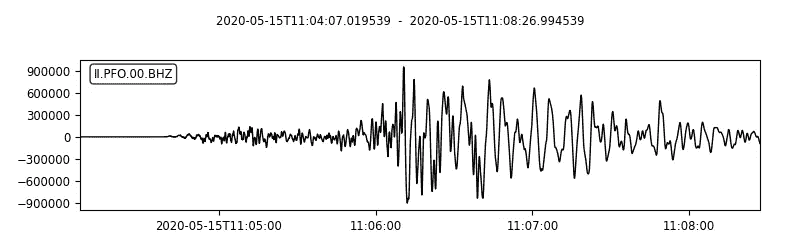
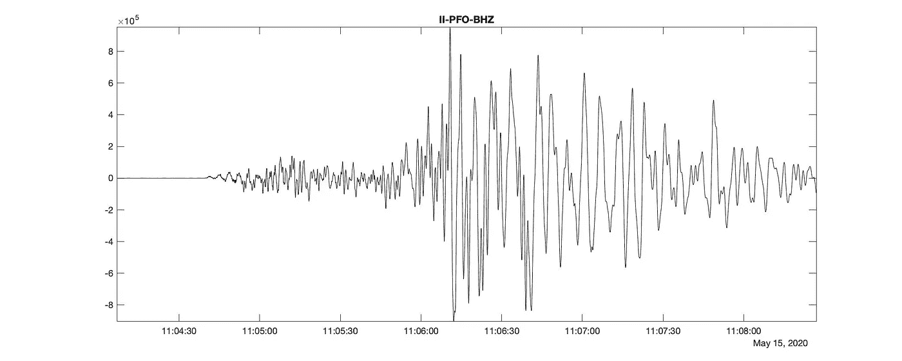
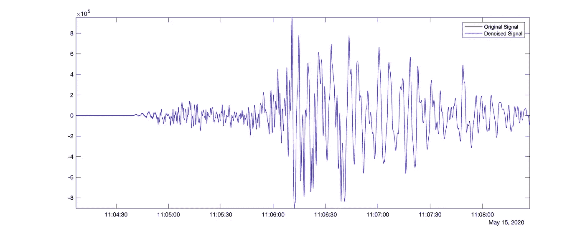
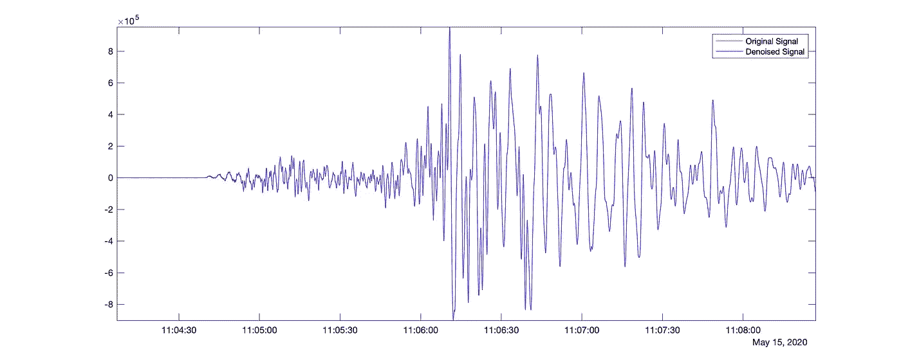
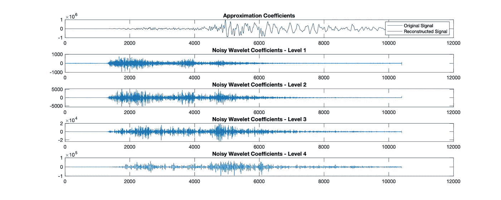

# 使用基于 MATLAB 的小波分析进行信号去噪的效果如何？

> 原文：<https://towardsdatascience.com/how-effective-is-the-signal-denoising-using-the-matlab-based-wavelet-analysis-9a90ed236f1d?source=collection_archive---------26----------------------->

## 我们检验了用小波分析滤除时间序列数据中噪声的可行性。


斯蒂芬·克拉克莫在 Unsplash[拍摄的照片](https://unsplash.com?utm_source=medium&utm_medium=referral)

[小波分析](http://www.earthinversion.com/techniques/towards-multi-resolution-analysis-with-wavelet-transform/)可视为傅立叶分析的一般形式。[傅立叶变换](http://www.earthinversion.com/techniques/signal-denoising-using-fast-fourier-transform/)常用于信号去噪。尽管如此，这种方法最大的缺点是信号需要稳定。我们现实世界中的大多数测量都不是静态的。此外，在基于傅立叶的去噪中，我们应用低通滤波器来去除噪声。然而，当数据具有高频特征时，如信号中的尖峰或图像中的边缘，低通滤波器会将其平滑掉。

这里，基于小波的方法可能有一些优点。小波查看多分辨率窗口中的信号。它将信号中的特征定位到不同的尺度。我们可以利用这一点，保留重要信号，消除不均匀噪声。我已经在之前的[文章](http://www.earthinversion.com/techniques/towards-multi-resolution-analysis-with-wavelet-transform/)中介绍了使用小波进行多分辨率分析的基础知识。

# 小波去噪

当我们对时间序列进行小波变换时，它将信号特征集中在几个大的小波系数中。一般而言，数值较小的系数被视为噪声。理论上，我们可以缩小这些系数，或者干脆去掉它们。

# 获取真实世界的信号

在这种情况下，我将下载记录大地震的地震时间序列。我将使用`Obspy`模块从 IRIS 下载数据。有关如何使用 Obspy 下载波形的详细信息，请参见我的[上一篇文章](http://www.earthinversion.com/geophysics/getting-started-with-obspy-for-seismologists-part-I/)。我将下载位于(北纬 38.1689，西经 117.8497)的任意选定事件“2020-05-15 Mww 6.5 Nevada”的波形。

这将 mseed 数据保存到脚本目录以及“流”的绘图中。我还对信号进行了高通滤波，以获得时间序列的高频部分。



内华达 2020 年 5 月 15 日 Mww 6.5 II-PFO 垂直分量波形(图片由作者提供)

# 将 mseed 转换为 mat 格式

现在，我们想让数据 MATLAB 可读。我写了一个实用程序来将任何 mseed 格式的数据转换成 mat 格式。我将在这种情况下使用它。



使用 MATLAB 的 2020 年 5 月 15 日 Mww 6.5 Nevada II-PFO 垂直分量波形(图片由作者提供)

# 基于非抽样小波变换的信号去噪

我将使用 Matlab 函数`wdenoise`通过`sym4`和`db1`小波将信号降噪到 9 级。`wdenoise`使用带有柯西先验的经验贝叶斯方法对信号降噪。



使用 sym4 对地震时间序列进行降噪处理(图片由作者提供)

在上面的代码中，我通过设置名称-值对“DenoisingMethod”、“BlockJS”，使用级别 9 使用块阈值对地震时间序列进行降噪。我用了小波`sym4`。

与原始时间序列相比，信号强度的最终差值为`82.5786`。

此外，我使用不同的小波`db1`尝试相同的过程。



使用 db1 的去噪地震时间序列(图片由作者提供)

这使得信号强度与原始时间序列相比的差值为`34.5294`。因此，我们发现小波`sym4`中的差异是显著的。我们还可以使用其他几个参数，包括级别。

对于“sym4”小波，我尝试将级别更改为 2、5、10，并得到 SNR 分别为 82.7493、82.5789、82.5786。不同电平的 SNR 之间的微小差异可能表明，在这种情况下，高频噪声量并不过量。让我们尝试使用有噪声的合成数据来验证这一假设(在这种情况下，我们将拥有完全的控制权)。



基于四级近似的小波重构(图片由作者提供)

# 完整的 MATLAB 代码

```
clear; close; clc;
wdir='./';

fileloc0=[wdir,'II-PFO-BHZ'];
fileloc_ext = '.mat';
fileloc = [fileloc0 fileloc_ext];

if exist(fileloc,'file')
    disp(['File exists ', fileloc]);
    load(fileloc);

    all_stats = fieldnames(stats);
    all_data = fieldnames(data);

    for id=1
        %% read data and header information
        stats_0 = stats.(all_stats{id});
        data_0 = data.(all_data{id});

        sampling_rate = stats_0.('sampling_rate');
        delta = stats_0.('delta');
        starttime = stats_0.('starttime');
        endtime = stats_0.('endtime');
        t1 = datetime(starttime,'InputFormat',"yyyy-MM-dd'T'HH:mm:ss.SSS'Z'");
        t2 = datetime(endtime,'InputFormat',"yyyy-MM-dd'T'HH:mm:ss.SSS'Z'");
        datetime_array = t1:seconds(delta):t2;

        %% Plot waveforms
        fig = figure('Renderer', 'painters', 'Position', [100 100 1000 400], 'color','w');
        plot(t1:seconds(delta):t2, data_0, 'k-')
        title([stats_0.('network'),'-', stats_0.('station'), '-', stats_0.('channel')])
        axis tight;
        print(fig,[fileloc0, '_ts', num2str(id),'.jpg'],'-djpeg')
        data_double = double(data_0);

        %% Using sym4
        [XDEN,DENOISEDCFS] = wdenoise(data_double,9,'Wavelet','sym4','DenoisingMethod','BlockJS');
        close;

        fig2=figure('Renderer', 'painters', 'Position', [100 100 1000 400], 'color','w');
        plot(data_double,'r')
        hold on;
        plot(XDEN, 'b')
        legend('Original Signal','Denoised Signal')
        axis tight;
        hold off;
        axis tight;
        print(fig2,['denoise_signal_sym49','.jpg'],'-djpeg')

        snrsym = -20*log10(norm(abs(data_double-XDEN))/norm(data_double))

        %% Using db1
        [XDEN_db1,DENOISEDCFS2] = wdenoise(data_double,9,'Wavelet','db1','DenoisingMethod','BlockJS');
        close;

        fig3=figure('Renderer', 'painters', 'Position', [100 100 1000 400], 'color','w');
        plot(data_double,'r')
        hold on;
        plot(XDEN_db1, 'b')
        legend('Original Signal','Denoised Signal')
        axis tight;
        hold off;
        axis tight;
        print(fig3,['denoise_signal_db1','.jpg'],'-djpeg')

        snrdb1 = -20*log10(norm(abs(data_double-XDEN_db1))/norm(data_double))

    end
end
```

# 含噪合成数据的小波去噪

这个例子是从 MATLAB 的例子中派生出来的。在上述情况下，对于相同的数据，我得到 sym4 和 db1 小波的 SNR 分别为 9.6994 和 9.4954。这也显示了 sym4 的显著差异。请注意,“sym4”在大多数情况下都能很好地工作，这可能是它被采用为缺省值的原因。


MATLAB 生成的合成数据小波去噪(图片由作者提供)

# 结论

我们已经了解了如何从 mseed 下载地震波形，将其转换为 mat 格式，然后使用小波分析进行去噪。我们首先对高频地震时间序列进行小波去噪，但重构后，视觉上差别并不明显。但是从信噪比上，我们可以看出区别。我们还绘制了不同尺度下的小波系数。此外，我在一个合成时间序列上展示了小波去噪的工作原理。

# 参考

**1\.** Wu, W., & Cai, P. (n.d.). Simulation of Wavelet Denoising Based on MATLAB — 《Information and Electronic Engineering》2008 年 03 期. Retrieved May 18, 2021, from [https://en.cnki.com.cn/Article_en/CJFDTotal-XXYD200803017.htm](https://en.cnki.com.cn/Article_en/CJFDTotal-XXYD200803017.htm)
2\. [MATLAB]([https://www.mathworks.com/?s_tid=gn_logo](https://www.mathworks.com/?s_tid=gn_logo))

*原载于 2021 年 5 月 18 日 http://www.earthinversion.com*[](https://www.earthinversion.com/techniques/how-effective-is-the-signal-denoising-using-the-matlab-based-wavelet-analysis/)**。**